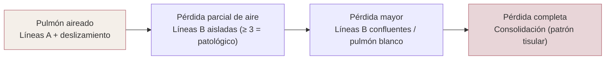
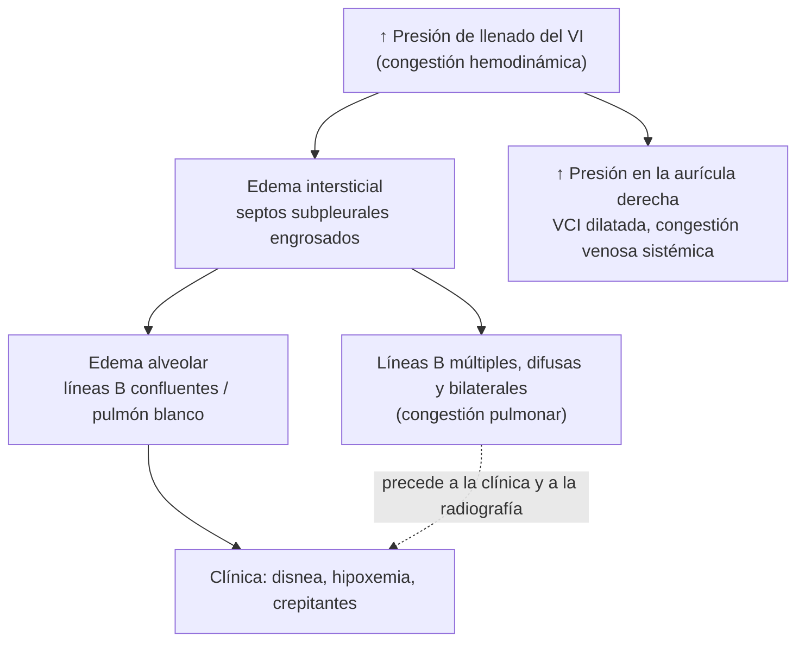

# 01 · Contexto y fundamento

La disnea aguda es uno de los motivos de consulta más frecuentes y graves en urgencias, y la insuficiencia cardiaca aguda (ICA) es una de sus causas principales. El problema clínico es doble. Primero, **diagnosticar**: saber si la disnea es cardiogénica o no, cuando la anamnesis, la exploración y la radiografía de tórax tienen una sensibilidad limitada. Segundo, **tratar y monitorizar** la congestión: la congestión residual al alta es frecuente, a menudo es subclínica y se asocia a reingresos y muerte. La ecografía pulmonar a pie de cama ofrece un marcador semicuantitativo de agua pulmonar extravascular, las **líneas B**, que responde a ambas preguntas. Esta página recoge la magnitud del problema, los motivos por los que fallan las herramientas clásicas y las bases físicas y fisiopatológicas que explican lo que vemos en la pantalla.

!!! info "Cómo leer esta página"
    Es material de fondo. Las cifras de **precisión diagnóstica** comparada se tratan en profundidad en [precisión diagnóstica](03-precision.md), y los **ensayos de tratamiento guiado** por líneas B en [impacto clínico](04-impacto.md). Aquí solo se citan lo justo para entender el fundamento.

---

## 1. Magnitud del problema

### 1.1. La disnea aguda en urgencias

Los estudios multicéntricos prospectivos AANZDEM (región Asia-Pacífico) y EuroDEM (Europa) describen bien la epidemiología de la disnea como síntoma principal en urgencias:

| Estudio | Diseño y población | Peso asistencial | Diagnósticos más frecuentes | Pronóstico | Cita |
|---|---|---|---|---|---|
| AANZDEM, 2017 | Cohorte prospectiva, 3044 pacientes adultos, urgencias de Australia, Nueva Zelanda, Singapur, Hong Kong y Malasia | 5,2 % de las visitas a urgencias, 11,4 % de los ingresos en planta y 19,9 % de los ingresos en UCI | Infección respiratoria de vías bajas 20,2 %, IC 14,9 %, EPOC 13,6 %, asma 12,7 % | Ingreso en planta 64 %, en UCI 3,3 %; mortalidad hospitalaria 6 % | [Kelly, 2017](../../05-fuentes/index.md#kelly2017) |
| EuroDEM + AANZDEM, 2019 | Cohorte prospectiva internacional, 5569 pacientes | Ingreso en UCI 5,5 %; mortalidad en urgencias 0,6 % | Infección respiratoria 24,9 %, IC 17,3 %, EPOC 15,8 %, asma 10,5 % (más IC y EPOC en Europa) | Mortalidad hospitalaria global 5,0 %: 8,7 % en infección respiratoria, **7,6 % en IC** y 5,6 % en EPOC | [Laribi, 2019](../../05-fuentes/index.md#laribi2019) |

La conclusión práctica es que, en un paciente con disnea en urgencias, **la IC es la segunda causa más frecuente** tras la infección respiratoria, y a menudo coexisten con la EPOC. Distinguirlas pronto cambia el tratamiento (diuréticos y vasodilatadores frente a antibióticos y broncodilatadores).

### 1.2. La insuficiencia cardiaca aguda

- **Carga global.** La IC afecta a más de 64 millones de personas en el mundo. Su incidencia se ha estabilizado en los países industrializados, pero la prevalencia aumenta por el envejecimiento y por la mayor supervivencia ([Savarese, 2023](../../05-fuentes/index.md#savarese2023)).
- **Fenotipos y mortalidad al año.** En el registro europeo ESC-HF-LT (6629 pacientes hospitalizados por ICA), el 61,1 % se presentó como IC descompensada, el 13,2 % como edema agudo de pulmón y el 2,9 % como shock cardiogénico. La mortalidad al año fue del 27,2 % en la IC descompensada, del 28,1 % en el edema de pulmón y del 54,0 % en el shock cardiogénico ([Chioncel, 2017](../../05-fuentes/index.md#chioncel2017)).
- **Reingresos y muerte tras el alta.** Hasta el 45 % de los pacientes hospitalizados por ICA reingresan por IC o mueren en los 12 meses siguientes al alta ([Gargani, 2023](../../05-fuentes/index.md#gargani2023)).

### 1.3. Datos españoles

| Estudio | Población | Resultado | Cita |
|---|---|---|---|
| Fernández-Gassó, 2017 | 27 581 hospitalizaciones índice por IC en la Región de Murcia (2003-2013), datos administrativos enlazados | Los reingresos no programados a 30 días subieron del 17,6 % al 22,1 %. El 60 % fueron de causa cardiovascular y la IC fue la causa aislada más frecuente (34 %) | [Fernández-Gassó, 2017](../../05-fuentes/index.md#fernandezgasso2017) |
| Fernández-Gassó, 2019 | 8258 primeras hospitalizaciones por IC (Murcia, 2009-2013) | En el primer año reingresó por IC el 22 % y por cualquier causa el 54 %. Supervivencia a 5 años del 40 %, frente al 76 % esperado para la población general de igual edad y sexo | [Fernández-Gassó, 2019](../../05-fuentes/index.md#fernandezgasso2019) |

!!! note "Documentos españoles de referencia"
    La SEMI publicó en 2025 un posicionamiento sobre el POCUS en la IC que integra ecocardiografía, ecografía pulmonar y ecografía venosa ([Tung-Chen, 2025](../../05-fuentes/index.md#tungchen2025)). El consenso SEMI/SEC/S.E.N. de 2024 sobre la sobrecarga hidrosalina propone un abordaje multiparamétrico de la congestión (clínica, imagen y biomarcadores) ([Llàcer, 2024](../../05-fuentes/index.md#llacer2024)). Su contenido se desarrolla en [guías](05-guias.md).

### 1.4. La congestión residual al alta: el problema oculto

La congestión es la causa más frecuente de hospitalización por IC. Además, **la mejoría clínica no equivale a descongestión completa**:

- En el análisis post hoc del grupo placebo del ensayo EVEREST (2061 pacientes con FEVI ≤ 40 %), la puntuación clínica de congestión bajó mucho durante el ingreso. Casi tres cuartas partes salieron con una puntuación de 0 o 1. Aun así, los pacientes dados de alta con una **puntuación compuesta de congestión de 0** (sin ortopnea, sin ingurgitación yugular y sin edemas) tuvieron un 26,2 % de hospitalizaciones por IC y un 19,1 % de mortalidad durante el seguimiento (mediana de 9,9 meses). Cada punto de congestión residual al alta aumentó el riesgo de muerte a 30 días (HR 1,34; IC 95 % 1,14–1,58) ([Ambrosy, 2013](../../05-fuentes/index.md#ambrosy2013)).
- La ecografía pulmonar detecta **congestión pulmonar subclínica** antes del alta, aunque los signos y síntomas se hayan resuelto ([Gargani, 2023](../../05-fuentes/index.md#gargani2023)).

| Estudio | Diseño | n | Protocolo y punto de corte | Resultado | Cita |
|---|---|---|---|---|---|
| Gargani 2015 | Cohorte prospectiva, cardiología | 100 | > 15 líneas B antes del alta (suma de todas las zonas) | Reingreso por IC a 6 meses: HR 11,74 (IC 95 % 1,30–106,16). Las líneas B bajaron de 48 ± 48 al ingreso a 20 ± 23 antes del alta | [Gargani, 2015](../../05-fuentes/index.md#gargani2015) |
| Coiro 2015 | Cohorte prospectiva, al alta | 60 | ≥ 30 líneas B (mediana 8,5) | Supervivencia libre de eventos a 3 meses: 27 % con ≥ 30 líneas B frente a 88 % con < 30 (HR 5,66; IC 95 % 1,74–18,39). Mejora la reclasificación sobre la NYHA y el BNP; el BNP y la E/e′ no quedaron en el modelo | [Coiro, 2015](../../05-fuentes/index.md#coiro2015) |
| Cogliati 2016 | Cohorte prospectiva, medicina interna | 150 | Anterolateral, puntuación por sectores con ≥ 3 líneas B | Cada punto aumentó un 24 % el riesgo de reingreso o muerte a 100 días (HR 1,19). En el multivariante solo el NT-proBNP fue independiente | [Cogliati, 2016](../../05-fuentes/index.md#cogliati2016) |
| Platz 2019 | Cohorte prospectiva, 2 centros | 349 | 4 zonas (protocolo simplificado), lectura central | Mediana de líneas B de 6 al ingreso y 4 al alta (6 días). Más líneas B al alta, más reingreso por IC o muerte: HR 3,30 a 60 días y 2,01 a 180 días, también tras ajustar por NT-proBNP | [Platz, 2019](../../05-fuentes/index.md#platz2019) |
| Platz 2017 | Revisión sistemática | 13 estudios | Varios | En la ICA, ≥ 15 líneas B en 28 zonas al alta multiplicó por más de 5 el riesgo de reingreso por IC o muerte. En la IC crónica ambulatoria, ≥ 3 líneas B en 5 u 8 zonas casi lo cuadruplicó. Las líneas B cambian con el tratamiento en apenas 3 h | [Platz, 2017](../../05-fuentes/index.md#platz2017) |
| Suhardi 2025 | RS/MA | 15 estudios | Líneas B residuales antes del alta | Evento combinado de muerte o reingreso por IC: HR 2,32 (IC 95 % 1,91–2,82). Mortalidad: HR 3,01. Reingreso por IC o eventos cardiovasculares: HR 4,01. Más riesgo cuanto mayor es la carga de líneas B y en el seguimiento corto | [Suhardi, 2025](../../05-fuentes/index.md#suhardi2025) |

!!! tip "Perla clínica"
    «Seco en la exploración» no significa «seco en la ecografía». Un paciente sin crepitantes, sin edemas y sin ingurgitación yugular puede tener todavía líneas B difusas. Es precisamente el grupo en el que la ecografía aporta información pronóstica que no da la clínica ([Gargani, 2023](../../05-fuentes/index.md#gargani2023); [Ambrosy, 2013](../../05-fuentes/index.md#ambrosy2013)).

!!! warning "Asociación no es causalidad"
    Que la congestión residual ecográfica **prediga** eventos no demuestra que **tratarla** los evite. El consenso de la EACVI señala que en 2023 no había evidencia de que ajustar el diurético según las líneas B durante la hospitalización mejorase la morbimortalidad ([Gargani, 2023](../../05-fuentes/index.md#gargani2023)). La evidencia de ensayos posteriores se revisa en [impacto clínico](04-impacto.md).

---

## 2. Por qué fallan la clínica y la radiografía

### 2.1. Anamnesis y exploración física

La revisión sistemática clásica de *JAMA Rational Clinical Examination* (22 estudios en urgencias) mostró que ningún dato aislado de la clínica basta para confirmar o descartar la IC ([Wang, 2005](../../05-fuentes/index.md#wang2005)):

| Hallazgo | Cociente de probabilidad | Lectura práctica |
|---|---|---|
| Tercer ruido (galope S3) | LR+ 11 (IC 95 % 4,9–25,0) | Muy específico, pero poco sensible y difícil de oír en urgencias |
| Antecedente de IC | LR+ 5,8; LR− 0,45 | Útil, pero no excluye otras causas |
| Disnea paroxística nocturna | LR+ 2,6 | Aumenta poco la probabilidad |
| **Ausencia de crepitantes** | **LR− 0,51** | **No descarta la IC** |
| Ausencia de disnea de esfuerzo | LR− 0,48 | Disminuye poco la probabilidad |
| Rx con congestión venosa pulmonar | LR+ 12,0 (IC 95 % 6,8–21,0) | Muy específica cuando está presente |
| Rx sin cardiomegalia | LR− 0,33 | Disminuye la probabilidad, pero no la descarta |
| BNP < 100 pg/mL | LR− 0,11 | El mejor dato para excluir |

Un metaanálisis posterior en urgencias confirmó el patrón: el S3 tiene un LR+ de 4,0, y los péptidos natriuréticos son los mejores para **excluir** (BNP < 100 pg/mL: LR− 0,11; NT-proBNP < 300 pg/mL: LR− 0,09) ([Martindale, 2016](../../05-fuentes/index.md#martindale2016)).

### 2.2. Radiografía de tórax

- En el registro ADHERE (85 376 pacientes ingresados desde urgencias con diagnóstico final de IC descompensada), **el 18,7 % no tenía ningún signo de congestión en la radiografía**. Estos pacientes recibieron con más frecuencia un diagnóstico inicial distinto de IC (23,3 % frente al 13,0 %) ([Collins, 2006](../../05-fuentes/index.md#collins2006)).
- En el estudio multicéntrico italiano de Pivetta (1005 pacientes con disnea en urgencias), la radiografía sola tuvo una sensibilidad del 69,5 % y una especificidad del 82,1 % para la IC descompensada, y los péptidos natriuréticos (n = 486) una sensibilidad del 85 % con una especificidad de solo el 61,7 % ([Pivetta, 2015](../../05-fuentes/index.md#pivetta2015)).
- En el metaanálisis de estudios que compararon directamente ambas pruebas en los mismos pacientes, la sensibilidad fue de 0,88 con la ecografía pulmonar y de 0,73 con la radiografía, con igual especificidad (0,90) ([Maw, 2019](../../05-fuentes/index.md#maw2019)). Otro metaanálisis (8 estudios, 2787 pacientes) obtuvo resultados parecidos: sensibilidad del 91,8 % frente al 76,5 % y especificidad del 92,3 % frente al 87,0 % ([Chiu, 2022](../../05-fuentes/index.md#chiu2022)).

!!! note "La radiografía no es inútil: es poco sensible"
    Cuando la radiografía muestra congestión venosa, el LR+ es alto (12,0) ([Wang, 2005](../../05-fuentes/index.md#wang2005)). El problema es la **radiografía normal**: aparece en casi 1 de cada 5 ICA y no debe usarse para descartar la IC ([Collins, 2006](../../05-fuentes/index.md#collins2006)).

!!! info "Para qué sirve cada herramienta"
    En el metaanálisis de Martindale, los cocientes de probabilidad positivos más altos para **confirmar** la ICA fueron el edema en la ecografía pulmonar (LR+ 7,4), el edema en la radiografía (LR+ 4,8), el S3 (LR+ 4,0) y la FEVI reducida en la ecocardiografía a pie de cama (LR+ 4,1). Para **descartarla**, los mejores fueron los péptidos natriuréticos y la ausencia de patrón B en la ecografía pulmonar (LR− 0,16). Los autores concluyen que la ecografía pulmonar y la ecocardiografía son las pruebas más útiles para confirmar, y los péptidos, para excluir ([Martindale, 2016](../../05-fuentes/index.md#martindale2016)). El análisis detallado está en [precisión diagnóstica](03-precision.md).

### 2.3. Por qué la ecografía sí «ve» el edema

La radiografía necesita que la densidad pulmonar aumente mucho para que el edema se haga visible. La ecografía detecta el **edema intersticial subpleural**, una fase previa y clínicamente silente que precede al edema alveolar ([Lichtenstein, 2014](../../05-fuentes/index.md#lichtenstein2014)). Además, es inmediata, repetible, sin radiación y se hace a pie de cama. En el estudio clásico de Lichtenstein (UCI, 66 pacientes con disnea), el patrón de colas de cometa difusas y bilaterales estuvo presente en los 40 pacientes con edema pulmonar y ausente en 24 de los 26 con EPOC (sensibilidad del 100 % y especificidad del 92 %), con una exploración de menos de 1 minuto ([Lichtenstein, 1998](../../05-fuentes/index.md#lichtenstein1998)). Integrada con la clínica, en urgencias subió la sensibilidad al 97 % y la especificidad al 97,4 %, frente al 85,3 % y 90 % de la valoración clínica inicial ([Pivetta, 2015](../../05-fuentes/index.md#pivetta2015)).

---

## 3. Bases físicas de la ecografía pulmonar

### 3.1. El aire, «enemigo» de los ultrasonidos, y por qué eso es útil

En la interfaz entre los tejidos blandos y el aire, la mayor parte de la onda de ultrasonido se refleja por la **enorme diferencia de impedancia acústica**. Por eso se usa gel y por eso durante años se pensó que el pulmón no se podía explorar ([Beshara, 2024](../../05-fuentes/index.md#beshara2024)). Las costillas también bloquean el haz y generan sombras acústicas. En consecuencia, el pulmón aireado **no se ve directamente**: lo que se interpreta son **artefactos** que nacen en la línea pleural y cuyo patrón cambia según la proporción de aire y agua bajo la pleura ([Beshara, 2024](../../05-fuentes/index.md#beshara2024); [Lichtenstein, 2014](../../05-fuentes/index.md#lichtenstein2014)).

Lichtenstein resumió el fundamento en siete principios ([Lichtenstein, 2014](../../05-fuentes/index.md#lichtenstein2014)):

1. La ecografía pulmonar se hace mejor con equipos sencillos.
2. En el tórax, el gas y los líquidos ocupan posiciones opuestas (el aire sube y el líquido baja) o se mezclan en los procesos patológicos, generando artefactos.
3. El pulmón es el órgano más voluminoso, y se pueden definir áreas estandarizadas.
4. Todos los signos nacen de la línea pleural.
5. Los signos estáticos son sobre todo artefactos.
6. El pulmón es un órgano vital: los signos de la línea pleural son, ante todo, dinámicos.
7. Casi todos los trastornos agudos graves contactan con la línea pleural, lo que explica el potencial de la técnica.

A medida que el pulmón pierde aire y gana densidad, la imagen evoluciona de forma continua: de **líneas A** (pulmón normalmente aireado) a **líneas B** aisladas, después **líneas B confluentes** («pulmón blanco») y, cuando la pérdida de aire es completa, **consolidación**, en la que el parénquima ya se ve directamente con aspecto de tejido ([Demi, 2023](../../05-fuentes/index.md#demi2023); [Gargani, 2023](../../05-fuentes/index.md#gargani2023)).

### 3.2. Los signos elementales

| Signo | Qué se ve | Qué significa | Cita |
|---|---|---|---|
| **Línea pleural y signo del murciélago** | Línea horizontal hiperecogénica unos 0,5 cm por debajo de la línea de las costillas en el adulto. Las dos costillas con su sombra y la línea pleural forman el «murciélago» | Referencia fija: marca la pleura parietal. Visible incluso en pacientes agitados u obesos | [Lichtenstein, 2014](../../05-fuentes/index.md#lichtenstein2014) |
| **Deslizamiento pleural** (*lung sliding*) | Movimiento de vaivén de la línea pleural sincrónico con la respiración | La pleura visceral se desliza sobre la parietal. Su presencia descarta el neumotórax bajo la sonda | [Lichtenstein, 2014](../../05-fuentes/index.md#lichtenstein2014) |
| **Pulso pulmonar** (*lung pulse*) | Oscilaciones de la línea pleural sincrónicas con el latido, sin deslizamiento | Transmisión del latido a través de un pulmón que no se ventila pero cuyas pleuras siguen en contacto: apnea, atelectasia completa, intubación selectiva. Puede percibirse también en pulmones normales. Siempre indica pleuras en contacto: **descarta el neumotórax bajo la sonda** | [Lichtenstein, 2003](../../05-fuentes/index.md#lichtenstein2003); [Beshara, 2024](../../05-fuentes/index.md#beshara2024) |
| **Líneas A** | Líneas horizontales hiperecogénicas, paralelas y equidistantes a la línea pleural, a múltiplos de la distancia sonda-pleura | Artefacto de reverberación entre la sonda y la superficie pulmonar. Indican **gas** bajo la pleura: aire alveolar normal o aire libre (neumotórax) | [Demi, 2023](../../05-fuentes/index.md#demi2023); [Lichtenstein, 2014](../../05-fuentes/index.md#lichtenstein2014) |
| **Líneas B** | Artefactos verticales hiperecogénicos, «en rayo láser», que nacen de la línea pleural, llegan al fondo de la pantalla sin atenuarse, borran las líneas A y se mueven con el deslizamiento | Pérdida parcial de aire subpleural: septos engrosados por agua, inflamación o fibrosis. **≥ 3 por espacio intercostal** es patológico | [Volpicelli, 2012](../../05-fuentes/index.md#volpicelli2012); [Lichtenstein, 2014](../../05-fuentes/index.md#lichtenstein2014) |
| **Líneas Z** | Artefactos verticales cortos, mal definidos, que no borran las líneas A | Sin significado patológico. No se cuentan como líneas B | [Lichtenstein, 2014](../../05-fuentes/index.md#lichtenstein2014); [Beshara, 2024](../../05-fuentes/index.md#beshara2024) |
| **Líneas E** | Líneas verticales que nacen por encima de la línea pleural (en el tejido subcutáneo), sin deslizamiento y sin signo del murciélago | Enfisema subcutáneo. Se confunden con líneas B | [Beshara, 2024](../../05-fuentes/index.md#beshara2024) |
| **Consolidación: signo del desflecado** (*shred* o fractal) | Zona hipoecoica cuyo borde profundo con el pulmón aireado es irregular, «deshilachado» | Consolidación no translobar | [Lichtenstein, 2014](../../05-fuentes/index.md#lichtenstein2014) |
| **Consolidación: signo del tejido** (*tissue-like*, hepatización) | Pulmón con ecogenicidad similar al hígado | Consolidación translobar | [Lichtenstein, 2014](../../05-fuentes/index.md#lichtenstein2014) |
| **Broncograma aéreo dinámico** | Puntos hiperecogénicos dentro de la consolidación que se mueven con la respiración | Aire en bronquios permeables: orienta a **neumonía** frente a atelectasia de reabsorción | [Lichtenstein, 2009b](../../05-fuentes/index.md#lichtenstein2009b) |
| **Derrame: signo del cuadrilátero** (*quad sign*) | Colección limitada por la línea pleural, las sombras costales y la «línea pulmonar» (pleura visceral) | Derrame pleural, sea cual sea su ecogenicidad | [Lichtenstein, 2014](../../05-fuentes/index.md#lichtenstein2014) |
| **Derrame: signo sinusoide** | En modo M, la línea pulmonar se acerca a la pleural en cada inspiración | Derrame libre y de baja viscosidad | [Lichtenstein, 2014](../../05-fuentes/index.md#lichtenstein2014) |
| **Signo de la columna** (*spine sign*) y **cortina** | La columna se ve por encima del diafragma si hay líquido. Sin derrame, el pulmón aireado desciende como una «cortina» en inspiración | El signo de la columna indica derrame; la cortina normal lo hace improbable | [Beshara, 2024](../../05-fuentes/index.md#beshara2024) |
| **Punto pulmonar** (*lung point*) | Transición en un punto fijo de la pared entre un patrón sin deslizamiento (neumotórax) y otro con deslizamiento o líneas B | Muy específico de neumotórax | [Lichtenstein, 2000](../../05-fuentes/index.md#lichtenstein2000) |

??? info "Detalle: cifras de los signos elementales en los estudios originales (UCI, operador experto)"
    - **Consolidación** (signos del desflecado y del tejido): sensibilidad del 90 % y especificidad del 98 %. El 98 % de las consolidaciones contacta con la pared y el 90 % se localiza en el punto PLAPS ([Lichtenstein, 2014](../../05-fuentes/index.md#lichtenstein2014)).
    - **Broncograma aéreo dinámico**, en 68 pacientes ventilados con consolidación y broncograma: especificidad del 94 % y VPP del 97 % para neumonía frente a atelectasia de reabsorción, con una sensibilidad de solo el 61 % y un VPN del 43 % ([Lichtenstein, 2009b](../../05-fuentes/index.md#lichtenstein2009b)).
    - **Derrame pleural** (signos del cuadrilátero y sinusoide): sensibilidad del 93 % y especificidad del 97 % ([Lichtenstein, 2014](../../05-fuentes/index.md#lichtenstein2014)). El signo de la columna, según una revisión narrativa: sensibilidad del 92,9 % y especificidad del 87,5 % ([Beshara, 2024](../../05-fuentes/index.md#beshara2024)).
    - **Punto pulmonar**: en 66 neumotórax y 233 hemitórax control, sensibilidad del 66 % (75 % en los radiológicamente ocultos) y especificidad del 100 % ([Lichtenstein, 2000](../../05-fuentes/index.md#lichtenstein2000)).
    - **Pulso pulmonar**: en la atelectasia completa por intubación selectiva, sensibilidad del 93 % y especificidad del 100 % ([Lichtenstein, 2003](../../05-fuentes/index.md#lichtenstein2003)).

    Son estudios clásicos, unicéntricos y hechos por el grupo que describió los signos. Sus limitaciones se discuten en [limitaciones y errores](07-limitaciones.md).

### 3.3. El modo M

El modo M representa en el tiempo lo que ocurre en una sola línea del haz. Ayuda cuando el deslizamiento es dudoso o hay que documentarlo ([Beshara, 2024](../../05-fuentes/index.md#beshara2024)):

- **Signo de la orilla del mar** (*seashore*): por encima de la línea pleural, líneas horizontales estáticas (pared torácica, «el mar»); por debajo, un patrón granulado (el pulmón que se desliza, «la arena»). Es normal ([Lichtenstein, 2014](../../05-fuentes/index.md#lichtenstein2014)).
- **Signo de la estratosfera o del código de barras**: líneas horizontales por encima y por debajo de la pleura. Indica ausencia total de movimiento y sugiere neumotórax, aunque no es exclusivo de él ([Lichtenstein, 2014](../../05-fuentes/index.md#lichtenstein2014)).
- **Signo sinusoide**: en el derrame, oscilación inspiratoria de la línea pulmonar ([Lichtenstein, 2014](../../05-fuentes/index.md#lichtenstein2014)).

### 3.4. Qué es realmente una línea B: definiciones y física actual

- **Definición de consenso (2012).** Artefactos de reverberación verticales, discretos, hiperecogénicos y «en rayo láser», que nacen de la línea pleural (antes llamados «colas de cometa»), llegan al fondo de la pantalla sin atenuarse y se mueven sincrónicamente con el deslizamiento pleural ([Volpicelli, 2012](../../05-fuentes/index.md#volpicelli2012), citado en [Demi, 2023](../../05-fuentes/index.md#demi2023)).
- **Definición de Lichtenstein.** Tres criterios constantes (es un artefacto en cola de cometa, nace de la línea pleural y se mueve con el deslizamiento) y cuatro casi constantes (es largo, bien definido, en rayo láser, hiperecogénico y borra las líneas A). Tres o más líneas B entre dos costillas se llaman **«cohetes pulmonares»** (*lung rockets*) ([Lichtenstein, 2014](../../05-fuentes/index.md#lichtenstein2014)).
- **Mecanismo físico.** La explicación clásica es que el haz atraviesa a la vez aire y agua cuando los septos interlobulillares subpleurales están edematosos ([Lichtenstein, 2014](../../05-fuentes/index.md#lichtenstein2014)). La física actual propone que los artefactos verticales se generan cuando la onda entra en volúmenes de pulmón con menos aire que actúan como **«trampas acústicas»** y se comportan como fuentes secundarias de ultrasonido ([Demi, 2023](../../05-fuentes/index.md#demi2023)).

!!! warning "Las líneas B dependen de la máquina"
    El consenso internacional de 2023 subraya que la **frecuencia de imagen y el ancho de banda** influyen mucho en la visualización de los artefactos verticales: en el mismo punto del pulmón pueden verse varios o ninguno según la frecuencia elegida. También influyen, aunque menos, la posición del foco y el ángulo de incidencia. Por eso, **contar líneas B es, como mucho, un método semicuantitativo**. La definición de 2012 es subjetiva: «rayo láser» y «sin atenuarse» no son cuantificables, y la longitud del artefacto cambia con la profundidad elegida ([Demi, 2023](../../05-fuentes/index.md#demi2023)). Los ajustes recomendados están en [técnica y protocolos](02-tecnica.md).

---

## 4. Fisiopatología de las líneas B

### 4.1. Del engrosamiento septal al agua pulmonar extravascular

La relación entre líneas B y agua pulmonar se estableció con una serie de estudios clásicos:

| Estudio | Diseño | n | Hallazgo principal | Cita |
|---|---|---|---|---|
| Lichtenstein 1997 (clásico) | Prospectivo, UCI médica | 250 | Las colas de cometa difusas identificaron el síndrome alveolointersticial radiológico difuso con una sensibilidad del 93,4 % y una especificidad del 93,0 %. En la TC se correspondían con **septos interlobulillares subpleurales engrosados** y áreas en vidrio deslustrado | [Lichtenstein, 1997](../../05-fuentes/index.md#lichtenstein1997) |
| Jambrik 2004 | Prospectivo, cardiología y neumología | 121 | Correlación lineal entre la puntuación de líneas B (suma de espacios intercostales predefinidos) y la puntuación radiológica de agua pulmonar (r = 0,78). En el mismo paciente (n = 15), los cambios se correlacionaron aún mejor (r = 0,89). Factibilidad del 100 % y menos de 3 minutos por exploración | [Jambrik, 2004](../../05-fuentes/index.md#jambrik2004) |
| Agricola 2005 | Prospectivo, cirugía cardiaca | 20 (60 comparaciones) | La puntuación de líneas B se correlacionó con el agua pulmonar extravascular por termodilución (r = 0,42), con la presión de enclavamiento (r = 0,48) y con la puntuación radiológica (r = 0,60) | [Agricola, 2005](../../05-fuentes/index.md#agricola2005) |
| Jambrik 2010 | Experimental (cerdos con lesión pulmonar aguda) | 17 | Correlación estrecha entre el número de líneas B y el cociente peso húmedo/seco del pulmón (r = 0,91) | [Jambrik, 2010](../../05-fuentes/index.md#jambrik2010) |
| Enghard 2015 | Prospectivo, UCI con ventilación mecánica | 50 | Un protocolo simplificado de 4 regiones se correlacionó muy bien con el agua pulmonar extravascular (PiCCO), mejor que la radiografía y sin relación con la presión venosa central | [Enghard, 2015](../../05-fuentes/index.md#enghard2015) |
| Volpicelli 2014 | Prospectivo multicéntrico, UCI con monitorización invasiva | 73 | El patrón A predijo un agua pulmonar extravascular ≤ 10 mL/kg con una sensibilidad del 81 % y una especificidad del 90,9 % | [Volpicelli, 2014](../../05-fuentes/index.md#volpicelli2014) |

El número de líneas B aumenta a medida que baja el cociente aire/agua ([Gargani, 2023](../../05-fuentes/index.md#gargani2023)). Lichtenstein describe dos grados. Los **«cohetes septales»** (3–4 líneas B por espacio) se corresponden con las líneas B de Kerley. Los **«cohetes de vidrio deslustrado»** (el doble) se corresponden con las áreas en vidrio deslustrado de la TC ([Lichtenstein, 2014](../../05-fuentes/index.md#lichtenstein2014)).

!!! tip "Perla clínica: las líneas B son un marcador dinámico"
    Las líneas B cambian en tiempo real. En hemodiálisis disminuyen de forma significativa ya a mitad de la sesión, a medida que se extrae líquido ([Noble, 2009](../../05-fuentes/index.md#noble2009)). En la ICA cambian en apenas 3 horas de tratamiento ([Platz, 2017](../../05-fuentes/index.md#platz2017)). Esto las hace útiles para **monitorizar**, no solo para diagnosticar ([Gargani, 2023](../../05-fuentes/index.md#gargani2023)).

!!! info "La congestión pulmonar puede ser silente"
    En 392 pacientes en hemodiálisis, el 45 % tenía congestión pulmonar ecográfica moderada o grave y, de ellos, el 71 % estaba asintomático o con síntomas leves. La congestión muy grave se asoció a un riesgo de muerte 4,2 veces mayor (HR 4,20; IC 95 % 2,45–7,23) tras ajustar por la clase NYHA ([Zoccali, 2013](../../05-fuentes/index.md#zoccali2013)). Es la misma idea que la congestión residual al alta en la ICA: **el pulmón se llena antes de que el paciente lo note**.

### 4.2. Congestión hemodinámica frente a congestión pulmonar

Conviene distinguir dos conceptos ([Gargani, 2023](../../05-fuentes/index.md#gargani2023)):

- **Congestión hemodinámica**: presiones de llenado elevadas. En la ecocardiografía se sospecha por una aurícula izquierda dilatada, una E/e′ alta, una presión sistólica pulmonar elevada o una VCI dilatada.
- **Congestión pulmonar**: aumento del agua pulmonar extravascular, que es lo que muestran las líneas B.

Ambas están relacionadas, pero **no son lo mismo**. El número de líneas B se relaciona con la presión telediastólica del VI medida de forma invasiva, con la E/e′, con la velocidad de la insuficiencia tricuspídea y con la función del VD. Sin embargo, en pacientes con el mismo perfil hemodinámico la congestión pulmonar puede variar mucho ([Gargani, 2023](../../05-fuentes/index.md#gargani2023)).

| Signos de presión de llenado del VI elevada (E/e′ y otros) | Líneas B | Interpretación según la EACVI |
|---|---|---|
| Normales | Ausentes | Sin congestión |
| Elevados | Ausentes | Congestión hemodinámica sin congestión pulmonar |
| Elevados | Múltiples, difusas y bilaterales | Congestión hemodinámica y pulmonar |
| Normales | Múltiples, difusas y bilaterales | Congestión pulmonar sin congestión hemodinámica: **pensar en SDRA u otras causas de líneas B** |

*Adaptada de [Gargani, 2023](../../05-fuentes/index.md#gargani2023), tabla 4.*

### 4.3. Líneas B y presiones de llenado: qué predicen y qué no

Las líneas B se correlacionan mejor con el **agua pulmonar** que con la **presión de enclavamiento**. Sobre la presión, los dos estudios de referencia con catéter no dicen exactamente lo mismo, y conviene conocer ambos:

| Estudio | Población | Hallazgo | Lectura | Cita |
|---|---|---|---|---|
| Lichtenstein 2009 (clásico, base del protocolo FALLS) | 102 pacientes ventilados de UCI con catéter de arteria pulmonar | El predominio de líneas A anteriores predijo una presión de enclavamiento ≤ 18 mmHg con especificidad del 93 % y VPP del 97 %, pero sensibilidad del 50 % y VPN del 24 %. Para ≤ 13 mmHg: especificidad del 90 %, sensibilidad del 67 %, VPP del 91 %. El predominio de líneas B apareció en un amplio rango de presiones | Si hay **patrón A**, la presión suele ser baja. Pero muchos pacientes con presión baja tienen líneas B (por lesión pulmonar u otras causas) | [Lichtenstein, 2009](../../05-fuentes/index.md#lichtenstein2009) |
| Volpicelli 2014 | 73 pacientes de UCI de 4 hospitales (41 con catéter de arteria pulmonar, 32 con termodilución transpulmonar) | El patrón A predijo una presión ≤ 18 mmHg con sensibilidad del 85,7 % pero especificidad de solo el 40 %. Predijo un agua pulmonar ≤ 10 mL/kg con sensibilidad del 81 % y especificidad del 90,9 %. Al añadir una FEVI normal estimada a ojo, la predicción de presión ≤ 18 mmHg subió a sensibilidad del 100 % y especificidad del 72,7 % | Un **patrón A no garantiza** una presión baja: la presión puede estar alta sin que el agua haya llegado aún al intersticio subpleural. El corazón mejora la predicción | [Volpicelli, 2014](../../05-fuentes/index.md#volpicelli2014) |

Lichtenstein sitúa en torno a 18 mmHg de presión de enclavamiento el umbral en el que las líneas A se sustituyen por líneas B, y propone usar esa transición como «biomarcador» de volemia en el protocolo FALLS ([Lichtenstein, 2015](../../05-fuentes/index.md#lichtenstein2015)). Es una propuesta fisiológica del autor, no un umbral validado en estudios independientes.

- **Frente a los péptidos natriuréticos.** En 149 pacientes con disnea aguda, el número de líneas B se correlacionó con el NT-proBNP (r = 0,69). El área bajo la curva para el origen cardiaco de la disnea fue de 0,893 con las líneas B y de 0,978 con el NT-proBNP ([Gargani, 2008](../../05-fuentes/index.md#gargani2008)).
- **Frente a la presión venosa central.** En pacientes ventilados, un protocolo de 4 regiones se correlacionó bien con el agua pulmonar medida por termodilución y **nada** con la PVC ([Enghard, 2015](../../05-fuentes/index.md#enghard2015)).

!!! warning "Controversia: ¿el patrón A descarta una presión de llenado alta?"
    Con los datos de Lichtenstein, el patrón A es muy específico de presión baja. Con los de Volpicelli, el patrón A se encuentra también en muchos pacientes con presión alta (especificidad del 40 %). Las poblaciones, los protocolos y los operadores fueron distintos, y ambos estudios son pequeños y de UCI. La conclusión prudente es que **el patrón A hace improbable el edema pulmonar hidrostático, pero no excluye una presión de llenado elevada**, sobre todo si el corazón es anormal ([Lichtenstein, 2009](../../05-fuentes/index.md#lichtenstein2009); [Volpicelli, 2014](../../05-fuentes/index.md#volpicelli2014)).

!!! tip "Mensaje fisiopatológico"
    Las líneas B miden **agua en el pulmón**, no presión en la aurícula. Por eso: (1) puede haber presiones altas sin líneas B todavía (congestión hemodinámica sin congestión pulmonar); (2) puede haber líneas B con presiones normales (lesión pulmonar, fibrosis, neumonía); (3) integrar el corazón (FEVI, E/e′) y la VCI mejora la interpretación ([Volpicelli, 2014](../../05-fuentes/index.md#volpicelli2014); [Gargani, 2023](../../05-fuentes/index.md#gargani2023)).

### 4.4. Líneas B cardiogénicas frente a no cardiogénicas

Las líneas B **no son específicas** del edema cardiogénico. Aparecen en cualquier situación que reduzca el aire subpleural: edema no cardiogénico (enfermedad renal terminal, lesión pulmonar aguda/SDRA), fibrosis pulmonar, neumonía intersticial (incluida la COVID-19) y contusión pulmonar ([Gargani, 2023](../../05-fuentes/index.md#gargani2023); [Demi, 2023](../../05-fuentes/index.md#demi2023)). La **distribución** de las líneas B y el aspecto de la **línea pleural** ayudan a diferenciarlas:

| Característica | Edema pulmonar cardiogénico | Lesión pulmonar aguda / SDRA | Neumonía intersticial | Fibrosis pulmonar intersticial |
|---|---|---|---|---|
| Distribución de las líneas B | Homogénea, dependiente de la gravedad, **sin áreas respetadas** | Parcheada, no gravitacional, áreas respetadas +++ | Parcheada, no gravitacional, áreas respetadas ++ | Predominio basal, sin áreas respetadas |
| Línea pleural | **Fina y regular** | Muy irregular y fragmentada | Irregular y fragmentada | Irregular en los grados moderado y grave; puede parecer normal en los leves |
| Consolidaciones | Ausentes, salvo atelectasia compresiva por derrame grande | Frecuentes, subpleurales pequeñas y mayores | Raras | Raras y pequeñas (fases agudas) |
| Derrame pleural | Frecuente, de tamaño variable, trasudado de aspecto simple, **bilateral** (a menudo mayor a la derecha) | Escaso o leve | Escaso | Raro |

*Adaptada de [Gargani, 2023](../../05-fuentes/index.md#gargani2023), tabla 1.*

El estudio de Copetti (58 pacientes de UCI) cuantificó estas diferencias. El síndrome intersticial estuvo presente en el 100 % de los pacientes con SDRA y en el 100 % de los que tenían edema cardiogénico. Lo que los distinguió fue lo demás ([Copetti, 2008](../../05-fuentes/index.md#copetti2008)):

| Signo | SDRA / lesión pulmonar aguda | Edema cardiogénico |
|---|:--:|:--:|
| Alteraciones de la línea pleural | 100 % | 25 % |
| Deslizamiento ausente o reducido | 100 % | 0 % |
| Áreas respetadas | 100 % | 0 % |
| Consolidaciones | 83,3 % | 0 % |
| Pulso pulmonar | 50 % | 0 % |
| Derrame pleural | 66,6 % | 95 % |

Lichtenstein lo explica con una metáfora fisiopatológica. El edema hemodinámico produce un **trasudado**, «una especie de aceite», que conserva el deslizamiento (perfil B). La neumonía y el SDRA producen un **exudado**, «una especie de pegamento», que lo abole (perfil B′). El edema hemodinámico dio un perfil B en el 97 % de los casos, y el SDRA dio un perfil de neumonía en el 86 % ([Lichtenstein, 2014](../../05-fuentes/index.md#lichtenstein2014)).

!!! warning "Error frecuente"
    Etiquetar como «insuficiencia cardiaca» a todo paciente con líneas B. El propio consenso de la EACVI considera que **el principal escollo es interpretar las líneas B sin un diagnóstico establecido** ([Gargani, 2023](../../05-fuentes/index.md#gargani2023)). La distribución, la línea pleural, el derrame, el corazón y la clínica deben ir siempre juntos. Los errores y falsos positivos se detallan en [limitaciones y errores](07-limitaciones.md).

---

## Puntos clave

- La disnea aguda supone alrededor del 5 % de las visitas a urgencias y la IC es su segunda causa. La mortalidad hospitalaria global es del 5–6 %, y del 7,6 % cuando la causa es la IC ([Kelly, 2017](../../05-fuentes/index.md#kelly2017); [Laribi, 2019](../../05-fuentes/index.md#laribi2019)).
- Tras un ingreso por ICA, hasta el 45 % reingresa o muere en un año ([Gargani, 2023](../../05-fuentes/index.md#gargani2023)). En España, más de uno de cada cinco pacientes reingresa en 30 días ([Fernández-Gassó, 2017](../../05-fuentes/index.md#fernandezgasso2017)).
- La congestión residual al alta es frecuente, a menudo subclínica, y predice eventos. La ecografía la detecta cuando la exploración ya es normal ([Ambrosy, 2013](../../05-fuentes/index.md#ambrosy2013); [Suhardi, 2025](../../05-fuentes/index.md#suhardi2025)).
- La exploración física no descarta la IC (la ausencia de crepitantes tiene un LR− de 0,51), y la radiografía es normal en casi 1 de cada 5 ICA ([Wang, 2005](../../05-fuentes/index.md#wang2005); [Collins, 2006](../../05-fuentes/index.md#collins2006)).
- El pulmón aireado solo produce artefactos. Al perder aire se pasa de líneas A a líneas B, líneas B confluentes y consolidación ([Demi, 2023](../../05-fuentes/index.md#demi2023)).
- Las líneas B reflejan septos subpleurales engrosados y agua pulmonar extravascular. Predicen mejor el agua pulmonar que la presión de enclavamiento. El patrón A hace improbable el edema hidrostático, pero no excluye una presión de llenado alta ([Lichtenstein, 1997](../../05-fuentes/index.md#lichtenstein1997); [Volpicelli, 2014](../../05-fuentes/index.md#volpicelli2014); [Lichtenstein, 2009](../../05-fuentes/index.md#lichtenstein2009)).
- El edema cardiogénico da líneas B homogéneas, bilaterales y gravitacionales, con una línea pleural fina, deslizamiento conservado y derrame bilateral frecuente. Las áreas respetadas, la pleura fragmentada y las consolidaciones sugieren una causa no cardiogénica ([Gargani, 2023](../../05-fuentes/index.md#gargani2023); [Copetti, 2008](../../05-fuentes/index.md#copetti2008)).
- Contar líneas B es semicuantitativo y depende del equipo y de los ajustes ([Demi, 2023](../../05-fuentes/index.md#demi2023)).

## Lagunas y preguntas abiertas

- **Origen físico exacto de las líneas B.** Se acepta que reflejan pérdida parcial de aire, pero el mecanismo y su relación cuantitativa con la histología siguen en estudio ([Demi, 2023](../../05-fuentes/index.md#demi2023); [Gargani, 2023](../../05-fuentes/index.md#gargani2023)).
- **Umbrales pronósticos al alta.** Varían según el protocolo (> 15 o ≥ 30 líneas B en exploraciones extensas; sumas de 4 zonas; zonas positivas en 8 zonas). Los estudios son pequeños y unicéntricos, con intervalos de confianza muy amplios (p. ej., HR 11,74 con un IC 95 % de 1,30–106,16) ([Gargani, 2015](../../05-fuentes/index.md#gargani2015); [Coiro, 2015](../../05-fuentes/index.md#coiro2015)).
- **Líneas B y presión de llenado.** Los estudios con catéter (UCI, pequeños) discrepan sobre el valor del patrón A para descartar una presión alta. No hay estudios equivalentes en urgencias ni en planta ([Lichtenstein, 2009](../../05-fuentes/index.md#lichtenstein2009); [Volpicelli, 2014](../../05-fuentes/index.md#volpicelli2014)).
- **Valor independiente frente al NT-proBNP.** En algunas cohortes, el péptido desplazó a las líneas B en el análisis multivariante ([Cogliati, 2016](../../05-fuentes/index.md#cogliati2016)); en otras, las líneas B conservaron su valor tras ajustar por NT-proBNP ([Platz, 2019](../../05-fuentes/index.md#platz2019)).
- **De marcador pronóstico a diana terapéutica.** Falta confirmar que descongestionar según las líneas B durante el ingreso mejore los resultados ([Gargani, 2023](../../05-fuentes/index.md#gargani2023)). Ver [impacto clínico](04-impacto.md) y [novedades](09-novedades.md).
- **Datos epidemiológicos españoles recientes** de disnea en urgencias: los disponibles son regionales o anteriores a 2015.
