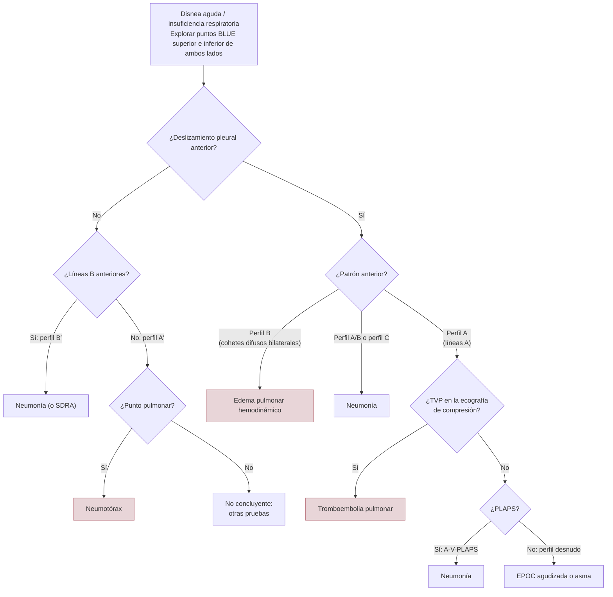
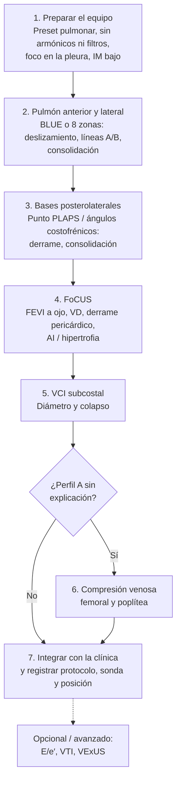

# 02 · Técnica y protocolos

Esta página es el **manual práctico** de la línea A: cómo se prepara el ecógrafo, cómo se coloca al paciente, qué signos hay que reconocer, cómo se ejecuta el protocolo BLUE, cómo se cuentan las líneas B de forma reproducible y cómo se integra el pulmón con el corazón (FoCUS), la vena cava inferior (VCI) y las venas. Las bases físicas de los artefactos se explican en [01 · Contexto](01-contexto.md). La precisión diagnóstica de cada signo y protocolo está en [03 · Precisión](03-precision.md), y las recomendaciones formales de las sociedades en [05 · Guías](05-guias.md).

Los tres documentos de referencia de esta página son:

- el **consenso clínico de la EACVI sobre ecografía pulmonar en la insuficiencia cardiaca aguda y crónica** ([Gargani, 2023](../../05-fuentes/index.md#gargani2023));
- el **consenso internacional de ecografía pulmonar de 2023**, que actualiza el de 2012 e incorpora a ingenieros y físicos ([Demi, 2023](../../05-fuentes/index.md#demi2023));
- las **descripciones originales del protocolo BLUE** ([Lichtenstein, 2008](../../05-fuentes/index.md#lichtenstein2008); [Lichtenstein, 2014](../../05-fuentes/index.md#lichtenstein2014); [Lichtenstein, 2015](../../05-fuentes/index.md#lichtenstein2015)).

!!! info "Cómo leer esta página"
    - Las secciones 1 a 3 (equipo, semiología y BLUE) son el **nivel básico** que debería dominar cualquier residente.
    - La sección 4 (cuantificación de líneas B) es necesaria para **monitorizar la descongestión**.
    - La sección 5 (FoCUS, VCI, Doppler, VExUS) combina elementos básicos (FEVI cualitativa, derrame pericárdico, VCI) con otros **avanzados** (E/e′, VExUS), que se señalan como tales.
    - La secuencia práctica de la sección 7 es una **propuesta docente** basada en las fuentes, no un protocolo validado como tal.

---

## 1. Equipo, ajustes y posición del paciente

### 1.1. Elección de la sonda

Todas las sondas habituales sirven para ver líneas B, pero cada una tiene ventajas y limitaciones. Los dos consensos de referencia **no coinciden del todo** en la sonda preferida (véase el recuadro de controversia).

| Sonda | Frecuencia orientativa | Ventajas en la disnea/ICA | Limitaciones | Fuente |
|---|---|---|---|---|
| **Convexa** (abdominal) | 3–7 MHz | Preferida por el consenso internacional para el parénquima subpleural y el derrame. Buena visión panorámica. Con preset abdominal da imagen adecuada para líneas B | Huella grande en espacios intercostales estrechos | [Demi, 2023](../../05-fuentes/index.md#demi2023); [Gargani, 2023](../../05-fuentes/index.md#gargani2023) |
| **Lineal** (vascular) | 7–13 MHz | Detalle de la línea pleural y la pared: deslizamiento, neumotórax, irregularidad pleural, consolidaciones subpleurales pequeñas. Imprescindible para la compresión venosa | Poca penetración. Con sondas «demasiado superficiales» cuesta distinguir las líneas B de otros artefactos en cola de cometa | [Demi, 2023](../../05-fuentes/index.md#demi2023); [Lichtenstein, 2014](../../05-fuentes/index.md#lichtenstein2014); [Gargani, 2014](../../05-fuentes/index.md#gargani2014) |
| **Sectorial** (*phased array*, cardiaca) | Baja frecuencia | Permite hacer pulmón y FoCUS sin cambiar de sonda. La EACVI la considera suficiente para líneas B (con preset cardiaco) y la usa para el derrame. Es la sonda de la mayoría de los estudios pronósticos de líneas B al alta | Menor resolución espacial y ancho de banda limitado. El consenso internacional **no la recomienda** para la ecografía pulmonar aislada. Peor para el neumotórax y el espacio subpleural | [Gargani, 2023](../../05-fuentes/index.md#gargani2023); [Demi, 2023](../../05-fuentes/index.md#demi2023); [Gargani, 2014](../../05-fuentes/index.md#gargani2014) |
| **Microconvexa** | Intermedia | La sonda del protocolo BLUE original: una sola sonda sirve para pulmón, corazón, venas y abdomen. Cabe entre la cama y la espalda del paciente en decúbito (punto PLAPS) | Menos disponible en algunos equipos | [Lichtenstein, 2014](../../05-fuentes/index.md#lichtenstein2014); [Lichtenstein, 2015](../../05-fuentes/index.md#lichtenstein2015); [Demi, 2023](../../05-fuentes/index.md#demi2023) |

- En un estudio con 21 pacientes con IC, un **ecógrafo de bolsillo** y un equipo de gama alta contaron un número similar de líneas B (mediana 4 frente a 5 con 8 zonas; p = 0,18) ([Platz, 2015](../../05-fuentes/index.md#platz2015)).
- Según una revisión narrativa, la sonda convexa podría asociarse a **menos líneas B detectadas** que la sectorial, y a mejor interpretación de la patología pleural por principiantes. La relevancia clínica no está aclarada ([Beshara, 2024](../../05-fuentes/index.md#beshara2024)).
- Aunque el número de líneas B cambie algo con la sonda en una zona concreta, el cuadro global no cambia. Nadie debería renunciar a explorar por no tener la sonda «ideal» ([Gargani, 2014](../../05-fuentes/index.md#gargani2014)).

!!! warning "Controversia: ¿sonda sectorial para el pulmón?"
    - **EACVI 2023 (cardiología):** la sectorial o la convexa son «suficientes» para las líneas B en el adulto, incluidos los ecógrafos de bolsillo ([Gargani, 2023](../../05-fuentes/index.md#gargani2023)).
    - **Consenso internacional 2023 (multidisciplinar, con ingenieros):** preferir la convexa (3–7 MHz) o la lineal (7–13 MHz). La sectorial puede usarse para integrar el pulmón con la ecocardiografía, pero **no se recomienda** por su menor resolución y ancho de banda ([Demi, 2023](../../05-fuentes/index.md#demi2023)).
    - **En la práctica:** en la disnea aguda, lo razonable es empezar con la sonda que ya está en la mano (a menudo la sectorial, si se va a hacer FoCUS) y cambiar a la lineal si hay que valorar la pleura o descartar un neumotórax. Lo que no se puede hacer es **cambiar de sonda entre exploraciones seriadas** del mismo paciente (véase 4.6).

### 1.2. Preset y ajustes del equipo

Las líneas B son **artefactos**: su número y su aspecto dependen de la máquina. El consenso internacional insiste en que la **frecuencia de imagen y el ancho de banda** tienen un papel mayor en la visualización de los artefactos verticales. En el mismo punto del pulmón pueden verse varias líneas B o ninguna según la frecuencia ([Demi, 2023](../../05-fuentes/index.md#demi2023)). Por eso, **contar líneas B es, como mucho, un método semicuantitativo** ([Demi, 2023](../../05-fuentes/index.md#demi2023)).

| Ajuste | Recomendación | Por qué | Fuente |
|---|---|---|---|
| **Preset** | Usar el preset **pulmonar** si el equipo lo tiene. Si no, el **abdominal** (convexa) o el **cardiaco** (sectorial) suelen dar imagen adecuada | Los presets de pulmón están optimizados para los artefactos | [Gargani, 2023](../../05-fuentes/index.md#gargani2023); [Demi, 2023](../../05-fuentes/index.md#demi2023) |
| **Frecuencia central** (edema cardiogénico) | 5–6 MHz | Las líneas B dependen de la frecuencia | [Demi, 2023](../../05-fuentes/index.md#demi2023) (enunciado 9) |
| **Armónicos** | **Desactivar** la imagen armónica | Los armónicos de los equipos modernos pueden alterar las líneas B | [Demi, 2023](../../05-fuentes/index.md#demi2023); [Lichtenstein, 2014](../../05-fuentes/index.md#lichtenstein2014); [Soldati, 2020](../../05-fuentes/index.md#soldati2020) |
| **Filtros «cosméticos»** (reducción de moteado, de ruido, promediado) | **Desactivar** | Algunos filtros (promediado, ruido dinámico) dificultan ver un deslizamiento discreto. Lichtenstein los suprime todos | [Lichtenstein, 2014](../../05-fuentes/index.md#lichtenstein2014); [Demi, 2023](../../05-fuentes/index.md#demi2023) |
| **Imagen compuesta** (*compounding*) y **persistencia** | **Desactivar** | El compuesto puede generar patrones artefactuales engañosos. Sin persistencia se gana frecuencia de imagen | [Demi, 2023](../../05-fuentes/index.md#demi2023); [Soldati, 2020](../../05-fuentes/index.md#soldati2020) |
| **Foco** | Un **único foco**, en la **línea pleural** (sin multifoco) | En el foco el haz es más estrecho y detecta mejor los detalles de la superficie pulmonar | [Demi, 2023](../../05-fuentes/index.md#demi2023); [Soldati, 2020](../../05-fuentes/index.md#soldati2020); [Beshara, 2024](../../05-fuentes/index.md#beshara2024) |
| **Ganancia** | Hasta un 50 % aproximadamente en el edema cardiogénico; **evitar la saturación** de la línea pleural. Bajarla para ver la pleura y las líneas A y B; subirla para estudiar una consolidación | La saturación produce zonas completamente blancas que borran la información | [Demi, 2023](../../05-fuentes/index.md#demi2023); [Soldati, 2020](../../05-fuentes/index.md#soldati2020); [Beshara, 2024](../../05-fuentes/index.md#beshara2024) |
| **Profundidad** | Para líneas B, unos **15–18 cm** según el tamaño del paciente. Menor para estudiar la pleura | Si la profundidad es escasa, el artefacto «no llega al fondo» y cambia su clasificación | [Gargani, 2023](../../05-fuentes/index.md#gargani2023); [Demi, 2023](../../05-fuentes/index.md#demi2023) |
| **Frecuencia de imagen** (*frame rate*) | La más alta posible | Los signos pleurales son dinámicos | [Demi, 2023](../../05-fuentes/index.md#demi2023); [Soldati, 2020](../../05-fuentes/index.md#soldati2020) |
| **Índice mecánico (IM)** | Guardar el preset pulmonar con un **IM inicial < 0,4** y subirlo solo si hace falta. Principio ALARA | En animales, la ecografía diagnóstica puede inducir hemorragia capilar pulmonar, que además puede **simular líneas B**. El riesgo es despreciable por debajo de IM 0,4. No se han descrito efectos significativos en humanos | [Demi, 2023](../../05-fuentes/index.md#demi2023) (enunciado 6) |
| **Doppler** | No necesario para la ecografía pulmonar básica | Un ecógrafo sencillo en escala de grises basta | [Gargani, 2014](../../05-fuentes/index.md#gargani2014); [Lichtenstein, 2015](../../05-fuentes/index.md#lichtenstein2015) |

!!! tip "Perla clínica: crea tu preset pulmonar"
    Antes de la primera guardia, guarda en el ecógrafo un preset pulmonar propio: armónicos y filtros apagados, sin compuesto ni persistencia, un solo foco en la pleura e IM bajo ([Demi, 2023](../../05-fuentes/index.md#demi2023)). Así, las exploraciones de un mismo paciente (y entre compañeros) serán comparables.

??? info "Detalle: qué pide el consenso internacional que se registre"
    Para que un estudio de ecografía pulmonar sea reproducible, el consenso de 2023 pide que se informe siempre del rango de IM, la sonda y el ecógrafo, el rango de frecuencias, la profundidad focal y de imagen, las zonas del tórax exploradas, el grosor de la pared torácica y el motivo de estas elecciones (enunciados técnicos 2, 3 y 5) ([Demi, 2023](../../05-fuentes/index.md#demi2023)). También recomienda **terminología estandarizada**: artefactos verticales (líneas B), línea B confluente, pulmón blanco, grosor pleural en milímetros, irregularidad pleural y artefactos horizontales (líneas A) (enunciado 8). Y describir los hallazgos en **milímetros** en lugar de «pequeño» o «grande» (enunciado 4).

### 1.3. Orientación de la sonda

- **Longitudinal** (perpendicular a las costillas): se ven las dos costillas con su sombra y, medio centímetro por debajo en el adulto, la línea pleural. Es el **signo del murciélago** (*bat sign*), la referencia fija de toda la exploración ([Lichtenstein, 2014](../../05-fuentes/index.md#lichtenstein2014); [Gargani, 2014](../../05-fuentes/index.md#gargani2014)).
- **Oblicua o transversal** (a lo largo del espacio intercostal): se ve más línea pleural, sin sombras costales ([Gargani, 2014](../../05-fuentes/index.md#gargani2014)). Ambas orientaciones son válidas para las líneas B según la EACVI ([Gargani, 2023](../../05-fuentes/index.md#gargani2023)).
- Inclinar la sonda hasta que el haz sea **perpendicular a la pleura** ([Beshara, 2024](../../05-fuentes/index.md#beshara2024)).
- Una vez optimizada la imagen, **mantener la sonda quieta al menos un ciclo respiratorio** y, dentro de cada zona, **barrer toda la superficie accesible** para ganar sensibilidad ([Gargani, 2023](../../05-fuentes/index.md#gargani2023)).
- El consenso internacional recomienda explorar la **mayor superficie torácica posible**. Limitarla solo está justificado por la situación del paciente (trauma, cicatrices, obesidad, apósitos, poca colaboración) o por la necesidad de un protocolo rápido en urgencias (enunciados 7 y 10) ([Demi, 2023](../../05-fuentes/index.md#demi2023)).

### 1.4. Posición del paciente

| Posición | Para qué | Comentario | Fuente |
|---|---|---|---|
| **Supino** | Tórax anterior; protocolo BLUE; **neumotórax** (el aire sube a la región anterior) | Posición del BLUE original en UCI. En supino, la búsqueda de neumotórax se centra en la región anterior | [Lichtenstein, 2014](../../05-fuentes/index.md#lichtenstein2014); [Beshara, 2024](../../05-fuentes/index.md#beshara2024) |
| **Semisentado** o **sentado** | La mayoría de los pacientes disneicos en urgencias; **derrame** en el ángulo costofrénico; regiones posteriores | Sentado de espaldas al explorador es la posición ideal para el tórax posterior | [Gargani, 2014](../../05-fuentes/index.md#gargani2014); [Beshara, 2024](../../05-fuentes/index.md#beshara2024) |
| **Decúbito lateral** | Líneas axilares y bases posteriores en el paciente que no se sienta | En el intubado o inconsciente, una sonda pequeña se puede meter entre la cama y la espalda | [Gargani, 2014](../../05-fuentes/index.md#gargani2014); [Beshara, 2024](../../05-fuentes/index.md#beshara2024) |

La EACVI admite explorar sentado, semisentado o en supino, pero **en las exploraciones seriadas hay que repetir la misma posición** ([Gargani, 2023](../../05-fuentes/index.md#gargani2023)). Según una revisión clásica, la distribución global de las líneas B no cambia de forma clínicamente relevante con la posición, salvo el derrame pleural ([Gargani, 2014](../../05-fuentes/index.md#gargani2014)).

!!! warning "Error frecuente: olvidar las bases posteriores"
    Los protocolos «cardiológicos» (4, 6 y 8 zonas) omiten la cara posterior del tórax, lo que el consenso internacional considera una posible debilidad ([Demi, 2023](../../05-fuentes/index.md#demi2023)). Las regiones dorsobasales son importantes para el derrame libre, las consolidaciones y la enfermedad intersticial, y no deberían omitirse ni siquiera en el paciente que no puede sentarse (enunciado 15) ([Demi, 2023](../../05-fuentes/index.md#demi2023)). En el paciente encamado muchas horas con IC, hay que mirar las zonas declives, a lo largo de las líneas axilares media y posterior ([Gargani, 2014](../../05-fuentes/index.md#gargani2014)).

---

## 2. Semiología básica

La tabla de signos elementales con su fundamento físico y sus cifras originales está en [01 · Contexto](01-contexto.md). Aquí se resume **desde el punto de vista del explorador**: cómo obtener cada signo, qué significa y cuál es la trampa principal.

### 2.1. Tabla de signos

| Hallazgo | Cómo se ve | Significado | Trampa principal | Fuente |
|---|---|---|---|---|
| **Línea pleural** (signo del murciélago) | Línea horizontal hiperecogénica entre dos sombras costales, unos 0,5 cm por debajo de la línea costal en el adulto | Referencia fija: pleura parietal. Visible incluso en agitados, obesos o con enfisema subcutáneo | En el enfisema subcutáneo no se ve el murciélago | [Lichtenstein, 2014](../../05-fuentes/index.md#lichtenstein2014); [Beshara, 2024](../../05-fuentes/index.md#beshara2024) |
| **Deslizamiento pleural** | Vaivén de la línea pleural sincrónico con la respiración | La pleura visceral se mueve contra la parietal. Donde hay deslizamiento **no hay neumotórax** bajo la sonda | Es más discreto en los vértices y en la enfermedad. Los filtros lo ocultan. Su ausencia es muy poco específica: adherencias, SDRA, atelectasia, intubación selectiva, apnea, parada, fibrosis, parálisis frénica, ajustes o sondas inadecuados | [Lichtenstein, 2014](../../05-fuentes/index.md#lichtenstein2014) |
| **Pulso pulmonar** | Oscilación de la línea pleural con cada latido, sin deslizamiento | Pulmón que no se ventila pero cuyas pleuras siguen en contacto (apnea, atelectasia completa, intubación selectiva). **Descarta el neumotórax** bajo la sonda | Muy sutil; exige frecuencia de imagen alta y sin filtros | [Lichtenstein, 2003](../../05-fuentes/index.md#lichtenstein2003); [Robba, 2021](../../05-fuentes/index.md#robba2021) |
| **Líneas A** | Líneas horizontales, paralelas y equidistantes a la pleura, a múltiplos de la distancia sonda-pleura | Reverberación: hay **gas** bajo la pleura (aire alveolar normal, hiperinsuflación o aire libre) | Líneas A **sin** deslizamiento pueden ser un neumotórax | [Demi, 2023](../../05-fuentes/index.md#demi2023); [Lichtenstein, 2014](../../05-fuentes/index.md#lichtenstein2014) |
| **Líneas B** | Artefactos verticales hiperecogénicos, «en rayo láser», que **nacen de la línea pleural**, **llegan al fondo de la pantalla** sin atenuarse, **se mueven** con el deslizamiento y **borran las líneas A** | Pérdida parcial de aire subpleural (agua, inflamación, fibrosis). **≥ 3 en un espacio intercostal** = zona positiva | Pueden verse **algunas aisladas en sujetos sanos**, sobre todo en las bases. Dependen de la frecuencia y de la profundidad elegidas | [Volpicelli, 2012](../../05-fuentes/index.md#volpicelli2012); [Lichtenstein, 2014](../../05-fuentes/index.md#lichtenstein2014); [Gargani, 2023](../../05-fuentes/index.md#gargani2023); [Demi, 2023](../../05-fuentes/index.md#demi2023) |
| **Líneas B confluentes / pulmón blanco** | Líneas B que se funden y ocupan buena parte o todo el espacio bajo la pleura | Pérdida mayor de aire: edema alveolar, SDRA, neumonía intersticial | Se cuentan por **porcentaje de pantalla** (véase 4.4), no una a una. La ganancia excesiva simula pulmón blanco | [Gargani, 2023](../../05-fuentes/index.md#gargani2023); [Picano, 2016](../../05-fuentes/index.md#picano2016); [Soldati, 2020](../../05-fuentes/index.md#soldati2020) |
| **Líneas Z** | Artefactos verticales cortos y mal definidos que **no** borran las líneas A | Sin significado patológico | Confundirlas con líneas B, sobre todo con sondas lineales superficiales | [Lichtenstein, 2014](../../05-fuentes/index.md#lichtenstein2014); [Beshara, 2024](../../05-fuentes/index.md#beshara2024) |
| **Líneas E** | Artefactos verticales que nacen **por encima** de la pleura, en el tejido subcutáneo | Enfisema subcutáneo | No nacen de la pleura ni se mueven con la respiración | [Beshara, 2024](../../05-fuentes/index.md#beshara2024) |
| **Consolidación: signo del tejido** (hepatización) | Pulmón con ecogenicidad similar al hígado o al bazo | Consolidación **translobar** | Distinguirla del hígado o bazo reales (buscar el diafragma) | [Lichtenstein, 2014](../../05-fuentes/index.md#lichtenstein2014) |
| **Consolidación: signo del desflecado** (*shred*, fractal) | Zona hipoecoica con borde profundo **irregular**, «deshilachado», frente al pulmón aireado | Consolidación **no translobar** (la más frecuente). En la neumonía, contornos irregulares | Solo se ve si la consolidación **toca la pleura** | [Lichtenstein, 2014](../../05-fuentes/index.md#lichtenstein2014); [Demi, 2023](../../05-fuentes/index.md#demi2023); [Gargani, 2014](../../05-fuentes/index.md#gargani2014) |
| **Broncograma aéreo dinámico** | Puntos o líneas hiperecogénicas dentro de la consolidación que **se mueven** con la respiración | Aire en bronquios permeables: orienta a **neumonía** frente a atelectasia de reabsorción | Un tercio de las neumonías tuvo broncograma estático en el estudio original | [Lichtenstein, 2009b](../../05-fuentes/index.md#lichtenstein2009b); [Demi, 2023](../../05-fuentes/index.md#demi2023) |
| **Broncograma aéreo estático** | Broncogramas que no se mueven; si son paralelos y horizontales, indican colapso con pérdida de volumen | Orienta a **atelectasia obstructiva** | El Doppler color (flujo presente en neumonía, ausente en atelectasia) y la clínica ayudan | [Lichtenstein, 2009b](../../05-fuentes/index.md#lichtenstein2009b); [Demi, 2023](../../05-fuentes/index.md#demi2023); [Beshara, 2024](../../05-fuentes/index.md#beshara2024) |
| **Broncograma líquido** | Estructuras tubulares anecoicas dentro de la consolidación, sin flujo en el Doppler | Bronquios llenos de líquido (exudado, moco): neumonía posobstructiva | Diferenciarlos de vasos con Doppler | [Demi, 2023](../../05-fuentes/index.md#demi2023) |
| **Derrame: signo del cuadrilátero** (*quad sign*) | Colección limitada por la línea pleural, las sombras de las costillas y la **línea pulmonar** (pleura visceral) | Derrame pleural, sea anecoico o ecogénico (empiema, hemotórax) | Confundir con consolidación: el derrame tiene un borde profundo **regular** | [Lichtenstein, 2014](../../05-fuentes/index.md#lichtenstein2014) |
| **Derrame: signo sinusoide** (modo M) | La línea pulmonar se acerca a la pleural en cada inspiración | Derrame **libre** y de baja viscosidad | Ausente en derrames muy tabicados o viscosos | [Lichtenstein, 2014](../../05-fuentes/index.md#lichtenstein2014) |
| **Signo de la columna** (*spine sign*) | La columna vertebral se ve **por encima** del diafragma | Hay líquido (o tejido consolidado) que transmite los ultrasonidos | Una consolidación basal también lo produce | [Beshara, 2024](../../05-fuentes/index.md#beshara2024) |
| **Signo de la cortina** | En inspiración, el pulmón aireado desciende y tapa el hígado o el bazo | Normal: su presencia hace improbable un derrame en ese punto | Su **ausencia** sugiere derrame o consolidación | [Gargani, 2014](../../05-fuentes/index.md#gargani2014); [Beshara, 2024](../../05-fuentes/index.md#beshara2024) |
| **Modo M: orilla del mar** (*seashore*) | Líneas horizontales estáticas por encima de la pleura («el mar») y granulado por debajo («la arena») | Deslizamiento presente | El modo M es solo un apoyo: la exploración se hace en tiempo real | [Lichtenstein, 2014](../../05-fuentes/index.md#lichtenstein2014) |
| **Modo M: estratosfera o código de barras** | Líneas horizontales por encima y por debajo de la pleura | Ausencia total de movimiento: sugiere neumotórax, pero no es exclusivo | Los movimientos respiratorios del paciente disneico interfieren por encima de la pleura | [Lichtenstein, 2014](../../05-fuentes/index.md#lichtenstein2014); [Beshara, 2024](../../05-fuentes/index.md#beshara2024) |
| **Punto pulmonar** (*lung point*) | En un punto fijo de la pared, el patrón sin deslizamiento (perfil A′) cambia bruscamente en inspiración a deslizamiento o líneas B | Específico de **neumotórax**. Su localización orienta al volumen: anterior (moderado) o lateral/posterior (grande) | No aparece en el colapso completo ni con adherencias extensas. Falsos puntos: bullas, contusión, adherencias, deslizamiento pericárdico | [Lichtenstein, 2000](../../05-fuentes/index.md#lichtenstein2000); [Lichtenstein, 2014](../../05-fuentes/index.md#lichtenstein2014); [Beshara, 2024](../../05-fuentes/index.md#beshara2024) |

!!! note "Qué es y qué no es una línea B"
    Lichtenstein define la línea B con **tres criterios constantes** (artefacto en cola de cometa, nace de la línea pleural, se mueve con el deslizamiento) y **cuatro casi constantes** (largo, bien definido, en rayo láser, hiperecogénico y que borra las líneas A). Tres o más entre dos costillas son **«cohetes pulmonares»** (*lung rockets*) ([Lichtenstein, 2014](../../05-fuentes/index.md#lichtenstein2014)). El consenso internacional de 2023 critica que «en rayo láser» y «sin atenuarse» son subjetivos y que la longitud del artefacto depende de la profundidad; propone hablar de **artefactos verticales** ([Demi, 2023](../../05-fuentes/index.md#demi2023)).

### 2.2. Cómo confirmar o descartar un neumotórax en tres pasos

Según Lichtenstein, el diagnóstico de neumotórax requiere tres pasos ([Lichtenstein, 2014](../../05-fuentes/index.md#lichtenstein2014)):

1. **Deslizamiento abolido** en la región anterior (en supino). Si hay deslizamiento, se descarta el neumotórax bajo la sonda.
2. **Signo de la línea A** (ninguna línea B). Una sola línea B, aunque no se mueva, descarta el neumotórax en ese punto, porque las líneas B nacen de la pleura visceral.
3. **Punto pulmonar**, que es el signo específico.

La ESICM recomienda como habilidad básica (recomendación fuerte) descartar el neumotórax con cualquiera de estos signos: deslizamiento, pulso pulmonar o líneas B, y usar el punto pulmonar para confirmarlo ([Robba, 2021](../../05-fuentes/index.md#robba2021)).

!!! tip "Perla clínica: el paciente inestable"
    En el paciente en shock o en parada, la ausencia de todo movimiento pleural (ni deslizamiento ni pulso pulmonar) junto a la ausencia de líneas B hace tan probable el neumotórax que puede justificar el drenaje sin más pruebas. En el paciente estable, en cambio, conviene ampliar la exploración para buscar el punto pulmonar ([Gargani, 2014](../../05-fuentes/index.md#gargani2014)).

### 2.3. Derrame pleural: cómo buscarlo y cuantificarlo

- **Dónde:** en las zonas declives, en la cara lateral y posterior del tórax (p. ej., línea axilar posterior) a la altura de los ángulos costofrénicos ([Gargani, 2023](../../05-fuentes/index.md#gargani2023)). En el BLUE, en el **punto PLAPS**, accesible en el paciente en supino ([Lichtenstein, 2014](../../05-fuentes/index.md#lichtenstein2014)). Con la convexa, las ventanas transhepática y transesplénica muestran bien la interfaz diafragmática ([Demi, 2023](../../05-fuentes/index.md#demi2023)).
- **Qué sonda:** la sectorial basta gracias a su baja frecuencia y su penetración ([Gargani, 2023](../../05-fuentes/index.md#gargani2023); [Gargani, 2014](../../05-fuentes/index.md#gargani2014)).
- **Qué buscar:** espacio anecoico por encima del diafragma, signos del cuadrilátero y sinusoide, signo de la columna, ausencia de cortina ([Robba, 2021](../../05-fuentes/index.md#robba2021); [Lichtenstein, 2014](../../05-fuentes/index.md#lichtenstein2014); [Beshara, 2024](../../05-fuentes/index.md#beshara2024)).
- **Aspecto:** los ecos internos, tabiques o ecos puntiformes flotantes (signo del plancton) sugieren un derrame **complicado** o exudado ([Robba, 2021](../../05-fuentes/index.md#robba2021); [Gargani, 2023](../../05-fuentes/index.md#gargani2023); [Beshara, 2024](../../05-fuentes/index.md#beshara2024)).
- **Volumen:** la ESICM considera habilidad básica estimar el volumen (recomendación fuerte) ([Robba, 2021](../../05-fuentes/index.md#robba2021)). Una fórmula sencilla, derivada en 81 pacientes ventilados en supino con el tronco a 15°, es **V (mL) ≈ 20 × separación interpleural máxima en espiración (mm)**, medida en la base en la línea axilar posterior. Su error medio de predicción fue de unos 158 mL ([Balik, 2006](../../05-fuentes/index.md#balik2006)).
- **Seguridad de la punción:** Lichtenstein exige una distancia inspiratoria mínima de 15 mm para la punción diagnóstica o terapéutica ([Lichtenstein, 2014](../../05-fuentes/index.md#lichtenstein2014)).

!!! info "El derrame en la insuficiencia cardiaca"
    Según la EACVI, el derrame cardiogénico es **frecuente, de tamaño variable, trasudado de aspecto no complejo y habitualmente bilateral, a menudo mayor en el lado derecho** ([Gargani, 2023](../../05-fuentes/index.md#gargani2023)). La ecografía es más sensible que la radiografía y permite monitorizar su reducción con la descongestión sin radiación. Cerca de la mitad de los pacientes dados de alta tras una ICA tiene derrame, aunque no está claro que ese hallazgo tenga valor pronóstico ([Gargani, 2023](../../05-fuentes/index.md#gargani2023)). **En las zonas con derrame no se pueden valorar las líneas B**: se debe anotar el derrame en su lugar ([Gargani, 2023](../../05-fuentes/index.md#gargani2023)). El derrame grande produce **atelectasia compresiva**, frecuente en la IC ([Gargani, 2023](../../05-fuentes/index.md#gargani2023)).

---

## 3. El protocolo BLUE

El protocolo BLUE (*Bedside Lung Ultrasound in Emergency*) se publicó en 2008 en 260 pacientes con insuficiencia respiratoria aguda ingresados en UCI, con diagnóstico definitivo; se excluyeron los diagnósticos inciertos y las causas raras (< 2 %) ([Lichtenstein, 2008](../../05-fuentes/index.md#lichtenstein2008)). Combina tres elementos (artefactos, deslizamiento y consolidación/derrame) con el **análisis venoso**, y agrupa los hallazgos en **perfiles** asociados a seis enfermedades que suponen el 97 % de los casos de urgencias ([Lichtenstein, 2008](../../05-fuentes/index.md#lichtenstein2008); [Lichtenstein, 2014](../../05-fuentes/index.md#lichtenstein2014)). Es un **estudio clásico**, unicéntrico y hecho por expertos; su validación externa se analiza en [03 · Precisión](03-precision.md).

### 3.1. Los puntos BLUE y la «mano BLUE»

Se colocan **dos manos** sobre el hemitórax (del tamaño de las del paciente, sin los pulgares): la superior toca la clavícula y los dedos de ambas manos se sitúan en contacto. Así se definen tres puntos estandarizados ([Lichtenstein, 2014](../../05-fuentes/index.md#lichtenstein2014)):

| Punto | Localización | Qué busca |
|---|---|---|
| **Punto BLUE superior** | En el **centro de la mano superior** | Deslizamiento, líneas A o B, consolidación anterior |
| **Punto BLUE inferior** | En el **centro de la palma de la mano inferior** | Ídem |
| **Punto PLAPS** | Intersección de una línea horizontal a la altura del punto BLUE inferior con la **línea axilar posterior** (tan posterior como permita la sonda en supino) | **PLAPS**: síndrome alveolar y/o pleural posterolateral (consolidación, derrame) |

El diafragma suele estar en el borde inferior de la mano inferior ([Lichtenstein, 2014](../../05-fuentes/index.md#lichtenstein2014)). El estudio original de 2008 exploraba tres zonas por hemitórax (anterior, lateral, posterolateral), cada una dividida en mitad superior e inferior; la versión simplificada con tres puntos estandarizados llegó después ([Beshara, 2024](../../05-fuentes/index.md#beshara2024)). El 90 % de las consolidaciones de los críticos se localiza en el punto PLAPS ([Lichtenstein, 2014](../../05-fuentes/index.md#lichtenstein2014)).

!!! note "Por qué solo cuentan las líneas B anteriores"
    En el BLUE solo se consideran los **cohetes pulmonares anterolaterales**: los cambios intersticiales posteriores pueden deberse solo a la gravedad en el paciente en decúbito ([Lichtenstein, 2014](../../05-fuentes/index.md#lichtenstein2014)). Esto hace el perfil B muy específico en el crítico, pero **menos sensible** en el paciente menos grave, en el que las líneas B aparecen primero en las zonas laterales y declives ([Gargani, 2014](../../05-fuentes/index.md#gargani2014)).

### 3.2. Los perfiles

| Perfil | Definición | Diagnóstico asociado | Sensibilidad / especificidad (estudio original) |
|---|---|---|---|
| **A** | Deslizamiento anterior + líneas A | Compatible con TEP, EPOC/asma o neumonía posterior: **obliga a seguir** (venas, PLAPS) | — |
| **A + TVP** | Perfil A + trombosis venosa profunda | **Tromboembolia pulmonar** | 81 % / 99 % |
| **A-V-PLAPS** | Perfil A + venas libres + PLAPS | **Neumonía** | 42 % / 96 % |
| **Perfil desnudo** (*nude*) | Perfil A sin TVP y sin PLAPS | **EPOC agudizada o asma grave** | 89 % / 97 % |
| **A′** | Perfil A **sin deslizamiento** | Sugiere neumotórax; se confirma con el **punto pulmonar** | 88 % / 100 % (A′ + punto pulmonar) |
| **B** | Deslizamiento anterior + **cohetes pulmonares** difusos bilaterales | **Edema pulmonar hemodinámico** | 97 % / 95 % |
| **B′** | Perfil B **sin deslizamiento** | **Neumonía** (o SDRA) | 11 % / 100 % |
| **A/B** | Perfil A en un pulmón y B en el otro | **Neumonía** | 14,5 % / 100 % |
| **C** | **Consolidación anterior**, sea cual sea su tamaño y número. Una línea pleural engrosada e irregular es equivalente | **Neumonía** | 21,5 % / 99 % |

Fuente: definiciones y tabla de rendimiento de [Lichtenstein, 2014](../../05-fuentes/index.md#lichtenstein2014), que reproduce el estudio de 2008 ([Lichtenstein, 2008](../../05-fuentes/index.md#lichtenstein2008)). Los cuatro perfiles de neumonía juntos alcanzaron un 89 % de sensibilidad y un 94 % de especificidad, y el conjunto del protocolo acertó el 90,5 % de los diagnósticos ([Lichtenstein, 2008](../../05-fuentes/index.md#lichtenstein2008); [Lichtenstein, 2014](../../05-fuentes/index.md#lichtenstein2014)). En el resumen de 2008, la sensibilidad para neumotórax figura como 81 %; la tabla de la revisión de 2014 da 88 % (8/9).

!!! info "Por qué el edema da perfil B y la neumonía perfil B′"
    Lichtenstein lo explica con una imagen: el edema hemodinámico produce un **trasudado**, «una especie de aceite», que conserva el deslizamiento; la neumonía produce un **exudado**, «una especie de pegamento», que lo abole. El edema hemodinámico dio perfil B en el 97 % de los casos, y el SDRA un perfil de neumonía en el 86 % ([Lichtenstein, 2014](../../05-fuentes/index.md#lichtenstein2014)). Es una explicación fisiopatológica del autor, no un dato de estudios independientes.

### 3.3. Integración con la trombosis venosa

Ante un **perfil A** (compatible con TEP), el BLUE pasa al **análisis venoso** antes de buscar PLAPS ([Lichtenstein, 2014](../../05-fuentes/index.md#lichtenstein2014)). La ESICM considera habilidad básica (recomendación fuerte) la **ecografía de compresión desde la vena femoral común en la ingle hasta la vena poplítea**, recordando que el TEP también puede originarse en trombos pélvicos o abdominales ([Robba, 2021](../../05-fuentes/index.md#robba2021)). En la sospecha de TEP en urgencias, la ecografía **multiórgano** (pulmón + corazón + venas) fue más sensible que cualquiera de sus componentes por separado ([Nazerian, 2014](../../05-fuentes/index.md#nazerian2014)); los detalles están en [03 · Precisión](03-precision.md).

### 3.4. Árbol de decisión

*Árbol adaptado de [Lichtenstein, 2008](../../05-fuentes/index.md#lichtenstein2008) y [Lichtenstein, 2014](../../05-fuentes/index.md#lichtenstein2014).*

!!! warning "Límites del BLUE que hay que decir en voz alta"
    - Es un protocolo **de UCI**, con dos operadores muy expertos y en un solo centro ([Beshara, 2024](../../05-fuentes/index.md#beshara2024)).
    - Los perfiles se **solapan**: el SDRA precoz puede dar un perfil B antes de evolucionar a un patrón consolidativo ([Beshara, 2024](../../05-fuentes/index.md#beshara2024)).
    - El BLUE se sigue de una ecocardiografía básica **si las ventanas lo permiten**: el protocolo pulmonar no sustituye al corazón ([Lichtenstein, 2014](../../05-fuentes/index.md#lichtenstein2014)).
    - El «perfil desnudo» de la EPOC y el asma es un diagnóstico **por exclusión**: el perfil A no descarta un TEP sin TVP visible ni una neumonía que no toque la pleura. Véase la trampa del perfil A en [03 · Precisión](03-precision.md).

### 3.5. Protocolos derivados

- **FALLS** (*Fluid Administration Limited by Lung Sonography*): aplica la lógica del BLUE al shock. Descarta sucesivamente el shock obstructivo, el cardiogénico y el hipovolémico, y usa la aparición de líneas B como límite de la fluidoterapia; según su autor, el paso de líneas A a cohetes aparece con una presión de enclavamiento de unos 18 mmHg ([Lichtenstein, 2015](../../05-fuentes/index.md#lichtenstein2015)). Su validez está discutida: en un estudio citado por una revisión, el aumento de líneas B tuvo una sensibilidad del 80 % y una especificidad de solo el 57 % para distinguir respondedores de no respondedores a fluidos ([Beshara, 2024](../../05-fuentes/index.md#beshara2024)). No es el tema de esta línea.
- **Protocolos multiórgano** (pulmón + corazón + VCI + venas): véanse la sección 5 y [03 · Precisión](03-precision.md).

---

## 4. Cuantificación de las líneas B

### 4.1. Por qué cuantificar

En la disnea aguda, la pregunta es **cualitativa**: ¿hay o no un patrón de edema? En la ICA hospitalizada y en el seguimiento, la pregunta pasa a ser **cuantitativa**: ¿cuánta congestión pulmonar hay y cómo cambia con el tratamiento? El número de líneas B aumenta a medida que baja la proporción de aire frente a agua ([Gargani, 2023](../../05-fuentes/index.md#gargani2023)), y en quienes responden al diurético disminuye con rapidez ([Gargani, 2023](../../05-fuentes/index.md#gargani2023)). En un estudio clásico de 121 pacientes, la suma de líneas B se correlacionó con la puntuación radiológica de agua pulmonar extravascular (r = 0,78) y sus cambios intrapaciente todavía más (r = 0,89), con menos de 3 minutos por exploración ([Jambrik, 2004](../../05-fuentes/index.md#jambrik2004)).

La evidencia de si guiar el diurético por las líneas B mejora los resultados está en [04 · Impacto](04-impacto.md).

### 4.2. Definiciones operativas

| Concepto | Definición | Fuente |
|---|---|---|
| **Zona positiva** | **≥ 3 líneas B** en un espacio intercostal (una exploración longitudinal) de esa zona | [Volpicelli, 2012](../../05-fuentes/index.md#volpicelli2012); [Gargani, 2023](../../05-fuentes/index.md#gargani2023) |
| **Patrón de edema pulmonar** (síndrome intersticial difuso) | Líneas B **múltiples** (≥ 3 por zona), **difusas** (≥ 2 zonas positivas por hemitórax) y **bilaterales** | [Gargani, 2023](../../05-fuentes/index.md#gargani2023) |
| **Hallazgo no patológico** | Algunas líneas B aisladas y parcheadas, sobre todo en las bases, que pueden verse en sanos y no cumplen «múltiples, difusas y bilaterales» | [Gargani, 2023](../../05-fuentes/index.md#gargani2023) |
| **Síndrome intersticial focal** | Líneas B múltiples en una sola zona: puede indicar neumonía precoz, o el edema que rodea a una consolidación | [Gargani, 2023](../../05-fuentes/index.md#gargani2023) |
| **Distribución** | En la afectación difusa y bilateral, describir si es **homogénea o heterogénea** (con zonas respetadas) y si hay **gradiente** apicocaudal o ventrodorsal | [Demi, 2023](../../05-fuentes/index.md#demi2023) (enunciado 8) |

### 4.3. Protocolos de exploración

| Protocolo | Zonas | Dónde | Cómo se puntúa | Uso principal | Fuente |
|---|---|---|---|---|---|
| **28 zonas** (Jambrik/Picano) | 28: 16 en el hemitórax derecho y 12 en el izquierdo | Tórax anterolateral: del 2.º al 4.º espacio intercostal (hasta el 5.º a la derecha), de la línea paraesternal a la axilar. A la izquierda no se incluye el 5.º espacio | **Recuento**: suma de líneas B de todas las zonas | Investigación, IC crónica, diálisis, estudios de eco de estrés; seguimiento fino | [Jambrik, 2004](../../05-fuentes/index.md#jambrik2004); [Gargani, 2014](../../05-fuentes/index.md#gargani2014); [Gargani, 2023](../../05-fuentes/index.md#gargani2023); [Demi, 2023](../../05-fuentes/index.md#demi2023) |
| **8 zonas** (Volpicelli) | 8: 4 por hemitórax | Zonas 1 y 2: anterior superior e inferior. Zonas 3 y 4: lateral superior y basal | **Zonas positivas** (≥ 3 líneas B). Examen positivo: ≥ 2 zonas positivas por hemitórax, bilateral. También admite recuento | **El más usado**; recomendado por la EACVI para diagnóstico, seguimiento y pronóstico en la IC | [Volpicelli, 2006](../../05-fuentes/index.md#volpicelli2006); [Volpicelli, 2012](../../05-fuentes/index.md#volpicelli2012); [Gargani, 2014](../../05-fuentes/index.md#gargani2014); [Gargani, 2023](../../05-fuentes/index.md#gargani2023) |
| **6 zonas** | 6 | Variante simplificada usada en estudios de IC `[POR VERIFICAR: la localización anatómica exacta varía entre estudios]` | Zonas positivas | Diagnóstico de ICA en urgencias | [Buessler, 2020](../../05-fuentes/index.md#buessler2020); [Demi, 2023](../../05-fuentes/index.md#demi2023) |
| **4 zonas** | 4: 2 por hemitórax | 3.er espacio intercostal en las líneas axilar anterior y axilar media | Recuento o zonas positivas | Eco de estrés; pronóstico al alta | [Gargani, 2023](../../05-fuentes/index.md#gargani2023); [Platz, 2019](../../05-fuentes/index.md#platz2019) |
| **BLUE** | 3 puntos por hemitórax (2 anteriores + PLAPS) | Puntos BLUE superior, inferior y PLAPS | Perfiles cualitativos | Diagnóstico de la insuficiencia respiratoria aguda | [Lichtenstein, 2014](../../05-fuentes/index.md#lichtenstein2014) |
| **12 regiones (LUS score)** | 12: 6 por hemitórax | Campos anterior, lateral y posterior (delimitados por el esternón y las líneas axilares anterior y posterior), cada uno con región superior e inferior | **Puntuación 0–3** por región (total 0–36) | UCI: aireación en SDRA y ventilación mecánica | [Bouhemad, 2011](../../05-fuentes/index.md#bouhemad2011); [Demi, 2023](../../05-fuentes/index.md#demi2023) |
| **14 zonas** (COVID-19) | 14: 3 posteriores, 2 laterales y 2 anteriores por lado | Líneas paravertebral, axilar media y medioclavicular | Puntuación 0–3 **específica** (basada en la pleura) | Neumonía COVID-19 | [Soldati, 2020](../../05-fuentes/index.md#soldati2020) |

!!! note "¿Cuántas zonas? La respuesta de la EACVI"
    La EACVI recomienda **idealmente el protocolo de 8 zonas**, por equilibrar rapidez y precisión ([Gargani, 2023](../../05-fuentes/index.md#gargani2023)). La base principal es un estudio prospectivo en cuatro servicios de urgencias con 117 pacientes con duda diagnóstica ([Buessler, 2020](../../05-fuentes/index.md#buessler2020)):

    - El índice C para ICA fue de 63,7 con 4 puntos (BLUE), 72,4 con 6, 74,0 con 8 y 72,4 con 28.
    - Los umbrales fueron: 4 puntos, dos puntos positivos bilaterales; 6 y 8 puntos, ≥ 1 punto positivo en cada lado; 28 puntos, ≥ 30 líneas B.
    - El mayor aumento del índice C sobre la puntuación clínica BREST se obtuvo con 8 zonas (+6,9), seguido de 6 zonas.

    Es decir, el protocolo de 8 zonas **no fue inferior** al de 28 y fue más práctico. El de 4 puntos rindió peor en el paciente de urgencias con duda diagnóstica.

### 4.4. Cómo contar

La EACVI distingue dos enfoques de cuantificación, ambos con buena concordancia intra- e interobservador ([Gargani, 2023](../../05-fuentes/index.md#gargani2023)):

1. **Por puntuación (zonas positivas):** cada zona con ≥ 3 líneas B cuenta como positiva y se suman las zonas positivas.
2. **Por recuento:** se cuentan las líneas B de cada zona y se suman.
    - Si son pocas, **una a una**.
    - Si son **confluentes**, se estima el **porcentaje de pantalla** ocupado por líneas B bajo la línea pleural y se **divide entre 10**. Por ejemplo, un 60 % equivale a 6 líneas B, con un **máximo de 10 por zona** ([Gargani, 2023](../../05-fuentes/index.md#gargani2023); [Gargani, 2014](../../05-fuentes/index.md#gargani2014)).
    - En cada zona se cuenta en el **peor punto** (el menos aireado, con más líneas B) ([Gargani, 2023](../../05-fuentes/index.md#gargani2023)).

**Espacio intercostal y tiempo de observación:**

- Mantener la sonda en el mismo sitio **al menos un ciclo respiratorio** ([Gargani, 2023](../../05-fuentes/index.md#gargani2023)).
- Si se graba un clip, la duración sugerida es de **unos 6 segundos** ([Gargani, 2023](../../05-fuentes/index.md#gargani2023)). En 21 pacientes con IC, los clips de 4 s mostraron más líneas B que los de 2 s, y los de 6 s más que los de 4 s (p = 0,018 con 8 zonas). La duración del clip influyó más que el tipo de ecógrafo ([Platz, 2015](../../05-fuentes/index.md#platz2015)).
- El protocolo COVID-19 de Soldati usa clips de 10 s por zona ([Soldati, 2020](../../05-fuentes/index.md#soldati2020)).

**Graduación del recuento (28 zonas):** según Picano y Pellikka, el recuento en el tórax anterolateral permite una estimación semicuantitativa del agua pulmonar extravascular, desde **ausente (≤ 5 líneas B)** hasta **edema grave (> 30)** ([Picano, 2016](../../05-fuentes/index.md#picano2016)). Las categorías intermedias habituales (leve 6–15, moderado 16–30) `[POR VERIFICAR: no constan en el resumen; figuran en el texto completo]`.

!!! warning "Error frecuente: comparar recuentos hechos de forma distinta"
    Un «8» con 8 zonas por zonas positivas no es comparable con un «8» por recuento, ni con un recuento de 28 zonas. Los puntos de corte pronósticos también dependen del protocolo. En la tabla de la EACVI, antes del alta, el riesgo de reingreso o muerte aumentaba con ≥ 7 líneas B con 4 zonas, con ≥ 1 zona positiva en cada hemitórax con 8 zonas, y con > 15 líneas B con 28 zonas ([Gargani, 2023](../../05-fuentes/index.md#gargani2023); [Platz, 2019](../../05-fuentes/index.md#platz2019); [Coiro, 2015](../../05-fuentes/index.md#coiro2015); [Gargani, 2015](../../05-fuentes/index.md#gargani2015)). **Anota siempre el protocolo, la sonda, la posición y el método de recuento.**

### 4.5. El LUS score (0–3): para qué sirve y para qué no

El **LUS score** clásico de UCI gradúa cuatro estadios de pérdida de aireación en cada una de las 12 regiones ([Bouhemad, 2011](../../05-fuentes/index.md#bouhemad2011); [Demi, 2023](../../05-fuentes/index.md#demi2023); [Beshara, 2024](../../05-fuentes/index.md#beshara2024)):

| Puntos | Patrón | Aireación |
|:--:|---|---|
| **0** | Líneas A, o ≤ 2 líneas B aisladas (N) | Normal |
| **1** | Líneas B múltiples y **bien separadas** (B1) | Pérdida moderada |
| **2** | Líneas B **coalescentes** (B2) | Pérdida grave |
| **3** | **Consolidación** (C) | Pérdida completa |

La suma de las 12 regiones da un total de 0 a 36. En 40 pacientes con SDRA o lesión pulmonar aguda, el cambio de la puntuación con la PEEP se correlacionó con el reclutamiento medido por curvas presión-volumen (Rho = 0,88), aunque la ecografía no detecta la hiperinsuflación ([Bouhemad, 2011](../../05-fuentes/index.md#bouhemad2011)).

| | IC / edema cardiogénico | SDRA y paciente ventilado |
|---|---|---|
| **Qué se mide** | Congestión pulmonar (agua extravascular) | Aireación global y regional (edema, colapso, consolidación) |
| **Método habitual** | Recuento de líneas B o zonas positivas (8 o 28 zonas), casi siempre **sin zonas posteriores** | LUS score de 12 regiones, **con zonas posteriores** |
| **Uso** | Diagnóstico, descongestión, riesgo al alta | Reclutamiento, decúbito prono, destete, evolución |
| **Documentos** | EACVI 2023 | ESICM-ESPNIC 2025 |
| **Fuente** | [Gargani, 2023](../../05-fuentes/index.md#gargani2023) | [Mongodi, 2025](../../05-fuentes/index.md#mongodi2025); [Bouhemad, 2011](../../05-fuentes/index.md#bouhemad2011) |

!!! warning "No confundir los «scores»"
    - La puntuación 0–3 de **Soldati para la COVID-19** no es la misma que la de Bouhemad: se basa en la continuidad de la línea pleural y en las consolidaciones (0: pleura continua con líneas A; 1: pleura indentada con áreas blancas verticales; 2: pleura rota con consolidaciones y pulmón blanco; 3: pulmón blanco denso y extenso) ([Soldati, 2020](../../05-fuentes/index.md#soldati2020)).
    - La **ESICM 2021** recomienda **en contra** de considerar las puntuaciones cuantitativas (LUS score) como habilidad básica (recomendación fuerte); la habilidad básica es reconocer el patrón B y la consolidación ([Robba, 2021](../../05-fuentes/index.md#robba2021)). El consenso ESICM-ESPNIC de 2025 regula la LUS cuantitativa en UCI y reconoce sus limitaciones actuales ([Mongodi, 2025](../../05-fuentes/index.md#mongodi2025)). La controversia cuantitativo frente a cualitativo se desarrolla en [09 · Novedades](09-novedades.md).

### 4.6. Recomendaciones de los consensos para la exploración seriada

| Recomendación | EACVI 2023 | Consenso internacional 2023 |
|---|---|---|
| Sonda | Sectorial o convexa (incluidos los de bolsillo) | Convexa o lineal; la sectorial no se recomienda para el pulmón aislado |
| Protocolo | Idealmente **8 zonas** | Explorar la mayor superficie posible; protocolos rápidos justificados en urgencias |
| Orientación | Sagital o transversal | Barrido intercostal |
| Posición | La **misma** en todas las exploraciones seriadas | Las mismas zonas en supino o sentado |
| Repetición | — | **La misma sonda y el mismo protocolo** cada vez (enunciado 9) |
| Ajustes | Preset abdominal/cardiaco o pulmonar; profundidad 15–18 cm; clip de ~6 s | 5–6 MHz, ganancia ≤ 50 %, sin armónicos, sin filtros ni compuesto, foco en la pleura, IM bajo |
| Recuento | Por zonas positivas o por recuento; peor punto de cada zona; confluentes = % / 10 | Semicuantitativo; describir distribución y gradiente |
| Fuente | [Gargani, 2023](../../05-fuentes/index.md#gargani2023) | [Demi, 2023](../../05-fuentes/index.md#demi2023) |

---

## 5. Integración con el corazón (FoCUS), la VCI y las venas

La EACVI insiste en que las líneas B indican **congestión pulmonar**, mientras que la ecocardiografía informa de la **congestión hemodinámica** (presiones de llenado) y de la **causa** de la IC. Los dos aspectos se relacionan pero pueden disociarse: con el mismo perfil hemodinámico, el grado de congestión pulmonar puede variar mucho ([Gargani, 2023](../../05-fuentes/index.md#gargani2023)). Por eso aconseja integrar las líneas B y el derrame pleural en la **FoCUS** siempre que sea posible ([Gargani, 2023](../../05-fuentes/index.md#gargani2023)).

### 5.1. Ventanas de la FoCUS

La FoCUS es una ecocardiografía a pie de cama con un protocolo estandarizado pero restringido, indicada en el compromiso circulatorio o respiratorio, el dolor torácico, el trauma, la disnea, el síncope o la parada ([Gargani, 2023](../../05-fuentes/index.md#gargani2023); [Neskovic, 2014](../../05-fuentes/index.md#neskovic2014)). Según la EACVI, comprende **cinco planos**, suficientes para una valoración grosera del tamaño y la función de ambos ventrículos, del derrame pericárdico y del estado de volumen ([Gargani, 2023](../../05-fuentes/index.md#gargani2023)). Las recomendaciones internacionales de WINFOCUS y de la ASE definen su contenido y sus límites ([Via, 2014](../../05-fuentes/index.md#via2014); [Spencer, 2013](../../05-fuentes/index.md#spencer2013)).

| Ventana | Qué aporta en la disnea/ICA |
|---|---|
| **Paraesternal eje largo** | Tamaño y contractilidad global del VI; AI a ojo; derrame pericárdico; cociente de diámetros VD/VI |
| **Paraesternal eje corto** (músculos papilares) | Contractilidad y motilidad segmentaria; **aplanamiento septal** («D») por sobrecarga del VD |
| **Apical 4 cámaras** | Tamaño relativo VD/VI; función del VD (TAPSE); colapso de cavidades; Doppler mitral y tisular (E/e′, nivel avanzado) |
| **Subcostal 4 cámaras** | Derrame pericárdico y colapso de cavidades; grosor de la pared libre del VD asociado a dilatación (fallo agudo del VD) |
| **Subcostal VCI** | Diámetro y colapso de la VCI (estimación de la PAD) |

El contenido de la tabla resume lo que la ESICM considera habilidades básicas de cada elemento (véase 5.2). La ESICM valora la contractilidad del VI como aumentada, normal o disminuida usando **cuatro ventanas** (recomendación fuerte) ([Robba, 2021](../../05-fuentes/index.md#robba2021)); la asignación de cada hallazgo a una ventana concreta es orientativa.

### 5.2. Qué evaluar y con qué criterios

| Elemento | Criterio práctico | Nivel | Fuente |
|---|---|---|---|
| **FEVI cualitativa** | Contractilidad aumentada, normal o disminuida «a ojo» | Básico (fuerte) | [Robba, 2021](../../05-fuentes/index.md#robba2021) |
| **Alteraciones segmentarias** | Pueden ayudar a orientar un síndrome coronario agudo | Básico (débil) | [Robba, 2021](../../05-fuentes/index.md#robba2021) |
| **VTI del tracto de salida del VI** | Estimación del volumen sistólico (perfusión) | Básico (débil) | [Robba, 2021](../../05-fuentes/index.md#robba2021); [Gargani, 2023](../../05-fuentes/index.md#gargani2023) |
| **Tamaño del VD** | VD dilatado por el cociente de áreas telediastólicas VD/VI en apical 4C o de diámetros en paraesternal largo. Un cociente de diámetros basales VD/VI **> 1** en telediástole sugiere dilatación | Básico (fuerte) | [Robba, 2021](../../05-fuentes/index.md#robba2021); [Zaidi, 2020](../../05-fuentes/index.md#zaidi2020) |
| **Fallo del VD** | Movimiento septal paradójico, aplanamiento septal, VCI dilatada con poca o ninguna variación respiratoria. Un VD de tamaño normal permite descartar un TEP masivo como causa del fallo circulatorio | Básico (fuerte) | [Robba, 2021](../../05-fuentes/index.md#robba2021) |
| **Función sistólica del VD** | **TAPSE < 1,7 cm** muy sugestivo de disfunción sistólica | Intermedio | [Zaidi, 2020](../../05-fuentes/index.md#zaidi2020) |
| **Derrame pericárdico** | Colapso sistólico precoz de la AD o diastólico del VD en apical 4C o subcostal; VCI no dilatada hace improbable el taponamiento | Básico (fuerte) | [Robba, 2021](../../05-fuentes/index.md#robba2021) |
| **Pistas de IC con FEVI conservada** | Líneas B múltiples, difusas y bilaterales con **AI dilatada y/o hipertrofia del VI** a ojo: pedir péptidos y ecocardiografía completa | Básico | [Gargani, 2023](../../05-fuentes/index.md#gargani2023) |

!!! tip "Perla clínica: la frase de la EACVI"
    «Líneas B múltiples, difusas y bilaterales en un paciente disneico con **disfunción del VI** son casi inequívocamente compatibles con una IC con FEVI reducida» ([Gargani, 2023](../../05-fuentes/index.md#gargani2023)). Con FEVI conservada, el mismo patrón pulmonar obliga a buscar signos indirectos (AI, hipertrofia) y a completar el estudio.

### 5.3. Vena cava inferior

**Técnica:** en la ventana subcostal, medir el diámetro **perpendicular al eje largo, a 1–2 cm de la unión con la AD y en espiración**, y valorar el porcentaje de reducción con el *sniff* o con la inspiración tranquila ([Zaidi, 2020](../../05-fuentes/index.md#zaidi2020)).

| Diámetro de la VCI | Colapso con el *sniff* | PAD estimada |
|---|---|---|
| **≤ 21 mm** | **> 50 %** | Normal (0–5 mmHg) |
| ≤ 21 mm | < 50 % | Intermedia (5–10 mmHg) |
| > 21 mm | > 50 % | Intermedia (5–10 mmHg) |
| **> 21 mm** | **< 50 %** (o < 20 % en respiración tranquila) | Alta (≈ 15 mmHg) |

Fuente: guía práctica de la British Society of Echocardiography ([Zaidi, 2020](../../05-fuentes/index.md#zaidi2020)), basada en la guía de la ASE sobre el corazón derecho ([Rudski, 2010](../../05-fuentes/index.md#rudski2010)). La categoría intermedia se reclasifica como alta si el colapso es mínimo (< 35 %) y hay índices secundarios de PAD elevada ([Zaidi, 2020](../../05-fuentes/index.md#zaidi2020)). La guía de la ASE de 2025 sobre el corazón derecho ([Mukherjee, 2025](../../05-fuentes/index.md#mukherjee2025)) no se ha revisado en texto completo `[POR VERIFICAR: posibles cambios de umbral]`.

La EACVI recoge el mismo umbral (VCI < 21 mm con colapso > 50 % sugiere PAD normal) y subraya que la VCI y las líneas B dan **información distinta**: la VCI es un indicador de la PAD y del volumen intravascular, mientras que las líneas B reflejan el agua extravascular pulmonar, que puede estar presente con una VCI normal o dilatada. Una VCI dilatada puede detectar la expansión de volumen antes que los síntomas o el peso, y predice reingreso o muerte en la IC aguda y crónica ([Gargani, 2023](../../05-fuentes/index.md#gargani2023)).

!!! warning "Error frecuente: interpretar la VCI de forma aislada"
    La VCI debe interpretarse en el contexto fisiopatológico y hemodinámico del paciente y junto al resto de la ecocardiografía ([Gargani, 2023](../../05-fuentes/index.md#gargani2023)). En la disnea, la VCI **no** responde a la pregunta «¿es cardiaca?»: en un estudio en urgencias, añadir el índice de la VCI a la combinación E/e′ + ecografía pulmonar **no mejoró** la precisión diagnóstica para ICA ([Öhman, 2019](../../05-fuentes/index.md#ohman2019)). La VCI dilatada también aparece en la IC derecha aislada, el taponamiento, el TEP o la insuficiencia tricuspídea.

### 5.4. Doppler: E/e′ y otros índices (nivel avanzado)

La ecocardiografía convencional aporta indicadores de **congestión hemodinámica**: AI dilatada, E/e′ elevado, presión sistólica pulmonar elevada y VCI dilatada ([Gargani, 2023](../../05-fuentes/index.md#gargani2023)). El número de líneas B se relaciona con la presión telediastólica del VI invasiva, con el E/e′, con la velocidad de la insuficiencia tricuspídea y con la función del VD ([Gargani, 2023](../../05-fuentes/index.md#gargani2023)).

La EACVI propone combinar ambos ejes ([Gargani, 2023](../../05-fuentes/index.md#gargani2023)):

| E/e′ y otros signos de presiones de llenado del VI | Líneas B | Interpretación |
|---|---|---|
| Normales | No | Sin congestión |
| Elevados | No | Congestión **hemodinámica** (aún sin congestión pulmonar) |
| Elevados | Múltiples, difusas y bilaterales | Congestión hemodinámica **y** pulmonar |
| Normales | Múltiples, difusas y bilaterales | Congestión pulmonar **sin** congestión hemodinámica: **buscar SDRA u otras causas** de líneas B |

- **Un ejemplo en urgencias:** el protocolo CaTUS (E/e′ > 15 más congestión en la ecografía pulmonar, es decir, líneas B bilaterales o derrame bilateral) tuvo en 100 pacientes con disnea una sensibilidad del 100 % y una especificidad del 95,8 % para ICA, mejor que cada componente por separado. El patrón de referencia se basó en gran parte en el BNP ([Öhman, 2019](../../05-fuentes/index.md#ohman2019)).
- **Guías de referencia para la función diastólica:** la guía ASE/EACVI de 2016 ([Nagueh, 2016](../../05-fuentes/index.md#nagueh2016)) y su actualización de la ASE de 2025, que incorpora el *strain* de la AI y el diagnóstico de la IC con FEVI conservada ([Nagueh, 2025](../../05-fuentes/index.md#nagueh2025)). El umbral de E/e′ medio > 14 de la guía de 2016 `[POR VERIFICAR: no se ha podido revisar el texto completo]`.

!!! note "Por qué el E/e′ es «nivel avanzado»"
    La ESICM considera que entender la física y las limitaciones del Doppler color es una habilidad añadida, **no básica** ([Robba, 2021](../../05-fuentes/index.md#robba2021)). El E/e′ exige un plano apical de buena calidad, alineación correcta del Doppler y ritmo sinusal para aplicar los algoritmos generales ([Nagueh, 2025](../../05-fuentes/index.md#nagueh2025)). Para un residente que empieza, el E/e′ es un complemento, no un requisito, para diagnosticar el edema cardiogénico: las líneas B con una FEVI visiblemente deprimida ya dan una respuesta útil ([Gargani, 2023](../../05-fuentes/index.md#gargani2023)).

### 5.5. Ecografía multiórgano y VExUS

La EACVI describe la congestión en la IC en tres niveles (hemodinámica, pulmonar y sistémica), todos valorables con ecografía ([Gargani, 2023](../../05-fuentes/index.md#gargani2023)):

- **Pulmón:** líneas B y derrame pleural (congestión pulmonar por IC izquierda).
- **Corazón:** FEVI, VD, AI, E/e′, presión pulmonar, VTI (causa, presiones y perfusión).
- **Venas sistémicas:** VCI, yugular interna (con la sonda lineal; una distensibilidad con la maniobra de Valsalva muy reducida indica congestión grave y mal pronóstico), suprahepáticas, porta e intrarrenales. La congestión venosa sistémica puede darse en la IC derecha e izquierda, mientras que las líneas B indican congestión pulmonar por IC izquierda.

**VExUS en breve.** El *Venous Excess Ultrasound* combina la VCI con el Doppler de las venas suprahepáticas, la porta y las intrarrenales ([Beaubien-Souligny, 2020](../../05-fuentes/index.md#beaubien2020)):

| Componente | Alteración leve | Alteración grave |
|---|---|---|
| Suprahepáticas | Onda S menor que D | **Inversión de la onda S** |
| Porta (fracción de pulsatilidad) | 30 % a < 50 % | **≥ 50 %** |
| Intrarrenales | Flujo discontinuo con fase S y D | Flujo discontinuo **solo diastólico** |

- **Grado 0:** VCI < 2 cm. **Grado 1:** VCI ≥ 2 cm con patrones normales o leves. **Grado 2:** VCI ≥ 2 cm con un patrón gravemente alterado. **Grado 3:** VCI ≥ 2 cm con **alteraciones graves en varios** patrones Doppler ([Beaubien-Souligny, 2020](../../05-fuentes/index.md#beaubien2020)).
- Se desarrolló en **cirugía cardiaca** (145 pacientes), donde el grado 3 se asoció al fracaso renal agudo (HR 3,69) y superó a la presión venosa central ([Beaubien-Souligny, 2020](../../05-fuentes/index.md#beaubien2020)). **No se diseñó para la ICA**; su valor pronóstico en la ICA se revisa en [04 · Impacto](04-impacto.md) y en [09 · Novedades](09-novedades.md).
- Es una técnica **Doppler avanzada** y la EACVI solo la menciona como propuesta reciente ([Gargani, 2023](../../05-fuentes/index.md#gargani2023)).

!!! warning "La ecografía pulmonar normal no descarta la IC"
    La ausencia de congestión pulmonar importante en la ecografía **no excluye la IC**, sobre todo en la **obesidad grave** o en la **IC derecha aislada**. En esos casos hay que valorar la congestión sistémica y venosa ([Gargani, 2023](../../05-fuentes/index.md#gargani2023)).

---

## 6. Hallazgos por diagnóstico

### 6.1. Tabla integrada de la disnea aguda

| Diagnóstico | Pulmón | Corazón (FoCUS) | VCI / venas | Fuente |
|---|---|---|---|---|
| **Edema pulmonar cardiogénico / ICA** | **Perfil B**: líneas B múltiples, difusas, bilaterales, homogéneas y con gradiente gravitacional, sin zonas respetadas. **Línea pleural fina y regular**, deslizamiento conservado. Derrame frecuente, bilateral, de predominio derecho. Consolidaciones raras (salvo atelectasia compresiva) | FEVI reducida, o AI dilatada / hipertrofia del VI si la FEVI es conservada; E/e′ elevado | VCI a menudo dilatada y poco colapsable (no imprescindible) | [Gargani, 2023](../../05-fuentes/index.md#gargani2023); [Lichtenstein, 2014](../../05-fuentes/index.md#lichtenstein2014); [Beshara, 2024](../../05-fuentes/index.md#beshara2024) |
| **SDRA / lesión pulmonar aguda** | Líneas B **parcheadas**, no gravitacionales, con **zonas respetadas**. **Pleura muy irregular y fragmentada**. Consolidaciones subpleurales pequeñas y grandes frecuentes. Derrame trivial o leve. Deslizamiento a veces abolido (perfil B′) | Sin disfunción del VI que lo explique (salvo miocardiopatía séptica) | Variable | [Gargani, 2023](../../05-fuentes/index.md#gargani2023); [Gargani, 2014](../../05-fuentes/index.md#gargani2014); [Lichtenstein, 2014](../../05-fuentes/index.md#lichtenstein2014) |
| **Neumonía** | Consolidación de contornos irregulares (desflecado o hepatización) con **broncograma dinámico**; síndrome intersticial **focal**; derrame asociado; pleura irregular. Perfiles BLUE: C, A/B, B′ o A-V-PLAPS. En la bacteriana, suele ser unilateral y más grande; en la vírica, múltiples consolidaciones subpleurales pequeñas y bilaterales | Normal o hiperdinámico | Variable | [Demi, 2023](../../05-fuentes/index.md#demi2023); [Lichtenstein, 2014](../../05-fuentes/index.md#lichtenstein2014); [Beshara, 2024](../../05-fuentes/index.md#beshara2024) |
| **Neumonía intersticial** (incluida COVID-19) | Líneas B parcheadas, no gravitacionales, con zonas respetadas; pleura irregular y fragmentada; consolidaciones infrecuentes; derrame habitualmente trivial | — | — | [Gargani, 2023](../../05-fuentes/index.md#gargani2023) |
| **Fibrosis pulmonar** (diagnóstico diferencial crónico) | Líneas B más numerosas en las bases, sin zonas respetadas; pleura irregular en los grados moderado o grave; consolidaciones raras. **Las líneas B «secas» no disminuyen con diuréticos** | — | — | [Gargani, 2023](../../05-fuentes/index.md#gargani2023); [Picano, 2016](../../05-fuentes/index.md#picano2016) |
| **EPOC agudizada / asma** | **Perfil A** con deslizamiento, **sin TVP y sin PLAPS** (perfil desnudo) | Normal; a veces VD dilatado por cor pulmonale | Venas libres | [Lichtenstein, 2008](../../05-fuentes/index.md#lichtenstein2008); [Lichtenstein, 2014](../../05-fuentes/index.md#lichtenstein2014) |
| **TEP** | **Perfil A**; a veces consolidaciones periféricas **triangulares o poligonales, hipoecoicas y de bordes nítidos** (infartos), sin señal en el Doppler color | VD dilatado y disfuncionante (si el TEP es relevante); un VD normal hace improbable un TEP masivo como causa del shock | **TVP** en la compresión venosa | [Lichtenstein, 2008](../../05-fuentes/index.md#lichtenstein2008); [Gargani, 2023](../../05-fuentes/index.md#gargani2023); [Gargani, 2014](../../05-fuentes/index.md#gargani2014); [Nazerian, 2014](../../05-fuentes/index.md#nazerian2014); [Robba, 2021](../../05-fuentes/index.md#robba2021) |
| **Neumotórax** | **Perfil A′**: sin deslizamiento, sin pulso pulmonar, sin líneas B, con líneas A; estratosfera en modo M; **punto pulmonar** | En el neumotórax a tensión, signos de obstrucción | — | [Lichtenstein, 2014](../../05-fuentes/index.md#lichtenstein2014); [Gargani, 2023](../../05-fuentes/index.md#gargani2023); [Beshara, 2024](../../05-fuentes/index.md#beshara2024) |
| **Derrame pleural** (causa o contribución a la disnea) | Espacio anecoico sobre el diafragma; cuadrilátero, sinusoide, signo de la columna; atelectasia compresiva | Según la causa | Según la causa | [Lichtenstein, 2014](../../05-fuentes/index.md#lichtenstein2014); [Robba, 2021](../../05-fuentes/index.md#robba2021); [Beshara, 2024](../../05-fuentes/index.md#beshara2024) |
| **Intubación selectiva / atelectasia completa** | Sin deslizamiento en el pulmón no ventilado, **con pulso pulmonar** | — | — | [Lichtenstein, 2003](../../05-fuentes/index.md#lichtenstein2003); [Beshara, 2024](../../05-fuentes/index.md#beshara2024) |

Las cifras de sensibilidad y especificidad de cada patrón están en [03 · Precisión](03-precision.md).

### 6.2. Cómo distinguir las líneas B cardiogénicas de las no cardiogénicas

La tabla 1 de la EACVI se resume en cuatro preguntas ([Gargani, 2023](../../05-fuentes/index.md#gargani2023)):

1. **Distribución:** ¿homogénea y gravitacional (cardiogénica) o parcheada con zonas respetadas (SDRA, neumonía)?
2. **Línea pleural:** ¿fina y regular (cardiogénica) o irregular y fragmentada (SDRA, neumonía, fibrosis)?
3. **Consolidaciones:** ¿ausentes (cardiogénica, salvo atelectasia compresiva) o frecuentes (SDRA)?
4. **Derrame:** ¿bilateral, variable, trasudado (cardiogénica) o trivial (SDRA, neumonía intersticial)?

Dos criterios dinámicos ayudan más: las líneas B que **desaparecen en horas con diurético** o en días con el tratamiento habitual, o tras la diálisis, apoyan con fuerza el origen cardiogénico o por sobrecarga ([Gargani, 2014](../../05-fuentes/index.md#gargani2014)), y el corazón (FEVI, AI, E/e′) da el contexto ([Gargani, 2023](../../05-fuentes/index.md#gargani2023)).

!!! warning "Error frecuente: «líneas B = insuficiencia cardiaca»"
    La EACVI considera que el principal error es interpretar las líneas B sin un diagnóstico establecido. Son un signo de **pérdida parcial de aire**, no de agua cardiogénica: aparecen en la enfermedad intersticial, la fibrosis, el SDRA y la neumonía intersticial (incluida la COVID-19). La formación debe asegurar que no se etiquete de IC a todo paciente con líneas B ([Gargani, 2023](../../05-fuentes/index.md#gargani2023)). A la inversa, **pocas líneas B** (aunque sean bilaterales) en un paciente con insuficiencia respiratoria grave hacen **improbable** el origen cardiogénico ([Gargani, 2014](../../05-fuentes/index.md#gargani2014)).

---

## 7. Tiempo de exploración y secuencia práctica

### 7.1. ¿Cuánto se tarda?

| Exploración | Tiempo descrito | Fuente |
|---|---|---|
| Protocolo BLUE (con equipo adecuado y puntos estandarizados) | **< 3 minutos**; los principiantes tardan más | [Lichtenstein, 2014](../../05-fuentes/index.md#lichtenstein2014) |
| Ecografía pulmonar para la ICA | **< 5 minutos** | [Gargani, 2023](../../05-fuentes/index.md#gargani2023) |
| Recuento de 28 zonas (estudio original) | **< 3 minutos** por exploración | [Jambrik, 2004](../../05-fuentes/index.md#jambrik2004) |
| Deslizamiento y líneas B (operador entrenado) | Segundos; < 1 minuto para encontrar un punto pulmonar | [Lichtenstein, 2014](../../05-fuentes/index.md#lichtenstein2014) |

El tiempo de la FoCUS, la VCI y el VExUS no está estandarizado en las fuentes revisadas. La curva de aprendizaje se trata en [08 · Formación](08-formacion.md).

### 7.2. Secuencia práctica recomendada

La secuencia siguiente es una **propuesta docente** del equipo que ordena los pasos descritos en las fuentes. No es un protocolo validado como tal.

| Paso | Qué hacer | Pregunta que responde | Fuente |
|---|---|---|---|
| 1 | Preparar el equipo y al paciente (semisentado si tolera; supino en el crítico) | — | [Demi, 2023](../../05-fuentes/index.md#demi2023); [Gargani, 2023](../../05-fuentes/index.md#gargani2023) |
| 2 | Tórax anterior y lateral: puntos BLUE (paciente crítico) u 8 zonas (paciente de urgencias o de planta) | ¿Edema? ¿Neumotórax? ¿Consolidación anterior? | [Lichtenstein, 2014](../../05-fuentes/index.md#lichtenstein2014); [Gargani, 2023](../../05-fuentes/index.md#gargani2023); [Buessler, 2020](../../05-fuentes/index.md#buessler2020) |
| 3 | Bases posterolaterales y ángulos costofrénicos | ¿Derrame? ¿PLAPS? | [Lichtenstein, 2014](../../05-fuentes/index.md#lichtenstein2014); [Gargani, 2023](../../05-fuentes/index.md#gargani2023) |
| 4 | FoCUS | ¿Causa cardiaca? ¿VD? ¿Pericardio? | [Gargani, 2023](../../05-fuentes/index.md#gargani2023); [Robba, 2021](../../05-fuentes/index.md#robba2021) |
| 5 | VCI | ¿PAD elevada? ¿Congestión sistémica? | [Zaidi, 2020](../../05-fuentes/index.md#zaidi2020); [Gargani, 2023](../../05-fuentes/index.md#gargani2023) |
| 6 | Venas de las piernas, si hay perfil A o sospecha de TEP | ¿TVP? | [Lichtenstein, 2014](../../05-fuentes/index.md#lichtenstein2014); [Robba, 2021](../../05-fuentes/index.md#robba2021) |
| 7 | Integrar, decidir y **documentar** (protocolo, sonda, posición, método de recuento, clips guardados) | ¿Qué cambia en el manejo? | [Gargani, 2023](../../05-fuentes/index.md#gargani2023); [Beshara, 2024](../../05-fuentes/index.md#beshara2024) |
| Seguimiento | Repetir el **mismo** protocolo, con la **misma** sonda y posición, para monitorizar la descongestión | ¿Baja la congestión? ¿Hay congestión residual al alta? | [Demi, 2023](../../05-fuentes/index.md#demi2023); [Gargani, 2023](../../05-fuentes/index.md#gargani2023) |

!!! tip "Perla clínica: adaptar el protocolo al paciente"
    La exploración debe guiarse por la clínica ([Gargani, 2014](../../05-fuentes/index.md#gargani2014)):

    - **Paciente crítico con insuficiencia respiratoria:** una exploración anterior rápida puede bastar para descartar el edema cardiogénico.
    - **Paciente menos grave:** esa exploración anterior **puede no bastar**, porque las líneas B anteriores suelen indicar una congestión más grave; hay que explorar las zonas laterales y declives (8 zonas).
    - **Sospecha de neumotórax:** empezar por la zona anterior e inferior en supino.
    - **Paciente crónico o seguimiento:** exploración más completa y cuantitativa.

!!! note "El informe"
    Una revisión recomienda un marco en cuatro pasos (**I-AIM**: indicación, adquisición, interpretación y decisión médica) y guardar las imágenes e informar de los hallazgos para el seguimiento y por motivos médico-legales ([Beshara, 2024](../../05-fuentes/index.md#beshara2024)). El consenso internacional pide describir las características de la línea pleural, la extensión y distribución de los artefactos verticales y las consolidaciones con su tamaño en milímetros ([Demi, 2023](../../05-fuentes/index.md#demi2023)).

---

## Puntos clave

- **Configura el equipo para el pulmón:** preset pulmonar (o abdominal/cardiaco), **sin armónicos, sin filtros cosméticos ni compuesto**, un solo foco en la pleura, ganancia sin saturar, IM bajo (< 0,4 al inicio) ([Demi, 2023](../../05-fuentes/index.md#demi2023); [Gargani, 2023](../../05-fuentes/index.md#gargani2023)).
- **Cualquier sonda ve líneas B**, pero la lineal es mejor para la pleura y el neumotórax, y la convexa o la microconvexa son las más versátiles; el uso de la sectorial para el pulmón es motivo de desacuerdo entre consensos ([Demi, 2023](../../05-fuentes/index.md#demi2023); [Gargani, 2023](../../05-fuentes/index.md#gargani2023)).
- **Una línea B** nace de la pleura, llega al fondo, se mueve con el deslizamiento y borra las líneas A. **≥ 3 por espacio** es una zona positiva. El **edema** es **múltiple, difuso (≥ 2 zonas por lado) y bilateral** ([Gargani, 2023](../../05-fuentes/index.md#gargani2023); [Volpicelli, 2012](../../05-fuentes/index.md#volpicelli2012)).
- **BLUE:** tres puntos por lado y siete perfiles. **Perfil B = edema hemodinámico**; perfil A obliga a mirar las venas (TEP) y el PLAPS (neumonía); perfil A′ + punto pulmonar = neumotórax ([Lichtenstein, 2008](../../05-fuentes/index.md#lichtenstein2008); [Lichtenstein, 2014](../../05-fuentes/index.md#lichtenstein2014)).
- **Para cuantificar, 8 zonas** (EACVI), contando en el peor punto de cada zona, confluentes como % de pantalla / 10 (máximo 10), clips de unos 6 s y **siempre la misma sonda, protocolo y posición** ([Gargani, 2023](../../05-fuentes/index.md#gargani2023); [Buessler, 2020](../../05-fuentes/index.md#buessler2020); [Platz, 2015](../../05-fuentes/index.md#platz2015)).
- **El LUS score 0–3** mide aireación en la UCI (SDRA, ventilación) y no es una habilidad básica; en la IC se usan el recuento o las zonas positivas ([Robba, 2021](../../05-fuentes/index.md#robba2021); [Bouhemad, 2011](../../05-fuentes/index.md#bouhemad2011)).
- **La pleura y la distribución** separan el edema cardiogénico (pleura fina, homogéneo, gravitacional) del SDRA y la neumonía (pleura fragmentada, parcheado, consolidaciones) ([Gargani, 2023](../../05-fuentes/index.md#gargani2023)).
- **Integra siempre el corazón y la VCI:** las líneas B dicen «cuánta agua hay en el pulmón»; la FoCUS dice «por qué»; la VCI informa de la PAD y la congestión sistémica ([Gargani, 2023](../../05-fuentes/index.md#gargani2023); [Zaidi, 2020](../../05-fuentes/index.md#zaidi2020)).
- **Una ecografía pulmonar normal no descarta la IC** (obesidad, IC derecha): busca congestión sistémica ([Gargani, 2023](../../05-fuentes/index.md#gargani2023)).

## Lagunas y preguntas abiertas

- **Definición de línea B:** el consenso internacional reconoce que la definición de 2012 es subjetiva y que el número de artefactos verticales depende de la frecuencia, el ancho de banda, el foco y la profundidad. No hay todavía una definición cuantitativa ni una estandarización de ajustes aceptada por todos ([Demi, 2023](../../05-fuentes/index.md#demi2023)).
- **Sonda sectorial:** la EACVI la acepta y muchos estudios de IC la usaron, mientras que el consenso internacional no la recomienda para el pulmón. Falta comparar directamente su rendimiento con la convexa en la ICA ([Gargani, 2023](../../05-fuentes/index.md#gargani2023); [Demi, 2023](../../05-fuentes/index.md#demi2023); [Beshara, 2024](../../05-fuentes/index.md#beshara2024)).
- **Número de zonas:** la preferencia por 8 zonas se apoya sobre todo en un estudio de 117 pacientes ([Buessler, 2020](../../05-fuentes/index.md#buessler2020)). Los protocolos cardiológicos omiten la región posterior, cuyo peso en la ICA no está bien estudiado ([Demi, 2023](../../05-fuentes/index.md#demi2023)).
- **Puntos de corte dependientes del protocolo:** los umbrales pronósticos al alta difieren entre 4, 8 y 28 zonas y no son intercambiables ([Gargani, 2023](../../05-fuentes/index.md#gargani2023)). No hay un umbral único de «descongestión ecográfica».
- **Seguridad:** la hemorragia capilar pulmonar inducida por ultrasonidos se ha descrito en animales; se desconoce su relevancia en humanos y no hay un índice de seguridad pulmonar específico ([Demi, 2023](../../05-fuentes/index.md#demi2023)).
- **El BLUE fuera de la UCI:** los perfiles y sus cifras proceden de un estudio unicéntrico con operadores expertos ([Lichtenstein, 2008](../../05-fuentes/index.md#lichtenstein2008); [Beshara, 2024](../../05-fuentes/index.md#beshara2024)); su rendimiento en urgencias y planta se discute en [03 · Precisión](03-precision.md).
- **VExUS en la ICA:** se desarrolló en cirugía cardiaca y exige Doppler avanzado; su papel en la ICA está por definir ([Beaubien-Souligny, 2020](../../05-fuentes/index.md#beaubien2020); [Gargani, 2023](../../05-fuentes/index.md#gargani2023)).
- **E/e′ en urgencias:** los datos de la combinación E/e′ + líneas B proceden de estudios pequeños con patrones de referencia basados en péptidos ([Öhman, 2019](../../05-fuentes/index.md#ohman2019)). Queda por verificar cómo cambian los umbrales con la guía de la ASE de 2025 ([Nagueh, 2025](../../05-fuentes/index.md#nagueh2025)).
- **Secuencia óptima y tiempo real** de la exploración multiórgano completa (pulmón + FoCUS + VCI + venas) en urgencias: no hay estudios que la definan.
