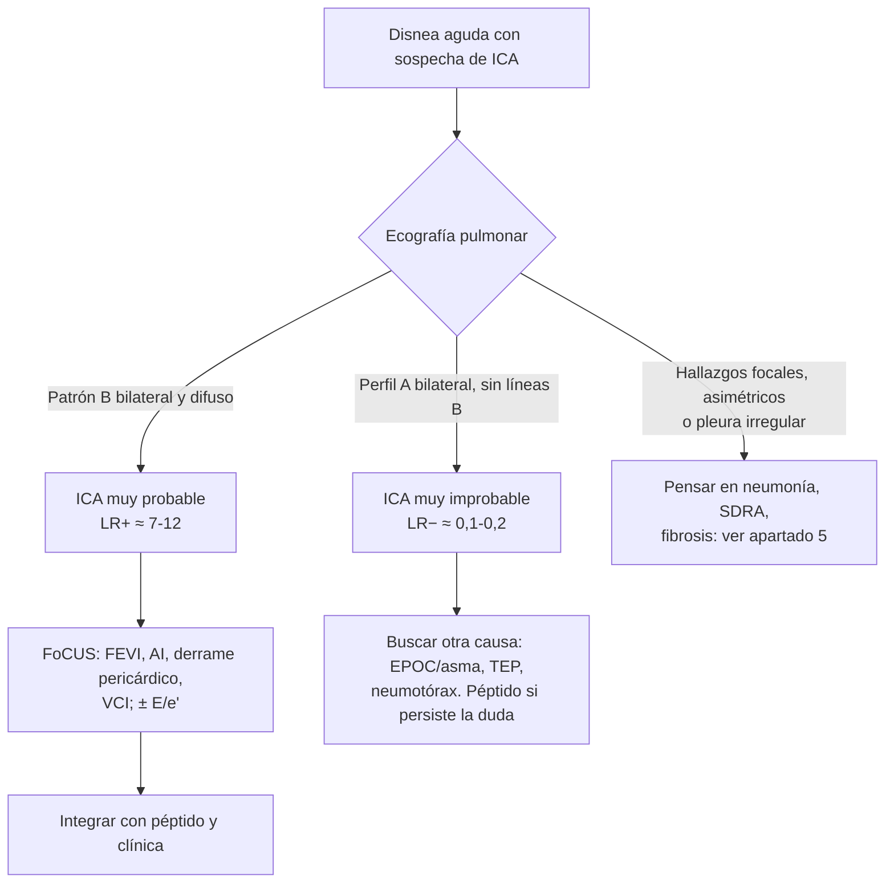

# 03 · Precisión diagnóstica: del protocolo BLUE a las líneas B en la ICA

Esta página reúne, de la forma más exhaustiva posible, los datos de **precisión diagnóstica** de la ecografía pulmonar (LUS) y de la ecografía multiórgano (pulmón + corazón + venas) en la disnea aguda y en la insuficiencia cardiaca aguda (ICA). Recoge el protocolo BLUE original y sus validaciones, la comparación de las líneas B con la radiografía de tórax, la clínica y los péptidos natriuréticos, el valor añadido de la ecocardiografía focalizada (FoCUS) y de la vena cava inferior (VCI), la precisión para los diagnósticos alternativos (neumonía, neumotórax, derrame, TEP, EPOC/asma), el rendimiento en ámbitos especiales (prehospitalario, ancianos) y el **valor pronóstico** de las líneas B. La técnica de exploración y la semiología se describen en [técnica](02-tecnica.md); el impacto en resultados clínicos (ensayos aleatorizados) y las guías se tratan en otras páginas de esta sección.

!!! info "Cómo leer esta página"
    - **S** = sensibilidad; **E** = especificidad; **LR+ / LR−** = cocientes de probabilidad (*likelihood ratios*) positivo y negativo; **AUC** = área bajo la curva ROC.
    - Cuando la fuente publica los LR, se citan tal cual. Cuando solo publica S y E, los LR se han **calculado** a partir de las estimaciones puntuales (LR+ = S / [1 − E]; LR− = [1 − S] / E) y se marcan como *calc.* Son aproximados: no llevan intervalo de confianza y heredan todo el sesgo del estudio original.
    - Si la especificidad es del 100 %, el LR+ no es calculable (tiende a infinito) y se indica con «—».

## 1. Antes de los números: qué significa un LR en la práctica

La sensibilidad y la especificidad describen la prueba; el **cociente de probabilidad** dice cuánto cambia la probabilidad de enfermedad *en el paciente concreto*. Se multiplica la *odds* pretest por el LR y se obtiene la *odds* postest. La tabla siguiente muestra el resultado para varias probabilidades pretest (cálculo aritmético propio a partir del teorema de Bayes, sin fuente clínica asociada).

| Probabilidad pretest | LR 10 | LR 5 | LR 2 | LR 1 | LR 0,5 | LR 0,2 | LR 0,1 |
|---|:--:|:--:|:--:|:--:|:--:|:--:|:--:|
| 10 % (poco probable) | 53 % | 36 % | 18 % | 10 % | 5 % | 2 % | 1 % |
| 20 % | 71 % | 56 % | 33 % | 20 % | 11 % | 5 % | 2 % |
| 40 % (dudoso) | 87 % | 77 % | 57 % | 40 % | 25 % | 12 % | 6 % |
| 60 % | 94 % | 88 % | 75 % | 60 % | 43 % | 23 % | 13 % |
| 80 % (muy probable) | 98 % | 95 % | 89 % | 80 % | 67 % | 44 % | 29 % |

!!! tip "Regla práctica para la cabecera del paciente"
    - **LR+ > 10 o LR− < 0,1**: cambios grandes, a menudo concluyentes.
    - **LR+ 5–10 o LR− 0,1–0,2**: cambios moderados, útiles.
    - **LR+ 2–5 o LR− 0,2–0,5**: cambios pequeños.
    - **LR 0,5–2**: la prueba apenas cambia nada.

    Ejemplo con datos reales: el patrón B en la ecografía pulmonar tiene un LR+ de 7,4 y un LR− de 0,16 para ICA en urgencias ([Martindale, 2016](../../05-fuentes/index.md#martindale2016)). En un paciente con probabilidad pretest del 40 %, un patrón B positivo la eleva a ≈ 83 %, y uno negativo la baja a ≈ 10 %.

!!! note "Umbral de tratamiento"
    En la revisión de la ecografía pulmonar prehospitalaria se aplicó un umbral de inicio de tratamiento del 70 %. Con una prevalencia observada del 42,4 %, una ecografía positiva llevó la probabilidad postest al 84 % (IC 95 % 80–88 %), por encima de ese umbral ([Russell, 2024](../../05-fuentes/index.md#russell2024)). Es la lógica que se usa en la práctica: la ecografía sirve cuando mueve al paciente por encima de un umbral de tratar o por debajo de un umbral de descartar.

## 2. El protocolo BLUE

### 2.1 Estudio original (clásico)

El protocolo BLUE (*Bedside Lung Ultrasound in Emergency*) se derivó en **UCI** a partir de 260 pacientes disneicos con diagnóstico definitivo. Se excluyeron los diagnósticos inciertos y las causas raras (< 2 %), lo que tiende a sobrestimar la precisión. Combinando artefactos (líneas A/B), deslizamiento pleural, consolidación/derrame y análisis venoso, los perfiles habrían dado el diagnóstico correcto en el **90,5 %** de los casos ([Lichtenstein, 2008](../../05-fuentes/index.md#lichtenstein2008)).

| Perfil BLUE | Diagnóstico | n | S | E | LR+ / LR− (*calc.*) |
|---|---|:--:|:--:|:--:|:--:|
| Líneas B anteriores difusas + deslizamiento (perfil B) | Edema pulmonar | 64 | 97 % | 95 % | 19,4 / 0,03 |
| Líneas A predominantes + deslizamiento, sin TVP ni PLAPS | Asma / EPOC | 83 | 89 % | 97 % | 29,7 / 0,11 |
| Perfil anterior normal + TVP | TEP | 21 | 81 % | 99 % | 81 / 0,19 |
| Ausencia de deslizamiento + líneas A + punto pulmón | Neumotórax | 9 | 81 % | 100 % | — / 0,19 |
| Perfil C, A/B, B', o PLAPS sin B difusas | Neumonía | 83 | 89 % | 94 % | 14,8 / 0,12 |

*Fuente: [Lichtenstein, 2008](../../05-fuentes/index.md#lichtenstein2008). PLAPS: síndrome alveolar y/o pleural posterolateral.*

!!! warning "Por qué el BLUE original «rinde» tanto"
    - Operador único y experto, que además creó el método.
    - Exclusión de diagnósticos inciertos y de pacientes con varias causas simultáneas (algo muy frecuente en el anciano con disnea).
    - Pocos casos de TEP (n = 21) y de neumotórax (n = 9): los intervalos de confianza son amplios.
    - Estudio de UCI, con prevalencias y espectro de gravedad distintos a los de urgencias o planta.

    Es un estudio **fundacional** (2008): sigue siendo la referencia conceptual, pero sus cifras no deben extrapolarse sin más a otros ámbitos.

### 2.2 Validaciones posteriores

| Estudio | Ámbito y operadores | n | Edema cardiogénico S / E | Neumonía S / E | Asma/EPOC S / E | TEP S / E | Neumotórax S / E |
|---|---|:--:|:--:|:--:|:--:|:--:|:--:|
| [Lichtenstein, 2008](../../05-fuentes/index.md#lichtenstein2008) | UCI, experto | 260 | 97 / 95 | 89 / 94 | 89 / 97 | 81 / 99 | 81 / 100 |
| [Dexheimer Neto, 2015](../../05-fuentes/index.md#dexheimerneto2015) | UCI, 4 no expertos entrenados, respiración espontánea | 37 | 86 / 87 | 88 / 90 | — | — | — |
| [Patel, 2018](../../05-fuentes/index.md#patel2018) | Urgencias (India) | 50 | 92,3 / 100 | 94,1 / 93,9 | 85,2 / 88,9 | 100 / 100 (n = 1) | 80 / 100 |
| [Bekgoz, 2019](../../05-fuentes/index.md#bekgoz2019) | Urgencias (Turquía), 5 urgenciólogos con acreditación avanzada | 383 | 87,6 / 96,2 | 85,7 / 99,0 | 98,2 / 67,3 | **46,2** / 100 | 71,4 / 100 |
| [Chaitra, 2022](../../05-fuentes/index.md#chaitra2022) | UCI (India), radiología | 130 | Exactitud 95,4 % | Exactitud 93,9 % | Exactitud 96,9 % | Exactitud 99,2 % | Exactitud 100 % |

*Valores en %. En Chaitra solo se publicó la exactitud global por diagnóstico, no S ni E.*

Lectura de las validaciones:

- **Edema cardiogénico y neumonía** mantienen un buen rendimiento fuera de la UCI y con operadores no expertos: en la cohorte de Dexheimer Neto el acuerdo con el diagnóstico final fue del 84 % (κ global 0,81) ([Dexheimer Neto, 2015](../../05-fuentes/index.md#dexheimerneto2015)).
- En urgencias, el **perfil A** pierde especificidad para asma/EPOC (67,3 %) y el BLUE **detecta mal el TEP** (S 46,2 %) ([Bekgoz, 2019](../../05-fuentes/index.md#bekgoz2019)). Los autores detectaron además derrame pleural o pericárdico en el 21,4 % de los pacientes, hallazgos que el algoritmo no contempla, y proponen modificarlo para incluirlos.
- Un metaanálisis pequeño (4 estudios) sobre el BLUE en la insuficiencia respiratoria aguda estimó, para **neumonía**, S 84 % (IC 95 % 76–89), E 98 % (93–99), LR+ 42 y LR− 0,12; y para **edema pulmonar**, S 89 % (81–93), E 94 % (89–96), LR+ 14 y LR− 0,165 ([Asmara, 2022](../../05-fuentes/index.md#asmara2022)). Por su tamaño y su publicación en una revista regional, debe leerse como apoyo, no como estimación definitiva.
- En el metaanálisis de hallazgos ecográficos para neumonía (26 estudios, 3454 pacientes), el **BLUE fue el criterio más sensible** (S 0,88; IC 95 % 0,84–0,92) ([Padrao, 2025](../../05-fuentes/index.md#padrao2025)).

### 2.3 Modificaciones y protocolos derivados

- **Perfil B en urgencias vs. síndrome intersticial difuso «modificado».** En la RS de Staub, en disnea aguda el síndrome intersticial difuso modificado tuvo S 0,90 (0,87–0,93) y E 0,93 (0,91–0,95) para ICA; en insuficiencia respiratoria, el perfil B tuvo S 0,93 (0,72–0,98) y E 0,92 (0,79–0,97) ([Staub, 2019](../../05-fuentes/index.md#staub2019)).
- **M-BLUE** (8 regiones por pulmón, con puntuación): desarrollado sobre todo en COVID-19, con acuerdo interobservador global aceptable (CCI 0,618) pero variable según el signo (CCI 0,33–0,60) ([Xue, 2021](../../05-fuentes/index.md#xue2021)). No es un protocolo diagnóstico de la disnea indiferenciada.
- **Integración con derrame pleural/pericárdico y corazón** (lo que en la práctica actual se llama «ecografía multiórgano»): véase el apartado 4.
- **Actualización del consenso internacional de ecografía pulmonar (2025, publicada en 2026).** Actualiza las recomendaciones de 2012 con 83 enunciados por Delphi, centrados en la LUS como herramienta aislada ([Volpicelli, 2026](../../05-fuentes/index.md#volpicelli2026)). El contenido de los enunciados concretos sobre la disnea y la ICA no se ha podido revisar en texto completo: **[POR VERIFICAR]**.

## 3. Líneas B e insuficiencia cardiaca aguda

### 3.1 Metaanálisis de precisión de la ecografía pulmonar para ICA/edema cardiogénico

| Revisión | Estudios (n) | Población | S (IC 95 %) | E (IC 95 %) | LR+ | LR− | AUC |
|---|:--:|---|:--:|:--:|:--:|:--:|:--:|
| [Al Deeb, 2014](../../05-fuentes/index.md#aldeeb2014) | 7 (1075) | Disnea aguda; urgencias, UCI, planta y prehospital | 94,1 % (81,3–98,3) | 92,4 % (84,2–96,4) | 12,4 *calc.* | 0,06 *calc.* | — |
| [Martindale, 2016](../../05-fuentes/index.md#martindale2016) | Múltiples (urgencias) | Disnea indiferenciada en urgencias | — | — | **7,4** (4,2–12,8) | **0,16** (0,05–0,51) | — |
| [McGivery, 2018](../../05-fuentes/index.md#mcgivery2018) | 7 (1861) | Disnea en urgencias, estudios prospectivos | 82,5 % (66,4–91,8) | 83,6 % (72,4–90,8) | 5,0 *calc.* | 0,21 *calc.* | — |
| [Staub, 2019](../../05-fuentes/index.md#staub2019) | 14 para ICA | Adultos con síntomas respiratorios, urgencias | 90 % (87–93) † | 93 % (91–95) † | 12,9 *calc.* | 0,11 *calc.* | 0,914 |
| [Maw, 2019](../../05-fuentes/index.md#maw2019) | 6 (1827) | Disnea con riesgo de ICA; LUS y Rx en todos | 88 % (75–95) | 90 % (88–92) | 8,8 *calc.* | 0,13 *calc.* | — |
| [Chiu, 2022](../../05-fuentes/index.md#chiu2022) | 8 (2787) | Síntomas de ICA; LUS y Rx | 91,8 % | 92,3 % | 11,9 *calc.* | 0,09 *calc.* | — |
| [Rahmani, 2025](../../05-fuentes/index.md#rahmani2025) | 38 (6783) | Sospecha de IC, todos los ámbitos | 92 % (87–95) | 90 % (86–93) | 7,87 (5,60–11,07) | 0,14 (0,10–0,19) | 0,96 ‡ |
| [Popat, 2026](../../05-fuentes/index.md#popat2026) | 15 (2751) | Disnea en urgencias | 79 % (patrón B bilateral ≥ 2 zonas) | 82 % | 4,4 *calc.* | 0,26 *calc.* | — |
| [Russell, 2024](../../05-fuentes/index.md#russell2024) | 8 (691) | **Prehospitalario** | 86,7 % (70,8–94,6) | 87,5 % (78,2–93,2) | 7,27 (3,69–13,10) | 0,17 (0,06–0,34) | 0,922 |

† Síndrome intersticial difuso modificado en disnea aguda. ‡ Rahmani expresa como «accuracy» 0,96; corresponde al área bajo la curva SROC.

Una revisión de síntesis de estos metaanálisis (siete RS/MA) resume el rango global: S 83–97 %, E 84–98 %, LR+ 4,8–12,4 y LR− 0,06–0,189 ([Jeffers, 2025](../../05-fuentes/index.md#jeffers2025)).

!!! note "Qué hay que retener"
    La ecografía pulmonar es, de forma consistente, **útil para confirmar y para descartar** edema cardiogénico: LR+ en torno a 7–12 y LR− en torno a 0,1–0,2. La heterogeneidad entre estudios es muy alta (en Rahmani, I² ≈ 93 % para S y E) y la mayoría de los estudios tiene riesgo de sesgo ([Rahmani, 2025](../../05-fuentes/index.md#rahmani2025)). El consenso de la EACVI resume la precisión como S 94–97 % y E 97 % ([Gargani, 2023](../../05-fuentes/index.md#gargani2023)), cifras que proceden de los estudios más favorables; los metaanálisis más recientes y de urgencias dan cifras algo menores.

### 3.2 Estudios primarios clave

| Estudio | Diseño y ámbito | n | Prueba / definición | S | E | Comentario |
|---|---|:--:|---|:--:|:--:|---|
| [Pivetta, 2015](../../05-fuentes/index.md#pivetta2015) | Cohorte prospectiva, 7 urgencias (Italia, SIMEU) | 1005 | Diagnóstico «implementado» con LUS | 97 % (95–98,3) | 97,4 % (95,7–98,6) | Clínica sola: S 85,3 %, E 90 %. Rx sola: S 69,5 %, E 82,1 %. Péptidos: S 85 %, E 61,7 % (n = 486). NRI 19,1 % |
| [Pivetta, 2019](../../05-fuentes/index.md#pivetta2019) | ECA diagnóstico, 2 urgencias | 518 | Clínica + LUS vs clínica + Rx/NT-proBNP | AUC 0,95 vs 0,87 | — | LUS redujo 7,98 errores diagnósticos/100 pacientes frente a 2,42 con Rx/NT-proBNP |
| [Glöckner, 2020](../../05-fuentes/index.md#glockner2020) | Prospectivo, urgencias (Alemania), 8 zonas | 89 | LUS positiva para ICA | 54,2 % | 97,6 % | Sin los pretratados con diurético, S 75 %. **Buena para confirmar, regular para descartar** |
| [Chiem, 2015](../../05-fuentes/index.md#chiem2015) | Prospectivo, urgencias, residentes con 30 min de formación | 380 | 1 zona positiva / 8 zonas positivas | 87 % / 19 % | 49 % / 97 % | AUC novatos 0,77 vs expertos 0,76 |
| [Msolli, 2021](../../05-fuentes/index.md#msolli2021) | Transversal, urgencias (Túnez), residentes con 2 h de formación | 700 | Puntuación B ≥ 15 / perfil B | 88 % / 82,5 % | 75 % / 84 % | AUC 0,86 y 0,83; κ entre residentes 0,81–0,85 |
| [Sartini, 2017](../../05-fuentes/index.md#sartini2017) | Prospectivo, urgencias (Italia) | 236 | LUS / Rx / NT-proBNP | 57,7 % / 74,5 % / 97,6 % | 88,0 % / 86,3 % / 27,6 % | Mejor combinación: Rx + LUS (S 84,7 %, E 77,7 %) |
| [Prosen, 2011](../../05-fuentes/index.md#prosen2011) | Prehospitalario (Eslovenia), IC vs EPOC/asma | 218 | Signo de cola de cometa / NT-proBNP > 1000 pg/ml | 100 % / 92 % | 95 % / 89 % | Combinación: 100 % / 100 %. Población seleccionada de dos grupos (diseño tipo casos-controles) |

!!! warning "Discordancias que conviene explicar"
    Algunos estudios obtienen sensibilidades bajas de la LUS (54 % en [Glöckner, 2020](../../05-fuentes/index.md#glockner2020); 58 % en [Sartini, 2017](../../05-fuentes/index.md#sartini2017)). Causas probables: diurético administrado antes de la exploración, criterio de positividad exigente (patrón bilateral y difuso), estándar de referencia distinto y población con alta comorbilidad. La LUS **es más sensible cuanto antes se hace**: en la metarregresión de Lian, el intervalo entre la llegada y la ecografía fue el principal determinante de la exactitud ([Lian, 2018](../../05-fuentes/index.md#lian2018)).

### 3.3 Puntos de corte y definiciones de positividad

| Definición | Qué mide | Datos de rendimiento | Fuente |
|---|---|---|---|
| **Zona positiva = ≥ 3 líneas B** en un espacio intercostal | Unidad básica de todos los protocolos | Base de los métodos de puntuación | [Gargani, 2023](../../05-fuentes/index.md#gargani2023) |
| **Patrón de ICA: ≥ 3 líneas B por zona, ≥ 2 zonas positivas por hemitórax, bilateral** (protocolo de 8 zonas) | Diagnóstico de edema pulmonar | Patrón B bilateral ≥ 2 zonas: S 79 %, E 82 % en urgencias | [Gargani, 2023](../../05-fuentes/index.md#gargani2023); [Popat, 2026](../../05-fuentes/index.md#popat2026) |
| **Suma de líneas B ≥ 10** | Cuantitativo | S 72 %, E 86 % | [Popat, 2026](../../05-fuentes/index.md#popat2026) |
| **Puntuación B ≥ 15** (8 zonas, residentes) | Cuantitativo | S 88 %, E 75 %, AUC 0,86 | [Msolli, 2021](../../05-fuentes/index.md#msolli2021) |
| **Una sola zona positiva** | Máxima sensibilidad | S 87 %, E 49 % (LR+ 1,7; LR− 0,3) | [Chiem, 2015](../../05-fuentes/index.md#chiem2015) |
| **Las 8 zonas positivas** | Máxima especificidad | S 19 %, E 97 % (LR+ 5,7; LR− 0,8) | [Chiem, 2015](../../05-fuentes/index.md#chiem2015) |
| **Al alta** (pronóstico): 28 zonas > 15 líneas B; 8 zonas ≥ 1 zona con ≥ 3 líneas B en cada hemitórax; 4 zonas ≥ 7 líneas B | Congestión residual | Véase el apartado 7 | [Gargani, 2023](../../05-fuentes/index.md#gargani2023) |

!!! tip "Perla clínica: el umbral cambia la pregunta"
    Cuantas más zonas se exige que sean positivas, **más específica y menos sensible** es la ecografía ([Chiem, 2015](../../05-fuentes/index.md#chiem2015)). Para *confirmar* ICA se busca el patrón bilateral y difuso; para *descartarla*, la ausencia de líneas B en todas las zonas. Una o dos zonas aisladas con líneas B no son diagnósticas de nada.

!!! note "Puntuaciones cuantitativas (LUS score)"
    El consenso de la ESICM desaconseja considerar las puntuaciones cuantitativas de ecografía pulmonar una **habilidad básica** del intensivista (recomendación fuerte en contra) ([Robba, 2021](../../05-fuentes/index.md#robba2021)). En la ICA, los recuentos de líneas B son útiles sobre todo para **monitorizar y estratificar el pronóstico**, más que para el diagnóstico inicial ([Gargani, 2023](../../05-fuentes/index.md#gargani2023)).

## 4. Ecografía pulmonar frente a radiografía, clínica y péptidos natriuréticos

### 4.1 Tabla comparativa «LUS vs Rx vs péptidos vs clínica»

| Prueba | S | E | LR+ | LR− | Mejor uso | Fuente |
|---|:--:|:--:|:--:|:--:|---|---|
| **Ecografía pulmonar (patrón B)** | 88–92 % | 90–92 % | 7,4 (4,2–12,8) | 0,16 (0,05–0,51) | Confirmar y descartar | [Martindale, 2016](../../05-fuentes/index.md#martindale2016); [Maw, 2019](../../05-fuentes/index.md#maw2019); [Chiu, 2022](../../05-fuentes/index.md#chiu2022) |
| **Radiografía de tórax (edema)** | 73–77 % | 87–90 % | 4,8 (3,6–6,4) | 0,30 *calc.* ([Maw](../../05-fuentes/index.md#maw2019)) | Confirmar; mala para descartar | [Martindale, 2016](../../05-fuentes/index.md#martindale2016); [Maw, 2019](../../05-fuentes/index.md#maw2019); [Chiu, 2022](../../05-fuentes/index.md#chiu2022) |
| **BNP < 100 pg/ml** | — | — | — | 0,11 (0,07–0,16) | Descartar | [Martindale, 2016](../../05-fuentes/index.md#martindale2016) |
| **NT-proBNP < 300 pg/ml** | — | — | — | 0,09 (0,03–0,34) | Descartar | [Martindale, 2016](../../05-fuentes/index.md#martindale2016) |
| **Péptidos (umbral estándar), urgencias** | 85 % | 61,7 % | 2,2 *calc.* | 0,24 *calc.* | Descartar; confirma mal | [Pivetta, 2015](../../05-fuentes/index.md#pivetta2015) |
| **Tercer ruido (S3)** | — | — | 4,0 (2,7–5,9) | — | Confirmar (poco sensible) | [Martindale, 2016](../../05-fuentes/index.md#martindale2016) |
| **FEVI reducida en ecocardiografía a pie de cama** | — | — | 4,1 (2,4–7,2) | — | Confirmar | [Martindale, 2016](../../05-fuentes/index.md#martindale2016) |
| **Valoración clínica inicial (gestalt)** | 85,3 % | 90 % | 8,5 *calc.* | 0,16 *calc.* | Punto de partida | [Pivetta, 2015](../../05-fuentes/index.md#pivetta2015) |
| **Clínica + LUS** | 97 % | 97,4 % | 37 *calc.* | 0,03 *calc.* | Mejor estrategia en urgencias | [Pivetta, 2015](../../05-fuentes/index.md#pivetta2015) |

La conclusión del metaanálisis de Martindale es la más citada: **la ecografía pulmonar y la ecocardiografía a pie de cama son las pruebas más útiles para confirmar la ICA, y los péptidos natriuréticos, para descartarla** ([Martindale, 2016](../../05-fuentes/index.md#martindale2016)). La radiografía es menos sensible que la ecografía (cociente de sensibilidad relativa 1,2; IC 95 % 1,08–1,34), con especificidad similar ([Maw, 2019](../../05-fuentes/index.md#maw2019)).

??? info "Detalle: los péptidos por intervalos"
    Los péptidos no son una prueba binaria. En el análisis por intervalos de Martindale, un BNP entre 100 y 200 pg/ml tuvo un LR de solo 0,29 (0,23–0,38), mientras que un BNP de 1000–1500 pg/ml tuvo un LR de 7,12 (4,53–11,18). Incluso un NT-proBNP muy alto (30 000–200 000 pg/ml) solo alcanzó un LR de 3,30 (2,05–5,31) ([Martindale, 2016](../../05-fuentes/index.md#martindale2016)). Por eso el péptido elevado «en zona gris» apenas ayuda, y ahí la ecografía aporta más.

### 4.2 La sobrecarga de volumen como pregunta (revisión *Rational Clinical Examination*, 2026)

Una revisión sistemática reciente de JAMA (40 estudios; 11 490 adultos no intubados, 33 estudios en disnea) evaluó qué hallazgos identifican la **sobrecarga de volumen** ([Drum, 2026](../../05-fuentes/index.md#drum2026)):

| Hallazgo | LR (IC 95 %) | S o E |
|---|:--:|:--:|
| Ingurgitación yugular > 3 cm sobre el ángulo esternal | 4,1 (2,9–5,6) | E 92 % |
| Edema en miembros inferiores | 2,2 (1,5–3,1) | E 80 % |
| Crepitantes | 2,7 (1,7–4,5) | E 81 % |
| Congestión vascular en la Rx | 5,9 (2,9–12,0) | E 91 % |
| **Líneas B bilaterales** | **4,0 (2,6–6,1)** | E 77 % |
| **Ausencia de líneas B** | **0,09 (0,04–0,23)** | S 93 % |
| Índice de colapso de VCI < 50 % | 3,9 (2,5–6,1) | E 79 % |
| Índice de colapso de VCI ≥ 50 % | 0,22 (0,11–0,45) | S 82 % |
| PVY ecográfica > 8 cm / ≤ 8 cm | 2,8 (2,2–3,5) / 0,26 (0,20–0,33) | E 71 % / S 81 % |
| BNP ≥ 100 / < 100 | 6,9 (2,4–20,4) / 0,14 (0,08–0,24) | E 87 % / S 87 % |

!!! tip "Perla clínica"
    En esta revisión, la **ausencia de líneas B** fue el hallazgo que mejor descartó la sobrecarga de volumen (LR 0,09), mejor que un BNP normal (LR 0,14) ([Drum, 2026](../../05-fuentes/index.md#drum2026)). Un pulmón «seco» (perfil A bilateral) en un disneico hace muy improbable el edema cardiogénico.

### 4.3 Combinación de ecografía pulmonar y péptidos

- En el ámbito prehospitalario, la combinación de cola de cometa y NT-proBNP > 1000 pg/ml alcanzó S y E del 100 % para distinguir IC de EPOC/asma, y la ecografía permitió descartar IC en pacientes con NT-proBNP elevado e historia previa de IC ([Prosen, 2011](../../05-fuentes/index.md#prosen2011)). Es un estudio con dos grupos preseleccionados, lo que infla la precisión.
- En el ECA de Pivetta, **añadir la LUS** a la clínica mejoró la exactitud (AUC 0,88 → 0,95), mientras que añadir Rx + NT-proBNP no la mejoró de forma significativa (AUC 0,85 → 0,87) ([Pivetta, 2019](../../05-fuentes/index.md#pivetta2019)).
- En Sartini, la estrategia escalonada propuesta fue Rx + LUS primero y NT-proBNP en los negativos ([Sartini, 2017](../../05-fuentes/index.md#sartini2017)).
- En **muy ancianos** hospitalizados (≥ 80 años, edad media 88), NT-proBNP y LUS ayudaron a confirmar la IC, pero discriminaron mal el fenotipo con FEVI reducida; la ecocardiografía siguió siendo necesaria ([Landolfo, 2024](../../05-fuentes/index.md#landolfo2024)).

*Algoritmo orientativo de elaboración propia a partir de [Martindale, 2016](../../05-fuentes/index.md#martindale2016), [Gargani, 2023](../../05-fuentes/index.md#gargani2023) y [Pivetta, 2019](../../05-fuentes/index.md#pivetta2019). No es un algoritmo validado prospectivamente.*

## 5. ¿Cardiogénico o no cardiogénico? Pleura y distribución

Las líneas B no son específicas del edema cardiogénico: aparecen en neumonía, SDRA, fibrosis pulmonar y contusión. Lo que ayuda a distinguirlos es **la pleura, la distribución y los hallazgos acompañantes**.

| Característica | Edema cardiogénico | No cardiogénico (SDRA, neumonía, fibrosis) |
|---|---|---|
| Distribución de las líneas B | Homogénea, bilateral, dependiente de la gravedad; sin áreas respetadas | Parcheada, no dependiente de la gravedad; áreas respetadas |
| Línea pleural | Fina y regular | Gruesa, irregular, «fragmentada» |
| Deslizamiento pleural | Conservado | Reducido o ausente (SDRA) |
| Consolidaciones subpleurales | Raras | Frecuentes |
| Derrame pleural | Frecuente, a menudo bilateral (mayor en el derecho) | Posible, variable |
| Pulso pulmonar | Ausente | Presente en parte de los SDRA |

*Fuentes: tabla 1 del consenso de la EACVI ([Gargani, 2023](../../05-fuentes/index.md#gargani2023)); estudio clásico de [Copetti, 2008](../../05-fuentes/index.md#copetti2008).*

En el estudio clásico de Copetti (UCI, 58 pacientes), el síndrome intersticial estuvo en el 100 % de ambos grupos. En cambio, las anomalías de la línea pleural (100 % vs 25 %), la ausencia o reducción del deslizamiento (100 % vs 0 %), las áreas respetadas (100 % vs 0 %) y las consolidaciones (83,3 % vs 0 %) fueron propias del SDRA, y el derrame fue más frecuente en el edema cardiogénico (95 % vs 66,6 %) ([Copetti, 2008](../../05-fuentes/index.md#copetti2008)).

!!! warning "Error frecuente"
    Diagnosticar ICA por encontrar líneas B **en una sola región** o de forma **asimétrica**. Las líneas B focales son un signo de neumonía, no de edema: tienen una sensibilidad baja (0,24) pero una especificidad alta (0,96) para neumonía ([Padrao, 2025](../../05-fuentes/index.md#padrao2025)). Y un paciente puede tener ICA y neumonía a la vez: la ecografía no resuelve bien la causa mixta.

## 6. Ecografía multiórgano: pulmón + corazón (FoCUS) + VCI

### 6.1 Componentes aislados

| Componente | Punto de corte / hallazgo | S | E | Fuente |
|---|---|:--:|:--:|---|
| FEVI (varios umbrales: < 40 %, < 45 %, < 50 %) | Visual o cuantitativa | 63–82 % | 76–88 % | [Popat, 2026](../../05-fuentes/index.md#popat2026) |
| FEVI reducida (ecocardiografía a pie de cama) | — | LR+ 4,1 | — | [Martindale, 2016](../../05-fuentes/index.md#martindale2016) |
| E/e' | Umbral variable según estudio | 100 % | 76–88 % (rango global cardiaco) | [Popat, 2026](../../05-fuentes/index.md#popat2026) |
| E/A | — | 70 % | 76–88 % (rango global cardiaco) | [Popat, 2026](../../05-fuentes/index.md#popat2026) |
| VCI pletórica | — | 100 % | **25 %** | [Popat, 2026](../../05-fuentes/index.md#popat2026) |
| Índice de colapso de VCI (RS de 7 estudios, 591 pacientes) | — | 79,1 % (68,5–86,8) | 81,8 % (75,0–87,0) | [Squizzato, 2021](../../05-fuentes/index.md#squizzato2021) |
| Índice de colapso VCI < 20 % / < 50 % | — | 43 % / 83 % | 90 % / 81 % | [Popat, 2026](../../05-fuentes/index.md#popat2026) |
| Derrame pleural (como signo de ICA) | — | 100 % | 75 % | [Popat, 2026](../../05-fuentes/index.md#popat2026) |

La VCI **no debe usarse como prueba aislada** para diagnosticar ICA ([Squizzato, 2021](../../05-fuentes/index.md#squizzato2021)). En un estudio de 155 pacientes, la hipocolapsabilidad y la dilatación de la VCI tuvieron un AUC de solo 0,718 ([Sforza, 2020](../../05-fuentes/index.md#sforza2020)).

!!! info "La FEVI estimada por el clínico"
    Un metaanálisis de 12 estudios (1131 pacientes, 159 ecografistas clínicos) encontró un acuerdo sustancial entre el urgenciólogo y el experto al clasificar la función sistólica del VI por estimación visual: κ 0,68 (0,57–0,79), S 89 %, E 85 %, LR+ 5,98 y LR− 0,13 ([Albaroudi, 2022](../../05-fuentes/index.md#albaroudi2022)). La calidad de los estudios fue baja. La FEVI visual «normal/reducida» es una habilidad FoCUS razonable; el E/e' ya es ecocardiografía avanzada.

### 6.2 Protocolos combinados

| Estudio / protocolo | Ámbito, n | Definición positiva | S | E | Comentario |
|---|---|---|:--:|:--:|---|
| [Popat, 2026](../../05-fuentes/index.md#popat2026), MA | Urgencias, 15 estudios, 2751 | LUS + corazón | 78 % | 96 % | Añadir VCI: E 99 %, pero S 54 % |
| [Popat, 2026](../../05-fuentes/index.md#popat2026), MA | Urgencias | Patrón B bilateral + MAPSE + E/A + E/e' | 96 % | 93 % | Requiere Doppler (avanzado) |
| [Popat, 2026](../../05-fuentes/index.md#popat2026), MA | Urgencias | FEVI + derrame pleural | 91 % | 99 % | — |
| [Popat, 2026](../../05-fuentes/index.md#popat2026), MA | Urgencias | FEVI + patrón B bilateral | 70 % | 93 % | — |
| CaTUS ([Öhman, 2019](../../05-fuentes/index.md#ohman2019)) | Urgencias (Finlandia), 100 | E/e' > 15 + congestión en LUS | 100 % (91,4–100) | 95,8 % (84,6–99,3) | AUC 0,979; añadir VCI no mejoró |
| LCI ([Kajimoto, 2012](../../05-fuentes/index.md#kajimoto2012)) | Urgencias (Japón), 90; edad media 78 | Pulmón + corazón + VCI (ecógrafo de bolsillo) | 94,3 % | 91,9 % | LUS sola: S 96,2 %, E 54,0 % |
| [Carlino, 2018](../../05-fuentes/index.md#carlino2018) | Urgencias (Italia), 102, ecógrafo de bolsillo | LUS + AI dilatada y/o FEVI ≤ 40 % | — | — | Exactitud 96 % (LUS sola: S 100 %, E 82 %, exactitud 89 %) |
| LuCUS modificado ([Russell, 2017](../../05-fuentes/index.md#russell2017)) | Urgencias, 99 | B+ en ambas zonas anterosuperiores + FEVI < 45 % | 25 % (14–41) | 100 % (94–100) | 1 min 32 s. Solo para confirmar |
| Tres modalidades ([Farahmand, 2020](../../05-fuentes/index.md#farahmand2020)) | Urgencias (Irán), 120 | Corazón + pulmón + VCI | 31,6 % | 98,4 % | Referencia: BNP > 500 pg/ml |
| Ecografía cardiopulmonar ([Gallard, 2015](../../05-fuentes/index.md#gallard2015)) | Urgencias (Francia), 130 | Protocolo cardiopulmonar | Exactitud 90 % | — | Clínica sola: 67 %; clínica + NT-proBNP + Rx: 81 %. Duración media 12 ± 3 min |
| HeaLus ([Bjällmark, 2025](../../05-fuentes/index.md#bjallmark2025)) | Urgencias (Suecia), 61 | Corazón + pulmón | 98 % | 90 % | Diagnóstico en 21 min vs 3 h 28 min |

!!! note "Mensaje de la ecografía multiórgano"
    Añadir órganos **sube la especificidad y suele bajar la sensibilidad** si se exige que todos sean positivos (p. ej., FEVI + LUS + VCI en [Popat, 2026](../../05-fuentes/index.md#popat2026); LuCUS modificado en [Russell, 2017](../../05-fuentes/index.md#russell2017)). La LUS aislada es muy sensible pero pierde especificidad en pacientes con enfermedad pulmonar previa. El corazón ayuda a **explicar** las líneas B: una FEVI muy deprimida o una aurícula izquierda dilatada hacen más verosímil el origen cardiogénico ([Kajimoto, 2012](../../05-fuentes/index.md#kajimoto2012); [Carlino, 2018](../../05-fuentes/index.md#carlino2018)).

## 7. Precisión para los diagnósticos alternativos

### 7.1 Tabla resumen por diagnóstico

| Diagnóstico | Hallazgo o protocolo | Revisión / estudio (estudios; n) | S (IC 95 %) | E (IC 95 %) | LR+ / LR− | Comparador |
|---|---|---|:--:|:--:|:--:|---|
| **Neumonía (adultos)** | LUS (global) | [Llamas-Álvarez, 2017](../../05-fuentes/index.md#llamasalvarez2017) (16; 2359) | — | — | DOR 50 (21–120); AUC 0,93 | — |
| Neumonía en urgencias | LUS | [Orso, 2018](../../05-fuentes/index.md#orso2018) (17; 5108) | 92 % | 93 % | 13,1 / 0,09 *calc.* | AUC 0,97 |
| Neumonía comunitaria, referencia TC | LUS vs Rx | [Vera-Ponce, 2025](../../05-fuentes/index.md#veraponce2025) (8) | 90,0 % (81,3–96,2) vs 72,6 % | 90,8 % (79,9–97,7) vs 82,0 % | 9,45 / 0,12 (LUS); 3,98 / 0,36 (Rx) | TC |
| Neumonía en UCI, referencia TC | LUS vs Rx | [Orso, 2025](../../05-fuentes/index.md#orso2025) (9; 746) | 0,93 (0,91–0,95) vs 0,65 | 0,83 (0,81–0,85) vs 0,81 | AUC 0,88 vs 0,76 | TC |
| Neumonía | Consolidación | [Staub, 2019](../../05-fuentes/index.md#staub2019) (14) | 0,82 (0,74–0,88) | 0,94 (0,85–0,98) | AUC 0,948 | — |
| Neumonía | BLUE / broncograma dinámico / líneas B focales | [Padrao, 2025](../../05-fuentes/index.md#padrao2025) (26; 3454) | 0,88 / — / 0,24 | — / 0,96 / 0,96 | Peor especificidad en NAV | Rx o TC |
| **Neumotórax** (sospecha clínica) | Deslizamiento + cola de cometa | [Alrajhi, 2012](../../05-fuentes/index.md#alrajhi2012) (8; 1048) | 90,9 % (86,5–93,9) vs 50,2 % | 98,2 % (97,0–99,0) vs 99,4 % | 50 / 0,09 *calc.* (US) | Rx en decúbito supino |
| Neumotórax traumático (Cochrane) | Ecografía por clínicos | [Chan, 2020](../../05-fuentes/index.md#chan2020) (9; 1271) | 0,91 (0,85–0,94) vs 0,47 | 0,99 (0,97–1,00) vs 1,00 | 91 / 0,09 *calc.* | Rx en supino |
| **Derrame pleural** | Ecografía | [Yousefifard, 2016](../../05-fuentes/index.md#yousefifard2016) (12; 1554) | 0,94 (0,88–0,97) vs 0,51 | 0,98 (0,92–1,0) vs 0,91 | 47 / 0,06 *calc.* | Rx |
| Derrame pleural | POCUS | [Zaki, 2024](../../05-fuentes/index.md#zaki2024) (18) | 94,5 % vs 67,7 % | 97,9 % vs 85,3 % | 45 / 0,06 *calc.* | Rx |
| **TEP** | Multiórgano (pulmón + corazón + venas) | [Nazerian, 2014](../../05-fuentes/index.md#nazerian2014) (357; urgencias) | 90 % | 86,2 % | 6,5 / 0,12 *calc.* | Angio-TC |
| TEP en críticos | Multiórgano | [Melo, 2025](../../05-fuentes/index.md#melo2025b) (4; 594) | 0,90 (0,85–0,94) | 0,69 (0,42–0,87) | 3,35 / 0,16 | Angio-TC / V/Q |
| TEP | Compresión bilateral femoral y poplítea | [Falster, 2022](../../05-fuentes/index.md#falster2022) (22; 4708) | 43,7 % (36,3–51,4) | 96,7 % (95,4–97,6) | 13,2 / 0,58 *calc.* | — |
| TEP | ≥ 1 lesión hipoecoica subpleural | [Falster, 2022](../../05-fuentes/index.md#falster2022) (19; 2134) | 81,4 % (73,2–87,5) | 87,4 % (80,9–91,9) | 6,5 / 0,21 *calc.* | — |
| TEP | Signo D (VD) | [Falster, 2022](../../05-fuentes/index.md#falster2022) (13; 1579) | 29,7 % | 96,2 % | 7,8 / 0,73 *calc.* | — |
| TEP | Signo de McConnell | [Falster, 2022](../../05-fuentes/index.md#falster2022) (11; 1480) | 29,1 % | 98,6 % | 20,8 / 0,72 *calc.* | — |
| TEP | Trombo en VD | [Falster, 2022](../../05-fuentes/index.md#falster2022) (5; 995) | 4,7 % | 100 % | — | — |
| **EPOC/asma** | Perfil A sin PLAPS | [Staub, 2019](../../05-fuentes/index.md#staub2019) (4) | 0,78 (0,67–0,86) | 0,94 (0,89–0,97) | 13,0 / 0,23 *calc.*; AUC 0,906 | — |

!!! warning "TEP: la ecografía no descarta por sí sola"
    Cada signo aislado de TEP es **específico pero poco sensible** ([Falster, 2022](../../05-fuentes/index.md#falster2022)). Solo la combinación multiórgano alcanza una sensibilidad del 90 % ([Nazerian, 2014](../../05-fuentes/index.md#nazerian2014)). En el estudio de Nazerian, ningún paciente con ecografía multiórgano negativa más un diagnóstico ecográfico alternativo o un dímero D negativo tuvo finalmente TEP (132 pacientes, 37 %). En la guía ESC de TEP, la ecocardiografía se reserva sobre todo para el paciente inestable con sospecha de TEP de alto riesgo ([Konstantinides, 2019](../../05-fuentes/index.md#konstantinides2019)). Hay que tener en cuenta que el 98,6 % de los estudios de la RS de Falster tenía riesgo de sesgo en algún dominio.

!!! tip "Perla: neumotórax"
    La radiografía en decúbito supino **pierde la mitad de los neumotórax** (S 47–50 %), mientras que la ecografía detecta 9 de cada 10 con una especificidad similar ([Alrajhi, 2012](../../05-fuentes/index.md#alrajhi2012); [Chan, 2020](../../05-fuentes/index.md#chan2020)). En una cohorte hipotética del 30 % de prevalencia, la ecografía dejaría sin diagnosticar 3 de cada 100 pacientes, frente a 16 con la Rx en supino ([Chan, 2020](../../05-fuentes/index.md#chan2020)). Los datos proceden sobre todo de pacientes traumáticos.

### 7.2 EPOC/asma: la trampa del perfil A

En el BLUE original, el perfil A con deslizamiento indicó asma/EPOC con S 89 % y E 97 % ([Lichtenstein, 2008](../../05-fuentes/index.md#lichtenstein2008)), pero en urgencias la especificidad cayó al 67,3 % ([Bekgoz, 2019](../../05-fuentes/index.md#bekgoz2019)). El perfil A sin PLAPS **no confirma** EPOC/asma: también aparece en el TEP (por eso el BLUE exige buscar TVP), en la acidosis metabólica, en la sepsis sin foco pulmonar y en la disnea de otro origen. Su valor es sobre todo **negativo**: aleja el edema y la neumonía extensa.

## 8. POCUS en la disnea indiferenciada

### 8.1 Metaanálisis y revisiones «por disnea»

| Revisión | Estudios | Hallazgo principal |
|---|:--:|---|
| [Gartlehner, 2021](../../05-fuentes/index.md#gartlehner2021) (informe de evidencia para la guía ACP) | 5 ECA + 44 cohortes | Añadir POCUS a la vía diagnóstica estándar aumenta los diagnósticos correctos; **mejora de forma consistente la sensibilidad** para IC, neumonía, TEP, derrame y neumotórax; la especificidad mejora en la mayoría, no en todos. Sin diferencias en mortalidad hospitalaria ni estancia |
| [Qaseem, 2021](../../05-fuentes/index.md#qaseem2021) (guía ACP) | Basada en Gartlehner | La ACP **sugiere** usar POCUS además de la vía estándar cuando hay incertidumbre diagnóstica en la disnea aguda (recomendación condicional; evidencia de certeza baja) |
| [Seyala, 2026](../../05-fuentes/index.md#seyala2026) | 44 (19 en MA) | POCUS global en urgencias: S 85,6 % (84,0–87,2), E 80,8 % (79,0–82,5), DOR 68,1, LR− 0,14. Heterogeneidad importante |
| [Staub, 2019](../../05-fuentes/index.md#staub2019) | 25 | AUC de la LUS: neumonía 0,948, ICA 0,914, EPOC/asma 0,906 |
| [Kok, 2022](../../05-fuentes/index.md#kok2022) | 89 artículos | El POCUS aumenta la exactitud diagnóstica en disnea, hipotensión y shock en urgencias, UCI y planta; la calidad de los estudios es baja en la mayoría |
| [Szabó, 2023](../../05-fuentes/index.md#szabo2023) | 5393 pacientes | Diagnóstico 63 min antes y tratamiento 27 min antes; más tratamiento apropiado (OR 2,31); sin cambios en mortalidad (detalle en la página de impacto clínico) |

!!! note "Evidencia vs. recomendación"
    La **precisión** de la ecografía en la disnea es alta y está bien documentada, pero la **certeza de la evidencia sobre beneficios clínicos** es baja: por eso la ACP emite una recomendación solo condicional ([Qaseem, 2021](../../05-fuentes/index.md#qaseem2021)). El informe de evidencia advierte además de que los estudios rara vez informan de la proporción de exploraciones indeterminadas, y de que no hay datos sobre los daños de los falsos positivos y negativos ([Gartlehner, 2021](../../05-fuentes/index.md#gartlehner2021)).

## 9. Ámbitos especiales

### 9.1 Prehospitalario

- **Metaanálisis de Russell (ICA):** 8 estudios diagnósticos (n = 691): S 86,7 %, E 87,5 %, LR+ 7,27, LR− 0,17, AUC 0,922. Rendimiento similar entre médicos y técnicos, y con distinto número de zonas. **Ningún estudio diagnóstico tuvo bajo riesgo de sesgo** ([Russell, 2024](../../05-fuentes/index.md#russell2024)).
- **Estudio de impacto con técnicos de emergencias:** sin ecografía, la S de los técnicos para ICA fue del 23 % y la E del 97 %; con ecografía (4 zonas), S 71 % y E 96 %. El tratamiento de IC prehospitalario pasó del 14 % al 53 %, y la mediana hasta el tratamiento, de 169 a 21 minutos. Solo 40 pacientes tuvieron ecografía ([Russell, 2024b](../../05-fuentes/index.md#russell2024b)).
- **RS de la disnea no traumática prehospitalaria** (23 estudios, la mayoría con riesgo de sesgo serio): exploración de < 5 min; precisión muy buena para ICA (S 71–100 %, E 72–95 %), buena para neumotórax y moderada para derrame (S 26–53 %). Cambió el tratamiento en el 11–54 % de los pacientes. Sin efecto demostrado en el pronóstico ([Taheri, 2025](../../05-fuentes/index.md#taheri2025)).
- Clásico: [Prosen, 2011](../../05-fuentes/index.md#prosen2011) (véase el apartado 4.3).

### 9.2 Ancianos

- En urgencias, en pacientes ≥ 65 años (edad media 84, n = 116; 66 % con ICA y 44 % con neumonía, a menudo solapadas), la estrategia ecográfica pulmón + VCI tuvo S 82 % y E 68 %, frente a S 92 % y E 53 % de la estrategia estándar, **sin diferencias significativas** ([Balen, 2021](../../05-fuentes/index.md#balen2021)).
- En muy ancianos hospitalizados, la LUS y el NT-proBNP no permitieron distinguir el fenotipo de FEVI reducida ([Landolfo, 2024](../../05-fuentes/index.md#landolfo2024)).
- Un ensayo aleatorizado por conglomerados escalonado (LUC-REED) está evaluando la ecografía pulmonar y cardiaca en la dificultad respiratoria del anciano: protocolo publicado, sin resultados todavía **[POR VERIFICAR]** (PMID 40819865, no incluido en la bibliografía hasta disponer de resultados).

!!! warning "Por qué la ecografía rinde menos en el anciano"
    Comorbilidad pulmonar (fibrosis, EPOC), causas mixtas (ICA + neumonía), derrames crónicos, ventanas acústicas difíciles y tratamiento diurético previo. Los estudios en ancianos muestran especificidades menores que los de población general ([Balen, 2021](../../05-fuentes/index.md#balen2021)).

## 10. Valor pronóstico de las líneas B

| Estudio | Contexto | n | Umbral | Resultado | HR (IC 95 %) |
|---|---|:--:|---|---|:--:|
| [Gargani, 2015](../../05-fuentes/index.md#gargani2015) | **Alta** hospitalaria (cardiología) | 100 | > 15 líneas B (28 zonas) | Reingreso por IC a 6 meses | 11,74 (1,30–106,16) |
| [Coiro, 2015](../../05-fuentes/index.md#coiro2015) | **Alta** | 60 | ≥ 30 líneas B | Muerte o reingreso por IC a 3 meses: supervivencia libre de eventos 27 % vs 88 % | 5,66 (1,74–18,39) |
| [Platz, 2016](../../05-fuentes/index.md#platz2016) | **Ambulatorio**, NYHA II–IV | 195 | ≥ 3 líneas B (8 zonas) | Hospitalización por IC o muerte a 6 meses. El 81 % de los pacientes con ≥ 3 líneas B tenía auscultación normal | 4,08 (1,95–8,54) |
| [Wang, 2021](../../05-fuentes/index.md#wang2021), MA | Alta y ambulatorio | 9 estudios; 1212 | Alta > 15 / > 30; ambulatorio > 3 | Muerte o reingreso por IC | 3,37 (1,52–7,47) / 4,01 (2,29–7,01) / 3,21 (2,09–4,93) |
| [Rastogi, 2024](../../05-fuentes/index.md#rastogi2024) | Análisis agrupado internacional: ingreso, alta y ambulatorio | 1947 | Terciles de líneas B (8 zonas) | Tercil 3 vs 1: alta HR 5,74; ambulatorio HR 2,66. Mejora la reclasificación sobre MAGGIC y AHEAD | 5,74 (3,26–10,12) / 2,66 (1,08–6,54) |
| [Suhardi, 2025](../../05-fuentes/index.md#suhardi2025), MA | Congestión residual al alta | 15 estudios | Líneas B residuales | Evento combinado 2,32; mortalidad 3,01; reingreso por IC/eventos CV 4,01. Más efecto a corto plazo (< 6 meses: HR 3,57) | 2,32 (1,91–2,82) |
| [Pugliese, 2023](../../05-fuentes/index.md#pugliese2023) | Ambulatorio, multiórgano (pulmón + VCI + Doppler venoso renal) | 310 | ≥ 2 signos ecográficos de congestión | El 42 % de los pacientes sin signos clínicos tenía congestión ecográfica. ≥ 2 signos: HR 26,7 (12,4–63,6). NRI 28 % sobre modelo con NT-proBNP | 26,7 |
| [Pellicori, 2026](../../05-fuentes/index.md#pellicori2026) | Agrupado (5 cohortes europeas): congestión pulmonar + sistémica | 835 | Tercil superior de líneas B + VCI ≥ 21 mm | La combinación de congestión pulmonar y sistémica pronostica peor que cualquiera por separado | 2,34 (1,11–4,91) congestión pulmonar aislada en ambulatorios |

!!! tip "Perla clínica: la congestión «silenciosa»"
    La ecografía detecta congestión que la exploración física no ve: en ambulatorios con IC, 8 de cada 10 pacientes con ≥ 3 líneas B tenían auscultación normal ([Platz, 2016](../../05-fuentes/index.md#platz2016)), y el 42 % de los pacientes sin signos clínicos de congestión tenían al menos un signo ecográfico ([Pugliese, 2023](../../05-fuentes/index.md#pugliese2023)). Al alta, un paciente «seco» por ecografía tiene un riesgo muy bajo de reingreso ([Gargani, 2015](../../05-fuentes/index.md#gargani2015)).

!!! warning "Pronóstico no es lo mismo que tratamiento guiado"
    Que las líneas B predigan eventos no demuestra que **tratarlas** mejore el pronóstico. Esta pregunta la responden los ensayos de tratamiento guiado por ecografía, que se revisan en la página de impacto clínico. Los estudios pronósticos usan protocolos (8 o 28 zonas) y umbrales distintos, lo que dificulta fijar un único punto de corte ([Gargani, 2023](../../05-fuentes/index.md#gargani2023)).

## 11. Calidad de la evidencia y fuentes de sesgo

- **Estándar de referencia imperfecto.** No existe una prueba de referencia para la ICA: casi todos los estudios usan el diagnóstico de alta adjudicado por expertos, a menudo con acceso a los péptidos o a la ecocardiografía (sesgo de incorporación) ([Maw, 2019](../../05-fuentes/index.md#maw2019); [Martindale, 2016](../../05-fuentes/index.md#martindale2016)).
- **Heterogeneidad** muy alta en los metaanálisis (protocolos de 4, 6, 8 o 28 zonas; umbrales; operadores) ([Rahmani, 2025](../../05-fuentes/index.md#rahmani2025); [Seyala, 2026](../../05-fuentes/index.md#seyala2026)).
- **Riesgo de sesgo** alto o incierto en la mayoría de los estudios primarios: ninguno de bajo riesgo en el prehospitalario ([Russell, 2024](../../05-fuentes/index.md#russell2024)); 98,6 % en los de TEP ([Falster, 2022](../../05-fuentes/index.md#falster2022)).
- **Espectro**: los estudios con dos grupos preseleccionados (IC frente a EPOC) inflan la precisión ([Prosen, 2011](../../05-fuentes/index.md#prosen2011)).
- **Indeterminados** poco informados ([Gartlehner, 2021](../../05-fuentes/index.md#gartlehner2021)).
- **Operador**: el rendimiento de novatos formados es similar al de expertos para detectar líneas B ([Chiem, 2015](../../05-fuentes/index.md#chiem2015)), pero la integración multiórgano y el Doppler cardiaco exigen más formación (véase la página de formación).

## Puntos clave

- El **protocolo BLUE** acertó el 90,5 % de los diagnósticos en su estudio original de UCI ([Lichtenstein, 2008](../../05-fuentes/index.md#lichtenstein2008)). En urgencias mantiene un buen rendimiento para edema y neumonía, pero **falla en el TEP** (S 46 %) y el perfil A pierde especificidad ([Bekgoz, 2019](../../05-fuentes/index.md#bekgoz2019)).
- Para la ICA, la ecografía pulmonar tiene **LR+ ≈ 7–12 y LR− ≈ 0,1–0,2**, y es **más sensible que la radiografía** (88–92 % frente a 73–77 %) con especificidad similar ([Maw, 2019](../../05-fuentes/index.md#maw2019); [Chiu, 2022](../../05-fuentes/index.md#chiu2022); [Martindale, 2016](../../05-fuentes/index.md#martindale2016)).
- **Péptidos para descartar, ecografía para confirmar (y descartar)**: NT-proBNP < 300 tiene LR− 0,09; el péptido en zona gris apenas ayuda ([Martindale, 2016](../../05-fuentes/index.md#martindale2016)). La **ausencia de líneas B** descarta la sobrecarga de volumen (LR 0,09) ([Drum, 2026](../../05-fuentes/index.md#drum2026)).
- Añadir la LUS a la clínica mejora el diagnóstico más que añadir Rx + NT-proBNP (AUC 0,95 frente a 0,87) ([Pivetta, 2019](../../05-fuentes/index.md#pivetta2019)).
- El patrón de ICA es **≥ 3 líneas B por zona, ≥ 2 zonas por hemitórax, bilateral y homogéneo con pleura fina**; las líneas B focales o con pleura irregular orientan a neumonía o SDRA ([Gargani, 2023](../../05-fuentes/index.md#gargani2023); [Copetti, 2008](../../05-fuentes/index.md#copetti2008)).
- **Pulmón + corazón** sube la especificidad (hasta 96 %); la VCI aislada no sirve para diagnosticar ICA ([Popat, 2026](../../05-fuentes/index.md#popat2026); [Squizzato, 2021](../../05-fuentes/index.md#squizzato2021)).
- Para diagnósticos alternativos, la ecografía supera a la Rx en **neumotórax, derrame y neumonía**; en el **TEP** solo el abordaje multiórgano alcanza una sensibilidad útil ([Chan, 2020](../../05-fuentes/index.md#chan2020); [Yousefifard, 2016](../../05-fuentes/index.md#yousefifard2016); [Vera-Ponce, 2025](../../05-fuentes/index.md#veraponce2025); [Nazerian, 2014](../../05-fuentes/index.md#nazerian2014)).
- Las **líneas B residuales al alta** multiplican el riesgo de reingreso o muerte (HR combinado 2,32) ([Suhardi, 2025](../../05-fuentes/index.md#suhardi2025)); en ambulatorios, ≥ 3 líneas B cuadruplican el riesgo ([Platz, 2016](../../05-fuentes/index.md#platz2016)).

## Lagunas y preguntas abiertas

- **Estándar de referencia** para la ICA: sin él, todas las cifras de precisión son aproximadas.
- **Umbral único** de líneas B para diagnóstico y para el alta: persisten protocolos y cortes diferentes (8 frente a 28 zonas; > 15, ≥ 30, terciles).
- **Ancianos y causas mixtas** (ICA + neumonía, EPOC + IC): muy pocos estudios y con peor rendimiento ([Balen, 2021](../../05-fuentes/index.md#balen2021)); pendientes los resultados de ensayos específicos.
- **Precisión en planta de medicina interna** (frente a urgencias y UCI): escasean los estudios diseñados para este ámbito.
- **Validación externa de algoritmos multiórgano** (CaTUS, LCI) en poblaciones amplias y con operadores no expertos.
- Contenido concreto de la **actualización 2025 del consenso internacional de ecografía pulmonar** ([Volpicelli, 2026](../../05-fuentes/index.md#volpicelli2026)) en lo relativo a la ICA: **[POR VERIFICAR]**.
- **Inteligencia artificial** para contar líneas B: prometedora para la adquisición por no expertos ([Baloescu, 2025](../../05-fuentes/index.md#baloescu2025)), pero sin datos suficientes de precisión diagnóstica clínica frente a la ICA adjudicada.
