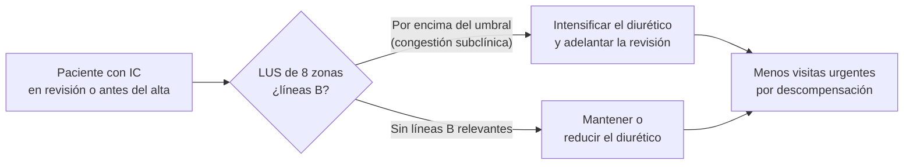

# 04 · Impacto clínico: ¿mejora el POCUS los resultados en disnea e ICA?

La [precisión diagnóstica](03-precision.md) de la ecografía pulmonar (LUS) y cardiaca está bien documentada. Pero una prueba precisa no mejora por sí sola los resultados del paciente. La pregunta de esta página es otra: **¿cambia algo que el paciente tenga una ecografía a pie de cama?** Por ejemplo, un diagnóstico correcto antes, un tratamiento apropiado, menos ingresos o reingresos, menos pruebas o menos mortalidad.

Revisamos la evidencia en cuatro escenarios:

1. **Disnea aguda indiferenciada en urgencias o planta**: ¿el POCUS mejora el diagnóstico y el manejo?
2. **Tratamiento guiado por líneas B en la insuficiencia cardiaca (IC)**: ambulatorio, al alta, en urgencias y en hospitalizados.
3. **Congestión residual al alta y pronóstico**: por qué importa contar líneas B antes del alta.
4. **Estrategias multiorgánicas de descongestión** (LUS más VCI más VExUS), uso de recursos y costes.

!!! abstract "Resumen en una frase"
    En la disnea, el POCUS **acelera el diagnóstico y aumenta el tratamiento apropiado**, pero no ha demostrado reducir la mortalidad ni, en el ECA pragmático más grande, la estancia hospitalaria. En la IC crónica o tras el alta, ajustar el diurético según las líneas B **reduce sobre todo las visitas urgentes** por descompensación. En la fase aguda (urgencias y hospitalización), la evidencia de beneficio clínico es todavía escasa y de ensayos pequeños.

---

## 1. Disnea aguda: ECA y estudios de impacto

### 1.1. Contexto: ¿por qué importa acertar pronto?

En un estudio prospectivo clásico de 514 ancianos con insuficiencia respiratoria aguda en urgencias, el diagnóstico inicial fue erróneo en el **20 %** de los casos. Además, el **32 %** recibió un tratamiento inicial inapropiado, y ese error se asoció a más mortalidad hospitalaria (25 % frente a 11 %). En el análisis multivariante, el tratamiento inapropiado fue un predictor independiente de muerte (OR 2,83). Casi la mitad de los pacientes (47 %) tenía más de dos diagnósticos simultáneos ([Ray, 2006](../../05-fuentes/index.md#ray2006)). Es un estudio observacional antiguo, pero es la justificación clásica de casi todos los ECA de POCUS en la disnea.

!!! note "Por qué la pregunta es difícil de responder"
    El POCUS es una **prueba diagnóstica**, no un tratamiento. Para que mejore la mortalidad o la estancia deben cumplirse cuatro condiciones en cadena:

    1. Cambia el diagnóstico.
    2. Ese cambio modifica el tratamiento.
    3. El nuevo tratamiento es más eficaz.
    4. El efecto es lo bastante grande como para detectarse con el tamaño de muestra del ensayo.

    Cada eslabón diluye el efecto. Por eso los ECA suelen mostrar beneficio en **resultados intermedios** (diagnóstico correcto, tiempo hasta el tratamiento) y no en los «duros».

### 1.2. Tabla de ECA y estudios de impacto en la disnea aguda

| Estudio (año) | n | Ámbito | Intervención | Comparador | Resultado primario | Resultado | Cita |
|---|---|---|---|---|---|---|---|
| Laursen 2014 | 320 aleatorizados (315 analizados) | Urgencias, Dinamarca, 1 centro | POCUS de corazón, pulmón y venas profundas + pruebas estándar | Pruebas estándar | Diagnóstico presuntivo correcto a las 4 h | **88,0 % frente a 63,7 %** (p < 0,0001). Diferencia absoluta del 24,3 %. Sin efectos adversos | [Laursen, 2014](../../05-fuentes/index.md#laursen2014) |
| Pivetta 2019 | 518 | 2 urgencias, Italia | Clínica + LUS | Clínica + Rx de tórax + NT-proBNP | Precisión para ICA | AUC **0,95** con LUS frente a 0,87 con Rx + NT-proBNP (p < 0,01). Errores diagnósticos: −7,98 por cada 100 pacientes con LUS frente a −2,42 por cada 100 con Rx + NT-proBNP | [Pivetta, 2019](../../05-fuentes/index.md#pivetta2019) |
| Baker 2020 | 442 (218 LUS, 224 control) | 3 urgencias, Australia. Mayores de 60 años. Operadores **no expertos** | LUS tras una formación breve | Evaluación convencional | Precisión diagnóstica en urgencias | Diferencia de riesgo del **6,5 %** (IC 95 % 0,9–12). NNS de 16. Sin cambios significativos en costes, estancia ni destino al alta | [Baker, 2020](../../05-fuentes/index.md#baker2020) |
| Riishede 2021 | 218 aleatorizados (211 analizados) | Urgencias multicéntrico, Dinamarca. Operadores con experiencia variable | POCUS cardiopulmonar en las primeras 4 h | Exploración estándar | Diagnóstico presuntivo concordante con el final a las 4 h | **Sin diferencias** (79,25 % frente a 77,1 %). Más tratamiento apropiado (**79,3 % frente a 65,7 %**) y más pacientes con estancia < 1 día (39,6 % frente a 23,8 %) | [Riishede, 2021](../../05-fuentes/index.md#riishede2021) |
| Zare 2022 | 103 | Urgencias multicéntrico, Irán | Ecografía precoz de corazón y pulmón | Valoración rutinaria | Tiempo desde la aleatorización hasta el diagnóstico | **42,6 frente a 79,3 min** (p < 0,01) | [Zare, 2022](../../05-fuentes/index.md#zare2022) |
| Ben-Baruch Golan 2020 | 60 | Planta de medicina interna, Israel (piloto) | POCUS en las primeras 24 h del ingreso | Manejo habitual | Tiempo hasta el diagnóstico correcto | No significativo (mediana de 24 frente a 48 h; p = 0,12). Tiempo hasta el tratamiento apropiado: **5 frente a 24 h** (p = 0,014). Cambio del diagnóstico principal en el 28 % | [Ben-Baruch Golan, 2020](../../05-fuentes/index.md#benbaruchgolan2020) |
| Özkan 2015 | No consta en el resumen | Urgencias, Turquía | POCUS | Fonendoscopio | Rendimiento diagnóstico (IC, neumonía) | Cifras algo mejores con POCUS, **sin diferencias significativas** en la utilidad | [Özkan, 2015](../../05-fuentes/index.md#ozkan2015) |
| Arvig 2023 | 206 | 3 urgencias, Dinamarca | POCUS cardiopulmonar **seriado** (0, 2 y 4 h) + manejo habitual | Un único POCUS a la llegada + manejo habitual | Reducción de la disnea en una escala verbal (0–10) | Diferencia media de **−1,09** a las 4 h y **−1,66** a las 5 h, a favor del POCUS seriado. Más diuréticos. Efecto mayor en la ICA | [Arvig, 2023](../../05-fuentes/index.md#arvig2023) |
| **Ovesen 2026** | 674 aleatorizados (663 analizados) | **10 urgencias, Dinamarca** (pragmático) | Circuito diagnóstico guiado por LUS y ecocardiografía focalizada | Circuito estándar | Alta con vida en menos de 24 h | **Negativo**: 42,6 % frente a 45,5 % (diferencia de riesgo de −2,9; IC 95 % −10,4 a 4,7). Tampoco cambió la estancia global (HR 0,93) | [Ovesen, 2026](../../05-fuentes/index.md#ovesen2026) |
| Ovesen 2026, subestudio | 674 | Mismo ensayo | Ídem | Ídem | Certeza diagnóstica | Más certeza **precoz**: probabilidad estimada del diagnóstico principal del 80 % frente al 73 %. Concordancia con el diagnóstico final similar (35,9 % frente a 38,9 %) | [Ovesen, 2026b](../../05-fuentes/index.md#ovesen2026b) |
| Maganti 2025 | 208 | Planta de hospitalistas, EE. UU. Mejora de calidad con diseño *stepped-wedge* por clústeres | POCUS cardiopulmonar estructurado (hospitalistas o ecografistas, con cardiólogo remoto) | Manejo estándar | Estancia y costes (marco RE-AIM) | Estancia esperada un **30,3 % menor** (8,3 frente a 11,9 días). 246 camas-día ahorradas. Cambió decisiones en el 35 %. Solo el 20 % de las exploraciones las hicieron los hospitalistas de forma autónoma | [Maganti, 2025](../../05-fuentes/index.md#maganti2025) |

??? info "Estudios observacionales de impacto relevantes (no aleatorizados)"
    - **Zanobetti 2017** (n = 2683, urgencias de Florencia). El diagnóstico ecográfico integrado (pulmón, corazón y VCI) se formuló en **24 ± 10 min**, frente a **186 ± 72 min** del diagnóstico de urgencias habitual. La concordancia fue buena (κ = 0,71). El POCUS fue más sensible para la IC y el estudio estándar fue mejor para EPOC/asma y TEP ([Zanobetti, 2017](../../05-fuentes/index.md#zanobetti2017)).
    - **Zanobetti 2011** (n = 404). Estudio observacional sobre la concordancia entre ecografía torácica y radiografía. La ecografía se interpretó durante la propia exploración; la radiografía tardó de media 1 h 35 min desde la petición hasta el informe. En los casos discordantes, la TC dio la razón a la ecografía en el 63 % ([Zanobetti, 2011](../../05-fuentes/index.md#zanobetti2011)). Un único operador experto limita su generalización.
    - **Pivetta 2015**, estudio SIMEU (n = 1005, 7 urgencias). La estrategia clínica con LUS alcanzó una sensibilidad del 97 % y una especificidad del 97,4 % para la ICA. La clínica sola se quedó en el 85,3 % y el 90 %, y la Rx sola en el 69,5 % y el 82,1 %. El índice de reclasificación neta fue del 19,1 % ([Pivetta, 2015](../../05-fuentes/index.md#pivetta2015)). Cohorte, no ECA: se detalla en [precisión](03-precision.md).
    - **Pontis 2018**. Estudio aleatorizado con **casos clínicos simulados** (76 médicos). Añadir datos de LUS redujo el número de diagnósticos inciertos ([Pontis, 2018](../../05-fuentes/index.md#pontis2018)). No evalúa pacientes reales.

!!! warning "Error frecuente: el ECA danés de 2026 no «tumba» el POCUS"
    El ensayo de Ovesen 2026 es el ECA pragmático más grande en la disnea. Buscaba confirmar la señal de Riishede 2021, donde más pacientes se iban de alta en menos de 24 h. **No la confirmó** ([Ovesen, 2026](../../05-fuentes/index.md#ovesen2026)). Hay que leerlo con dos matices:

    - Su objetivo era un resultado de **flujo hospitalario** (alta en menos de 24 h), no la precisión diagnóstica ni el tratamiento apropiado.
    - Su subestudio mostró **más certeza diagnóstica precoz**, pero no mayor concordancia con el diagnóstico final ([Ovesen, 2026b](../../05-fuentes/index.md#ovesen2026b)).

    Mensaje: **aplicar el POCUS de forma sistemática a toda disnea no acorta por sí solo la estancia**. Su valor está en resolver la incertidumbre diagnóstica en el paciente concreto, que es justo lo que recomienda la ACP (ver abajo).

### 1.3. Revisiones sistemáticas y metaanálisis de impacto en la disnea

| RS/MA (año) | Estudios incluidos | Hallazgos principales | Cita |
|---|---|---|---|
| **Szabó 2023** | 8 ECA + 6 observacionales, 5393 participantes | Tiempo hasta el diagnóstico: **−63 min** (IC 95 % −115 a −11). Tiempo hasta el tratamiento: **−27 min** (−43 a −11). Estancia en UCI: −1,27 días. Tratamiento apropiado: **OR 2,31** (1,61–3,32). **Sin efecto** en la estancia hospitalaria, los reingresos a 30 días ni la mortalidad hospitalaria o a 30 días. Calidad baja o moderada | [Szabó, 2023](../../05-fuentes/index.md#szabo2023) |
| **Gartlehner 2021** (informe de evidencia para la guía ACP) | 5 ECA + 44 cohortes (2004–2020) | Añadir el POCUS a la vía estándar aumenta los diagnósticos correctos. **Sin diferencias** en la mortalidad hospitalaria ni en la estancia. Mejora la sensibilidad para IC, neumonía, TEP, derrame y neumotórax. No hay datos sobre el daño de los falsos positivos o negativos | [Gartlehner, 2021](../../05-fuentes/index.md#gartlehner2021) |
| Seyala 2026 | 44 estudios (19 en el metaanálisis) | Rendimiento diagnóstico global del POCUS en la disnea en urgencias: sensibilidad del 85,6 % y especificidad del 80,8 %. Heterogeneidad sustancial (operador, diseño, protocolos) | [Seyala, 2026](../../05-fuentes/index.md#seyala2026) |

!!! info "Qué dice la guía que se apoya en esta evidencia"
    La **ACP 2021**, con metodología GRADE, sugiere que *«clinicians may use POCUS in addition to the standard diagnostic pathway when there is diagnostic uncertainty in patients with acute dyspnea in emergency department or inpatient settings»*. Es una **recomendación condicional basada en evidencia de certeza baja** ([Qaseem, 2021](../../05-fuentes/index.md#qaseem2021)). Las demás guías se tratan en [05-guías](05-guias.md).

!!! tip "Perla clínica: el POCUS acorta la primera hora"
    En los metaanálisis, el beneficio más consistente es **temporal**: una hora menos hasta el diagnóstico y media hora menos hasta el tratamiento. También aumenta la probabilidad de que ese tratamiento sea el adecuado ([Szabó, 2023](../../05-fuentes/index.md#szabo2023)). Es especialmente útil en el paciente mayor con varias causas posibles de disnea, en quien el tratamiento inicial erróneo se asocia a más mortalidad ([Ray, 2006](../../05-fuentes/index.md#ray2006)).

---

## 2. Tratamiento guiado por líneas B en la insuficiencia cardiaca

### 2.1. Fundamento

Las líneas B cambian en pocas horas con el tratamiento de la ICA ([Platz, 2017](../../05-fuentes/index.md#platz2017)). Además, la congestión pulmonar subclínica es frecuente. En pacientes ambulatorios con IC, el **32 %** tenía 3 o más líneas B, y el **81 %** de ellos no tenía nada en la auscultación ([Platz, 2016](../../05-fuentes/index.md#platz2016)). La hipótesis es sencilla: si subimos el diurético cuando aparecen líneas B, antes de que haya síntomas, y lo bajamos cuando no las hay, deberíamos evitar descompensaciones.

### 2.2. Tabla de ECA de tratamiento guiado por LUS en la IC

| Estudio (año) | n | Ámbito | Intervención | Comparador | Resultado primario | Resultado | Cita |
|---|---|---|---|---|---|---|---|
| **LUS-HF**, Rivas-Lasarte 2019 (España) | 123 | Tras un ingreso por IC. Revisiones a los 14, 30, 90 y 180 días | Seguimiento con LUS (8 zonas, ecógrafo de bolsillo) y ajuste del diurético según las líneas B | Seguimiento estándar | Visita urgente, hospitalización por IC o muerte a 6 meses | **HR 0,518** (IC 95 % 0,268–0,998), sobre todo por **menos visitas urgentes**. NNT de 5. Más diurético de asa (91 % frente a 75 %) y mejor test de 6 minutos. Seguridad similar | [Rivas-Lasarte, 2019](../../05-fuentes/index.md#rivaslasarte2019) |
| **CLUSTER-HF**, Araiza-Garaygordobil 2020 (México) | 126 | Ambulatorio tras el alta (4 visitas en 6 meses). FEVI mediana del 31 % | LUS con resultado visible para el clínico | LUS ciego (hecho, pero no mostrado) | Visitas urgentes, reingreso por IC y muerte | 31,7 % frente a 47,6 %: **HR 0,55** (0,31–0,98). Visitas urgentes: HR 0,28. **Sin diferencias** en reingresos ni muerte | [Araiza-Garaygordobil, 2020](../../05-fuentes/index.md#araizagaraygordobil2020) |
| **Marini 2020** (Italia y Armenia) | 244 | IC crónica ambulatoria con tratamiento optimizado. Multicéntrico, abierto | Exploración física + LUS | Solo exploración física | Hospitalización por ICA a 90 días | **9,4 % frente a 21,4 %** (RR 0,44; IC 95 % 0,23–0,84). NNT de 8,4. Bajan el NT-proBNP y mejora la calidad de vida. Sin diferencias en la mortalidad | [Marini, 2020](../../05-fuentes/index.md#marini2020) |
| **EPICC**, Torres-Macho 2022 (España, SEMI) | 79 (recogida detenida tras un análisis intermedio) | Tras el alta de medicina interna. Edad media de 81 años. 52 % con FEVI > 50 % | Tratamiento guiado por LUS (líneas B semicuantitativas + derrame) | Manejo estándar | Muerte CV, reingreso o visita urgente o a hospital de día por IC a 6 meses | **Negativo**: 26,1 % frente a 29,7 % (log-rank 0,83) | [Torres-Macho, 2022](../../05-fuentes/index.md#torresmacho2022) |
| **Cruz 2024** (Portugal) | 139 | IC crónica ambulatoria «estable» | LUS de 8 zonas visible para el clínico | LUS ciego | Cambio en la dosis de diurético de asa | Más ajustes de furosemida, al alza y a la baja (**31,9 % frente a 18,6 %**; OR 2,55). Eventos de IC o muerte CV similares (11,6 % frente a 11,4 %) | [Cruz, 2024](../../05-fuentes/index.md#cruz2024) |
| **Zisis 2024**, DMP-Plus (Australia) | 122, de alto riesgo | Antes del alta y en seguimiento domiciliario por **enfermería** | Descongestión guiada por LUS (≥ 10 líneas B en 8 zonas = congestión residual) + programa de enfermería | Programa de enfermería estándar | Reingreso o muerte a 30 y 90 días, y reingreso por IC a 90 días | **Negativo**: compuesto a 30 días del 28 % frente al 22 % (OR 1,36). Reingreso por IC a 90 días del 22 % frente al 31 % (OR 0,63; no significativo) | [Zisis, 2024](../../05-fuentes/index.md#zisis2024) |
| **BLUSHED-AHF**, Pang 2021 (EE. UU., piloto) | 130 | **Urgencias** | Estrategia guiada por LUS durante 6 h | Manejo habitual estructurado | ≤ 15 líneas B a las 6 h | **Negativo**: 25,0 % frente a 27,5 % (p = 0,83). Días vivo y fuera del hospital a 30 días iguales (21,3 frente a 21,3). Las líneas B bajaron **más rápido en las primeras 48 h** (p = 0,04) | [Pang, 2021](../../05-fuentes/index.md#pang2021) |
| **CAVAL US-AHF**, Burgos 2024 (Argentina, piloto) | 60 | **Hospitalizados** con ICA, un solo centro | Protocolo diario de LUS (8 zonas) + VCI con algoritmo de tratamiento | Tratamiento estándar | Congestión subclínica al alta (> 5 líneas B y/o VCI dilatada o poco colapsable) | **13,3 % frente a 66,6 %** (p < 0,001). Objetivo exploratorio (reingreso, visita no programada o muerte a 90 días): 13,3 % frente a 36,7 % | [Burgos, 2024](../../05-fuentes/index.md#burgos2024) |

!!! warning "Cuidado: LUDT-ADHF no es un ECA"
    El ensayo **LUDT-ADHF** (Omán, n = 77, hospitalizados) se presenta como *clinical trial*, pero su resumen lo describe como **abierto y no aleatorizado**. Comunicó menos reingresos por ICA a 90 días en el grupo LUS (10,5 % frente a 35,9 %; HR 0,24) y ninguna diferencia significativa en la estancia ([Kashoob, 2025](../../05-fuentes/index.md#kashoob2025)). Con ese diseño, el riesgo de sesgo de selección es alto. No debe mezclarse con los ECA al presentar la evidencia.

!!! note "Por qué los resultados positivos vienen sobre todo de visitas urgentes"
    En LUS-HF y en CLUSTER-HF, el beneficio del objetivo compuesto se explica **casi entero por las visitas urgentes** ([Rivas-Lasarte, 2019](../../05-fuentes/index.md#rivaslasarte2019); [Araiza-Garaygordobil, 2020](../../05-fuentes/index.md#araizagaraygordobil2020)). Las visitas urgentes son un resultado «blando». Además, en ensayos abiertos o con un solo ciego, el médico que conoce la ecografía puede modificar su conducta de formas que influyen en ese resultado. Marini 2020 es la excepción: redujo la **hospitalización** por ICA, aunque también fue abierto ([Marini, 2020](../../05-fuentes/index.md#marini2020)).

### 2.3. Metaanálisis del tratamiento guiado por LUS

| RS/MA (año) | Ensayos (n) | Modelo | Resultados principales | Cita |
|---|---|---|---|---|
| Mhanna 2022 | 3 ECA ambulatorios (493) | Efectos aleatorios | Hospitalización por IC: RR 0,65 (0,34–1,22), **no significativo**. Visitas urgentes: **RR 0,32** (0,18–0,59). Mortalidad, FRA e hipopotasemia sin diferencias | [Mhanna, 2022](../../05-fuentes/index.md#mhanna2022) |
| Li 2022 | 10 ECA (1203) | Con análisis secuencial de ensayos | MACE (compuesto de mortalidad, reingreso e IC sintomática): **RR 0,59** (0,48–0,71). Reingreso por IC: RR 0,63 (0,40–0,99). La metarregresión relaciona el MACE con el cambio en las líneas B | [Li, 2022](../../05-fuentes/index.md#li2022) |
| **Al-Sagban 2026** | 9 ECA (1095) | **Efectos fijos** | Hospitalización por IC o muerte: **RR 0,72** (0,56–0,93). Hospitalización por IC: RR 0,65 (0,48–0,88). Visitas urgentes: **RR 0,38** (0,22–0,66). Sin más hipotensión, hipo- o hiperpotasemia ni FRA | [Al-Sagban, 2026](../../05-fuentes/index.md#alsagban2026) |
| Chotalia 2026 | 5 ECA en IC **crónica** (694) | No consta en el resumen | Visitas urgentes: **RR 0,31** (0,17–0,55), I² = 0 %. Hospitalización por IC: RR 0,76 (0,48–1,18), **no significativo**. Sin diferencias en mortalidad, hipopotasemia ni función renal. Definiciones de congestión heterogéneas | [Chotalia, 2026](../../05-fuentes/index.md#chotalia2026) |
| Bagheri 2026 | 7 ECA (824), LUS y/o VCI | Efectos aleatorios (DerSimonian-Laird) | Reingreso por IC: **RR 0,61** (0,38–0,96), I² = 52 %. **Mortalidad sin cambios**: RR 0,96 (0,58–1,58). Subgrupo LUS + VCI: RR 0,28 (2 ensayos, n = 65; exploratorio). LUS sola: RR 0,75, no significativo | [Bagheri, 2026](../../05-fuentes/index.md#bagheri2026) |

!!! warning "Controversia: ¿reduce hospitalizaciones o solo visitas urgentes?"
    - **Coinciden todos los metaanálisis**: el tratamiento guiado por LUS reduce las **visitas urgentes** por IC (RR de 0,31 a 0,38) y **no cambia la mortalidad** ([Mhanna, 2022](../../05-fuentes/index.md#mhanna2022); [Al-Sagban, 2026](../../05-fuentes/index.md#alsagban2026); [Chotalia, 2026](../../05-fuentes/index.md#chotalia2026); [Bagheri, 2026](../../05-fuentes/index.md#bagheri2026)).
    - **Discrepan en la hospitalización por IC**. Al-Sagban 2026 la encuentra reducida con un modelo de **efectos fijos** ([Al-Sagban, 2026](../../05-fuentes/index.md#alsagban2026)). Chotalia 2026, solo en IC crónica, no la encuentra significativa ([Chotalia, 2026](../../05-fuentes/index.md#chotalia2026)). En Bagheri 2026, con efectos aleatorios, la reducción de reingresos es significativa en el conjunto, pero **no en el subgrupo de LUS sola** ([Bagheri, 2026](../../05-fuentes/index.md#bagheri2026)).
    - *Observación metodológica (nuestra, no de los autores):* con ensayos pequeños, heterogéneos (ámbito, umbral de líneas B, protocolo) y con I² de hasta el 52 %, un modelo de efectos fijos tiende a dar intervalos más estrechos. Esto justifica presentar el RR 0,72 con cautela.
    - Al metaanálisis de Al-Sagban se le ha publicado una **carta crítica** ([Kumar, 2026](../../05-fuentes/index.md#kumar2026)). Su contenido concreto es `[POR VERIFICAR]`: la carta no tiene resumen en PubMed y el texto completo es de pago. Ver [novedades](09-novedades.md).

!!! tip "Perla clínica: dónde hay más evidencia"
    El beneficio es más sólido en el **seguimiento ambulatorio o tras el alta de pacientes con IC y FEVI reducida o levemente reducida**. En esa población, la LUS detecta congestión subclínica que la auscultación no ve ([Platz, 2016](../../05-fuentes/index.md#platz2016); [Rivas-Lasarte, 2019](../../05-fuentes/index.md#rivaslasarte2019); [Marini, 2020](../../05-fuentes/index.md#marini2020)). En ancianos muy mayores con FEVI preservada, el único ECA español (EPICC) fue negativo y se detuvo precozmente ([Torres-Macho, 2022](../../05-fuentes/index.md#torresmacho2022)).

### 2.4. Urgencias y hospitalización: la gran laguna

- **Urgencias**. BLUSHED-AHF es el único ECA específico. Fue negativo en su objetivo primario, aunque las líneas B bajaron más rápido en las primeras 48 horas ([Pang, 2021](../../05-fuentes/index.md#pang2021)). El POCUS **seriado** mejoró la disnea percibida y se acompañó de más uso de diuréticos, pero con un objetivo subjetivo ([Arvig, 2023](../../05-fuentes/index.md#arvig2023)).
- **Hospitalización**. Solo hay pilotos pequeños con objetivos «de imagen», como la congestión al alta en CAVAL US-AHF ([Burgos, 2024](../../05-fuentes/index.md#burgos2024)).
- **Ensayos en marcha que intentarán cerrar esta laguna**:
    - **ICARUS** (Suiza, n = 222, hospitalizados). Descongestión guiada por LUS diaria de 8 puntos frente a exploración física. Objetivo: días vivo y fuera del hospital a 40 días ([Leidi, 2026](../../05-fuentes/index.md#leidi2026)).
    - **ABDOPOCUS-HF** (España, 14 hospitales, n = 168). Guiado por presión intraabdominal + LUS + VCI + VExUS. Objetivo: resolución de la congestión a las 72 h medida con la escala ADVOR ([Josa-Laorden, 2025](../../05-fuentes/index.md#josalaorden2025)).
    - Más detalle en [novedades](09-novedades.md).

---

## 3. Congestión residual al alta y pronóstico

La congestión residual al alta **predice reingreso y muerte** de forma consistente. Esta es probablemente la aplicación con mejor evidencia observacional y la que más fácilmente se incorpora a la planta.

### 3.1. Estudios clave

| Estudio (año) | Diseño y n | Protocolo y umbral | Resultado | Cita |
|---|---|---|---|---|
| Coiro 2015 | Cohorte, 60 hospitalizados | 28 zonas. ≥ 30 líneas B al alta | Supervivencia libre de eventos a 3 meses: **27 % frente a 88 %**. HR 5,66 (1,74–18,39). Mejora la reclasificación sobre la NYHA y el BNP | [Coiro, 2015](../../05-fuentes/index.md#coiro2015) |
| Gargani 2015 | Cohorte, 100 pacientes | > 15 líneas B antes del alta | Predictor independiente de reingreso por IC a 6 meses: **HR 11,74** (1,30–106,16). Intervalo muy amplio | [Gargani, 2015](../../05-fuentes/index.md#gargani2015) |
| Platz 2016 | Cohorte ambulatoria, 195 pacientes | 8 zonas, ecógrafo de bolsillo, exploración de unos 2 min. ≥ 3 líneas B | **HR 4,08** (1,95–8,54) de hospitalización por IC o muerte a 6 meses. El 81 % de los congestionados no tenía hallazgos en la auscultación | [Platz, 2016](../../05-fuentes/index.md#platz2016) |
| Platz 2017 | RS de 13 estudios | Varios | En la ICA, ≥ 15 líneas B (28 zonas) al alta multiplican por más de 5 el riesgo. En la IC crónica, ≥ 3 líneas B (5 u 8 zonas) casi lo multiplican por 4. Las líneas B cambian en apenas 3 h de tratamiento | [Platz, 2017](../../05-fuentes/index.md#platz2017) |
| Platz 2019 | Cohorte, 349 con ICA | **4 zonas** simplificadas | Más líneas B al alta se asocian a más hospitalización por IC o muerte: HR 3,30 a 60 días y 2,01 a 180 días. La asociación se mantiene tras ajustar por NT-proBNP | [Platz, 2019](../../05-fuentes/index.md#platz2019) |
| Rivas-Lasarte 2020 | Análisis post hoc de LUS-HF (n = 123) | ≥ 5 líneas B sin crepitantes | El **41 %** de los pacientes «secos» a la auscultación tenía congestión subclínica. HR 2,63 (1,08–6,41) de eventos a 6 meses | [Rivas-Lasarte, 2020](../../05-fuentes/index.md#rivaslasarte2020) |
| Zisis 2022 | Cohorte multicéntrica, 240 pacientes. Ecografía hecha por **enfermeras de IC** | ≥ 10 líneas B en 9 zonas (protocolo LUICA con VCI) | Reingreso por IC o muerte a 90 días: **37 % frente a 14 %**. OR de 3,4 a 4,2 ajustado | [Zisis, 2022](../../05-fuentes/index.md#zisis2022) |
| Cogliati 2022, DRY-OFF | Cohorte, 314 pacientes de medicina interna (82 ± 9 años) | LUS score + VCI seriados | La congestión residual se asoció a reingreso o muerte en el conjunto. En la FEVI preservada no hubo asociación entre los índices ecográficos y el pronóstico | [Cogliati, 2022](../../05-fuentes/index.md#cogliati2022) |
| **Rastogi 2024** | Análisis agrupado de cohortes internacionales (n = 1947: 578 al ingreso, 389 al alta y 980 ambulatorios) | 8 zonas, número total de líneas B | Tercil superior frente a inferior: **HR ajustado de 5,74 al alta** y de 2,66 en ambulatorios. La edad y la FEVI no modifican el valor pronóstico. Mejora la reclasificación sobre las escalas MAGGIC y AHEAD | [Rastogi, 2024](../../05-fuentes/index.md#rastogi2024) |
| **Suhardi 2025** | RS/MA de 15 estudios (hospitalizados) | Líneas B residuales al alta | Compuesto: **HR 2,32** (1,91–2,82). Mortalidad: HR 3,01. Reingreso por IC: HR 4,01. Efecto mayor a menos de 6 meses (HR 3,57) que a 6 meses o más (HR 1,96) | [Suhardi, 2025](../../05-fuentes/index.md#suhardi2025) |

!!! tip "Perla clínica: «seco a la auscultación» no significa «descongestionado»"
    Hasta **4 de cada 10** pacientes sin crepitantes al alta tienen congestión pulmonar subclínica por ecografía, y tienen peor pronóstico ([Rivas-Lasarte, 2020](../../05-fuentes/index.md#rivaslasarte2020)). La congestión residual reingresa **pronto**, en las primeras dos semanas ([Zisis, 2024](../../05-fuentes/index.md#zisis2024)). La EACVI considera la congestión residual al alta un marcador pronóstico ([Gargani, 2023](../../05-fuentes/index.md#gargani2023)).

!!! warning "Pronóstico no es lo mismo que beneficio terapéutico"
    Que la congestión residual prediga eventos **no demuestra** que tratarla hasta hacerla desaparecer los evite. El único ECA que intervino específicamente sobre la congestión residual al alta y en domicilio (DMP-Plus) fue negativo ([Zisis, 2024](../../05-fuentes/index.md#zisis2024)). El valor pronóstico es robusto; el beneficio de «tratar la imagen» durante el ingreso está por demostrar.

!!! note "Umbrales: no hay un número único"
    Los puntos de corte dependen del protocolo:

    - Con **28 zonas**: ≥ 15 o ≥ 30 líneas B.
    - Con **8 zonas**: ≥ 3 a ≥ 10 líneas B, o ≥ 5 en LUS-HF.
    - Con **4 zonas**: variable continua.

    ([Platz, 2017](../../05-fuentes/index.md#platz2017); [Coiro, 2015](../../05-fuentes/index.md#coiro2015); [Rivas-Lasarte, 2020](../../05-fuentes/index.md#rivaslasarte2020); [Zisis, 2022](../../05-fuentes/index.md#zisis2022)). La EACVI propone estandarizar el protocolo de 8 zonas ([Gargani, 2023](../../05-fuentes/index.md#gargani2023)). La técnica se detalla en [02-técnica](02-tecnica.md).

---

## 4. Estrategias multiorgánicas de descongestión

La congestión en la IC no es solo pulmonar. La LUS refleja sobre todo las **presiones izquierdas**, mientras que la VCI y el VExUS reflejan la **congestión venosa sistémica** (presiones derechas). En 20 pacientes de UCI cardiaca con catéter de arteria pulmonar:

- El LUS simplificado se correlacionó con la **presión de enclavamiento pulmonar** (ρ = 0,82 al inicio).
- El VExUS y la pulsatilidad portal se correlacionaron con la **presión de aurícula derecha**, no con la de enclavamiento.
- Ambos descendieron en paralelo a las presiones con la descongestión.

([Jimenez, 2026](../../05-fuentes/index.md#jimenez2026)). Es un estudio piloto, pero ilustra por qué tiene sentido combinar ambas valoraciones.

### 4.1. VExUS en la ICA: evidencia pronóstica

| Estudio (año) | n | Hallazgo | Cita |
|---|---|---|---|
| Anastasiou 2024 | 290 con ICA al ingreso | El **39 %** tenía VExUS 3. El VExUS 3 se asoció a mortalidad hospitalaria (OR 8,03; IC 95 % 2,25–28,61) y aumentó el poder predictivo de la escala GWTG-HF | [Anastasiou, 2024](../../05-fuentes/index.md#anastasiou2024) |
| Anastasiou 2026 | 428 al alta | Eventos a unos 12 meses: 25,4 % con VExUS 0 frente a **68,8 % con VExUS 3**. HR ajustado de 1,33 por punto. Patrón similar con FEVI reducida y preservada | [Anastasiou, 2026](../../05-fuentes/index.md#anastasiou2026) |
| Landi 2024 | 50 en urgencias | El 56 % tenía VExUS 3 al ingreso. Todos los fallecidos hospitalarios y el 94 % de los reingresados tenían VExUS 3 inicial | [Landi, 2024](../../05-fuentes/index.md#landi2024) |
| Saadi 2025 | 104 en UCI cardiológica (FEVI < 50 %) | Mejora de ≥ 1 punto del VExUS modificado a las 72 h: mortalidad hospitalaria del **11,1 % frente al 36,4 %** (OR ajustado de 0,31) | [Saadi, 2025](../../05-fuentes/index.md#saadi2025) |
| Araiza-Garaygordobil 2026 | 109 con ICA | VExUS > 1 frente a ≤ 1: más FRA (HR 2,65; OR ajustado de 4,60) | [Araiza-Garaygordobil, 2026](../../05-fuentes/index.md#araizagaraygordobil2026) |

### 4.2. Ensayos de descongestión guiada por varios órganos

| Estudio | n | Población | Intervención | Resultado | Cita |
|---|---|---|---|---|---|
| Islas-Rodríguez 2024 (ECA) | 140 | Síndrome cardiorrenal tipo 1 | Descongestión guiada por VExUS frente a valoración clínica | Recuperación de la función renal (objetivo primario): **sin diferencias**. Más descongestión (OR 2,6) y más descenso del BNP > 30 % (OR 2,4). Supervivencia a 90 días similar | [Islas-Rodríguez, 2024](../../05-fuentes/index.md#islasrodriguez2024) |
| CAVAL US-AHF (ECA piloto) | 60 | ICA hospitalizada | LUS + VCI diarios | Menos congestión subclínica al alta (13,3 % frente a 66,6 %) | [Burgos, 2024](../../05-fuentes/index.md#burgos2024) |
| **ABDOPOCUS-HF** (protocolo) | 168 (previstos) | ICA, 14 hospitales españoles | Presión intraabdominal + LUS + VCI + VExUS | En marcha. Objetivo primario: resolución de la congestión sistémica a las 72 h (escala ADVOR). Registro NCT07008365, en reclutamiento | [Josa-Laorden, 2025](../../05-fuentes/index.md#josalaorden2025) |

!!! info "Metaanálisis del VExUS en el paciente crítico"
    En pacientes críticos en general, el VExUS se asocia a lesión renal aguda en estudios observacionales ([Melo, 2025](../../05-fuentes/index.md#melo2025)). En el estudio prospectivo de Longino se comparó con la presión venosa central ([Longino, 2024](../../05-fuentes/index.md#longino2024)). Guías prácticas de técnica: [Assavapokee, 2024](../../05-fuentes/index.md#assavapokee2024).

!!! warning "Lo que todavía no sabemos del VExUS en la IC"
    Todos los datos del VExUS en la ICA son **pronósticos y observacionales**. El único ECA (en síndrome cardiorrenal) fue negativo en su objetivo primario ([Islas-Rodríguez, 2024](../../05-fuentes/index.md#islasrodriguez2024)). Además, el VExUS se ve alterado por la insuficiencia tricuspídea grave y por la disfunción del ventrículo derecho, que se asocian de forma independiente al VExUS 3 ([Anastasiou, 2024](../../05-fuentes/index.md#anastasiou2024)). Por eso no equivale siempre a «exceso de volumen».

---

## 5. Uso de recursos y coste-efectividad

| Aspecto | Evidencia | Cita |
|---|---|---|
| Menos radiografías y TC | En la UCI, la introducción de LUS rutinaria se asoció a **−26 % de radiografías** de tórax y **−47 % de TC** (comparación antes-después, n = 376) | [Peris, 2010](../../05-fuentes/index.md#peris2010) |
| Estancia y costes en planta | POCUS cardiopulmonar en hospitalistas: estancia esperada −30,3 %, ahorro directo estimado de 751 537 USD y coste incremental de 3055 USD por cama-día ahorrada. Diseño de mejora de calidad en un único centro | [Maganti, 2025](../../05-fuentes/index.md#maganti2025) |
| Costes en urgencias | LUS por no expertos: **sin cambios significativos** en los costes ni en la estancia | [Baker, 2020](../../05-fuentes/index.md#baker2020) |
| Estancia en urgencias (pragmático) | Circuito POCUS: **sin cambios** en el alta en menos de 24 h ni en la estancia global | [Ovesen, 2026](../../05-fuentes/index.md#ovesen2026) |
| Costes en la guía ACP | La ACP incluyó los costes del POCUS en su análisis y mantuvo una recomendación **condicional** | [Qaseem, 2021](../../05-fuentes/index.md#qaseem2021) |
| Ecógrafo de bolsillo | En medicina interna, la concordancia con el equipo convencional fue del 79 % para las líneas B y del 89 % para el derrame. La exploración fue algo más corta (8 frente a 10 min) | [Lo Cricchio, 2024](../../05-fuentes/index.md#locricchio2024) |

!!! note "Laguna"
    No hemos encontrado **análisis formales de coste-efectividad** (coste por AVAC) del tratamiento guiado por líneas B en la IC, ni del POCUS en la disnea con datos de ECA. Los datos disponibles son estimaciones de estudios de un solo centro o de antes-después.

---

## 6. Impacto en el diagnóstico erróneo

- **Menos errores con la integración clínica**. Añadir LUS a la valoración clínica redujo los errores diagnósticos de ICA en 7,98 por cada 100 pacientes, frente a 2,42 por cada 100 al añadir Rx + NT-proBNP ([Pivetta, 2019](../../05-fuentes/index.md#pivetta2019)).
- **Más diagnósticos correctos a las 4 h** con POCUS multiórgano (88 % frente a 64 %) ([Laursen, 2014](../../05-fuentes/index.md#laursen2014)). En un contexto posterior, con operadores de experiencia variable, no se reprodujo ([Riishede, 2021](../../05-fuentes/index.md#riishede2021)).
- **Beneficio pequeño con operadores no expertos**: hay que hacer 16 exploraciones para evitar un error diagnóstico ([Baker, 2020](../../05-fuentes/index.md#baker2020)).
- **Dónde falla**. Frente al estudio estándar en urgencias, el POCUS integrado fue **menos preciso para EPOC/asma y TEP** ([Zanobetti, 2017](../../05-fuentes/index.md#zanobetti2017)). No hay datos sobre las consecuencias de los falsos positivos y negativos ([Gartlehner, 2021](../../05-fuentes/index.md#gartlehner2021)). Las limitaciones se amplían en [07-limitaciones](07-limitaciones.md).

!!! warning "El efecto depende del operador y del contexto"
    Los ECA positivos (Laursen 2014) se hicieron con **operadores entrenados** y el POCUS como complemento del estudio estándar. Con operadores de experiencia variable o en aplicación sistemática, el efecto se atenúa ([Riishede, 2021](../../05-fuentes/index.md#riishede2021); [Baker, 2020](../../05-fuentes/index.md#baker2020); [Ovesen, 2026](../../05-fuentes/index.md#ovesen2026)). La formación se trata en [08-formación](08-formacion.md).

---

## Puntos clave

- En la **disnea aguda**, el POCUS **acelera el diagnóstico (unos 60 min) y el tratamiento (unos 30 min)** y **duplica la probabilidad de tratamiento apropiado** (OR 2,31), sin efecto demostrado en la mortalidad ni en la estancia ([Szabó, 2023](../../05-fuentes/index.md#szabo2023)).
- La **ACP 2021** lo sugiere como complemento cuando hay **incertidumbre diagnóstica** (recomendación condicional, certeza baja) ([Qaseem, 2021](../../05-fuentes/index.md#qaseem2021)). Aplicarlo de forma sistemática a toda disnea no acortó la estancia en el ECA pragmático más grande ([Ovesen, 2026](../../05-fuentes/index.md#ovesen2026)).
- En la **IC ambulatoria o tras el alta**, ajustar el diurético según las líneas B **reduce las visitas urgentes** por IC en un 60–70 % en todos los metaanálisis. El efecto sobre la hospitalización es discutido y **no hay efecto en la mortalidad** ([Al-Sagban, 2026](../../05-fuentes/index.md#alsagban2026); [Chotalia, 2026](../../05-fuentes/index.md#chotalia2026); [Bagheri, 2026](../../05-fuentes/index.md#bagheri2026)).
- En **urgencias y hospitalización**, los ECA son pilotos pequeños. BLUSHED-AHF fue negativo ([Pang, 2021](../../05-fuentes/index.md#pang2021)), y ICARUS y ABDOPOCUS-HF están en marcha.
- La **congestión residual al alta** es un potente marcador pronóstico: riesgo de eventos del doble al quíntuple. Hasta el 40 % de los pacientes «secos» a la auscultación la tienen ([Rastogi, 2024](../../05-fuentes/index.md#rastogi2024); [Suhardi, 2025](../../05-fuentes/index.md#suhardi2025); [Rivas-Lasarte, 2020](../../05-fuentes/index.md#rivaslasarte2020)).
- La valoración **multiórgano** (LUS para las presiones izquierdas; VCI y VExUS para las derechas) tiene sentido fisiopatológico y valor pronóstico, pero **todavía no hay ECA con beneficio clínico** ([Jimenez, 2026](../../05-fuentes/index.md#jimenez2026); [Islas-Rodríguez, 2024](../../05-fuentes/index.md#islasrodriguez2024)).
- Los datos de coste y uso de recursos son **prometedores pero de baja calidad**: menos radiografías y TC en la UCI y menos estancia en un estudio de mejora de calidad ([Peris, 2010](../../05-fuentes/index.md#peris2010); [Maganti, 2025](../../05-fuentes/index.md#maganti2025)).

## Lagunas y preguntas abiertas

- **Mortalidad**. Ningún ECA ni metaanálisis muestra reducción de la mortalidad, ni en la disnea ni en la IC.
- **Heterogeneidad** de protocolos (4, 8 o 28 zonas), umbrales de líneas B y algoritmos de ajuste del diurético entre ensayos.
- **Ensayos abiertos o con un solo ciego**, con objetivos «blandos» (visitas urgentes) más sensibles al sesgo.
- ¿Beneficia **tratar la congestión residual durante el ingreso**, o solo sirve para estratificar el riesgo?
- **FEVI preservada y ancianos muy mayores**: la señal es más débil o nula ([Torres-Macho, 2022](../../05-fuentes/index.md#torresmacho2022); [Cogliati, 2022](../../05-fuentes/index.md#cogliati2022)).
- **Faltan estudios de coste-efectividad** formales y ensayos en atención primaria. Hay en marcha una cohorte pronóstica en primaria en Barcelona ([Leceaga-Gaztambide, 2025](../../05-fuentes/index.md#leceagagaztambide2025)).
- Contenido de la carta crítica de Kumar 2026 al metaanálisis de Al-Sagban: `[POR VERIFICAR]`.
