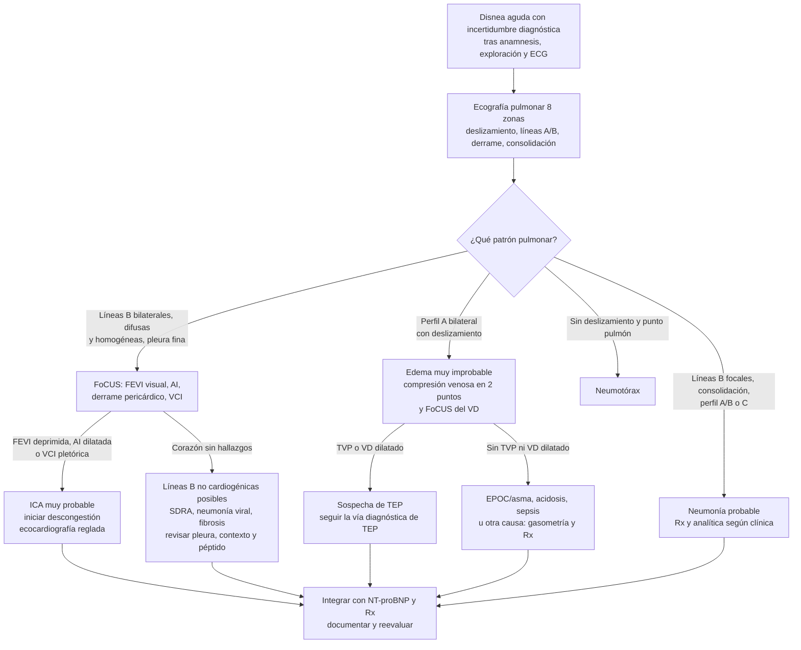
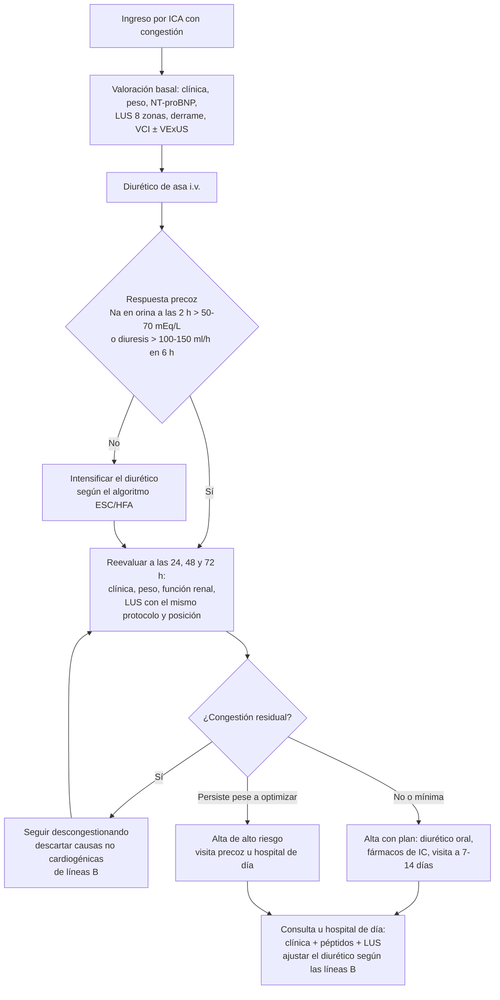

# 06 · Integración en la práctica

Las páginas anteriores responden a tres preguntas: qué precisión tiene la ecografía ([precisión](03-precision.md)), si cambia los resultados ([impacto](04-impacto.md)) y qué dicen las sociedades ([guías](05-guias.md)). Esta página responde a la pregunta del clínico de guardia: **¿qué hago mañana con el ecógrafo en la mano?**

Se organiza por escenarios: urgencias (disnea indiferenciada), planta (seguimiento de la descongestión), alta (congestión residual) y consulta u hospital de día. Para cada uno se indica a quién explorar, qué buscar, cómo combinar la ecografía con el NT-proBNP y la radiografía, qué hacer con cada hallazgo, cómo documentarlo y qué hace falta para organizarlo.

!!! warning "Qué es evidencia y qué es síntesis propia"
    Los **dos algoritmos** y la **plantilla de informe** de esta página son **síntesis del equipo**. Se han construido a partir de las guías, los consensos y los estudios citados, pero **no son algoritmos validados prospectivamente** ni recomendaciones oficiales de ninguna sociedad. Cada rama del algoritmo remite a su fuente. Donde no hay evidencia, se dice.

---

## 1. Principios de uso

1. **La ecografía responde a una pregunta clínica concreta.** No es un «estudio completo»: es una prueba focalizada que se interpreta junto a la cabecera del paciente y se integra con el resto de datos ([ACEP, 2016](../../05-fuentes/index.md#acep2016)). La FoCUS **no sustituye** a la ecocardiografía reglada ([Neskovic, 2014](../../05-fuentes/index.md#neskovic2014)).
2. **Se usa cuando hay incertidumbre.** La ACP sugiere usar el POCUS **además** de la vía diagnóstica estándar cuando hay incertidumbre diagnóstica en la disnea aguda, en urgencias o en planta (recomendación condicional, certeza baja) ([Qaseem, 2021](../../05-fuentes/index.md#qaseem2021)). Aplicarlo de forma sistemática a toda disnea no acortó la estancia en el ECA pragmático más grande ([Ovesen, 2026](../../05-fuentes/index.md#ovesen2026)).
3. **Se interpreta como un cociente de probabilidad, no como un diagnóstico.** El patrón B tiene un LR+ de 7,4 y el perfil sin líneas B un LR− de 0,16 para la ICA en urgencias ([Martindale, 2016](../../05-fuentes/index.md#martindale2016)). El resultado mueve la probabilidad pretest; no la sustituye (véase la tabla de Bayes en [precisión](03-precision.md)).
4. **Patrón para diagnosticar, número para seguir la evolución.** En urgencias importa reconocer el patrón (bilateral, difuso, homogéneo). En planta y en consulta importa el **cambio** en el número de líneas B con el mismo protocolo ([Gargani, 2023](../../05-fuentes/index.md#gargani2023); [Robba, 2021](../../05-fuentes/index.md#robba2021)). *Esta fórmula es una síntesis docente del equipo.*
5. **Se repite con el mismo método.** Para comparar exploraciones seriadas hay que usar la misma sonda, el mismo protocolo y la misma posición del paciente ([Demi, 2023](../../05-fuentes/index.md#demi2023); [Gargani, 2023](../../05-fuentes/index.md#gargani2023)). En la ICA hay más líneas B en decúbito supino que sentado, y las sondas sectoriales y los clips más largos muestran más líneas B ([Platz, 2019b](../../05-fuentes/index.md#platz2019b)).
6. **Se documenta y se guarda.** Una exploración que no queda en la historia clínica no puede revisarse, compararse ni auditarse ([ACEP, 2016](../../05-fuentes/index.md#acep2016); [Soni, 2019b](../../05-fuentes/index.md#soni2019b)). Véase el apartado 8.

---

## 2. A quién y cuándo: indicaciones por escenario

| Escenario | Pregunta clínica | ¿A quién? | ¿Cuándo? | Respaldo |
|---|---|---|---|---|
| **Urgencias** | ¿Es ICA, neumonía, TEP, neumotórax, derrame o broncoespasmo? | Disnea aguda **con incertidumbre diagnóstica** tras la valoración inicial | **Lo antes posible**, idealmente antes del diurético | ACP: condicional, certeza baja ([Qaseem, 2021](../../05-fuentes/index.md#qaseem2021)); SCCM: condicional, certeza baja ([Díaz-Gómez, 2025](../../05-fuentes/index.md#diazgomez2025)); EACVI: «puede ser apropiado» para confirmar o descartar el edema ([Gargani, 2023](../../05-fuentes/index.md#gargani2023)) |
| **Urgencias u observación** | ¿Responde al tratamiento? | ICA en tratamiento con evolución dudosa | Reevaluaciones a las 2–4 h | POCUS seriado a las 0, 2 y 4 h: menos disnea percibida y más diurético ([Arvig, 2023](../../05-fuentes/index.md#arvig2023)) |
| **Planta** | ¿Se está descongestionando? ¿Hay otra causa? | ICA ingresada; deterioro o mala respuesta diurética | Basal y cada 24–72 h (intervalo óptimo no definido) | EACVI: las líneas B bajan rápido con el tratamiento ([Gargani, 2023](../../05-fuentes/index.md#gargani2023)); evaluación multiparamétrica a las 24, 48 y 72 h ([Llàcer, 2024](../../05-fuentes/index.md#llacer2024)); el intervalo óptimo no está definido ([Demi, 2023](../../05-fuentes/index.md#demi2023)) |
| **Alta** | ¿Hay congestión residual? | Todo paciente ingresado por ICA | En las 24–48 h previas al alta | ESC: descartar congestión persistente antes del alta (I C, sin especificar método) ([McDonagh, 2021](../../05-fuentes/index.md#mcdonagh2021)); EACVI: LUS «apropiada» para detectarla ([Gargani, 2023](../../05-fuentes/index.md#gargani2023)) |
| **Consulta / hospital de día** | ¿Hay congestión subclínica? ¿Subo o bajo el diurético? | IC tras el alta, sobre todo con FEVI reducida o levemente reducida | Visita a 1–2 semanas y revisiones programadas | ESC: visita a 1–2 semanas para valorar la congestión (I C) ([McDonagh, 2021](../../05-fuentes/index.md#mcdonagh2021)); reducción de visitas urgentes en ECA ambulatorios ([Rivas-Lasarte, 2019](../../05-fuentes/index.md#rivaslasarte2019); [Araiza-Garaygordobil, 2020](../../05-fuentes/index.md#araizagaraygordobil2020); [Marini, 2020](../../05-fuentes/index.md#marini2020)) |

!!! tip "Perla clínica: explorar antes del diurético"
    La ecografía es **más sensible cuanto antes se hace**. En la metarregresión de Lian, el intervalo entre la llegada y la ecografía fue el principal determinante de la exactitud ([Lian, 2018](../../05-fuentes/index.md#lian2018)). En el estudio de Glöckner, la sensibilidad subió del 54 % al 75 % al excluir a los pacientes pretratados con diurético ([Glöckner, 2020](../../05-fuentes/index.md#glockner2020)). Si el paciente llega ya tratado desde la ambulancia, un perfil A **no descarta** con la misma seguridad.

!!! warning "Error frecuente: explorar a todos «por protocolo»"
    El ECA danés de 2026 aplicó un circuito POCUS a todos los pacientes con disnea y no consiguió más altas en < 24 h ([Ovesen, 2026](../../05-fuentes/index.md#ovesen2026)). El beneficio consistente de los metaanálisis es **temporal y de tratamiento apropiado** (diagnóstico unos 63 min antes y tratamiento apropiado con OR 2,31) ([Szabó, 2023](../../05-fuentes/index.md#szabo2023)). Rinde más donde hay **duda real**: el anciano con varias causas posibles, la Rx no concluyente, el péptido en zona gris.

---

## 3. Algoritmo 1: disnea indiferenciada en urgencias

El algoritmo integra el protocolo BLUE ([Lichtenstein, 2008](../../05-fuentes/index.md#lichtenstein2008)), la definición de patrón de edema de la EACVI ([Gargani, 2023](../../05-fuentes/index.md#gargani2023)), el enfoque pulmón-corazón-venas de la ESICM ([Robba, 2021](../../05-fuentes/index.md#robba2021)) y los datos de precisión de la [página 03](03-precision.md). Es **síntesis propia**.



*Algoritmo de elaboración propia a partir de [Lichtenstein, 2008](../../05-fuentes/index.md#lichtenstein2008), [Gargani, 2023](../../05-fuentes/index.md#gargani2023), [Robba, 2021](../../05-fuentes/index.md#robba2021), [Martindale, 2016](../../05-fuentes/index.md#martindale2016) y [Nazerian, 2014](../../05-fuentes/index.md#nazerian2014). No está validado prospectivamente. El derrame pleural puede acompañar a cualquier rama: bilateral orienta a ICA; unilateral obliga a pensar en otras causas.*

### 3.1. Qué hacer con cada perfil

| Hallazgo | Qué significa | Datos de precisión | Siguiente paso | Fuente |
|---|---|---|---|---|
| **Patrón B bilateral y difuso** (≥ 3 líneas B por zona, ≥ 2 zonas por hemitórax), pleura fina | Edema pulmonar, cardiogénico si el contexto encaja | LR+ 7,4 (4,2–12,8) para ICA en urgencias; S 92 %, E 90 % en el metaanálisis más amplio | FoCUS para «explicar» las líneas B; tratar; ecocardiografía reglada | [Martindale, 2016](../../05-fuentes/index.md#martindale2016); [Rahmani, 2025](../../05-fuentes/index.md#rahmani2025); [Gargani, 2023](../../05-fuentes/index.md#gargani2023) |
| **Patrón B + FoCUS alterada** (FEVI deprimida, AI dilatada) | Edema cardiogénico muy probable | Pulmón + corazón: S 78 %, E 96 %. FEVI reducida sola: LR+ 4,1 | Descongestión; ecocardiografía reglada para la etiología | [Popat, 2026](../../05-fuentes/index.md#popat2026); [Martindale, 2016](../../05-fuentes/index.md#martindale2016) |
| **Patrón B con pleura gruesa o irregular, áreas respetadas, consolidaciones subpleurales** | Líneas B no cardiogénicas (SDRA, neumonía, fibrosis) | En el SDRA: anomalías pleurales 100 % frente a 25 % en el edema; áreas respetadas 100 % frente a 0 % | Buscar infección o lesión pulmonar; valorar el corazón y la VCI | [Copetti, 2008](../../05-fuentes/index.md#copetti2008); [Gargani, 2023](../../05-fuentes/index.md#gargani2023) |
| **Perfil A bilateral** | Edema muy improbable | Ausencia de líneas B: LR 0,09 para sobrecarga de volumen | Buscar TVP y signos de VD; valorar broncoespasmo, acidosis o causa extrapulmonar | [Drum, 2026](../../05-fuentes/index.md#drum2026); [Lichtenstein, 2008](../../05-fuentes/index.md#lichtenstein2008) |
| **Perfil A + TVP** | TEP probable | S 81 %, E 99 % en el BLUE original (n = 21) | Vía diagnóstica de TEP (véase el [caso 3](10-casos.md)) | [Lichtenstein, 2008](../../05-fuentes/index.md#lichtenstein2008) |
| **Perfil A sin TVP** | No descarta TEP | El BLUE detectó el TEP con S del 46,2 % en urgencias | Probabilidad clínica y dímero D; multiórgano (pulmón + corazón + venas): S 90 % | [Bekgoz, 2019](../../05-fuentes/index.md#bekgoz2019); [Nazerian, 2014](../../05-fuentes/index.md#nazerian2014) |
| **Líneas B focales, consolidación, perfil A/B o C** | Neumonía | LUS en urgencias: S 92 %, E 93 %; líneas B focales: E 0,96 | Rx y analítica según el caso; antibiótico según la clínica | [Orso, 2018](../../05-fuentes/index.md#orso2018); [Padrao, 2025](../../05-fuentes/index.md#padrao2025) |
| **Sin deslizamiento + líneas A + punto pulmón** | Neumotórax | Ecografía S 91 %, E 99 %, frente a S 47 % de la Rx en supino | Tratamiento según tamaño y clínica | [Chan, 2020](../../05-fuentes/index.md#chan2020) |
| **Derrame pleural** | ICA si es bilateral y hay líneas B; otras causas si es unilateral | Ecografía S 94 %, E 98 % frente a S 51 % de la Rx | Integrar; no valorar líneas B en las zonas con derrame | [Yousefifard, 2016](../../05-fuentes/index.md#yousefifard2016); [Gargani, 2023](../../05-fuentes/index.md#gargani2023) |

!!! warning "Error frecuente: una ecografía, un solo diagnóstico"
    En los ancianos con insuficiencia respiratoria aguda, casi la mitad (47 %) tiene más de un diagnóstico simultáneo, y el tratamiento inicial inapropiado se asocia a más mortalidad ([Ray, 2006](../../05-fuentes/index.md#ray2006)). La ecografía **no resuelve bien la causa mixta** (ICA + neumonía): en mayores de 65 años, la estrategia ecográfica no mejoró significativamente la precisión frente a la estándar ([Balen, 2021](../../05-fuentes/index.md#balen2021)). Un patrón B bilateral con una consolidación focal puede ser ICA **y** neumonía.

!!! tip "Perla clínica: el corazón «explica» las líneas B"
    La LUS aislada es muy sensible pero pierde especificidad en quien tiene enfermedad pulmonar previa. Una FEVI muy deprimida o una aurícula izquierda dilatada hacen más verosímil el origen cardiogénico ([Kajimoto, 2012](../../05-fuentes/index.md#kajimoto2012); [Carlino, 2018](../../05-fuentes/index.md#carlino2018)). Si el corazón es normal y hay patrón B, la EACVI aconseja **buscar SDRA u otras causas** de líneas B ([Gargani, 2023](../../05-fuentes/index.md#gargani2023)).

---

## 4. Cómo combinar la ecografía con el NT-proBNP y la radiografía

Ninguna prueba discrimina sola todas las causas de disnea ([Kokorin, 2024](../../05-fuentes/index.md#kokorin2024)). Cada una tiene su papel:

| Prueba | Mejor para | Límite principal | Fuente |
|---|---|---|---|
| **Ecografía pulmonar** | Confirmar **y** descartar edema a pie de cama; diagnósticos alternativos | Operador; líneas B no específicas; pierde sensibilidad tras el diurético | [Martindale, 2016](../../05-fuentes/index.md#martindale2016); [Lian, 2018](../../05-fuentes/index.md#lian2018) |
| **NT-proBNP** | **Descartar** (NT-proBNP < 300 pg/ml: LR− 0,09) | Zona gris: un valor intermedio apenas cambia la probabilidad; bajo en obesidad, edema *flash* e ICA derecha; alto en FA e insuficiencia renal | [Martindale, 2016](../../05-fuentes/index.md#martindale2016); [McDonagh, 2021](../../05-fuentes/index.md#mcdonagh2021) |
| **Radiografía de tórax** | Confirmar edema (E 87–90 %); visión global del tórax | Poco sensible (73–77 %): una Rx normal no descarta ICA | [Maw, 2019](../../05-fuentes/index.md#maw2019); [Chiu, 2022](../../05-fuentes/index.md#chiu2022) |
| **FoCUS** | Explicar las líneas B (FEVI, AI), derrame pericárdico, VD | No sustituye a la ecocardiografía; E/e′ es avanzado | [Albaroudi, 2022](../../05-fuentes/index.md#albaroudi2022); [Neskovic, 2014](../../05-fuentes/index.md#neskovic2014) |

**Puntos de corte del NT-proBNP según la ESC 2021** ([McDonagh, 2021](../../05-fuentes/index.md#mcdonagh2021)):

- **Para descartar la ICA:** BNP < 100 pg/ml, NT-proBNP < 300 pg/ml o MR-proANP < 120 pg/ml.
- **Para confirmarla:** NT-proBNP > 450 pg/ml en menores de 55 años, > 900 pg/ml entre 55 y 75 años y > 1800 pg/ml en mayores de 75.

**Estrategias de combinación con respaldo:**

1. **Clínica + ecografía primero.** Añadir la LUS a la clínica mejoró la exactitud para la ICA (AUC 0,88 → 0,95). Añadir Rx + NT-proBNP no la mejoró de forma significativa (AUC 0,85 → 0,87) ([Pivetta, 2019](../../05-fuentes/index.md#pivetta2019)).
2. **Péptido para la duda que queda.** La ESC sitúa la LUS y la Rx como pruebas confirmatorias, «especialmente cuando no esté disponible la determinación de péptidos» ([McDonagh, 2021](../../05-fuentes/index.md#mcdonagh2021)). En la práctica, el péptido es especialmente útil **cuando la ecografía no es concluyente** o el perfil A llega en un paciente ya tratado. *Esta secuencia es una síntesis del equipo.*
3. **Rx + LUS con péptido en los negativos.** Es la estrategia escalonada que propusieron Sartini et al. (Rx + LUS: S 84,7 %, E 77,7 %) ([Sartini, 2017](../../05-fuentes/index.md#sartini2017)).
4. **La Rx no es obligatoria para empezar a tratar** si la ecografía es inequívoca, pero sigue siendo útil para otras preguntas (masas, mediastino, dispositivos) y cuando la ecografía no es concluyente. *Opinión del equipo.* Los límites físicos de la LUS se detallan en [limitaciones](07-limitaciones.md).

!!! info "La definición universal de IC de 2026"
    La segunda definición universal de IC (AHA/ACC/ESC/WHF) incluye expresamente la **ecografía pulmonar** entre las pruebas de imagen de congestión pulmonar que aumentan la certeza diagnóstica, junto a los péptidos. Define la IC por la **acumulación de rasgos** en una valoración integral, no por una prueba única ([Walsh, 2026](../../05-fuentes/index.md#walsh2026)).

??? info "Detalle: el péptido en zona gris"
    En el análisis por intervalos de Martindale, un BNP de 100–200 pg/ml tuvo un LR de solo 0,29, y un NT-proBNP muy alto (30 000–200 000 pg/ml) solo alcanzó un LR de 3,30 ([Martindale, 2016](../../05-fuentes/index.md#martindale2016)). En la zona intermedia, el péptido apenas mueve la probabilidad, y ahí la ecografía aporta más. En muy ancianos, NT-proBNP y LUS confirman la IC, pero discriminan mal el fenotipo con FEVI reducida ([Landolfo, 2024](../../05-fuentes/index.md#landolfo2024)).

---

## 5. Algoritmo 2: descongestión en planta, alta y consulta

Este algoritmo sigue el recorrido del paciente con ICA desde el ingreso hasta la consulta, en línea con la valoración de la congestión «a lo largo del viaje del paciente» ([Girerd, 2018](../../05-fuentes/index.md#girerd2018)). Integra los criterios de respuesta diurética de la ESC y la HFA ([McDonagh, 2021](../../05-fuentes/index.md#mcdonagh2021); [Mullens, 2019](../../05-fuentes/index.md#mullens2019)), el calendario de reevaluación del consenso SEMI/SEC/S.E.N. ([Llàcer, 2024](../../05-fuentes/index.md#llacer2024)) y los umbrales de congestión residual de la EACVI ([Gargani, 2023](../../05-fuentes/index.md#gargani2023)). Es **síntesis propia**.



*Algoritmo de elaboración propia. Criterios de respuesta diurética: [McDonagh, 2021](../../05-fuentes/index.md#mcdonagh2021) y [Mullens, 2019](../../05-fuentes/index.md#mullens2019). Calendario de 2 h, 6 h, 24 h, 48–72 h y 7–14 días: [Llàcer, 2024](../../05-fuentes/index.md#llacer2024). Visita a 1–2 semanas (I C): [McDonagh, 2021](../../05-fuentes/index.md#mcdonagh2021). Ajuste ambulatorio por líneas B: [Rivas-Lasarte, 2019](../../05-fuentes/index.md#rivaslasarte2019). Guiar el diurético por las líneas B **durante el ingreso** no ha demostrado mejorar la morbimortalidad ([Gargani, 2023](../../05-fuentes/index.md#gargani2023)).*

### 5.1. Planta: seguimiento de la descongestión

- **Qué se sabe.** Las líneas B cambian en pocas horas con el tratamiento: en la revisión de Platz, en apenas 3 h ([Platz, 2017](../../05-fuentes/index.md#platz2017)). Su descenso durante el ingreso se asocia a mejor supervivencia ([Gargani, 2023](../../05-fuentes/index.md#gargani2023)). En la UCI cardiaca, la LUS se correlacionó con la presión de enclavamiento y el VExUS con la presión de aurícula derecha ([Jimenez, 2026](../../05-fuentes/index.md#jimenez2026)).
- **Qué no se sabe.** La EACVI reconoce que **no hay evidencia de que titular el diurético según las líneas B mejore la morbimortalidad en el paciente hospitalizado** ([Gargani, 2023](../../05-fuentes/index.md#gargani2023)). BLUSHED-AHF, en urgencias, fue negativo en su objetivo primario ([Pang, 2021](../../05-fuentes/index.md#pang2021)). CAVAL US-AHF redujo la congestión subclínica al alta (13,3 % frente a 66,6 %), pero es un piloto de 60 pacientes con un objetivo de imagen ([Burgos, 2024](../../05-fuentes/index.md#burgos2024)). ICARUS y ABDOPOCUS-HF están en marcha ([Leidi, 2026](../../05-fuentes/index.md#leidi2026); [Josa-Laorden, 2025](../../05-fuentes/index.md#josalaorden2025)).
- **Qué no hace falta repetir.** El consenso de la ACVC no recomienda la **ecocardiografía** para monitorizar el tratamiento de la ICA sin shock cardiogénico ([Price, 2017](../../05-fuentes/index.md#price2017)). Lo que se repite es la LUS (y, si se usa, la VCI), no la ecocardiografía completa.
- **Frecuencia.** El intervalo óptimo entre LUS de monitorización **no está definido** ([Demi, 2023](../../05-fuentes/index.md#demi2023)). Los ensayos usan una exploración diaria ([Burgos, 2024](../../05-fuentes/index.md#burgos2024); [Leidi, 2026](../../05-fuentes/index.md#leidi2026)), y el consenso español propone reevaluar a las 24, 48 y 72 h ([Llàcer, 2024](../../05-fuentes/index.md#llacer2024)).

!!! tip "Perla clínica: si las líneas B no bajan"
    Si el paciente orina bien y las líneas B no bajan, **la pregunta no es solo «más diurético»**. Hay que pensar en causas no cardiogénicas de líneas B (neumonía, SDRA, fibrosis, enfermedad renal terminal) y revisar la pleura y la distribución ([Gargani, 2023](../../05-fuentes/index.md#gargani2023); [Platz, 2019b](../../05-fuentes/index.md#platz2019b)). En la COVID, el patrón B bilateral fue sensible pero poco específico de la causa ([Ebrahimzadeh, 2022](../../05-fuentes/index.md#ebrahimzadeh2022)).

### 5.2. Alta: congestión residual

El **I C** de la ESC dice *qué* hay que hacer (descartar congestión persistente antes del alta), pero no *cómo* ([McDonagh, 2021](../../05-fuentes/index.md#mcdonagh2021)). La exploración física es insuficiente: el **41 %** de los pacientes «secos» a la auscultación tenía ≥ 5 líneas B al alta, con peor pronóstico (HR 2,63; IC 95 % 1,08–6,41) ([Rivas-Lasarte, 2020](../../05-fuentes/index.md#rivaslasarte2020)).

**Umbrales pronósticos de congestión residual al alta** (dependen del protocolo; no son intercambiables):

| Protocolo | Umbral de congestión residual | Resultado | Fuente |
|---|---|---|---|
| 4 zonas | ≥ 7 líneas B | Reingreso por IC o muerte a 90 días: HR ajustado 3,03 (1,45–6,31) | Tabla 2 de [Gargani, 2023](../../05-fuentes/index.md#gargani2023), a partir de [Platz, 2019](../../05-fuentes/index.md#platz2019) |
| **8 zonas** | **≥ 1 zona positiva (≥ 3 líneas B) en cada hemitórax** | Reingreso por IC o muerte a 90 días: HR ajustado 3,30 (1,00–10,91) | Tabla 2 de [Gargani, 2023](../../05-fuentes/index.md#gargani2023) |
| 8 zonas, sin crepitantes | ≥ 5 líneas B en total | Eventos a 6 meses: HR 2,63 | [Rivas-Lasarte, 2020](../../05-fuentes/index.md#rivaslasarte2020) |
| 9 zonas (LUS + VCI, enfermería) | ≥ 10 líneas B | Reingreso por IC o muerte a 90 días: 37 % frente a 14 % | [Zisis, 2022](../../05-fuentes/index.md#zisis2022) |
| 28 zonas | > 15 líneas B | Reingreso por IC a 6 meses: HR 11,74 (1,30–106,16) | [Gargani, 2015](../../05-fuentes/index.md#gargani2015) |
| 28 zonas | ≥ 30 líneas B | Muerte o reingreso a 3 meses: supervivencia libre de eventos 27 % frente a 88 %; HR 5,66 | [Coiro, 2015](../../05-fuentes/index.md#coiro2015) |

En el conjunto de la evidencia, las líneas B residuales al alta se asocian a un HR combinado de 2,32 (1,91–2,82) para eventos ([Suhardi, 2025](../../05-fuentes/index.md#suhardi2025)), y el valor pronóstico no depende de la edad ni de la FEVI ([Rastogi, 2024](../../05-fuentes/index.md#rastogi2024)). El derrame pleural se detecta por ecografía en aproximadamente la mitad de los pacientes al alta, pero no está claro que aumente el riesgo ([Gargani, 2023](../../05-fuentes/index.md#gargani2023)).

!!! warning "Pronóstico no es lo mismo que decisión de alta"
    La congestión residual **identifica al paciente de riesgo**, pero no hay ECA que demuestre que retrasar el alta hasta «secar» las líneas B mejore los resultados. El único ECA que intervino sobre la congestión residual al alta y en domicilio (DMP-Plus) fue negativo ([Zisis, 2024](../../05-fuentes/index.md#zisis2024)). Opciones razonables ante un paciente con congestión residual (*síntesis del equipo*): prolongar 24–48 h la descongestión si es segura, intensificar el diurético oral al alta, **adelantar la primera visita** y dejar escrito el hallazgo en el informe de alta para que la consulta lo compare. La estrategia de alta intensiva con visitas frecuentes en las primeras semanas (STRONG-HF) redujo el reingreso por IC o la muerte a 180 días (15,2 % frente a 23,3 %) ([Mebazaa, 2022](../../05-fuentes/index.md#mebazaa2022)); la ecografía no formó parte de esa estrategia.

### 5.3. Consulta y hospital de día

Es el escenario **con más ECA** a favor del ajuste del diurético por las líneas B:

- **LUS-HF** (España): LUS de 8 zonas con ecógrafo de bolsillo a los 14, 30, 90 y 180 días; HR 0,518 del objetivo compuesto, sobre todo por menos visitas urgentes; NNT 5 ([Rivas-Lasarte, 2019](../../05-fuentes/index.md#rivaslasarte2019)).
- **CLUSTER-HF**: HR 0,55; visitas urgentes HR 0,28; sin diferencias en reingresos ni muerte ([Araiza-Garaygordobil, 2020](../../05-fuentes/index.md#araizagaraygordobil2020)).
- **Marini 2020**: hospitalización por ICA a 90 días 9,4 % frente a 21,4 % ([Marini, 2020](../../05-fuentes/index.md#marini2020)).
- **Metaanálisis**: todos coinciden en menos visitas urgentes (RR 0,31–0,38) y ninguno muestra efecto en la mortalidad ([Al-Sagban, 2026](../../05-fuentes/index.md#alsagban2026); [Chotalia, 2026](../../05-fuentes/index.md#chotalia2026); [Bagheri, 2026](../../05-fuentes/index.md#bagheri2026)).
- **Excepción:** en ancianos de medicina interna (edad media 81; 52 % con FEVI > 50 %), el ECA EPICC fue negativo ([Torres-Macho, 2022](../../05-fuentes/index.md#torresmacho2022)).

La congestión que detecta la ecografía en consulta es a menudo **silenciosa**: el 81 % de los ambulatorios con ≥ 3 líneas B tenía auscultación normal ([Platz, 2016](../../05-fuentes/index.md#platz2016)), y el 42 % de los pacientes sin signos clínicos tenía algún signo ecográfico de congestión en una valoración multiórgano ([Pugliese, 2023](../../05-fuentes/index.md#pugliese2023)). El consenso SEMI/SEC/S.E.N. incluye LUS y VExUS en la revaluación precoz a los 7–14 días ([Llàcer, 2024](../../05-fuentes/index.md#llacer2024)).

!!! note "Cómo usar el resultado en consulta (orientativo)"
    - **Más líneas B que en la visita previa** o por encima del umbral del protocolo, aunque el paciente esté asintomático → valorar subir el diurético y **adelantar la revisión**.
    - **Sin líneas B relevantes** y paciente euvolémico → valorar mantener o **reducir** el diurético. En Cruz 2024, la LUS visible aumentó los ajustes de furosemida **en ambos sentidos** (31,9 % frente a 18,6 %) ([Cruz, 2024](../../05-fuentes/index.md#cruz2024)).
    - Los ensayos no usaron un algoritmo único ni un umbral común ([Chotalia, 2026](../../05-fuentes/index.md#chotalia2026)). *Estas reglas son síntesis del equipo a partir de esos ensayos.*

---

## 6. Criterios multiparamétricos de «descongestión»

No existe una definición única y validada de «paciente descongestionado». Las sociedades coinciden en un **abordaje multiparamétrico** con clínica, biomarcadores e imagen ([Llàcer, 2024](../../05-fuentes/index.md#llacer2024); [Girerd, 2018](../../05-fuentes/index.md#girerd2018); [Mullens, 2019](../../05-fuentes/index.md#mullens2019)).

| Dominio | Parámetro | Objetivo orientativo | Calidad de la evidencia | Fuente |
|---|---|---|---|---|
| **Clínico** | Ortopnea, ingurgitación yugular, edemas, crepitantes, peso | Ausencia de signos | Recomendación I C de valorar la congestión antes del alta; la exploración **infraestima** la congestión pulmonar | [McDonagh, 2021](../../05-fuentes/index.md#mcdonagh2021); [Rivas-Lasarte, 2020](../../05-fuentes/index.md#rivaslasarte2020) |
| **Respuesta diurética** | Sodio en orina a las 2 h; diuresis en las primeras 6 h | Na > 50–70 mEq/l; diuresis > 100–150 ml/h | Posicionamiento de la HFA recogido en la ESC 2021 | [McDonagh, 2021](../../05-fuentes/index.md#mcdonagh2021); [Mullens, 2019](../../05-fuentes/index.md#mullens2019) |
| **Biomarcadores** | NT-proBNP (y CA125 en el consenso español) | Tendencia descendente; **no hay umbral de descenso validado** como objetivo | El NT-proBNP forma parte del seguimiento intensivo tras el alta en STRONG-HF | [Llàcer, 2024](../../05-fuentes/index.md#llacer2024); [Mebazaa, 2022](../../05-fuentes/index.md#mebazaa2022) |
| **Pulmonar (LUS)** | Líneas B en 8 zonas; derrame | Por debajo del umbral pronóstico del protocolo usado (apartado 5.2) | **Pronóstico** robusto; beneficio de tratar hasta normalizarlo durante el ingreso no demostrado | [Gargani, 2023](../../05-fuentes/index.md#gargani2023); [Suhardi, 2025](../../05-fuentes/index.md#suhardi2025) |
| **Venoso sistémico (VCI)** | Diámetro y colapso inspiratorio | VCI no dilatada y con colapso | Pronóstico: la VCI al alta se asoció al evento en el modelo de Coiro; la combinación de congestión pulmonar y VCI ≥ 21 mm pronostica peor | [Coiro, 2015](../../05-fuentes/index.md#coiro2015); [Pellicori, 2026](../../05-fuentes/index.md#pellicori2026) |
| **Venoso sistémico (VExUS)** | Doppler de venas suprahepáticas, porta e intrarrenales + VCI | Grado 0–1 | **Solo pronóstico y observacional**; el único ECA (síndrome cardiorrenal) fue negativo en su objetivo primario. Habilidad avanzada | [Beaubien-Souligny, 2020](../../05-fuentes/index.md#beaubien2020); [Anastasiou, 2026](../../05-fuentes/index.md#anastasiou2026); [Islas-Rodríguez, 2024](../../05-fuentes/index.md#islasrodriguez2024); [Robba, 2021](../../05-fuentes/index.md#robba2021) |
| **Escala integrada** | Escala de sobrecarga hidrosalina SEMI/SEC/S.E.N. (10 variables: 5 clínicas, 2 de biomarcadores, 3 ecográficas: derrame, líneas B y VExUS; 0–3 puntos cada una) | **≤ 4 puntos** | Propuesta de expertos **no validada** prospectivamente | [Llàcer, 2024](../../05-fuentes/index.md#llacer2024) |

!!! tip "Perla clínica: pulmón «seco» no es paciente «seco», y al revés"
    La LUS refleja sobre todo las presiones izquierdas; la VCI y el VExUS, la congestión venosa sistémica ([Jimenez, 2026](../../05-fuentes/index.md#jimenez2026)). Pueden disociarse: en DRY-OFF, la congestión intravascular mejoró más con el diurético en la FEVI reducida que en la preservada ([Cogliati, 2022](../../05-fuentes/index.md#cogliati2022)). La EACVI recuerda que **la ausencia de congestión pulmonar no excluye la IC**, sobre todo en la obesidad grave o la IC derecha aislada ([Gargani, 2023](../../05-fuentes/index.md#gargani2023)).

!!! warning "Error frecuente: leer el VExUS como «exceso de volumen»"
    La insuficiencia tricuspídea grave y la disfunción del VD se asocian de forma independiente al VExUS 3 ([Anastasiou, 2024](../../05-fuentes/index.md#anastasiou2024)). Un VExUS alto indica congestión venosa, pero no siempre exceso de volumen tratable con diurético. La ESICM considera el Doppler venoso fuera del nivel básico ([Robba, 2021](../../05-fuentes/index.md#robba2021)); véase [formación](08-formacion.md).

---

## 7. Trampas y situaciones especiales

| Situación | Qué ocurre | Qué hacer | Fuente |
|---|---|---|---|
| **Diurético previo** | Menos líneas B: baja la sensibilidad | Interpretar el perfil A con cautela; apoyarse en el péptido | [Glöckner, 2020](../../05-fuentes/index.md#glockner2020); [Lian, 2018](../../05-fuentes/index.md#lian2018) |
| **Fibrosis, EPOC con enfisema, neumopatía intersticial** | Líneas B basales crónicas o ventana difícil | Comparar con exploraciones previas; valorar pleura y distribución; el corazón ayuda | [Gargani, 2023](../../05-fuentes/index.md#gargani2023); [Copetti, 2008](../../05-fuentes/index.md#copetti2008) |
| **Enfermedad renal terminal o diálisis** | Congestión pulmonar sin IC | Interpretar en contexto | [Platz, 2019b](../../05-fuentes/index.md#platz2019b) |
| **Derrame pleural** | Las líneas B de las zonas con derrame no se valoran | Informar del derrame en esas zonas | [Gargani, 2023](../../05-fuentes/index.md#gargani2023) |
| **Obesidad grave, IC derecha aislada** | Pulmón sin congestión con IC presente | Valorar la congestión sistémica (VCI, clínica) | [Gargani, 2023](../../05-fuentes/index.md#gargani2023) |
| **Anciano con causas mixtas** | Menor especificidad | No cerrar el diagnóstico con la ecografía | [Balen, 2021](../../05-fuentes/index.md#balen2021) |
| **Contador automático de líneas B** | Un software comercial sobrecontó casi diez veces | Comprobar con el recuento propio antes de ajustar el diurético | [Labaf, 2025](../../05-fuentes/index.md#labaf2025) |

Más detalle sobre los límites técnicos en [limitaciones](07-limitaciones.md) y [técnica](02-tecnica.md).

---

## 8. Documentación e informe

**Qué exigen las sociedades:**

- La documentación de la ecografía urgente puede ser **preliminar y breve**, centrada en la presencia o ausencia de los hallazgos relevantes. Los informes deben estar **disponibles** para el resto del equipo. Los hallazgos incidentales se comunican al paciente o a quien hará el seguimiento. El **archivo digital** de imágenes con su documentación es lo óptimo ([ACEP, 2016](../../05-fuentes/index.md#acep2016)).
- Componentes del informe según la Society of Hospital Medicine: indicación y tipo de exploración, fecha y hora, identificación del paciente, nombre de quien adquiere e interpreta, protocolo, **posición del paciente**, sonda usada y hallazgos. Puede ir en una nota propia o dentro de la evolución, y debe ser **oportuna** ([Soni, 2019b](../../05-fuentes/index.md#soni2019b)).
- Para la LUS en la IC, la lista de verificación de la ACVC/HFA pide dejar constancia de: equipo y sonda, orientación, **posición**, **número y localización de las zonas**, duración de los clips, **método de cuantificación** de las líneas B (y el software, si se usa), cómo se valoró el **derrame**, las zonas no valorables y la **relación temporal con los péptidos, la ecocardiografía y el tratamiento descongestivo** ([Platz, 2019b](../../05-fuentes/index.md#platz2019b)). Aunque se diseñó para investigación, sus autores la proponen como guía también para clínicos.
- Técnica que conviene anotar según la EACVI y el consenso internacional: clip de unos 6 s por zona, al menos un ciclo respiratorio, misma posición en las exploraciones seriadas, y distribución de las líneas B (homogénea o heterogénea, focal o bilateral) ([Gargani, 2023](../../05-fuentes/index.md#gargani2023); [Demi, 2023](../../05-fuentes/index.md#demi2023)).

!!! note "Plantilla de informe: ecografía pulmonar y cardiaca focalizada en disnea o ICA (propuesta del equipo)"
    Plantilla de elaboración propia que adapta [Soni, 2019b](../../05-fuentes/index.md#soni2019b), [ACEP, 2016](../../05-fuentes/index.md#acep2016), [Platz, 2019b](../../05-fuentes/index.md#platz2019b) y [Gargani, 2023](../../05-fuentes/index.md#gargani2023). No es un formulario oficial.

    ```text
    ECOGRAFÍA CLÍNICA A PIE DE CAMA (POCUS) — PULMÓN / CORAZÓN / VENAS
    Fecha y hora: ____  Ámbito: urgencias / planta / consulta / hospital de día
    Explorador: ____ (nivel: en formación supervisado / autónomo)  Supervisor: ____
    Indicación / pregunta clínica: ____________________________
    Momento: basal / reevaluación n.º __ / prealta / seguimiento
    Tratamiento previo relevante: diurético (dosis y hora) ____  VMNI: sí/no
    Equipo y sonda: ____ (sectorial / convexa / bolsillo)   Posición: supino / 45° / sentado
    Protocolo: 8 zonas (otro: __)   Clips: ~6 s por zona   Armónicos: no

    PULMÓN (líneas B por zona; «D» = derrame, «NV» = no valorable)
      Derecho:   R1 __  R2 __  R3 __  R4 __     Izquierdo: L1 __  L2 __  L3 __  L4 __
      Zonas positivas (≥3 B): __/8   Suma de líneas B: __
      Distribución: bilateral y homogénea / parcheada / focal
      Línea pleural: fina / irregular-engrosada   Deslizamiento: presente / ausente (lado)
      Consolidación: no / sí (localización)   Derrame pleural: no / dcho / izdo (estimación)
    CORAZÓN (FoCUS)
      FEVI visual: normal / reducida / muy reducida   AI: normal / dilatada
      VD: normal / dilatado   Derrame pericárdico: no / sí   Calidad de ventanas: buena / limitada
    VENAS
      VCI: __ mm, colapso inspiratorio >50% / <50%   (VExUS, si competente: grado __)
      Compresión venosa 2 puntos: normal / TVP (lado, nivel) / no realizada

    INTERPRETACIÓN: patrón compatible con ____ ; comparación con previa: más / igual / menos
    LIMITACIONES: ____
    CONDUCTA DERIVADA: ____    Pruebas solicitadas: ecocardiografía reglada / TC / otras
    Imágenes archivadas: sí (n.º de clips) / no — ubicación: ____
    ```

!!! tip "Perla organizativa: qué clips guardar"
    Propuesta práctica del equipo: guardar **al menos un clip por hemitórax** (el peor de cada lado), un clip de cada hallazgo positivo (derrame, consolidación, TVP) y el plano cardiaco que sustenta la FEVI. La SHM recuerda que el archivo de imágenes es esencial para la calidad, la formación y la documentación, aunque reconoce que en exploraciones seriadas muy frecuentes puede no ser necesario archivar todas ([Soni, 2019b](../../05-fuentes/index.md#soni2019b)).

---

## 9. Aspectos organizativos

### 9.1. Equipos

- **Ecógrafos de bolsillo.** La EACVI los considera una extensión de la exploración física para exploraciones parciales y focalizadas, y da recomendaciones sobre nomenclatura, indicaciones, operadores, entornos, **gestión y almacenamiento de datos** y formación ([Cardim, 2019](../../05-fuentes/index.md#cardim2019)). En medicina interna, un equipo de bolsillo concordó con uno convencional en el 79 % para las líneas B y en el 89 % para el derrame ([Lo Cricchio, 2024](../../05-fuentes/index.md#locricchio2024)). Los estudios clave de seguimiento ambulatorio se hicieron con ecógrafo de bolsillo ([Platz, 2016](../../05-fuentes/index.md#platz2016); [Rivas-Lasarte, 2019](../../05-fuentes/index.md#rivaslasarte2019)).
- **Mismo equipo para las exploraciones seriadas.** La sonda, la orientación y la duración del clip cambian el número de líneas B visibles ([Platz, 2019b](../../05-fuentes/index.md#platz2019b)).
- **Criterios de elección** según la SHM: portabilidad, pantalla, facilidad de uso, **integración con la historia clínica electrónica** y archivo, servicio técnico y cumplimiento de las normas locales de control de infecciones ([Soni, 2019b](../../05-fuentes/index.md#soni2019b)).

### 9.2. Limpieza y desinfección

Recomendaciones del grupo de trabajo de ecografía de la European Society of Radiology ([Nyhsen, 2017](../../05-fuentes/index.md#nyhsen2017)):

- Todo equipo, **incluidos los de bolsillo**, debe estar aprobado antes del primer uso.
- Las sondas en contacto con el paciente se limpian y desinfectan **antes del primer uso y después de cada exploración**. Periódicamente, limpieza a fondo del equipo y del entorno.
- En la ecografía sobre **piel íntegra** (la de este tema) basta la **desinfección de bajo nivel**. La de alto nivel es obligatoria en la ecografía endocavitaria y en todo procedimiento intervencionista, con fundas específicas y gel estéril.
- No se usan sondas dañadas.

La ACEP añade la descontaminación de la sonda y el principio ALARA como prácticas básicas de seguridad ([ACEP, 2016](../../05-fuentes/index.md#acep2016)).

!!! warning "Error frecuente: el ecógrafo que va de cama en cama"
    El equipo portátil y el móvil o la tableta conectados a la sonda viajan entre pacientes. Hay que incluirlos en el protocolo de limpieza del centro, no solo la sonda ([Nyhsen, 2017](../../05-fuentes/index.md#nyhsen2017); [Soni, 2019b](../../05-fuentes/index.md#soni2019b)).

### 9.3. Responsabilidad y acreditación

- **Formación y acreditación.** La ACEP considera que un paso clave para gestionar el riesgo es que los médicos estén formados y acreditados, con programas de calidad que identifiquen y corrijan la práctica deficiente ([ACEP, 2016](../../05-fuentes/index.md#acep2016)). La SHM recomienda acordar los requisitos con la comisión local de acreditación y distinguir los certificados de asistencia de los de competencia ([Soni, 2019b](../../05-fuentes/index.md#soni2019b)). En España, el consenso GTECO-SEMI propone una rotación estructurada, evaluación de competencias y **acreditación de unidades** ([Tung-Chen, 2024](../../05-fuentes/index.md#tungchen2024)). Véase [formación](08-formacion.md).
- **Litigios.** En EE. UU., una revisión de 20 años no encontró demandas contra urgenciólogos por realizar o interpretar un POCUS; hubo un único caso por **no realizarlo** ([Blaivas, 2012](../../05-fuentes/index.md#blaivas2012)). En 2008–2012 se identificaron cinco casos, todos por no hacer la ecografía o no hacerla a tiempo ([Stolz, 2015](../../05-fuentes/index.md#stolz2015)). La ACEP llega a afirmar que el mayor riesgo es **no usarla** cuando está indicada ([ACEP, 2016](../../05-fuentes/index.md#acep2016)). *Son datos del sistema legal estadounidense y no son extrapolables sin más a España.*
- **Límites de la competencia.** Quien explora debe saber qué preguntas puede responder y cuándo pedir una ecocardiografía o una TC. Los falsos positivos son el principal riesgo en manos inexpertas ([Ruddox, 2017](../../05-fuentes/index.md#ruddox2017)).

### 9.4. Integración en la historia clínica y calidad

- **El informe debe estar en la historia clínica** y accesible para el resto del equipo ([ACEP, 2016](../../05-fuentes/index.md#acep2016)). Lo ideal es un archivo de imágenes vinculado a los informes y a las peticiones; si no es posible, un almacenamiento paralelo que cumpla la normativa de protección de datos ([Soni, 2019b](../../05-fuentes/index.md#soni2019b)).
- **Programa de calidad.** La revisión de imágenes e interpretaciones, y su comparación con otras pruebas y con la evolución, es parte esencial de un programa de ecografía clínica ([ACEP, 2016](../../05-fuentes/index.md#acep2016); [Soni, 2019b](../../05-fuentes/index.md#soni2019b)).
- **Implantación real.** Incluso con formación completa, en un programa de hospitalistas solo el 20 % de las exploraciones las hicieron los hospitalistas de forma autónoma ([Maganti, 2025](../../05-fuentes/index.md#maganti2025)). Sin tiempo, equipo accesible y supervisión, el protocolo se queda en el papel.

!!! info "Lista de comprobación para implantar el circuito (propuesta del equipo)"
    - [ ] Ecógrafo accesible en urgencias y en planta, con sonda sectorial o convexa.
    - [ ] Protocolo común de 8 zonas y posición estándar para las exploraciones seriadas.
    - [ ] Plantilla de informe en la historia clínica electrónica y sistema de archivo de clips.
    - [ ] Protocolo de limpieza que incluya sonda, equipo y dispositivo móvil.
    - [ ] Registro de exploraciones supervisadas y evaluación de competencias de los residentes.
    - [ ] Sesiones periódicas de revisión de casos (control de calidad).
    - [ ] Circuito de alta: hallazgo ecográfico en el informe y visita a 7–14 días.

---

## Puntos clave

- **A quién:** disnea aguda **con incertidumbre diagnóstica**, en urgencias o en planta; la ACP y la SCCM lo sugieren de forma condicional y con certeza baja ([Qaseem, 2021](../../05-fuentes/index.md#qaseem2021); [Díaz-Gómez, 2025](../../05-fuentes/index.md#diazgomez2025)). Aplicarlo a todos por sistema no acortó la estancia ([Ovesen, 2026](../../05-fuentes/index.md#ovesen2026)).
- **Cuándo:** lo antes posible, idealmente antes del diurético, que resta sensibilidad ([Lian, 2018](../../05-fuentes/index.md#lian2018); [Glöckner, 2020](../../05-fuentes/index.md#glockner2020)).
- **Qué hacer con cada perfil:** patrón B bilateral + FoCUS alterada → ICA; perfil A → buscar TVP y VD; líneas B focales o consolidación → neumonía; perfil A sin TVP **no** descarta TEP ([Lichtenstein, 2008](../../05-fuentes/index.md#lichtenstein2008); [Popat, 2026](../../05-fuentes/index.md#popat2026); [Bekgoz, 2019](../../05-fuentes/index.md#bekgoz2019)).
- **Con qué combinarla:** clínica + LUS primero; el NT-proBNP para **descartar** y para la duda que queda; una Rx normal no descarta ICA ([Pivetta, 2019](../../05-fuentes/index.md#pivetta2019); [Martindale, 2016](../../05-fuentes/index.md#martindale2016); [Maw, 2019](../../05-fuentes/index.md#maw2019)).
- **Planta:** las líneas B bajan en horas y sirven para monitorizar, pero **guiar el diurético por ellas durante el ingreso no ha demostrado beneficio** clínico ([Gargani, 2023](../../05-fuentes/index.md#gargani2023); [Pang, 2021](../../05-fuentes/index.md#pang2021)).
- **Alta:** la ESC pide descartar la congestión persistente (I C) sin decir cómo; hasta el 41 % de los «secos» a la auscultación tiene congestión ecográfica, con peor pronóstico ([McDonagh, 2021](../../05-fuentes/index.md#mcdonagh2021); [Rivas-Lasarte, 2020](../../05-fuentes/index.md#rivaslasarte2020)). Los umbrales dependen del protocolo (con 8 zonas: ≥ 1 zona positiva en cada hemitórax) ([Gargani, 2023](../../05-fuentes/index.md#gargani2023)).
- **Consulta:** ajustar el diurético por las líneas B reduce las visitas urgentes, sin efecto en la mortalidad ([Rivas-Lasarte, 2019](../../05-fuentes/index.md#rivaslasarte2019); [Al-Sagban, 2026](../../05-fuentes/index.md#alsagban2026)).
- **Descongestión multiparamétrica:** clínica + respuesta diurética + péptidos + LUS ± VCI/VExUS; la escala SEMI/SEC/S.E.N. (objetivo ≤ 4) es útil para sistematizar, pero **no está validada** ([Llàcer, 2024](../../05-fuentes/index.md#llacer2024)).
- **Documentar:** zonas, método de recuento, posición, sonda, derrame, relación con el tratamiento y clips archivados en la historia clínica ([Platz, 2019b](../../05-fuentes/index.md#platz2019b); [Soni, 2019b](../../05-fuentes/index.md#soni2019b)).
- **Organizar:** desinfección de bajo nivel tras cada exploración en piel íntegra, incluidos los equipos de bolsillo; acreditación local y programa de calidad ([Nyhsen, 2017](../../05-fuentes/index.md#nyhsen2017); [ACEP, 2016](../../05-fuentes/index.md#acep2016)).
