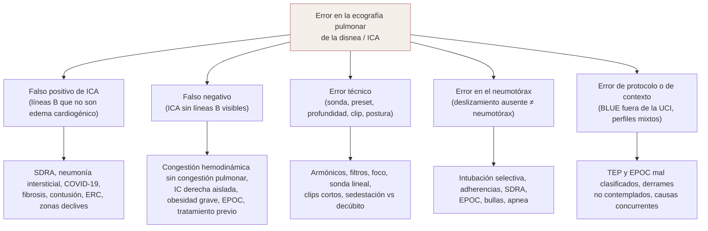
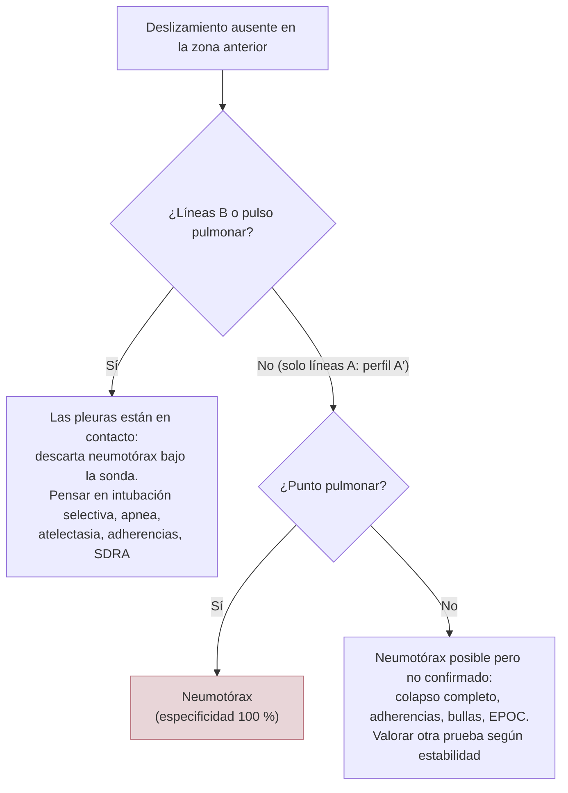

# 07 · Limitaciones y errores

La ecografía pulmonar es rápida y sensible, pero interpreta **artefactos**, y un artefacto no es un diagnóstico. Sus errores se repiten siempre en los mismos cuatro puntos. El primero es la **inespecificidad**: las líneas B aparecen en muchas enfermedades, no solo en la ICA. El segundo son los **falsos negativos**: hay insuficiencia cardiaca sin líneas B. El tercero es la **técnica**: la sonda, el preset, la profundidad, la duración del clip y la postura del paciente cambian lo que se ve. El cuarto es el **contexto**: un protocolo diseñado en la UCI por un experto no rinde igual en urgencias, en el anciano pluripatológico o en el paciente ventilado. Esta página reúne esas trampas y cómo evitarlas.

!!! info "Cómo leer esta página"
    Las bases físicas de los signos están en [contexto y fundamento](01-contexto.md). Las cifras de precisión del BLUE y de las líneas B, en [precisión diagnóstica](03-precision.md). Los ajustes del equipo y los protocolos de exploración, en [técnica y protocolos](02-tecnica.md). La curva de aprendizaje y la concordancia, en [formación y competencia](08-formacion.md). Aquí se tratan los **errores** y sus causas.

---

## 1. Mapa de los errores

| Tipo de error | Ejemplo típico | Consecuencia clínica | Cómo prevenirlo |
|---|---|---|---|
| Falso positivo de ICA | Líneas B por neumonía intersticial o fibrosis | Diuréticos innecesarios, retraso del antibiótico | Mirar la distribución, la línea pleural, el corazón y la clínica (apartado 2) |
| Falso negativo de ICA | IC derecha, congestión solo hemodinámica, obesidad | Se descarta la IC erróneamente | No usar un patrón A para excluir la IC; valorar el corazón y la VCI (apartado 3) |
| Error técnico | Armónicos activados, clip de 2 s, sonda lineal | Se infraestiman o se sobreestiman las líneas B | Preset estandarizado y repetible (apartados 5 y 6) |
| Error en el neumotórax | Ausencia de deslizamiento por intubación selectiva o EPOC | Drenaje torácico innecesario | Buscar líneas B, pulso pulmonar y punto pulmonar (apartado 4) |
| Error de protocolo | Perfil A etiquetado como EPOC cuando es un TEP | Diagnóstico erróneo | Conocer los límites del BLUE (apartado 8) |

---

## 2. Falsos positivos: las líneas B no son sinónimo de insuficiencia cardiaca

### 2.1. Por qué ocurren

Las líneas B son un signo de **pérdida parcial de aire** subpleural. Aparecen cuando el aire se sustituye por cualquier medio con una impedancia acústica parecida a la del tejido: agua, sangre, células inflamatorias o tejido cicatricial ([Demi, 2023](../../05-fuentes/index.md#demi2023)). Por eso el consenso de la EACVI considera que **el principal escollo de la técnica es interpretar las líneas B sin un diagnóstico establecido**. Recuerda que pueden verse en la enfermedad pulmonar intersticial (fibrosis), en la lesión pulmonar aguda/SDRA y en la neumonía intersticial, incluida la COVID-19 ([Gargani, 2023](../../05-fuentes/index.md#gargani2023)).

### 2.2. Causas de líneas B no cardiogénicas

| Situación | Qué se ha observado | Pista que ayuda a diferenciar | Cita |
|---|---|---|---|
| **SDRA / lesión pulmonar aguda** | Síndrome intersticial en el 100 % de los SDRA y en el 100 % de los edemas cardiogénicos | En el SDRA hay alteraciones de la línea pleural (100 % frente a 25 %), deslizamiento reducido (100 % frente a 0 %), áreas respetadas (100 % frente a 0 %) y consolidaciones (83,3 % frente a 0 %) | [Copetti, 2008](../../05-fuentes/index.md#copetti2008) |
| **Neumonía intersticial / COVID-19** | En la revisión Cochrane, la ecografía pulmonar para diagnosticar la COVID-19 tuvo una sensibilidad del 88,9 % pero una especificidad del 72,2 % (15 estudios, 2410 participantes) | Distribución parcheada, pleura irregular y fragmentada, consolidaciones subpleurales pequeñas. Los autores concluyen que sirve más para **descartar** que para diferenciar la COVID-19 de otras causas | [Ebrahimzadeh, 2022](../../05-fuentes/index.md#ebrahimzadeh2022); [Gargani, 2023](../../05-fuentes/index.md#gargani2023) |
| **Fibrosis pulmonar / EPID** | En la esclerosis sistémica, el número de líneas B se correlacionó con la puntuación de fibrosis de la TC de alta resolución (r = 0,72). En un metaanálisis (8 estudios, 868 participantes), las líneas B detectaron la EPID con una sensibilidad de 0,93 y una especificidad de 0,61 | Predominio basal, sin áreas respetadas, línea pleural irregular (puede parecer normal en los grados leves). Las líneas B **persisten** tras el diurético | [Gargani, 2009](../../05-fuentes/index.md#gargani2009); [Radić, 2023](../../05-fuentes/index.md#radic2023); [Gargani, 2023](../../05-fuentes/index.md#gargani2023) |
| **Contusión pulmonar** | En 121 traumatismos torácicos cerrados, el síndrome alveolointersticial detectó la contusión con una sensibilidad del 94,6 % y una especificidad del 96,1 % frente a la TC | Contexto de traumatismo; distribución focal; lesiones subpleurales | [Soldati, 2006](../../05-fuentes/index.md#soldati2006) |
| **Enfermedad renal terminal en hemodiálisis** | El 45 % tenía congestión pulmonar moderada o grave, y el 71 % de ellos estaba asintomático o con síntomas leves | Es agua pulmonar real, pero no necesariamente por disfunción cardiaca: la causa puede ser la sobrecarga de volumen | [Zoccali, 2013](../../05-fuentes/index.md#zoccali2013) |
| **Atelectasia** | Puede haber líneas B y pulso pulmonar en la atelectasia | Broncograma estático, pérdida de volumen, contexto (intubación, derrame) | [Beshara, 2024](../../05-fuentes/index.md#beshara2024) |
| **Zonas declives** | En el paciente en decúbito, las líneas B posteriores pueden deberse solo a la gravedad. Por eso el BLUE valora solo las líneas B **anterolaterales** | No interpretar líneas B posteriores aisladas como edema | [Lichtenstein, 2014](../../05-fuentes/index.md#lichtenstein2014) |
| **Pulmón sano** | En 200 voluntarios sanos, el 12,5 % tenía alguna línea B, casi siempre una sola (84 %). Solo 1 de 200 tenía ≥ 3 líneas B en una zona. En la serie clásica, las líneas B fueron normales en el último espacio intercostal lateral | Una o dos líneas B aisladas, sobre todo laterobasales, **no son patológicas** | [Zoneff, 2019](../../05-fuentes/index.md#zoneff2019); [Lichtenstein, 1997](../../05-fuentes/index.md#lichtenstein1997) |

!!! warning "Error frecuente: una zona positiva no es un edema"
    En el estudio FLUID (380 pacientes con disnea en urgencias, residentes con 30 minutos de formación), **una sola zona positiva** tuvo una sensibilidad del 87 % pero una especificidad del 49 % para la ICA (LR+ 1,7). Cuando **las 8 zonas** eran positivas, la especificidad subía al 97 % (LR+ 5,7), pero la sensibilidad bajaba al 19 % ([Chiem, 2015](../../05-fuentes/index.md#chiem2015)). El edema cardiogénico es **bilateral y difuso**. Las líneas B focales o asimétricas deben hacer pensar en neumonía, contusión o atelectasia (véase [precisión diagnóstica](03-precision.md#5-cardiogenico-o-no-cardiogenico-pleura-y-distribucion)).

### 2.3. Imitadores de líneas B

No todo artefacto vertical es una línea B:

| Artefacto | Cómo reconocerlo | Cita |
|---|---|---|
| **Líneas Z** | Cortas, mal definidas, no borran las líneas A | [Lichtenstein, 2014](../../05-fuentes/index.md#lichtenstein2014); [Beshara, 2024](../../05-fuentes/index.md#beshara2024) |
| **Líneas E** (enfisema subcutáneo) | Nacen por encima de la línea pleural, en el tejido subcutáneo; no se mueven con la respiración como las líneas B. Falta el signo del murciélago | [Beshara, 2024](../../05-fuentes/index.md#beshara2024) |
| **Colas de cometa cortas con sonda lineal** | Las sondas lineales, demasiado superficiales, dificultan distinguir las líneas B de otros artefactos en cola de cometa | [Lichtenstein, 2014](../../05-fuentes/index.md#lichtenstein2014) |

!!! tip "Perla clínica: la regla de los tres criterios"
    Una línea B verdadera cumple siempre tres criterios: es un artefacto en cola de cometa, **nace de la línea pleural** y **se mueve con el deslizamiento**. Casi siempre es además larga, bien definida, hiperecogénica y borra las líneas A ([Lichtenstein, 2014](../../05-fuentes/index.md#lichtenstein2014)). Si no nace de la pleura, no es una línea B.

---

## 3. Falsos negativos: insuficiencia cardiaca sin líneas B

### 3.1. Situaciones en las que la ICA puede no dar líneas B

| Situación | Por qué falla | Cita |
|---|---|---|
| **Congestión hemodinámica sin congestión pulmonar** | Las presiones de llenado están altas pero el agua aún no ha llegado al intersticio subpleural. El patrón A predijo una presión de enclavamiento ≤ 18 mmHg con una especificidad de solo el 40 % | [Volpicelli, 2014](../../05-fuentes/index.md#volpicelli2014); [Gargani, 2023](../../05-fuentes/index.md#gargani2023) |
| **IC derecha aislada** | La congestión es sistémica, no pulmonar | [Gargani, 2023](../../05-fuentes/index.md#gargani2023) |
| **Obesidad grave** | La EACVI la cita expresamente como situación en la que la ausencia de congestión pulmonar ecográfica no excluye la IC | [Gargani, 2023](../../05-fuentes/index.md#gargani2023) |
| **EPOC con IC concurrente** | En 123 exacerbaciones de EPOC (48 con IC concurrente adjudicada), una ecografía positiva (≥ 3 líneas B en ≥ 2 zonas bilaterales) tuvo una sensibilidad del **17 %** y una especificidad del 89 % para detectar la IC | [Johannessen, 2023](../../05-fuentes/index.md#johannessen2023) |
| **Tratamiento ya iniciado** | Las líneas B cambian en apenas 3 horas de tratamiento de la ICA. Una exploración hecha tras diuréticos o ventilación no invasiva puede infraestimar la congestión inicial | [Platz, 2017](../../05-fuentes/index.md#platz2017) |
| **Sedestación** | En 50 pacientes con IC, la puntuación de líneas B fue mayor en decúbito supino que sentado (mediana 6 frente a 5) | [Frasure, 2015](../../05-fuentes/index.md#frasure2015) |
| **Ajustes o sonda inadecuados** | Los armónicos, los filtros y un foco mal colocado pueden reducir la visibilidad de las líneas B (apartado 5) | [Matthias, 2020](../../05-fuentes/index.md#matthias2020); [Demi, 2023](../../05-fuentes/index.md#demi2023) |
| **Exploración solo anterior** | El BLUE busca solo líneas B anterolaterales. Un edema de predominio basal puede pasar desapercibido con un protocolo demasiado corto | [Lichtenstein, 2014](../../05-fuentes/index.md#lichtenstein2014) |

!!! warning "Error frecuente: «no hay líneas B, luego no es IC»"
    La EACVI advierte de que la ausencia de congestión pulmonar ecográfica **no excluye la IC**, en particular en la obesidad grave o en la IC derecha aislada, y recomienda valorar siempre la congestión sistémica y venosa ([Gargani, 2023](../../05-fuentes/index.md#gargani2023)). Un patrón A aleja el edema pulmonar, pero no la IC. Integra la ecocardiografía (FEVI, E/e′), la VCI y los péptidos (véase [práctica clínica](06-practica.md)).

### 3.2. EPOC: la doble trampa

La EPOC es el escenario donde más fácilmente se equivoca la ecografía pulmonar, y en los dos sentidos:

- **Falso negativo de IC.** Las líneas B apenas detectan la IC concurrente en la exacerbación de EPOC (sensibilidad del 17 %). Además, un resultado positivo no se asoció a reingreso ni a mortalidad (HR ajustado 0,93) ([Johannessen, 2023](../../05-fuentes/index.md#johannessen2023)).
- **Falso positivo de neumotórax.** La hiperinsuflación y las bullas pueden abolir o reducir el deslizamiento (apartado 4) ([Slater, 2006](../../05-fuentes/index.md#slater2006)).
- **El perfil A no confirma EPOC.** En el estudio clásico, el patrón B difuso faltó en 24 de 26 EPOC ([Lichtenstein, 1998](../../05-fuentes/index.md#lichtenstein1998)). Pero en urgencias el perfil A tuvo una especificidad de solo el 67,3 % para asma/EPOC ([Bekgoz, 2019](../../05-fuentes/index.md#bekgoz2019)). El perfil A también aparece en el TEP y en la disnea de causa no pulmonar (véase [precisión diagnóstica](03-precision.md#72-epocasma-la-trampa-del-perfil-a)).

---

## 4. La ausencia de deslizamiento no es un neumotórax

### 4.1. Causas de deslizamiento ausente o reducido

El deslizamiento abolido es muy sensible para el neumotórax (95 %, con un VPN del 100 %), pero **es cualquier cosa menos específico** ([Lichtenstein, 2014](../../05-fuentes/index.md#lichtenstein2014)). Lichtenstein enumera como causas habituales ([Lichtenstein, 2014](../../05-fuentes/index.md#lichtenstein2014)):

- adherencias inflamatorias (SDRA) y adherencias crónicas;
- atelectasia, incluida la **intubación selectiva** de un bronquio;
- fibrosis;
- parálisis frénica;
- ventilación *jet*, parada cardiorrespiratoria y **apnea**;
- intubación esofágica;
- **ajustes o sondas inadecuados**.

Además, la EPOC y las bullas pueden imitar un neumotórax ([Slater, 2006](../../05-fuentes/index.md#slater2006); [Gelabert, 2015](../../05-fuentes/index.md#gelabert2015)).

| Contexto | VPP del deslizamiento abolido para neumotórax | Cita |
|---|---|---|
| Población general | 87 % | [Lichtenstein, 2014](../../05-fuentes/index.md#lichtenstein2014) |
| Paciente crítico | 56 % | [Lichtenstein, 2014](../../05-fuentes/index.md#lichtenstein2014) |
| Insuficiencia respiratoria aguda | 27 % | [Lichtenstein, 2014](../../05-fuentes/index.md#lichtenstein2014) |

*Cifras citadas por Lichtenstein en su revisión de 2014, basadas en estudios propios previos.*

| Estudio | Hallazgo | Cita |
|---|---|---|
| Slater 2006 (EPOC) | En 41 sujetos (9 neumotórax, 17 EPOC, 9 fibrosis quística, 6 controles), la especificidad para neumotórax fue del 84 % con el observador experto y del 81 % con el inexperto. **En los pacientes con EPOC bajó al 71 % y al 65 %**. No hubo falsos positivos en la fibrosis quística ni en los controles | [Slater, 2006](../../05-fuentes/index.md#slater2006) |
| Gelabert 2015 (caso clínico) | Una bulla grande generó un falso «punto pulmonar» (*bleb point*) que simuló un neumotórax | [Gelabert, 2015](../../05-fuentes/index.md#gelabert2015) |
| Lichtenstein 2003 (intubación selectiva) | En la intubación selectiva derecha, el pulso pulmonar izquierdo apareció en 14 de 15 pacientes (sensibilidad del 93 %, especificidad del 100 %) | [Lichtenstein, 2003](../../05-fuentes/index.md#lichtenstein2003) |

!!! note "Nivel de evidencia"
    El caso del *bleb point* es una comunicación aislada (nivel bajo). Sirve para ilustrar el mecanismo, no para estimar su frecuencia.

### 4.2. Cómo no equivocarse: la secuencia

- **Una sola línea B**, aunque no se mueva, descarta el neumotórax en ese punto, porque nace de la pleura visceral ([Lichtenstein, 2014](../../05-fuentes/index.md#lichtenstein2014)).
- **El pulso pulmonar** también descarta el neumotórax bajo la sonda, porque requiere contacto entre las pleuras ([Beshara, 2024](../../05-fuentes/index.md#beshara2024); [Lichtenstein, 2003](../../05-fuentes/index.md#lichtenstein2003)).
- **El punto pulmonar** es específico (100 %), pero su sensibilidad es solo del 66 %: un pulmón completamente colapsado no llega a contactar con la pared ([Lichtenstein, 2000](../../05-fuentes/index.md#lichtenstein2000)). Los neumotórax complejos con adherencias extensas tampoco lo generan ([Lichtenstein, 2014](../../05-fuentes/index.md#lichtenstein2014)).
- Los **equipos modernos con retardo de imagen** o con **filtros excesivos** pueden hacer invisible un deslizamiento discreto. Lichtenstein recomienda desactivar los filtros ([Lichtenstein, 2014](../../05-fuentes/index.md#lichtenstein2014)).
- La **disnea intensa** genera movimientos por encima de la línea pleural que se confunden con deslizamiento ([Lichtenstein, 2014](../../05-fuentes/index.md#lichtenstein2014)).

!!! tip "Perla clínica: el paciente intubado"
    Tras intubar, si falta el deslizamiento en el hemitórax izquierdo y aparece pulso pulmonar, piensa antes en una **intubación selectiva derecha** que en un neumotórax. La intubación selectiva es más frecuente en el lado derecho, por la salida más vertical del bronquio principal derecho, y deja sin ventilar el pulmón izquierdo ([Beshara, 2024](../../05-fuentes/index.md#beshara2024); [Lichtenstein, 2003](../../05-fuentes/index.md#lichtenstein2003)).

!!! info "Rendimiento global en el neumotórax"
    Pese a estas trampas, en el metaanálisis de Alrajhi (8 estudios, 1048 pacientes) la ecografía tuvo una sensibilidad del 90,9 % y una especificidad del 98,2 %, frente al 50,2 % y el 99,4 % de la radiografía en decúbito ([Alrajhi, 2012](../../05-fuentes/index.md#alrajhi2012)). Se trata de pacientes con sospecha clínica de neumotórax, con la TC o la salida de aire por el drenaje como referencia. En la EPOC y en el paciente crítico, la especificidad es menor (véase arriba).

---

## 5. Errores de preset y de ajustes del equipo

### 5.1. Qué recomiendan los consensos

Las líneas B son artefactos y, por tanto, **dependen de cómo se generan en la máquina**. El consenso internacional de 2023 subraya que la visualización de los artefactos verticales depende mucho de la **frecuencia de imagen** y que también influyen el ancho de banda, la profundidad del foco, la tasa de imágenes, el índice mecánico y la ganancia ([Demi, 2023](../../05-fuentes/index.md#demi2023)).

| Ajuste | Recomendación | Error frecuente | Cita |
|---|---|---|---|
| **Frecuencia** | En el edema cardiogénico, frecuencia central de 5–6 MHz | Usar frecuencias muy altas (lineal) o muy bajas sin saberlo | [Demi, 2023](../../05-fuentes/index.md#demi2023) |
| **Armónicos** | Desactivados | Preset «cardiaco» o «abdominal» con armónicos: altera las líneas B | [Demi, 2023](../../05-fuentes/index.md#demi2023); [Lichtenstein, 2014](../../05-fuentes/index.md#lichtenstein2014); [Matthias, 2020](../../05-fuentes/index.md#matthias2020) |
| **Filtros cosméticos y *compounding*** | Desactivados; el *compounding* puede generar patrones artefactuales engañosos | Dejar los filtros por defecto; los filtros de ruido dinámico ocultan el deslizamiento discreto | [Demi, 2023](../../05-fuentes/index.md#demi2023); [Lichtenstein, 2014](../../05-fuentes/index.md#lichtenstein2014) |
| **Foco** | En la línea pleural | Foco profundo (preset abdominal) | [Demi, 2023](../../05-fuentes/index.md#demi2023); [Matthias, 2020](../../05-fuentes/index.md#matthias2020) |
| **Ganancia** | Hasta ~50 %, según el paciente; aumentar la ganancia en campo lejano | Saturar la línea pleural | [Demi, 2023](../../05-fuentes/index.md#demi2023); [Matthias, 2020](../../05-fuentes/index.md#matthias2020) |
| **Índice mecánico** | Bajo | IM alto sin necesidad | [Demi, 2023](../../05-fuentes/index.md#demi2023) |
| **Tasa de imágenes** | La más alta posible | Tasa baja, que dificulta ver el deslizamiento | [Demi, 2023](../../05-fuentes/index.md#demi2023) |
| **Sonda** | Convexa o sectorial (*phased array*) para las líneas B; lineal para la pleura | Contar líneas B con sonda lineal superficial | [Gargani, 2023](../../05-fuentes/index.md#gargani2023); [Lichtenstein, 2014](../../05-fuentes/index.md#lichtenstein2014) |

En un estudio en urgencias (20 pacientes con disnea, 14 clínicos evaluadores), las líneas B se vieron mejor y en mayor número con los ajustes «corregidos» (foco en la pleura, armónicos desactivados y más ganancia en campo lejano) que con los ajustes habituales de la institución, tanto con sonda convexa como con sectorial ([Matthias, 2020](../../05-fuentes/index.md#matthias2020)).

!!! warning "Controversia: ¿cuánto importa la máquina?"
    Los consensos no dicen lo mismo. El **consenso internacional de 2023** (con ingenieros y físicos) insiste en que el recuento de líneas B es, como mucho, **semicuantitativo** por su fuerte dependencia del equipo y de los ajustes ([Demi, 2023](../../05-fuentes/index.md#demi2023)). El **consenso clínico de la EACVI**, en cambio, afirma que no se han descrito diferencias clínicamente significativas entre máquinas y ajustes, aunque pide evitar la magnificación o la supresión de los artefactos ([Gargani, 2023](../../05-fuentes/index.md#gargani2023)). En la práctica, en 21 pacientes con IC un ecógrafo de bolsillo y uno de gama alta dieron un número de líneas B similar. Lo que sí cambió el recuento fue la **duración del clip** ([Platz, 2015](../../05-fuentes/index.md#platz2015)). **Lectura práctica:** para el diagnóstico cualitativo (patrón A frente a B difuso), el equipo importa poco. Para el **seguimiento seriado**, repite siempre con el mismo equipo, la misma sonda y los mismos ajustes.

Los parámetros concretos por equipo se desarrollan en [técnica y protocolos](02-tecnica.md).

### 5.2. Seguridad

El consenso de 2023 recoge que, en modelos animales, la ecografía pulmonar en régimen diagnóstico puede inducir **hemorragia capilar pulmonar**, y pide investigar si hacen falta límites de seguridad específicos. Por eso recomienda trabajar con un índice mecánico bajo ([Demi, 2023](../../05-fuentes/index.md#demi2023)). No hay datos de daño clínico en humanos. Es una razón más para no dejar el IM alto por defecto.

---

## 6. Errores al contar líneas B

Contar líneas B parece sencillo, pero el resultado cambia con la técnica. Esto importa sobre todo cuando se usa el recuento para **seguir la descongestión** (véase [impacto clínico](04-impacto.md)).

| Fuente de error | Evidencia | Cómo evitarlo | Cita |
|---|---|---|---|
| **Líneas B confluentes** («pulmón blanco») | Contarlas como una sola infraestima la congestión. El método más reproducible cuenta las confluentes según el **porcentaje del espacio intercostal** que ocupan y registra el **momento de máximo número** de líneas B (CCI 0,89, frente a 0,84 al contar a lo largo de todo el ciclo) | Usar el método del porcentaje y del máximo | [Anderson, 2013](../../05-fuentes/index.md#anderson2013) |
| **Duración del clip** | En 21 pacientes con IC se contaron más líneas B en clips de 4 s que de 2 s, y en clips de 6 s que de 4 s (significativo en el protocolo de 8 zonas) | Clips de duración fija (p. ej., 6 s) en todas las exploraciones | [Platz, 2015](../../05-fuentes/index.md#platz2015) |
| **Postura** | Más líneas B en decúbito supino que sentado | Explorar siempre en la misma postura | [Frasure, 2015](../../05-fuentes/index.md#frasure2015) |
| **Profundidad** | Según la profundidad elegida, el artefacto puede dejar de «llegar al fondo de la pantalla», que es parte de la definición | Profundidad estandarizada | [Demi, 2023](../../05-fuentes/index.md#demi2023) |
| **Zona explorada** | La concordancia es mejor en las zonas **anterosuperiores** (CCI 0,73–0,88) y peor en las **laterales inferiores** y en la posterior izquierda | Empezar por las zonas anteriores; cuidado en las bases, donde se mezclan derrame, consolidación y diafragma | [Gullett, 2015](../../05-fuentes/index.md#gullett2015) |
| **Protocolo** (número de zonas y umbral) | Una zona positiva frente a ocho zonas positivas cambia la especificidad del 49 % al 97 % | Definir de antemano el protocolo y el criterio de positividad | [Chiem, 2015](../../05-fuentes/index.md#chiem2015) |
| **Frecuencia y equipo** | En el mismo punto pueden verse varias líneas B o ninguna según la frecuencia | Mismo equipo y ajustes en el seguimiento | [Demi, 2023](../../05-fuentes/index.md#demi2023) |

!!! tip "Perla clínica: para comparar, repite en las mismas condiciones"
    Un cambio en el número de líneas B entre dos exploraciones solo es interpretable si se hicieron con la **misma sonda, el mismo preset, la misma profundidad, la misma postura, la misma duración del clip y el mismo protocolo de zonas** ([Platz, 2015](../../05-fuentes/index.md#platz2015); [Frasure, 2015](../../05-fuentes/index.md#frasure2015); [Demi, 2023](../../05-fuentes/index.md#demi2023)). Anótalo en el informe.

---

## 7. Dependencia del operador y concordancia

La ecografía pulmonar es de las técnicas POCUS más fáciles de aprender, pero **no es independiente del operador**:

- **Detectar líneas B** se aprende pronto. En el estudio FLUID, residentes con 30 minutos de formación (mediana de 3 exploraciones cada uno) identificaron líneas B, frente al experto, con una sensibilidad del 85 % y una especificidad del 84 % ([Chiem, 2015](../../05-fuentes/index.md#chiem2015)). Es decir, casi 1 de cada 6 zonas se clasificó mal.
- **Contar líneas B** tiene una concordancia interobservador sustancial (CCI 0,84–0,89) ([Anderson, 2013](../../05-fuentes/index.md#anderson2013)). La concordancia de dos expertos consigo mismos, al reinterpretar más tarde sus propios clips, fue menor (0,65–0,70 para la graduación ordinal) y fue máxima en los extremos (muy pocas o muchas líneas B) ([Gullett, 2015](../../05-fuentes/index.md#gullett2015)).
- **Aplicar el BLUE** por no expertos formados alcanzó un acuerdo del 84 % con el diagnóstico final (κ 0,81), aunque en solo 37 pacientes ([Dexheimer Neto, 2015](../../05-fuentes/index.md#dexheimerneto2015)).
- **El neumotórax es más difícil.** En los pacientes con EPOC, la especificidad del observador inexperto fue del 65 %, frente al 71 % del experto ([Slater, 2006](../../05-fuentes/index.md#slater2006)).
- **Lo más difícil es integrar.** Distinguir un patrón cardiogénico de uno no cardiogénico exige valorar la pleura, la distribución, el derrame y el corazón. La evaluación de la línea pleural sigue siendo cualitativa, subjetiva y poco reproducible, y no hay una definición consensuada de irregularidad, engrosamiento o fragmentación ([Demi, 2023](../../05-fuentes/index.md#demi2023)).

La curva de aprendizaje, los requisitos de acreditación y la tabla completa de estudios de concordancia están en [formación y competencia](08-formacion.md).

---

## 8. Limitaciones del protocolo BLUE

El BLUE es la base conceptual de la ecografía pulmonar en la disnea, pero conviene conocer cómo se diseñó ([Lichtenstein, 2008](../../05-fuentes/index.md#lichtenstein2008)):

| Limitación | Detalle | Cita |
|---|---|---|
| **Población seleccionada** | Se excluyeron los diagnósticos inciertos y las causas raras (frecuencia < 2 %). Se analizaron 260 pacientes con un diagnóstico definitivo | [Lichtenstein, 2008](../../05-fuentes/index.md#lichtenstein2008) |
| **Ámbito y operador** | UCI de hospitales universitarios, con el grupo que describió los signos | [Lichtenstein, 2008](../../05-fuentes/index.md#lichtenstein2008) |
| **Un diagnóstico por paciente** | El algoritmo asigna un perfil a cada paciente. En la práctica son frecuentes las **causas concurrentes** (ICA + neumonía, ICA + EPOC), que el BLUE no contempla | [Lichtenstein, 2008](../../05-fuentes/index.md#lichtenstein2008); [Johannessen, 2023](../../05-fuentes/index.md#johannessen2023) |
| **Rendimiento en urgencias** | Con urgenciólogos acreditados (383 pacientes), el edema pulmonar mantuvo buena precisión (sensibilidad del 87,6 %, especificidad del 96,2 %). En cambio, el perfil de asma/EPOC tuvo una especificidad del **67,3 %** y el TEP una sensibilidad del **46,2 %** | [Bekgoz, 2019](../../05-fuentes/index.md#bekgoz2019) |
| **Hallazgos no contemplados** | El 21,4 % de los pacientes de urgencias tenía derrame pleural o pericárdico, que el algoritmo no incluye | [Bekgoz, 2019](../../05-fuentes/index.md#bekgoz2019) |
| **Solo líneas B anteriores** | Las líneas B posteriores no se consideran porque pueden deberse a la gravedad | [Lichtenstein, 2014](../../05-fuentes/index.md#lichtenstein2014) |
| **Sin corazón** | El BLUE es pulmonar y venoso. La ecocardiografía se añade después, «si las ventanas lo permiten» | [Lichtenstein, 2014](../../05-fuentes/index.md#lichtenstein2014) |

!!! note "Qué significa esto para la charla"
    El BLUE enseña a **pensar** la ecografía pulmonar por perfiles. En urgencias rinde bien para el edema y la neumonía, pero mal para el TEP y de forma irregular para la EPOC/asma. Hoy se recomienda integrarlo con la ecocardiografía focalizada, la VCI y la exploración venosa (véanse [precisión diagnóstica](03-precision.md) y [guías](05-guias.md)).

---

## 9. Situaciones especiales

### 9.1. Barreras del paciente

| Barrera | Efecto | Cita |
|---|---|---|
| **Enfisema subcutáneo** | Límite «insalvable»: el aire subcutáneo impide ver la pleura y genera líneas E. No se ve el deslizamiento | [Lichtenstein, 2014](../../05-fuentes/index.md#lichtenstein2014); [Beshara, 2024](../../05-fuentes/index.md#beshara2024) |
| **Apósitos, drenajes, heridas** | Límite insalvable en las zonas cubiertas | [Lichtenstein, 2014](../../05-fuentes/index.md#lichtenstein2014) |
| **Obesidad** | Lichtenstein defiende que el signo del murciélago se ve incluso en pacientes bariátricos. Aun así, la EACVI advierte de que en la obesidad grave la ausencia de congestión ecográfica no excluye la IC | [Lichtenstein, 2014](../../05-fuentes/index.md#lichtenstein2014); [Gargani, 2023](../../05-fuentes/index.md#gargani2023) |
| **Paciente que no colabora o con disnea intensa** | Movimientos parásitos por encima de la línea pleural; dificultad para mantener la sonda y la postura | [Lichtenstein, 2014](../../05-fuentes/index.md#lichtenstein2014) |

!!! warning "Contradicción entre fuentes: el enfisema subcutáneo"
    Lichtenstein describe el signo del murciélago como un punto de referencia «visible en todas las circunstancias, incluido el enfisema subcutáneo». Sin embargo, en la misma revisión considera el enfisema subcutáneo un límite insalvable ([Lichtenstein, 2014](../../05-fuentes/index.md#lichtenstein2014)), y la revisión de Beshara afirma que en el enfisema subcutáneo **no** se ve el signo del murciélago ([Beshara, 2024](../../05-fuentes/index.md#beshara2024)). En la práctica, si hay enfisema subcutáneo, la ecografía pulmonar no es fiable en esa zona.

### 9.2. Ventilación mecánica y paciente crítico

- **El deslizamiento pierde valor.** El VPP del deslizamiento abolido para el neumotórax cae al 56 % en el paciente crítico ([Lichtenstein, 2014](../../05-fuentes/index.md#lichtenstein2014)).
- **La PEEP reairea el pulmón.** En 40 pacientes con SDRA/lesión pulmonar aguda, subir la PEEP de 0 a 15 cmH₂O produjo una reaireación ecográfica que se correlacionó con el reclutamiento medido por curvas presión-volumen (Rho = 0,88) ([Bouhemad, 2011](../../05-fuentes/index.md#bouhemad2011)). *Extrapolación:* si la PEEP reduce las líneas B y las consolidaciones, una exploración en ventilación con PEEP alta podría infraestimar el edema. Es un razonamiento fisiológico: no hay estudios que lo hayan cuantificado en el edema cardiogénico. Los autores recuerdan además que la ecografía **no detecta la hiperinsuflación**, así que no debe ser el único método para ajustar la PEEP.
- **Zonas declives.** En decúbito prolongado, las líneas B y las consolidaciones posteriores pueden ser gravitacionales ([Lichtenstein, 2014](../../05-fuentes/index.md#lichtenstein2014)).
- **A favor:** en pacientes ventilados, un protocolo simplificado de 4 regiones se correlacionó bien con el agua pulmonar extravascular medida por termodilución ([Enghard, 2015](../../05-fuentes/index.md#enghard2015)).

### 9.3. Embarazo y preeclampsia

| Estudio | Población | Hallazgo | Cita |
|---|---|---|---|
| Pachtman Shetty 2021 | 262 gestantes en el tercer trimestre (32–41 semanas), con y sin preeclampsia, 4 zonas | Ninguna gestante sana tuvo una ecografía positiva para edema intersticial (≥ 3 líneas B en ≥ 2 campos bilaterales). Tuvo 1–2 líneas B, o 3 en un solo campo, el 11,4 % de las sanas y el 18,6 % de las preeclámpticas. Solo fueron positivas las 2 pacientes con síntomas o signos de edema. El equipo obstétrico clasificó como positivas más exploraciones que el experto | [Pachtman Shetty, 2021](../../05-fuentes/index.md#pachtmanshetty2021) |
| Zieleskiewicz 2014 | 20 parturientas con preeclampsia grave y 20 controles | Edema intersticial en el 25 %. Una puntuación de líneas B > 25 predijo una E/e′ > 9,5 con sensibilidad de 1,00 y especificidad de 0,82. Los autores lo consideran preliminar | [Zieleskiewicz, 2014](../../05-fuentes/index.md#zieleskiewicz2014) |

**Lectura práctica:** la gestación normal no produce un patrón B difuso. Unas pocas líneas B aisladas pueden ser normales. En la preeclampsia, un patrón B aconseja restringir los líquidos, pero la evidencia se basa en estudios pequeños ([Zieleskiewicz, 2014](../../05-fuentes/index.md#zieleskiewicz2014); [Pachtman Shetty, 2021](../../05-fuentes/index.md#pachtmanshetty2021)).

### 9.4. Anciano

- **Menos rendimiento.** En el anciano coinciden la comorbilidad pulmonar (EPOC, fibrosis), las causas mixtas (ICA + neumonía), los derrames crónicos y el diurético previo. Los datos de precisión en ancianos se revisan en [precisión diagnóstica](03-precision.md#92-ancianos).
- **Líneas B «normales» y edad.** Se suele asumir que el anciano sano tiene más líneas B. En un estudio de 200 voluntarios sanos ocurrió lo contrario: el grupo de 50–91 años tuvo **menos** líneas B que el de 18–49 (5 % frente a 20 %), y las líneas B se asociaron a la neumopatía crónica y al tabaquismo. Solo 1 de 200 voluntarios tenía ≥ 3 líneas B en una zona ([Zoneff, 2019](../../05-fuentes/index.md#zoneff2019)). Es un estudio único, con un solo explorador y una muestra de conveniencia: **no confirma ni descarta** que la edad por sí sola produzca líneas B.

### 9.5. Enfermedad renal crónica y diálisis

La congestión pulmonar ecográfica es muy frecuente y a menudo asintomática en hemodiálisis, y tiene valor pronóstico ([Zoccali, 2013](../../05-fuentes/index.md#zoccali2013)). En estos pacientes, las líneas B indican **agua pulmonar** pero no distinguen la sobrecarga de volumen de la disfunción cardiaca. Además, las líneas B disminuyen en tiempo real durante la diálisis ([Noble, 2009](../../05-fuentes/index.md#noble2009)): el momento de la exploración respecto a la sesión cambia el resultado.

---

## 10. Lista de comprobación antes de fiarse de las líneas B

!!! tip "Antes de decir «es una ICA»"
    1. **¿Son líneas B de verdad?** Nacen de la pleura, se mueven con el deslizamiento y borran las líneas A ([Lichtenstein, 2014](../../05-fuentes/index.md#lichtenstein2014)).
    2. **¿Son bilaterales y difusas?** Una zona positiva tiene una especificidad del 49 % ([Chiem, 2015](../../05-fuentes/index.md#chiem2015)).
    3. **¿Cómo es la pleura?** Fina y regular en el edema cardiogénico; irregular o fragmentada, con áreas respetadas y consolidaciones, en el SDRA o la neumonía ([Copetti, 2008](../../05-fuentes/index.md#copetti2008); [Gargani, 2023](../../05-fuentes/index.md#gargani2023)).
    4. **¿Hay derrame bilateral?** Es frecuente en el edema cardiogénico ([Gargani, 2023](../../05-fuentes/index.md#gargani2023)).
    5. **¿Qué dice el corazón?** FEVI, E/e′, VCI ([Volpicelli, 2014](../../05-fuentes/index.md#volpicelli2014); [Gargani, 2023](../../05-fuentes/index.md#gargani2023)).
    6. **¿Hay otra explicación?** Fibrosis conocida, diálisis, traumatismo, COVID-19 o neumonía.
    7. **¿Están bien los ajustes?** Sin armónicos, foco en la pleura, sonda convexa o sectorial ([Demi, 2023](../../05-fuentes/index.md#demi2023); [Matthias, 2020](../../05-fuentes/index.md#matthias2020)).

!!! tip "Antes de decir «no es una ICA»"
    1. ¿Hay obesidad grave, IC derecha o EPOC? ([Gargani, 2023](../../05-fuentes/index.md#gargani2023); [Johannessen, 2023](../../05-fuentes/index.md#johannessen2023)).
    2. ¿Se ha explorado con el paciente sentado, tras el diurético o con una PEEP alta? ([Frasure, 2015](../../05-fuentes/index.md#frasure2015); [Platz, 2017](../../05-fuentes/index.md#platz2017)).
    3. ¿Se han explorado también las zonas laterales y basales?
    4. ¿El corazón y la VCI son normales? Un patrón A con FEVI normal hace poco probable una presión de enclavamiento alta ([Volpicelli, 2014](../../05-fuentes/index.md#volpicelli2014)).

---

## Puntos clave

- Las líneas B indican pérdida de aire subpleural, no insuficiencia cardiaca. El principal error es interpretarlas sin contexto clínico ([Gargani, 2023](../../05-fuentes/index.md#gargani2023); [Demi, 2023](../../05-fuentes/index.md#demi2023)).
- El SDRA, la neumonía intersticial (incluida la COVID-19), la fibrosis, la contusión y la ERC dan líneas B. La pleura irregular, las áreas respetadas y las consolidaciones apuntan a una causa no cardiogénica ([Copetti, 2008](../../05-fuentes/index.md#copetti2008); [Ebrahimzadeh, 2022](../../05-fuentes/index.md#ebrahimzadeh2022); [Radić, 2023](../../05-fuentes/index.md#radic2023)).
- Una zona positiva aislada no es un edema: el edema cardiogénico es bilateral y difuso ([Chiem, 2015](../../05-fuentes/index.md#chiem2015)).
- La ausencia de líneas B no descarta la IC, sobre todo en la obesidad grave, la IC derecha y la EPOC (sensibilidad del 17 % para la IC concurrente en la EPOC) ([Gargani, 2023](../../05-fuentes/index.md#gargani2023); [Johannessen, 2023](../../05-fuentes/index.md#johannessen2023)).
- La ausencia de deslizamiento no es un neumotórax. Una línea B o el pulso pulmonar lo descartan bajo la sonda, y el punto pulmonar lo confirma, aunque solo aparece en dos de cada tres ([Lichtenstein, 2014](../../05-fuentes/index.md#lichtenstein2014); [Lichtenstein, 2000](../../05-fuentes/index.md#lichtenstein2000); [Slater, 2006](../../05-fuentes/index.md#slater2006)).
- Para las líneas B: sin armónicos ni filtros, foco en la pleura, sonda convexa o sectorial. Para seguir a un paciente: siempre la misma sonda, preset, postura, duración del clip y protocolo ([Demi, 2023](../../05-fuentes/index.md#demi2023); [Matthias, 2020](../../05-fuentes/index.md#matthias2020); [Platz, 2015](../../05-fuentes/index.md#platz2015); [Frasure, 2015](../../05-fuentes/index.md#frasure2015)).
- El BLUE se diseñó en la UCI, con expertos y excluyendo los diagnósticos inciertos. En urgencias rinde bien para el edema, pero mal para el TEP y de forma irregular para la EPOC ([Lichtenstein, 2008](../../05-fuentes/index.md#lichtenstein2008); [Bekgoz, 2019](../../05-fuentes/index.md#bekgoz2019)).

## Lagunas y preguntas abiertas

- **Cuánto influye el equipo.** Los consensos discrepan: el internacional de 2023 lo considera decisivo y el de la EACVI, clínicamente poco relevante. Faltan estudios que comparen equipos y ajustes con desenlaces clínicos ([Demi, 2023](../../05-fuentes/index.md#demi2023); [Gargani, 2023](../../05-fuentes/index.md#gargani2023); [Platz, 2015](../../05-fuentes/index.md#platz2015)).
- **Criterios objetivos de la línea pleural.** No hay una definición consensuada ni medible de irregularidad, engrosamiento o fragmentación, aunque es el principal dato para separar las causas cardiogénicas de las no cardiogénicas ([Demi, 2023](../../05-fuentes/index.md#demi2023)).
- **Obesidad.** La EACVI la señala como causa de falsos negativos, pero no hemos encontrado estudios que cuantifiquen el rendimiento de las líneas B según el IMC.
- **Ventilación mecánica y PEEP.** El efecto de la PEEP sobre las líneas B del edema cardiogénico no está cuantificado; solo hay datos de reaireación en el SDRA ([Bouhemad, 2011](../../05-fuentes/index.md#bouhemad2011)).
- **Causas concurrentes.** No hay protocolos validados para la ICA + neumonía o la ICA + EPOC, que son frecuentes en el anciano ([Johannessen, 2023](../../05-fuentes/index.md#johannessen2023)).
- **Valores normales por edad y sexo.** Solo un estudio de voluntarios sanos, con resultados contrarios a lo esperado ([Zoneff, 2019](../../05-fuentes/index.md#zoneff2019)).
- **Daños de los falsos positivos y negativos.** Los estudios de precisión rara vez informan de sus consecuencias (diuréticos innecesarios, drenajes torácicos, retraso del antibiótico) ([Gartlehner, 2021](../../05-fuentes/index.md#gartlehner2021)).
- **Seguridad del índice mecánico** en el pulmón humano: solo hay datos en animales ([Demi, 2023](../../05-fuentes/index.md#demi2023)).
