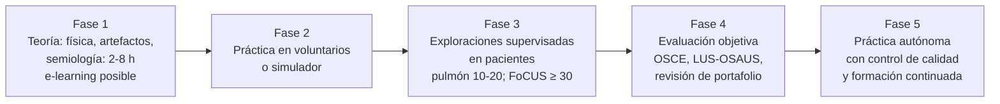

# 08 · Formación y competencia en ecografía pulmonar y FoCUS

¿Cuánto hay que entrenar para que las líneas B y la ecocardiografía focalizada (FoCUS) sean fiables en manos de un residente? Esta página revisa las **curvas de aprendizaje** (número de exploraciones hasta la competencia), los estudios con **novatos**, las recomendaciones de las **sociedades científicas** (ACEP, ESICM, EFSUMB, WINFOCUS, EACVI, consenso internacional de ecografía pulmonar, SEMI, SEMES, SEDAR), el **acuerdo interobservador**, los **formatos docentes** (e-learning, simulación, supervisión, teleecografía, portafolio) y los programas de residencia. Termina con una propuesta de **competencias mínimas** para la audiencia de la sesión: residentes y médicos no expertos en ecografía.

!!! info "Punto de partida"
    La ecografía pulmonar se considera una técnica **de aprendizaje rápido**. El consenso de la EACVI la describe como «fácil de aprender, con una curva de aprendizaje corta que puede limitarse a unas 20 exploraciones» ([Gargani, 2023](../../05-fuentes/index.md#gargani2023)), y el consenso internacional de 2023 califica la curva de aprendizaje de «empinada» (rápida) ([Demi, 2023](../../05-fuentes/index.md#demi2023)). Pero «aprender a ver líneas B» no es lo mismo que «saber integrarlas en el diagnóstico diferencial de la disnea»: la primera habilidad se adquiere en horas; la segunda, en meses de práctica supervisada.

## 1. Curvas de aprendizaje: ¿cuántas exploraciones?

### 1.1 Ecografía pulmonar (líneas B y patrones básicos)

| Estudio | Aprendices | Formación inicial | Número hasta la competencia | Criterio de competencia |
|---|---|---|---|---|
| [Russell, 2020](../../05-fuentes/index.md#russell2020) | 29 novatos (médicos y no médicos), 3 centros | 2 h (clase, vídeos, práctica) | **≈ 11 zonas pulmonares** (media 10,8; DE 14,0) | CCI > 0,7 con experto para contar líneas B (8 zonas); CUSUM |
| [House, 2021](../../05-fuentes/index.md#house2021) | 19 médicos de urgencias novatos (Nepal) | 8 h (1 día) | **≈ 5 exploraciones** (4,4 por zona; 4,8 para la interpretación global) | Acuerdo con experto; CUSUM; el 95 % alcanzó la competencia |
| [See, 2016](../../05-fuentes/index.md#see2016) | 11 fisioterapeutas respiratorios sin experiencia (UCI) | Teoría + autoaprendizaje | **≥ 10 exploraciones supervisadas** | < 2 % de imágenes con ayuda y < 5 % mal interpretadas (12 zonas, 6 patrones) |
| [Chiem, 2015](../../05-fuentes/index.md#chiem2015) | 66 residentes de urgencias | 30 min | Mediana de 3 exploraciones por residente | S 85 % y E 84 % frente al experto para detectar líneas B |
| [Msolli, 2021](../../05-fuentes/index.md#msolli2021) | Residentes de urgencias | 2 h | No aplicable (estudio de precisión) | κ 0,81–0,85 entre residentes; AUC 0,86 para ICA |
| [Imanishi, 2024](../../05-fuentes/index.md#imanishi2024) | 30 residentes de primer año sin experiencia ecográfica | Clase breve + 15 vídeos con retroalimentación | No aplicable | Congestión residual: S 90 %, E 100 %; κ 0,86 con experto |
| [Dexheimer Neto, 2015](../../05-fuentes/index.md#dexheimerneto2015) | 4 médicos no expertos (UCI), protocolo BLUE | Formación del programa de la UCI | No aplicable | Acuerdo con el diagnóstico final 84 %; κ 0,81 |

!!! tip "Perla docente"
    Los estudios coinciden: tras una formación estructurada **breve (2–8 h)**, la mayoría de los novatos **identifica y cuenta líneas B** con fiabilidad aceptable tras **5–20 exploraciones supervisadas** ([Russell, 2020](../../05-fuentes/index.md#russell2020); [House, 2021](../../05-fuentes/index.md#house2021); [See, 2016](../../05-fuentes/index.md#see2016); [Gargani, 2023](../../05-fuentes/index.md#gargani2023)). En Russell 2020, el número necesario no difirió entre médicos y no médicos ni según la experiencia ecográfica previa.

!!! warning "Error frecuente: confundir «ver líneas B» con «diagnosticar ICA»"
    En [Chiem, 2015](../../05-fuentes/index.md#chiem2015), los residentes detectaban líneas B igual que los expertos, pero **ni unos ni otros** diagnosticaron muy bien la ICA con la ecografía pulmonar sola (AUC 0,77 y 0,76). La habilidad técnica se adquiere rápido; el juicio clínico (distribución, pleura, corazón, contexto) es lo que marca la diferencia.

??? info "Detalle: la puntuación de ecografía pulmonar (LUS score) en críticos"
    La medida del LUS score (puntuación de aireación 0–3 por zona) se considera una habilidad más avanzada; la ESICM desaconseja incluirla en el nivel básico ([Robba, 2021](../../05-fuentes/index.md#robba2021)). Existe una carta de investigación sobre el entrenamiento necesario para medir el LUS score en críticos ([Rouby, 2018](../../05-fuentes/index.md#rouby2018)), cuyo número exacto de exploraciones no se ha podido comprobar en el texto completo: **[POR VERIFICAR]**.

### 1.2 Ecocardiografía focalizada (FoCUS)

| Estudio / fuente | Aprendices | Formación | Resultado |
|---|---|---|---|
| Tabla de estudios de formación en ecocardiografía básica en UCI ([Robba, 2021](../../05-fuentes/index.md#robba2021)) | Residentes y *fellows* de UCI | Variable (2–40 h teóricas) | Las cifras de exploraciones hasta la competencia van de ≈ 15 a ≈ 40 en los estudios recopilados; la proporción de hallazgos aceptables pasó del 70 % antes de 10 exploraciones al 92 % tras 30. La mesa redonda internacional de 2011 de sociedades de cuidados críticos, recogida en esa tabla, pedía ≥ 10 h de formación teórica y **≥ 30 ecocardiografías transtorácicas totalmente supervisadas** |
| [Hellmann, 2005](../../05-fuentes/index.md#hellmann2005) | 30 residentes de medicina interna (ecocardiografía portátil) | 15–30 min + tutoría individual | La destreza técnica mejoró 0,79 puntos (escala 0–3) y la exactitud de interpretación 1,01 puntos **cada 10 exploraciones** (231 estudios) |
| [Ruddox, 2017](../../05-fuentes/index.md#ruddox2017) | Residentes de guardia de medicina interna no seleccionados | 4 h + 1 h a los 6 meses | S 92 % para FEVI reducida, 85 % para dilatación del VI y 100 % para derrame pericárdico; κ > 0,6 en varios parámetros. Utilidad clínica en un tercio de las exploraciones; **los falsos positivos fueron el principal problema** |
| [Ojeda, 2015](../../05-fuentes/index.md#ojeda2015) | 40 residentes de medicina interna, ECA | 3 h + 1 mes de práctica independiente | Con ecógrafo de bolsillo la exactitud global no mejoró de forma significativa (44,9 % vs 37,6 %); sí mejoró en los hallazgos cardiacos (47,0 % vs 34,6 %) |
| [Albaroudi, 2022](../../05-fuentes/index.md#albaroudi2022), MA | 159 ecografistas clínicos de urgencias | Variable | FEVI visual normal/anormal frente al experto: κ 0,68, S 89 %, E 85 % |

!!! note "Mensaje para la FoCUS"
    La FoCUS necesita **más exploraciones** que la ecografía pulmonar para ser fiable, y la formación muy breve sin supervisión posterior no basta ([Ojeda, 2015](../../05-fuentes/index.md#ojeda2015); [Ruddox, 2017](../../05-fuentes/index.md#ruddox2017)). La estimación visual de la FEVI (normal / reducida / muy reducida) y el derrame pericárdico son objetivos alcanzables; el E/e' o la cuantificación del VD son ecocardiografía avanzada.

## 2. Recomendaciones de las sociedades científicas

### 2.1 Tabla comparativa

| Sociedad / documento | Año | Ámbito | Qué recomienda sobre formación | Número de exploraciones |
|---|:--:|---|---|---|
| **ACEP**, guías de ecografía en urgencias ([ACEP, 2016](../../05-fuentes/index.md#acep2016); revisión vigente: [ACEP, 2023](../../05-fuentes/index.md#acep2023)) | 2016 / 2023 | Medicina de urgencias (EE. UU.) | 12 aplicaciones nucleares, entre ellas «vía aérea/torácica» y «cardiaca/valoración hemodinámica». Umbrales numéricos **más** evaluación individualizada: supervisión en tiempo real, revisión de calidad semanal, OSCE, observación directa estandarizada, simulación. Durante el umbral, todas las exploraciones se revisan; cabe un portafolio si no hay docentes. En residencia, ≥ 80 h de rotación dedicada | **25–50 exploraciones revisadas por aplicación**; **150–300 en total**; 5 procedimientos ecoguiados (texto de 2016). Que la versión de 2023 mantiene estas cifras: **[POR VERIFICAR]** en el texto completo de 2023 |
| **ESICM**, habilidades básicas de ecografía para intensivistas ([Robba, 2021](../../05-fuentes/index.md#robba2021)) | 2021 | UCI | Define qué es competencia **básica** (patrón B, consolidación, derrame, neumotórax; enfoque integrado pulmón-corazón-venas si se sospecha TEP). El LUS score no es básico | Recoge recomendaciones previas: pulmón/pleura, 15–20 exploraciones (recomendaciones canadienses de 2014); ecocardiografía básica, ≥ 30 supervisadas |
| **ESICM**, competencias nucleares en la formación de intensivistas ([Wong, 2020](../../05-fuentes/index.md#wong2020)) | 2020 | Especialistas en formación en UCI | Lista obligatoria con ≥ 90 % de acuerdo: 15 competencias ecocardiográficas, 5 torácicas, 4 abdominales, TVP y acceso venoso central | No fija números en el resumen |
| **Consenso internacional de ecografía pulmonar** ([Demi, 2023](../../05-fuentes/index.md#demi2023)) | 2023 | Todas las especialidades | Enunciado 18: se recomienda **firmemente** adquirir formación adecuada antes de usar la LUS para el diagnóstico (cursos teóricos y prácticos, práctica supervisada por expertos, revisión de casos; mínimos según EFSUMB). Enunciado 19: enseñar las bases en el grado. Enunciado 20: la tutoría remota es una opción. Formación continuada; falta un sistema internacional de certificación | No fija un número; cita la curva de aprendizaje «empinada» y 10 exploraciones supervisadas en fisioterapeutas respiratorios |
| **Consenso internacional de LUS, 2012** ([Volpicelli, 2012](../../05-fuentes/index.md#volpicelli2012)) y **actualización 2025** ([Volpicelli, 2026](../../05-fuentes/index.md#volpicelli2026)) | 2012 / 2026 | Urgencias y críticos | La actualización de 2025 (83 enunciados por Delphi) se centra en la LUS como herramienta aislada | Enunciados sobre formación de la actualización: **[POR VERIFICAR]** |
| **WINFOCUS**, recomendaciones internacionales de FoCUS ([Via, 2014](../../05-fuentes/index.md#via2014)) | 2014 | Multiespecialidad, adultos y niños | 108 enunciados (GRADE + RAND) que incluyen principios de educación y certificación | Cifras concretas: **[POR VERIFICAR]** (texto completo no revisado) |
| **EACVI**, FoCUS ([Neskovic, 2014](../../05-fuentes/index.md#neskovic2014); currículo nuclear: [Neskovic, 2018](../../05-fuentes/index.md#neskovic2018)) | 2014 / 2018 | Cualquier profesional que atienda urgencias cardiovasculares | Anima a usar la FoCUS a todo profesional **suficientemente formado**; subraya la diferencia entre FoCUS y ecocardiografía. El currículo de 2018 (con ESA, EACTA, ACVC y WINFOCUS) define contenidos y marco formativo | No figuran en los resúmenes; **[POR VERIFICAR]** en el texto completo |
| **EACVI**, ecografía pulmonar en la IC ([Gargani, 2023](../../05-fuentes/index.md#gargani2023)) | 2023 | Cardiología | Técnica fácil de aprender; buen acuerdo intra e interobservador con los distintos métodos de recuento | Curva de aprendizaje de **≈ 20 exploraciones** |
| **EFSUMB**, guías de POCUS parte 1 (corazón y pulmón) ([Jarman, 2023](../../05-fuentes/index.md#jarman2023)) | 2023 | Ámbitos agudos | Recomendaciones clínicas con niveles de evidencia y GRADE para 10 preguntas | No es un documento de formación |
| **EFSUMB**, POCUS en atención primaria ([Andersen, 2026](../../05-fuentes/index.md#andersen2026)) | 2026 | Atención primaria | Currículo nuclear por Delphi correspondiente al **nivel 1 de competencia** EFSUMB | Detalle numérico: **[POR VERIFICAR]** |
| **SEMI (GTECO)**, consenso de formación y desarrollo de la ecografía clínica ([Tung-Chen, 2024](../../05-fuentes/index.md#tungchen2024)) | 2024 | Medicina interna (España) | 99 recomendaciones por Delphi en 10 áreas. Adquisición progresiva de la competencia; rotación inicial de un mes con formación teórica y práctica estructurada y evaluación de competencias, seguida de formación continuada. Proporción alumnos/instructor ≤ 5:1 en prácticas. Sistema de acreditación de unidades (asistencial, docente, avanzada) | **≈ 150 exploraciones supervisadas** por rotante durante la rotación (dato del resumen ejecutivo; conviene confirmarlo en el documento completo) |
| **SEMI**, posicionamiento sobre ecografía clínica en medicina interna ([Torres Macho, 2018](../../05-fuentes/index.md#torresmacho2018)) | 2018 | Medicina interna | Indicaciones fundamentales y periodo de formación recomendado; fomentar la formación estructurada | — |
| **SEMI**, POCUS en IC ([Tung-Chen, 2025](../../05-fuentes/index.md#tungchen2025)) | 2025 | Medicina interna | Recomendaciones de uso del POCUS en la IC (detalle en la página de guías) | — |
| **SEDAR / SEMI / SEMES**, diploma de ecografía en críticos y urgencias ([Vives, 2021](../../05-fuentes/index.md#vives2021)) | 2021 | Críticos, anestesia y urgencias (España) | Programa de formación y competencias mínimas para el diploma en ecografía **pulmonar**, abdominal y vascular. Sirve de guía para la formación de los MIR | Detalle numérico: **[POR VERIFICAR]** |
| **SHM** (medicina hospitalaria), posicionamiento sobre POCUS ([Soni, 2019b](../../05-fuentes/index.md#soni2019b)) | 2019 | Hospitalistas (EE. UU.) | Aplicaciones, formación, evaluación y gestión del programa; la acreditación debe acordarse con los comités locales | No fija un número único |
| **CIMUS**, currículo de POCUS para medicina interna ([Ma, 2017](../../05-fuentes/index.md#ma2017)) | 2017 | Residencia de medicina interna (Canadá) | Núcleo (R1–R3): **VCI, líneas B, derrame pleural, líquido libre abdominal** + toracocentesis, paracentesis y vía central. Ampliado (R4–R5): consolidación, neumotórax, FEVI global, derrame pericárdico, sobrecarga del VD, etc. | — |
| **Consenso EE. UU. de POCUS en la residencia de medicina interna** ([LoPresti, 2025](../../05-fuentes/index.md#lopresti2025); [Chockalingam, 2025](../../05-fuentes/index.md#chockalingam2025)) | 2025 | Residencia de medicina interna (EE. UU.) | 12 indicaciones diagnósticas nucleares (entre ellas **disnea** y shock), 15 aplicaciones y 52 componentes. Chockalingam: 53 habilidades (25 % pulmonares, 17 % cardiacas), 14 métodos docentes y 5 estrategias de evaluación con consenso | — |

!!! note "Evidencia frente a opinión de experto"
    Todas las cifras de «número mínimo de exploraciones» de las sociedades son **opinión de expertos por consenso** (Delphi, RAND), no umbrales derivados de estudios de competencia. La propia ACEP reconoce que la curva de aprendizaje puede estabilizarse por debajo o por encima del umbral recomendado y que los aprendices aprenden a ritmos distintos ([ACEP, 2016](../../05-fuentes/index.md#acep2016)). La tendencia actual es combinar un **número orientativo** con una **evaluación objetiva de la competencia** ([Skaarup, 2017](../../05-fuentes/index.md#skaarup2017); [Pietersen, 2019](../../05-fuentes/index.md#pietersen2019)).

### 2.2 Qué dice la evidencia sobre las recomendaciones

La revisión sistemática de Pietersen sobre formación en ecografía pulmonar (16 estudios) concluyó que todos los métodos aumentaban el conocimiento teórico y práctico, pero que los estudios eran muy heterogéneos, **ninguno usaba evaluaciones validadas** y el riesgo de sesgo era alto en el 69 %. Con esa evidencia **no fue posible construir recomendaciones claras** de formación y certificación ([Pietersen, 2018](../../05-fuentes/index.md#pietersen2018)).

## 3. Acuerdo interobservador

| Estudio | Contexto | Resultado |
|---|---|---|
| [Anderson, 2013](../../05-fuentes/index.md#anderson2013) | 456 vídeos de urgencias, 3 métodos de recuento de líneas B | CCI 0,84–0,89. El método más fiable fue contar en el **momento de máximo número de líneas B**, considerando las confluentes según el porcentaje del espacio intercostal ocupado |
| [Gullett, 2015](../../05-fuentes/index.md#gullett2015) | 91 pacientes, 10 zonas, parejas experto/experto y experto/novato (novatos con 5 exploraciones supervisadas) | El mejor acuerdo, en las zonas **anterosuperiores** (CCI 0,73–0,88), tanto experto/experto como experto/novato; peor en las zonas **laterales inferiores** y posterior izquierda |
| [Russell, 2020](../../05-fuentes/index.md#russell2020) | Novatos frente a expertos, 8 zonas | CCI novato-experto 0,74; experto-experto 0,80 |
| [Msolli, 2021](../../05-fuentes/index.md#msolli2021) | Dos residentes independientes por paciente, 700 pacientes | κ 0,81 (puntuación B) y 0,85 (perfil B) |
| [Imanishi, 2024](../../05-fuentes/index.md#imanishi2024) | Residentes novatos frente a experto, congestión residual | κ 0,86; correlación de Spearman 0,916 |
| [Xue, 2021](../../05-fuentes/index.md#xue2021) | M-BLUE en COVID-19, 5 lectores | CCI global 0,618; por signo 0,33–0,60 |
| [Albaroudi, 2022](../../05-fuentes/index.md#albaroudi2022) | FEVI visual, urgenciólogo vs experto | κ 0,68 (binaria); κ ponderada 0,70 (3 categorías) |

!!! tip "Perla docente"
    Para enseñar a contar líneas B, empieza por las **zonas anteriores y superiores**, donde el acuerdo es mayor, y usa un método de recuento sencillo y reproducible ([Gullett, 2015](../../05-fuentes/index.md#gullett2015); [Anderson, 2013](../../05-fuentes/index.md#anderson2013)). Las zonas laterales inferiores (donde se mezclan derrame, consolidación y diafragma) son las más difíciles.

!!! warning "Fuentes de variabilidad que el residente debe conocer"
    Profundidad, ganancia, armónicos, tipo de sonda, tiempo de grabación y posición del paciente cambian el número de líneas B. Por eso los estudios de competencia estandarizan los parámetros (p. ej., 18 cm de profundidad, clips de 6 s, sin armónicos) ([Russell, 2020](../../05-fuentes/index.md#russell2020)). Los detalles técnicos se tratan en [técnica](02-tecnica.md).

## 4. Formatos de formación

### 4.1 Qué funciona

| Formato | Evidencia | Resultado |
|---|---|---|
| **Clase breve + práctica supervisada** | Estudios de novatos | 30 min a 8 h de teoría y práctica bastan para reconocer líneas B ([Chiem, 2015](../../05-fuentes/index.md#chiem2015); [Russell, 2020](../../05-fuentes/index.md#russell2020); [House, 2021](../../05-fuentes/index.md#house2021)) |
| **Formación en línea (e-learning)** | ECA de no inferioridad en novatos pediátricos | Tan eficaz como la clase presencial en conocimientos y en OSCE, también a los 2 meses ([Soon, 2020](../../05-fuentes/index.md#soon2020)). El consenso de 2023 considera el e-learning y el aprendizaje combinado factibles y eficaces ([Demi, 2023](../../05-fuentes/index.md#demi2023)) |
| **Simulación** | ECA, 66 médicos sin experiencia en ecografía torácica | La simulación no superó la práctica con voluntarios sanos (45,1 vs 41,9 puntos; p = 0,38), pero ambas superaron a no hacer práctica (36,7) ([Pietersen, 2021](../../05-fuentes/index.md#pietersen2021)) |
| **Realidad virtual inmersiva** | ECA, 48 novatos | Tras el módulo de RV, las puntuaciones fueron similares a las de usuarios intermedios; la gamificación no añadió nada ([Larsen, 2023](../../05-fuentes/index.md#larsen2023)) |
| **Teleecografía (formación práctica a distancia)** | Estudio observacional de cursos | Puntuaciones posteriores al curso similares a las de un curso presencial (89 % vs 87 %); los docentes perciben peor la interacción y la corrección de la adquisición ([Soni, 2021](../../05-fuentes/index.md#soni2021)). El consenso de 2023 recoge la tutoría remota como opción ([Demi, 2023](../../05-fuentes/index.md#demi2023)) |
| **Revisión de imágenes con retroalimentación** | Residentes novatos | Vídeos con corrección inmediata de discrepancias permitieron cuantificar líneas B de forma fiable ([Imanishi, 2024](../../05-fuentes/index.md#imanishi2024)) |
| **Portafolio y control de calidad** | Recomendación de sociedad | ACEP: todas las exploraciones del periodo de formación se revisan; portafolio de imágenes contrastado con otras pruebas si no hay docentes ([ACEP, 2016](../../05-fuentes/index.md#acep2016)) |
| **Inteligencia artificial como guía de adquisición** | Estudio multicéntrico de validación | Profesionales no médicos con guía por IA obtuvieron un 98,3 % de estudios de calidad diagnóstica, sin diferencias frente a expertos sin IA ([Baloescu, 2025](../../05-fuentes/index.md#baloescu2025)) |

### 4.2 Cómo evaluar la competencia

- **Herramienta LUS-OSAUS** (evaluación estructurada y objetiva de la ecografía pulmonar): consenso Delphi multiespecialidad; distingue niveles de competencia (p < 0,001) con buen acuerdo entre evaluadores (r = 0,85) ([Skaarup, 2017](../../05-fuentes/index.md#skaarup2017)).
- **Prueba de competencias en simulador**: 9 casos, con punto de corte de aprobado (16 puntos) y buena discriminación entre novatos y entrenados ([Pietersen, 2019](../../05-fuentes/index.md#pietersen2019)).
- **Métodos individualizados de la ACEP**: supervisión en tiempo real, sesiones semanales de revisión de imágenes, evaluaciones de conocimientos estandarizadas, OSCE, herramientas de observación directa (SDOT) y simulación, idealmente al principio y al final de la formación ([ACEP, 2016](../../05-fuentes/index.md#acep2016)).
- **Indicadores de calidad del programa** (no del alumno): 22 indicadores educativos de consenso para programas de POCUS en medicina interna ([Ambasta, 2019](../../05-fuentes/index.md#ambasta2019)).

### 4.3 Profesionales no médicos

En una revisión sistemática, enfermeras y estudiantes identificaron líneas B y derrame con S del 79–98 % y E del 70–99 % tras 0–12 h de formación teórica y 58–62 exploraciones de práctica; solo un estudio evaluó a técnicos de emergencias, y no apoyó su capacidad tras 2 h de formación ([Swamy, 2019](../../05-fuentes/index.md#swamy2019)). En cambio, fisioterapeutas respiratorios alcanzaron la práctica independiente tras 10 exploraciones supervisadas ([See, 2016](../../05-fuentes/index.md#see2016)), y novatos no médicos cuantificaron líneas B igual que los médicos ([Russell, 2020](../../05-fuentes/index.md#russell2020)).

## 5. Programas de residencia

*Esquema de elaboración propia que integra [ACEP, 2016](../../05-fuentes/index.md#acep2016), [Demi, 2023](../../05-fuentes/index.md#demi2023), [Tung-Chen, 2024](../../05-fuentes/index.md#tungchen2024) y los estudios de curvas de aprendizaje citados. Los números son orientativos, no umbrales validados.*

- **Medicina interna en España:** el consenso GTECO-SEMI propone una rotación estructurada de un mes, evaluación de competencias y formación continuada, con acreditación de unidades ([Tung-Chen, 2024](../../05-fuentes/index.md#tungchen2024)). Los residentes de urgencias, anestesia y medicina intensiva cuentan con el diploma SEDAR-SEMI-SEMES en ecografía pulmonar, abdominal y vascular ([Vives, 2021](../../05-fuentes/index.md#vives2021)).
- **Medicina interna en Canadá:** las líneas B, el derrame pleural y la VCI forman parte del núcleo de R1–R3; la FEVI global y el derrame pericárdico, del currículo ampliado ([Ma, 2017](../../05-fuentes/index.md#ma2017)).
- **Medicina interna en EE. UU.:** la disnea es una indicación nuclear del currículo de consenso ([LoPresti, 2025](../../05-fuentes/index.md#lopresti2025)); el 25 % de las habilidades con consenso son pulmonares ([Chockalingam, 2025](../../05-fuentes/index.md#chockalingam2025)).
- **Urgencias en EE. UU.:** dos semanas de rotación en el primer año y al menos una semana en cada año siguiente; ≥ 80 h de rotación dedicada ([ACEP, 2016](../../05-fuentes/index.md#acep2016)).

## 6. Competencias mínimas recomendadas para la audiencia (residentes)

Propuesta de **elaboración propia** para la sesión, basada en las competencias básicas de la ESICM ([Robba, 2021](../../05-fuentes/index.md#robba2021)), el currículo CIMUS ([Ma, 2017](../../05-fuentes/index.md#ma2017)), el consenso de la EACVI ([Gargani, 2023](../../05-fuentes/index.md#gargani2023)) y los datos de precisión de la [página 03](03-precision.md). No es una recomendación oficial de ninguna sociedad.

| Nivel | Competencia | Objetivo clínico | Formación orientativa |
|---|---|---|---|
| **Básico (todo residente)** | Deslizamiento pleural, líneas A, líneas B (≥ 3 por zona), protocolo de 8 zonas | Reconocer el patrón B bilateral y difuso frente al perfil A | Teoría breve + ≈ 10–20 exploraciones supervisadas ([Russell, 2020](../../05-fuentes/index.md#russell2020); [See, 2016](../../05-fuentes/index.md#see2016); [Gargani, 2023](../../05-fuentes/index.md#gargani2023)) |
| Básico | Derrame pleural y consolidación | Diagnósticos alternativos y concomitantes | Mismo periodo |
| Básico | Neumotórax (ausencia de deslizamiento, punto pulmón) | Descartar neumotórax | Mismo periodo |
| Básico | Integrar el hallazgo con la probabilidad pretest | Usar el resultado como un LR, no como un diagnóstico | Sesiones de casos |
| **Intermedio** | FoCUS: FEVI visual (normal / reducida / muy reducida), derrame pericárdico, dilatación grosera del VD, VCI | Explicar las líneas B; orientar TEP o taponamiento | ≥ 30 exploraciones supervisadas (orientativo, [Robba, 2021](../../05-fuentes/index.md#robba2021)) |
| Intermedio | Compresión venosa en 2 puntos | TVP en la sospecha de TEP | Según las sociedades, ≈ 25 exploraciones ([Robba, 2021](../../05-fuentes/index.md#robba2021), recomendación canadiense) |
| Intermedio | Recuento de líneas B para seguimiento y alta | Congestión residual | Clase breve + vídeos con retroalimentación ([Imanishi, 2024](../../05-fuentes/index.md#imanishi2024)) |
| **Avanzado** | E/e', Doppler venoso (VExUS), LUS score | Presiones de llenado, congestión sistémica | Ecocardiografía avanzada; fuera del nivel básico según la ESICM ([Robba, 2021](../../05-fuentes/index.md#robba2021)) |

!!! warning "Límites de la competencia"
    La FoCUS **no sustituye** a la ecocardiografía reglada; la EACVI insiste en esta diferencia y en la necesidad de formación específica ([Neskovic, 2014](../../05-fuentes/index.md#neskovic2014)). Un residente con formación básica debe saber **qué preguntas puede responder** (¿hay patrón B bilateral?, ¿la FEVI está muy deprimida?, ¿hay derrame pericárdico?) y cuándo pedir una ecocardiografía o una TC. Los falsos positivos son el principal riesgo en manos inexpertas ([Ruddox, 2017](../../05-fuentes/index.md#ruddox2017)).

## Puntos clave

- Reconocer y contar **líneas B** se aprende rápido: tras 2–8 h de formación, los novatos alcanzan la competencia en **≈ 5–20 exploraciones supervisadas** ([Russell, 2020](../../05-fuentes/index.md#russell2020); [House, 2021](../../05-fuentes/index.md#house2021); [Gargani, 2023](../../05-fuentes/index.md#gargani2023)).
- La **FoCUS** exige más: ≥ 30 exploraciones supervisadas según las recomendaciones de cuidados críticos recogidas por la ESICM ([Robba, 2021](../../05-fuentes/index.md#robba2021)), y la formación muy breve sin supervisión no mejora el diagnóstico ([Ojeda, 2015](../../05-fuentes/index.md#ojeda2015)).
- Los umbrales numéricos de las sociedades (ACEP: 25–50 por aplicación y 150–300 en total) son **opinión de expertos**; la evidencia sobre formación es heterogénea y de baja calidad ([ACEP, 2016](../../05-fuentes/index.md#acep2016); [Pietersen, 2018](../../05-fuentes/index.md#pietersen2018)).
- El **acuerdo interobservador** para las líneas B es bueno (CCI 0,74–0,89; κ 0,81–0,86), mejor en las zonas anterosuperiores ([Anderson, 2013](../../05-fuentes/index.md#anderson2013); [Gullett, 2015](../../05-fuentes/index.md#gullett2015); [Msolli, 2021](../../05-fuentes/index.md#msolli2021)).
- El **e-learning** es tan eficaz como la clase presencial, y la **simulación** no supera a la práctica en voluntarios, aunque ambas mejoran frente a no practicar ([Soon, 2020](../../05-fuentes/index.md#soon2020); [Pietersen, 2021](../../05-fuentes/index.md#pietersen2021)).
- En España, la SEMI propone una rotación estructurada de un mes, evaluación de competencias y acreditación de unidades, con ≈ 150 exploraciones supervisadas por rotante ([Tung-Chen, 2024](../../05-fuentes/index.md#tungchen2024)); SEDAR, SEMI y SEMES tienen un diploma conjunto en ecografía pulmonar ([Vives, 2021](../../05-fuentes/index.md#vives2021)).
- Ver líneas B **no es lo mismo** que diagnosticar la ICA: la integración clínica es la competencia que más tarda en adquirirse ([Chiem, 2015](../../05-fuentes/index.md#chiem2015)).

## Lagunas y preguntas abiertas

- **No hay umbrales validados** de competencia: las cifras de exploraciones son de consenso y los estudios usan criterios distintos (CCI, κ, CUSUM, OSCE) ([Pietersen, 2018](../../05-fuentes/index.md#pietersen2018)).
- **Retención de la habilidad** y mantenimiento de la competencia a largo plazo: muy pocos datos más allá de los 2 meses ([Soon, 2020](../../05-fuentes/index.md#soon2020)).
- **Competencia en la integración clínica** (no solo en el reconocimiento de artefactos): falta una herramienta validada que la mida.
- **Certificación internacional** de la ecografía pulmonar: pendiente, según el consenso de 2023 ([Demi, 2023](../../05-fuentes/index.md#demi2023)).
- Cifras concretas de formación en los documentos de WINFOCUS, EACVI (FoCUS), EFSUMB, SEDAR-SEMI-SEMES y en la actualización 2025 del consenso internacional: **[POR VERIFICAR]** en los textos completos.
- Papel de la **inteligencia artificial** en la formación: puede guiar la adquisición ([Baloescu, 2025](../../05-fuentes/index.md#baloescu2025)), pero se desconoce si acelera o sustituye el aprendizaje.
