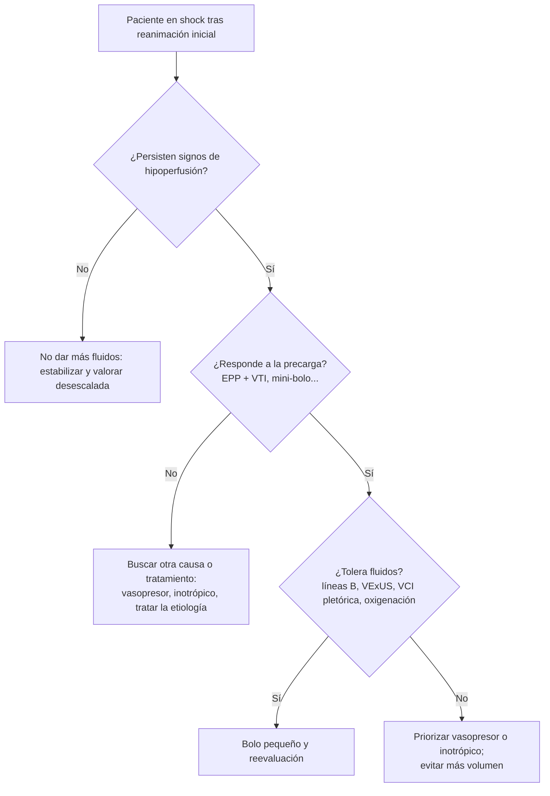

# 01 · Contexto y fundamento fisiológico

El shock es una urgencia tiempo-dependiente en la que el clínico tiene que contestar, casi a la vez, cuatro preguntas: **¿qué tipo de shock es?**, **¿mejorará el gasto cardiaco si doy fluidos?**, **¿los tolerará el paciente?** y **¿cuándo debo parar o retirar volumen?** La exploración física y los parámetros estáticos (como la presión venosa central) responden mal a estas preguntas. La ecografía a pie de cama permite contestarlas de forma no invasiva y repetible. Esta página resume la definición y la epidemiología del shock, explica por qué falla la valoración clínica y repasa la fisiología que da sentido a cada medida ecográfica: Frank-Starling, retorno venoso, respuesta frente a tolerancia a fluidos, fases de la reanimación, daño por sobrecarga y congestión venosa. La técnica se detalla en [02 · Técnica y protocolos](02-tecnica.md) y las trampas en [07 · Limitaciones y errores](07-limitaciones.md).

## 1. Qué es el shock

### 1.1 Definición

El consenso de la ESICM de 2014 define el shock circulatorio como **una forma generalizada de insuficiencia circulatoria aguda, potencialmente mortal, asociada a una utilización inadecuada del oxígeno por las células** ([Cecconi, 2014](../../05-fuentes/index.md#cecconi2014)). Recoge además varias ideas con implicaciones prácticas:

- La hipotensión **no es imprescindible** para definir shock (recomendación de nivel 1, calidad de la evidencia moderada) ([Cecconi, 2014](../../05-fuentes/index.md#cecconi2014)).
- Se reconocen **cuatro patrones hemodinámicos**: tres de bajo gasto (hipovolémico, cardiogénico y obstructivo) y uno hipercinético (distributivo) ([Cecconi, 2014](../../05-fuentes/index.md#cecconi2014)).
- El shock **puede deberse a la combinación de varios mecanismos**, y un paciente ingresado por un tipo de shock puede desarrollar otro. Por ejemplo, un shock hemorrágico o cardiogénico puede complicarse con un shock séptico ([Cecconi, 2014](../../05-fuentes/index.md#cecconi2014)).
- Se recomienda medir el lactato ante la sospecha de shock (nivel 1, calidad baja) ([Cecconi, 2014](../../05-fuentes/index.md#cecconi2014)).

Sepsis-3 define el **shock séptico** como la sepsis con necesidad de vasopresores para mantener una PAM ≥ 65 mmHg y un lactato > 2 mmol/L, pese a la ausencia de hipovolemia. Esta combinación se asocia a una mortalidad hospitalaria **superior al 40 %** ([Singer, 2016](../../05-fuentes/index.md#singer2016)).

### 1.2 Los cuatro tipos de shock y su perfil hemodinámico

| Tipo | Mecanismo | Gasto cardiaco | Presiones y volúmenes | Causas típicas |
|---|---|---|---|---|
| **Distributivo** | Vasodilatación y mala distribución del flujo | Habitualmente **alto** | Precarga variable, resistencias bajas | Sepsis, anafilaxia, lesión medular |
| **Hipovolémico** | Pérdida de volumen intravascular | Bajo | Presiones y volúmenes **bajos** | Hemorragia, pérdidas digestivas o renales, quemaduras |
| **Cardiogénico** | Fallo de bomba | Bajo | Presiones y volúmenes **altos** | Infarto, miocardiopatía, valvulopatía aguda, arritmia |
| **Obstructivo** | Obstáculo al llenado o a la eyección | Bajo | Presión pulmonar alta y **cavidades derechas dilatadas**. En el taponamiento, presiones altas con cavidades **pequeñas** | TEP, taponamiento, neumotórax a tensión |

Fuente: [Cecconi, 2014](../../05-fuentes/index.md#cecconi2014). El consenso subraya que estos perfiles se solapan en los pacientes complejos o con comorbilidad.

!!! info "Por qué importa el perfil hemodinámico"
    Cada tipo de shock deja una «firma» distinta en la ecografía: VCI pequeña y colapsable con ventrículo izquierdo hiperdinámico, VCI pletórica con ventrículo hipocontráctil o VD dilatado, derrame con colapso diastólico… Los protocolos como el RUSH se construyen sobre esta lógica: **bomba, depósito y tuberías** ([Perera, 2010](../../05-fuentes/index.md#perera2010); [Seif, 2012](../../05-fuentes/index.md#seif2012)). Véase [02 · Técnica](02-tecnica.md#rush-bomba-deposito-y-tuberias).

## 2. Epidemiología

### 2.1 Frecuencia de cada tipo

Hasta **un tercio de los pacientes que ingresan en la UCI** está en shock circulatorio ([Cecconi, 2014](../../05-fuentes/index.md#cecconi2014)). La mejor referencia sobre la frecuencia relativa de cada tipo procede de los 1679 pacientes en shock del ensayo SOAP II, que comparó dopamina y noradrenalina ([De Backer, 2010](../../05-fuentes/index.md#debacker2010)):

| Tipo de shock (SOAP II, UCI) | Frecuencia |
|---|:--:|
| Séptico | **62 %** |
| Cardiogénico | 17 % |
| Hipovolémico | 16 % |
| Otros (resto de distributivos y obstructivos) | ≈ 5 % (por diferencia) |

Fuente: datos del SOAP II resumidos en [Cecconi, 2014](../../05-fuentes/index.md#cecconi2014). El reparto fino del 5 % restante no se ha podido verificar en el texto completo.

!!! note "Sesgo de población"
    Estos porcentajes proceden de pacientes de UCI incluidos en un ensayo de vasopresores. En urgencias el espectro es distinto: incluye más hipovolemia y shock en fases precoces. En el ensayo SHoC-ED, realizado con pacientes hipotensos de urgencias, la **sepsis oculta** fue el diagnóstico más frecuente en más de la mitad de los casos ([Atkinson, 2018](../../05-fuentes/index.md#atkinson2018)).

### 2.2 Mortalidad

| Contexto | Mortalidad | Fuente |
|---|---|---|
| Shock en UCI (SOAP II) | 48,5 % (noradrenalina) y 52,5 % (dopamina) a 28 días | [De Backer, 2010](../../05-fuentes/index.md#debacker2010) |
| Shock séptico (criterios Sepsis-3) | > 40 % hospitalaria | [Singer, 2016](../../05-fuentes/index.md#singer2016) |
| Shock séptico (series descritas) | 40–50 %, hasta 80 % | [Cecconi, 2014](../../05-fuentes/index.md#cecconi2014) |
| Shock cardiogénico en el síndrome coronario agudo (65 119 pacientes, 1999–2007) | Aparece en el 4,6 %, con una letalidad hospitalaria del 59,4 % | [Cecconi, 2014](../../05-fuentes/index.md#cecconi2014) |
| Shock en urgencias (Dinamarca, 2000–2011, n = 1646) | 23,1 % a 7 días y 40,7 % a 90 días | [Holler, 2016](../../05-fuentes/index.md#holler2016) |

En la cohorte poblacional danesa, el shock (PAS ≤ 100 mmHg y ≥ 1 fallo orgánico) afectó al **0,4 %** de los pacientes atendidos en urgencias. Su incidencia pasó de 53,8 a 80,6 casos por 100 000 personas-año en 12 años. La edad y el número de fallos orgánicos predijeron la mortalidad precoz: con ≥ 3 fallos, la HR ajustada fue de 3,13 ([Holler, 2016](../../05-fuentes/index.md#holler2016)).

### 2.3 El shock indiferenciado en urgencias

En urgencias el paciente llega **sin etiqueta**: hipotenso, taquicárdico y con signos de hipoperfusión, pero sin causa evidente. Un análisis prospectivo de 151 pacientes con hipotensión indiferenciada, que sirvió de base al consenso SHoC de la IFEM, describió la frecuencia de los hallazgos ecográficos anormales ([Milne, 2016](../../05-fuentes/index.md#milne2016)):

| Hallazgo ecográfico en hipotensión indiferenciada | Frecuencia |
|---|:--:|
| Cambios dinámicos del ventrículo izquierdo (hiper o hipocontractilidad) | 43 % |
| Alteraciones de la VCI | 27 % |
| Derrame pericárdico | 16 % |
| Derrame pleural | 8 % |
| Líquido libre abdominal | 5 % |
| Aneurisma de aorta abdominal | 2 % |

Estos datos explican por qué el consenso SHoC prioriza como **vistas nucleares** el corazón, el pulmón y la VCI, y deja el abdomen y la aorta como vistas adicionales según la clínica ([Atkinson, 2017](../../05-fuentes/index.md#atkinson2017)).

## 3. Por qué falla la exploración física

### 3.1 Estimar el gasto cardiaco a pie de cama

El estudio SICS-I incluyó 1075 pacientes de UCI. Realizó una exploración protocolizada de 19 signos clínicos y midió el índice cardiaco con ecografía ([Hiemstra, 2019](../../05-fuentes/index.md#hiemstra2019)):

- Siete signos se asociaron de forma independiente al índice cardiaco, pero en conjunto **solo explicaban el 30 % de su variabilidad** (R² = 0,30).
- El 36 % de los pacientes tenía un índice cardiaco bajo (< 2,2 L/min/m²). Para detectarlo, **ningún signo alcanzó una sensibilidad ni valores predictivos del 90 %**.
- Conclusión de los autores: la exploración clínica es insuficiente y se necesitan mediciones adicionales, como la ecografía crítica.

### 3.2 Predecir la respuesta a fluidos

La revisión sistemática de *JAMA Rational Clinical Examination* incluyó 50 estudios y 2260 pacientes inestables ([Bentzer, 2016](../../05-fuentes/index.md#bentzer2016)):

- Solo **el 50 %** (IC 95 % 42–56 %) respondía a fluidos.
- **Ningún hallazgo de la exploración física** fue predictivo: todos los cocientes de probabilidad tenían un IC que cruzaba el 1.
- Una PVC baja (< 8 mmHg) solo aumentaba algo la probabilidad (LR+ 2,6).
- La prueba más útil fue la **elevación pasiva de piernas (EPP) con medida del gasto cardiaco** (LR+ 11; LR− 0,13).

### 3.3 Identificar la causa

- En un ECA de 184 pacientes hipotensos en urgencias, la **ecografía inmediata** redujo la mediana de diagnósticos considerados a los 15 minutos de 9 a 4. Además, el diagnóstico final correcto figuraba como el más probable en el **80 %** de los casos, frente al **50 %** del grupo de ecografía diferida (diferencia del 30 %; IC 95 % 16–42 %) ([Jones, 2004](../../05-fuentes/index.md#jones2004)). Es un estudio clásico, monocéntrico y con variables de resultado intermedias.
- En el taponamiento, la **tríada de Beck** clásica (que incluye la hipotensión) **es poco frecuente**; el síntoma más referido es la disnea ([Alerhand, 2022](../../05-fuentes/index.md#alerhand2022)).

### 3.4 La práctica real de los bolos de fluidos

El estudio FENICE, una cohorte de 2213 pacientes en UCI de todo el mundo, describió cómo se administran los bolos de fluidos ([Cecconi, 2015](../../05-fuentes/index.md#cecconi2015)):

- Mediana del bolo: **500 mL** en 24 minutos. El motivo principal fue la hipotensión (59 %).
- En el **43 %** de los bolos no se usó ninguna variable hemodinámica para decidir. En el 36 % se usaron marcadores estáticos y solo en el **22 %**, índices dinámicos.
- En el **72 %** no se usó ninguna variable de seguridad.
- La proporción de pacientes que recibió más fluidos fue la misma con respuesta positiva, dudosa o negativa al bolo previo.

!!! warning "Error frecuente"
    Dar fluidos «porque está hipotenso», sin comprobar si responde ni si tolera el volumen. La mitad de los pacientes no aumentará el gasto cardiaco ([Bentzer, 2016](../../05-fuentes/index.md#bentzer2016)), y en la práctica real la falta de respuesta a un bolo no suele cambiar la decisión siguiente ([Cecconi, 2015](../../05-fuentes/index.md#cecconi2015)).

### 3.5 Qué dicen las guías

- **ESICM 2014:** si la exploración clínica no permite llegar a un diagnóstico, se recomienda una valoración hemodinámica adicional para determinar el tipo de shock (buena práctica). Se sugiere la **ecocardiografía como modalidad preferente** frente a técnicas más invasivas (nivel 2, calidad moderada) ([Cecconi, 2014](../../05-fuentes/index.md#cecconi2014)).
- **ESICM 2025:** se sugiere la **ecocardiografía como primera prueba de imagen** para valorar el tipo de shock (recomendación graduada). También se indica evaluar la respuesta a fluidos antes de seguir administrándolos en el shock persistente tras la reanimación inicial (buena práctica no graduada) ([Monnet, 2025](../../05-fuentes/index.md#monnet2025)). La certeza exacta de cada recomendación queda `[POR VERIFICAR]` porque el texto completo es de pago.
- **SCCM 2024 (publicada en 2025):** se sugiere usar la ecografía crítica para guiar el manejo del shock séptico y del cardiogénico. También se sugiere para el manejo del volumen, por la mejora de la mortalidad observada (recomendaciones condicionales) ([Díaz-Gómez, 2025](../../05-fuentes/index.md#diazgomez2025)).

El análisis detallado de guías está en la página de [guías](05-guias.md).

## 4. Fisiología aplicada

### 4.1 La curva de Frank-Starling y la respuesta a fluidos

El volumen sistólico aumenta con la precarga mientras el ventrículo trabaja en la **parte ascendente** de la curva de Frank-Starling. En la **meseta**, un aumento de precarga eleva las presiones de llenado sin mejorar el gasto ([Berlin, 2015](../../05-fuentes/index.md#berlin2015)). La pendiente de la curva depende de la contractilidad: un estado hiperdinámico la hace más pronunciada, y la disfunción miocárdica séptica la aplana ([Persichini, 2022](../../05-fuentes/index.md#persichini2022)).

- **Respuesta a fluidos:** aumento del volumen sistólico o del gasto cardiaco tras un bolo. Los estudios suelen definirla como un incremento **≥ 10–15 %** (≥ 15 % en [Muller, 2011](../../05-fuentes/index.md#muller2011); ≥ 10 % en [Airapetian, 2015](../../05-fuentes/index.md#airapetian2015) y [Preau, 2017](../../05-fuentes/index.md#preau2017)).
- **Solo la mitad de los pacientes responde:** 50 % en [Bentzer, 2016](../../05-fuentes/index.md#bentzer2016); 57 % ± 13 % en [Marik, 2013](../../05-fuentes/index.md#marik2013); 49,9 % en [Chaves, 2024](../../05-fuentes/index.md#chaves2024).
- Una **precarga baja no garantiza la respuesta**, ni una alta la descarta. Los parámetros estáticos (PAD, POAP, volúmenes o áreas telediastólicas) no discriminaban a los respondedores, mientras que los **dinámicos** tenían valores predictivos positivos del 77–95 % y negativos del 81–100 %. Es la revisión clásica de [Michard, 2002](../../05-fuentes/index.md#michard2002).

!!! tip "Perla clínica"
    La respuesta a fluidos es **normal en una persona sana**: tener precarga «de reserva» no es una indicación de dar fluidos. Solo tiene sentido administrarlos cuando se cumplen a la vez tres condiciones: **inestabilidad o signos de shock**, **respuesta a la precarga** y **riesgo limitado de sobrecarga** ([Monnet, 2015](../../05-fuentes/index.md#monnet2015)).

### 4.2 El retorno venoso: presión media de llenado sistémico y PVC como presión de salida

En situación estable, el retorno venoso es igual al gasto cardiaco. Según el modelo de Guyton, lo determinan tres variables ([Persichini, 2022](../../05-fuentes/index.md#persichini2022)):

```text
Retorno venoso = (Pmsf − PAD) / RRV
```

donde **Pmsf** es la presión media de llenado sistémico (la presión «de entrada», que empuja la sangre hacia el corazón), **PAD** es la presión en la aurícula derecha o PVC (la presión «de salida», que se opone al retorno) y **RRV** es la resistencia al retorno venoso.

Datos clave del sistema venoso ([Persichini, 2022](../../05-fuentes/index.md#persichini2022)):

- Contiene alrededor del **70 % de la volemia** (unos 3,5 L), y el 70 % de ese volumen está en el lecho esplácnico.
- Su distensibilidad es unas **40 veces mayor** que la del sistema arterial.
- Solo una parte de la sangre venosa (el **volumen *stressed***) genera presión y flujo. El volumen *unstressed*, que en condiciones normales es aproximadamente el **70 % de la volemia total**, actúa como reservorio. Se recluta por estimulación simpática endógena o por vasopresores.
- La noradrenalina recluta volumen *unstressed* por venoconstricción. En teoría, su efecto puede equivaler a una expansión de volumen de **un litro**, y aumenta la precarga y el gasto en los pacientes que responden a la precarga.
- Cuando la PAD baja por debajo de un valor crítico, las venas colapsan y el retorno deja de aumentar. Es el fenómeno de **cascada vascular** (*vascular waterfall*).

Consecuencias prácticas:

1. **Un bolo de fluidos solo aumenta el gasto si incrementa el gradiente Pmsf − PAD.** En el paciente que responde a la precarga, el bolo sube la Pmsf más que la PAD. En el que no responde, la PAD sube tanto como la Pmsf, el gradiente no cambia y el volumen solo aumenta las presiones venosas ([Persichini, 2022](../../05-fuentes/index.md#persichini2022)).
2. **La PVC no es un marcador de «volemia» ni de respuesta.** Es una variable dependiente de la interacción entre la función cardiaca y el retorno venoso, no una variable independiente que determine el gasto ([Berlin, 2015](../../05-fuentes/index.md#berlin2015)). En el metaanálisis de 43 estudios, la PVC tuvo un AUC de **0,56** para predecir la respuesta a fluidos, apenas mejor que el azar ([Marik, 2013](../../05-fuentes/index.md#marik2013)). Las guías recomiendan no usar la PVC ni otras medidas de precarga aisladas para guiar la reanimación con fluidos (nivel 1, calidad moderada) ([Cecconi, 2014](../../05-fuentes/index.md#cecconi2014)).
3. **Una PVC alta es la presión «aguas arriba» de los órganos.** Aumenta la presión venosa de riñón, hígado e intestino, y es la base fisiológica del concepto de congestión venosa (§ 4.6).
4. La **EPP** es una «pseudoprueba de fluidos»: transfiere sangre de las piernas y del lecho esplácnico hacia el corazón (unos **300 mL**), aumenta la Pmsf sin cambiar la RRV y es reversible ([Persichini, 2022](../../05-fuentes/index.md#persichini2022); [Monnet, 2022](../../05-fuentes/index.md#monnet2022)).

??? info "Detalle: interacción del retorno venoso con cada tipo de shock"
    - **Hipovolémico:** la caída del volumen *stressed* reduce la Pmsf y, con ella, el gradiente de retorno. La respuesta simpática recluta volumen *unstressed* para compensar.
    - **Cardiogénico:** la disfunción sistólica aplana la curva de Frank-Starling. El punto de equilibrio se sitúa en la meseta, de modo que un aumento de la Pmsf eleva la PAD en la misma medida y el gasto no mejora. En teoría, la expansión de volumen no puede restaurar el gasto en esta situación.
    - **Séptico:** coinciden la venodilatación (aumenta el volumen *unstressed* y cae la Pmsf) y, en ocasiones, la disfunción miocárdica, que aplana la curva.
    - **Obstructivo:** el obstáculo al llenado o a la eyección del VD eleva la PAD y reduce el gradiente de retorno.

    Fuentes: [Persichini, 2022](../../05-fuentes/index.md#persichini2022); [Funk, 2013](../../05-fuentes/index.md#funk2013); [Funk, 2013b](../../05-fuentes/index.md#funk2013b).

### 4.3 Respuesta a fluidos frente a tolerancia a fluidos

Durante décadas la pregunta fue **«¿responde?»**. El concepto de **tolerancia a fluidos** añade una segunda pregunta: **«¿puede el paciente recibir más volumen sin que le haga daño?»**. Se ha propuesto como documento de posición, con una definición operativa y una lista de señales clínicas y ecográficas para valorarla ([Kattan, 2022](../../05-fuentes/index.md#kattan2022)). La VCI, que como predictor de respuesta es mediocre, tendría un papel central en esta valoración de la tolerancia ([Rola, 2024](../../05-fuentes/index.md#rola2024)).

| | **Tolera fluidos** (sin congestión) | **No tolera fluidos** (congestión pulmonar o venosa sistémica) |
|---|---|---|
| **Responde a la precarga** | Candidato a fluidos si persiste la hipoperfusión | **Dilema**: priorizar vasopresores o inotrópicos; si se dan fluidos, que sea en pequeños bolos y reevaluando |
| **No responde a la precarga** | Los fluidos no mejorarán el gasto: buscar otra causa o tratamiento (vasopresor, inotrópico, tratar la causa) | **No dar fluidos**; valorar la desreanimación |

Marco conceptual basado en opinión de expertos ([Kattan, 2022](../../05-fuentes/index.md#kattan2022); [Monnet, 2015](../../05-fuentes/index.md#monnet2015)). No hay ensayos que validen la matriz como estrategia de manejo.



!!! note "Evidencia frente a opinión"
    La **predicción de la respuesta** está bien estudiada, con metaanálisis de precisión diagnóstica ([Monnet, 2016](../../05-fuentes/index.md#monnet2016); [Bentzer, 2016](../../05-fuentes/index.md#bentzer2016)). La **tolerancia** es un concepto reciente, sin un patrón de referencia ni ensayos de resultados ([Kattan, 2022](../../05-fuentes/index.md#kattan2022)).

### 4.4 Las fases de la reanimación: modelos ROSE y SOSD

Los modelos de fases proponen que **la pregunta sobre los fluidos cambia con el tiempo**:

- La conferencia ADQI XII describió **cuatro fases** de la fluidoterapia intravenosa. Plantea tratar los fluidos como un fármaco, con indicaciones y dosis individualizadas, y señala que el uso inapropiado de fluidos puede darse **hasta en el 20 %** de los pacientes que los reciben ([Hoste, 2014](../../05-fuentes/index.md#hoste2014)).
- Malbrain y colaboradores lo resumieron en el acrónimo **ROSE** (*Resuscitation, Optimization, Stabilization, Evacuation*) y las **«cuatro D»** (*drug, dosing, duration, de-escalation*). Proponen cuatro preguntas: cuándo empezar los fluidos, cuándo pararlos, cuándo empezar la retirada activa y cuándo detenerla. Lo llaman «administración responsable de fluidos» (*fluid stewardship*), por analogía con los antibióticos ([Malbrain, 2018](../../05-fuentes/index.md#malbrain2018)).
- La revisión de Vincent y De Backer en *NEJM* describe un esquema equivalente, **SOSD** (*Salvage, Optimization, Stabilization, De-escalation*) ([Vincent, 2013](../../05-fuentes/index.md#vincent2013)) `[POR VERIFICAR: no se ha podido acceder al texto completo]`.

| Fase | Objetivo | Actitud con los fluidos | Pregunta ecográfica principal |
|---|---|---|---|
| **R — Rescate o reanimación** (minutos) | Presión y flujo mínimos para sobrevivir | Bolos rápidos | ¿Qué tipo de shock es? ¿Hay una causa tratable (taponamiento, TEP masivo, hemorragia)? |
| **O — Optimización** (horas) | Mejorar la perfusión orgánica | Bolos **individualizados**, solo si responde | ¿Responde a la precarga? ¿Tolera fluidos? |
| **S — Estabilización** (días) | Mantener la homeostasis | Balance neutro, solo mantenimiento y reposición | ¿Aparece congestión (líneas B, VExUS)? |
| **E — Evacuación o desescalada** | Eliminar el exceso de volumen | Balance negativo (diuréticos o ultrafiltración) | ¿Se resuelve la congestión? ¿Tolera la retirada? |

Fases según [Malbrain, 2018](../../05-fuentes/index.md#malbrain2018) y [Hoste, 2014](../../05-fuentes/index.md#hoste2014). La columna ecográfica es una **propuesta docente** que integra los conceptos de esta página; no procede de una guía.

La **guía ESICM 2025 de fluidos (parte 2, volumen)** se ajusta a este modelo ([Mekontso Dessap, 2025](../../05-fuentes/index.md#mekontsodessap2025)):

- **Sepsis o shock séptico, fase inicial:** se sugiere administrar **hasta 30 mL/kg** de cristaloides, ajustando al contexto y con reevaluación frecuente (certeza muy baja).
- **Fase de optimización:** se sugiere un **enfoque individualizado** (certeza muy baja). **No se pudo recomendar** a favor ni en contra de las estrategias restrictivas o liberales (certeza moderada de ausencia de efecto).
- **Shock cardiogénico izquierdo:** los fluidos **no se recomiendan** como tratamiento principal.
- **Taponamiento:** fluidos con cautela hasta el tratamiento definitivo. **TEP:** guiar los fluidos por marcadores indirectos de congestión derecha (buenas prácticas no graduadas).

!!! info "Los ensayos «restrictivo frente a liberal»"
    - **CLOVERS** (1563 pacientes con hipotensión por sepsis tras 1–3 L): la estrategia restrictiva, que priorizaba los vasopresores, administró una mediana de 2134 mL menos de fluidos. La mortalidad a 90 días fue similar: **14,0 % frente a 14,9 %** ([Shapiro, 2023](../../05-fuentes/index.md#clovers2023)).
    - **CLASSIC** (1554 pacientes con shock séptico en UCI): con la restricción se administraron 1798 mL frente a 3811 mL, y la mortalidad a 90 días fue de **42,3 % frente a 42,1 %** ([Meyhoff, 2022](../../05-fuentes/index.md#classic2022)).

    Ninguna de las dos estrategias fijas es mejor para todos. Este resultado refuerza el argumento de **individualizar** la reanimación, que es donde la ecografía puede aportar ([Mekontso Dessap, 2025](../../05-fuentes/index.md#mekontsodessap2025)). Los ensayos de reanimación guiada por ecografía se analizan en la página de [impacto clínico](04-impacto.md).

### 4.5 El daño por sobrecarga de fluidos

| Estudio | Diseño y población | Hallazgo |
|---|---|---|
| [Boyd, 2011](../../05-fuentes/index.md#boyd2011) (VASST) | Análisis retrospectivo de 778 pacientes con shock séptico | Balance medio de +4,2 L a las 12 h y +11 L al 4.º día. Un balance más positivo, tanto a las 12 h como acumulado, se asoció a más mortalidad. La mortalidad fue máxima con PVC > 12 mmHg a las 12 h, y la supervivencia óptima se dio con un balance de unos +3 L a las 12 h |
| [Messmer, 2020](../../05-fuentes/index.md#messmer2020) | RS/MA de 31 estudios observacionales (31 076 pacientes de UCI) | Sobrecarga de fluidos a los 3 días: RR ajustado de mortalidad de 8,83 (4,03–19,33). Balance acumulado: RR 2,15. **Cada litro de balance positivo aumentó el riesgo por un factor de 1,19** (1,11–1,28). En la sepsis, el RR del balance acumulado fue de 1,66 |
| [Malbrain, 2014](../../05-fuentes/index.md#malbrain2014) | RS de 19 902 pacientes críticos | Los fallecidos tenían un balance +4,4 L más positivo a la semana. La estrategia restrictiva se asoció a menor mortalidad (24,7 % frente a 33,2 %; OR 0,42). El balance positivo se asoció a hipertensión intraabdominal, y retirar 4,9 L redujo la presión intraabdominal de 19,3 a 11,5 mmHg |

!!! warning "Cuidado con la interpretación"
    Estos datos son **observacionales**: los pacientes más graves reciben más fluidos y también mueren más, de modo que la asociación no demuestra causalidad. Los ECA de estrategias fijas, en cambio, no han mostrado diferencias en la mortalidad ([Shapiro, 2023](../../05-fuentes/index.md#clovers2023); [Meyhoff, 2022](../../05-fuentes/index.md#classic2022)). El mensaje razonable es que **el volumen innecesario no es inocuo** y que interesa dar fluidos solo a quien los necesita y los tolera. No se trata de restringir por sistema. El consenso ESICM lo resume así: la hipovolemia y la hipervolemia son perjudiciales ([Cecconi, 2014](../../05-fuentes/index.md#cecconi2014)).

### 4.6 Congestión venosa y riñón

El riñón es un órgano encapsulado. Una presión venosa elevada reduce el gradiente de perfusión renal, actuando como una **«poscarga» del riñón** ([Koratala, 2022](../../05-fuentes/index.md#koratala2022)). La evidencia clínica de este mecanismo procede sobre todo de la insuficiencia cardiaca y de la sepsis:

- **Insuficiencia cardiaca descompensada avanzada** (145 pacientes con catéter de arteria pulmonar): el 40 % presentó empeoramiento de la función renal. Estos pacientes tenían una **PVC más alta** al ingreso (18 ± 7 frente a 12 ± 6 mmHg), sin relación con el índice cardiaco. El empeoramiento fue menos frecuente si se alcanzaba una PVC < 8 mmHg ([Mullens, 2009](../../05-fuentes/index.md#mullens2009)).
- **Sepsis** (137 pacientes de UCI quirúrgica): la PAM, la ScvO₂ y el gasto cardiaco no diferían entre los pacientes con y sin lesión renal aguda (LRA) nueva o persistente. La **PVC**, en cambio, se asoció al riesgo de LRA tras ajustar por balance y PEEP (OR 1,22; IC 95 % 1,08–1,39), con una relación lineal ([Legrand, 2013](../../05-fuentes/index.md#legrand2013)).
- **Cirugía cardiaca** (145 pacientes): la **pulsatilidad portal** (HR 2,09) y las **alteraciones graves del flujo venoso intrarrenal** (HR 2,81) se asociaron de forma independiente a la LRA posoperatoria. Además, mejoraron su predicción respecto a los factores de riesgo y la PVC ([Beaubien-Souligny, 2018](../../05-fuentes/index.md#beaubien2018)).

### 4.7 Por qué medir la congestión: el origen del VExUS

La PVC es un número único y la VCI, un marcador indirecto con muchas trampas ([Koratala, 2022](../../05-fuentes/index.md#koratala2022)). Por eso se propuso **medir la congestión donde produce daño**, en los órganos, con Doppler venoso. El **VExUS** (*Venous Excess Ultrasound*) combina el diámetro de la VCI con el Doppler de las venas suprahepáticas, la porta y las venas intrarrenales en una escala de 0 a 3 ([Beaubien-Souligny, 2020](../../05-fuentes/index.md#beaubien2020)). La técnica se detalla en [02 · Técnica](02-tecnica.md#vexus-la-ecografia-de-la-congestion-venosa).

| Estudio | Población | Hallazgo principal |
|---|---|---|
| [Beaubien-Souligny, 2020](../../05-fuentes/index.md#beaubien2020) (derivación) | 145 pacientes de cirugía cardiaca, 706 exploraciones | El grado 3 (≥ 2 patrones Doppler gravemente alterados y VCI ≥ 2 cm) predijo la LRA (HR 3,69; ajustada 2,82). Al ingreso en UCI tuvo una especificidad del 96 % y una sensibilidad del 27 % (LR+ 6,37), mejor que la PVC |
| [Longino, 2024](../../05-fuentes/index.md#longino2024) | 81 pacientes con cateterismo derecho | Para predecir una PAD > 10 mmHg, el AUC fue de **0,90** para el VExUS, 0,77 para el diámetro de la VCI y 0,65 para el índice de colapso |
| [Andrei, 2023](../../05-fuentes/index.md#andrei2023) | 145 pacientes de UCI general | Solo el 16 % tenía grado 2 y el 6 %, grado 3. El VExUS al ingreso **no se asoció** a la LRA ni a la mortalidad a 28 días |
| [Prager, 2024](../../05-fuentes/index.md#prager2024) | 75 pacientes con shock séptico (estudio piloto) | El VExUS pudo completarse en el 94,5 % de los casos. El 19 % tenía congestión grave el primer día. Posible asociación con la necesidad de TRR (HR 3,35; IC 95 % 0,94–11,88) |
| [Melo, 2025](../../05-fuentes/index.md#melo2025) | RS/MA de 9 estudios (1036 pacientes críticos) | Un VExUS ≥ 2 se asoció a LRA (OR 2,63), con un efecto más fuerte en la cirugía cardiaca (OR 3,86). **Sin asociación con la mortalidad** |
| [Klompmaker, 2026](../../05-fuentes/index.md#klompmaker2026b) | RS/MA de 32 estudios (3142 pacientes) | Precisión moderada o buena para detectar una PVC o PAD elevadas (sensibilidad del 78–95 %, especificidad del 80–90 %). En pacientes cardiacos, un VExUS ≥ 2 se asoció a LRA (OR 4,44) y a mortalidad (OR 3,17). **En críticos generales no hubo asociación** |

!!! warning "Controversia"
    El VExUS nació en la **cirugía cardiaca**, donde la congestión suele deberse a disfunción del VD. En el paciente crítico general y en el séptico, la asociación con resultados es **inconsistente** ([Andrei, 2023](../../05-fuentes/index.md#andrei2023); [Klompmaker, 2026](../../05-fuentes/index.md#klompmaker2026b)). **No hay ningún ECA** que demuestre que guiar el tratamiento por VExUS mejora los resultados. La cohorte ANDROMEDA-VEXUS, en shock séptico, está en marcha ([Prager, 2023](../../05-fuentes/index.md#prager2023)).

!!! tip "Perla clínica"
    Las **líneas B** pulmonares informan de la congestión del **lado izquierdo** (presiones de llenado del VI). El **VExUS** informa de la congestión **venosa sistémica**, el lado derecho y los órganos ([Koratala, 2022](../../05-fuentes/index.md#koratala2022)). Un paciente puede tener una y no la otra. Para valorar la «tolerancia», hay que mirar ambas.

## 5. Síntesis: las cuatro preguntas ecográficas en el shock

| Pregunta | Fundamento fisiológico | Herramienta ecográfica (véase [02](02-tecnica.md)) |
|---|---|---|
| 1. ¿Qué tipo de shock es? | Cuatro perfiles hemodinámicos, a menudo combinados | FoCUS y protocolos multiórgano (RUSH, SHoC): bomba, depósito y tuberías |
| 2. ¿Responde a la precarga? | Pendiente de la curva de Frank-Starling | Medidas dinámicas: EPP con VTI, mini-bolo, variación respiratoria, carótida. La VCI, solo en contextos seleccionados |
| 3. ¿Tolera fluidos? | Gradiente de retorno venoso; congestión pulmonar y sistémica | Líneas B, VCI pletórica, VExUS |
| 4. ¿Cuándo parar o retirar? | Fases ROSE; daño por sobrecarga | Reevaluación seriada de todo lo anterior |

## Puntos clave

- El shock es frecuente (hasta un tercio de los ingresos en UCI) y grave: la mortalidad del shock séptico supera el 40 %. En la UCI predomina el **séptico** (62 %), seguido del cardiogénico (17 %) y el hipovolémico (16 %) ([Cecconi, 2014](../../05-fuentes/index.md#cecconi2014); [Singer, 2016](../../05-fuentes/index.md#singer2016)).
- La **exploración física no permite estimar el gasto cardiaco** ni predecir la respuesta a fluidos. La ecografía inmediata mejora la precisión diagnóstica inicial en la hipotensión indiferenciada ([Hiemstra, 2019](../../05-fuentes/index.md#hiemstra2019); [Bentzer, 2016](../../05-fuentes/index.md#bentzer2016); [Jones, 2004](../../05-fuentes/index.md#jones2004)).
- Solo **la mitad** de los pacientes inestables responde a fluidos. La **PVC no lo predice** (AUC 0,56) ([Marik, 2013](../../05-fuentes/index.md#marik2013)).
- El gasto solo aumenta si el bolo aumenta el gradiente entre la **presión media de llenado sistémico y la PVC**. Una PVC alta es, además, la presión que reciben los órganos ([Persichini, 2022](../../05-fuentes/index.md#persichini2022)).
- Hay que distinguir **responder** de **tolerar**: la reanimación pasa por fases (ROSE o SOSD) en las que cambia la pregunta ([Malbrain, 2018](../../05-fuentes/index.md#malbrain2018); [Kattan, 2022](../../05-fuentes/index.md#kattan2022)).
- El balance positivo y la congestión venosa se asocian a más mortalidad y LRA en estudios observacionales, pero los ECA de estrategias fijas restrictivas o liberales son neutros. Esto apoya **individualizar** ([Messmer, 2020](../../05-fuentes/index.md#messmer2020); [Shapiro, 2023](../../05-fuentes/index.md#clovers2023); [Meyhoff, 2022](../../05-fuentes/index.md#classic2022)).
- El **VExUS** cuantifica la congestión venosa sistémica y predice la LRA en pacientes cardiacos. En el crítico general su valor pronóstico es incierto y no hay ECA de manejo guiado ([Beaubien-Souligny, 2020](../../05-fuentes/index.md#beaubien2020); [Klompmaker, 2026](../../05-fuentes/index.md#klompmaker2026b)).

## Lagunas y preguntas abiertas

- **Epidemiología actual del shock indiferenciado en urgencias españolas:** no se han localizado datos nacionales recientes sobre la frecuencia de cada tipo.
- **Tolerancia a fluidos:** falta una definición validada y un patrón de referencia. Su valoración es hoy **opinión de experto** ([Kattan, 2022](../../05-fuentes/index.md#kattan2022)).
- **Causalidad del daño por fluidos:** la evidencia es observacional y los ECA de volumen fijo son neutros. No se sabe si una estrategia individualizada guiada por ecografía cambia los resultados; véase [impacto clínico](04-impacto.md).
- **VExUS fuera de la cirugía cardiaca:** los resultados en sepsis y en el crítico general son discordantes. Se espera ANDROMEDA-VEXUS ([Prager, 2023](../../05-fuentes/index.md#prager2023)).
- **Distribución fina de los tipos de shock en SOAP II** (otros distributivos y obstructivos): `[POR VERIFICAR]` en el texto completo de [De Backer, 2010](../../05-fuentes/index.md#debacker2010) o [Vincent, 2013](../../05-fuentes/index.md#vincent2013).
