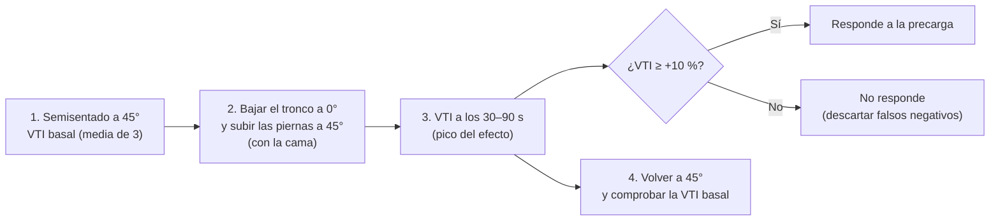
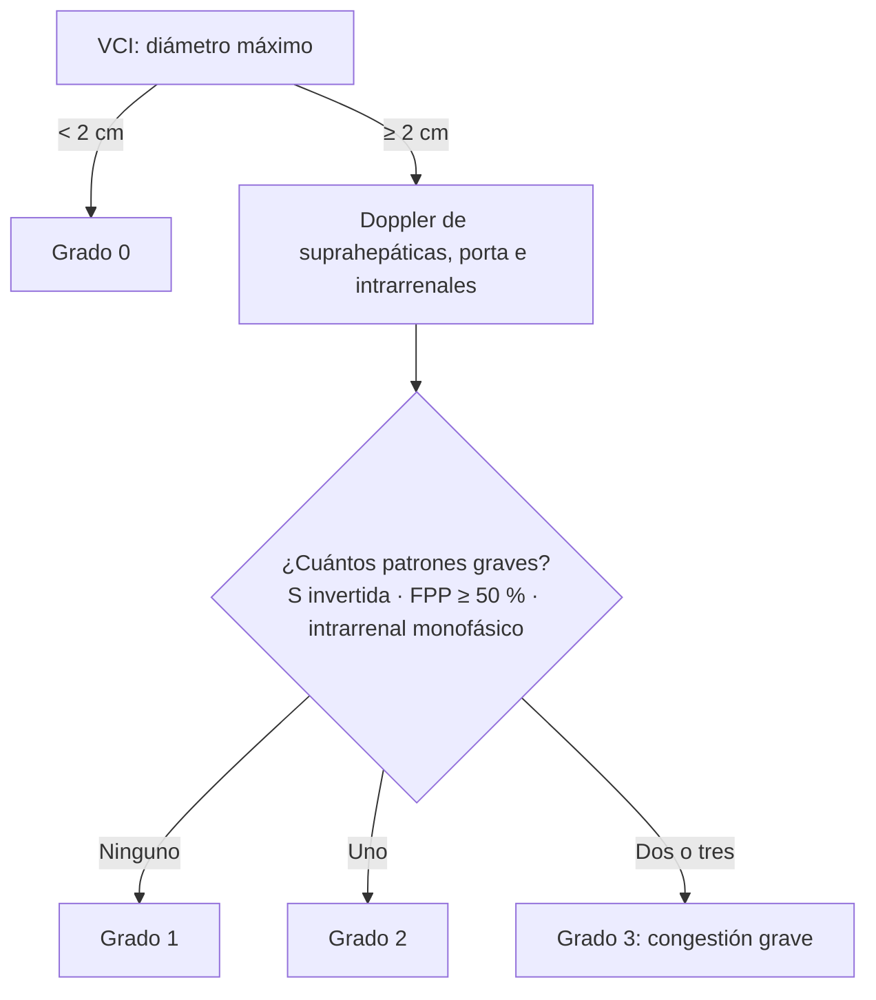

# 02 · Técnica y protocolos

Esta página describe **cómo se hace** la ecografía en el paciente en shock. Empieza por los protocolos multiórgano para identificar el tipo de shock (RUSH, ACES, FALLS, SHoC, SIMPLE…). Sigue con la **ecocardioscopia básica (FoCUS)** para valorar la bomba y con la **vena cava inferior** y sus índices. Después vienen las **medidas dinámicas** de respuesta a fluidos (VTI del tracto de salida del VI, elevación pasiva de piernas, mini-bolo, variación respiratoria y carótida) y, por último, el protocolo **VExUS** para cuantificar la congestión venosa. Al final se recogen dos tablas resumen: hallazgos por tipo de shock y parámetros con sus puntos de corte. La fisiología que justifica cada medida está en [01 · Contexto](01-contexto.md) y las trampas técnicas, en [07 · Limitaciones](07-limitaciones.md). La precisión diagnóstica de los protocolos se analiza en [03 · Precisión diagnóstica](03-precision.md).

!!! abstract "Esquema mental"
    1. **¿Qué tipo de shock es?** → protocolo multiórgano: bomba, depósito y tuberías.
    2. **¿Responde a la precarga?** → medida dinámica: EPP + VTI o mini-bolo + VTI.
    3. **¿Tolera fluidos?** → líneas B, VCI y VExUS.
    4. **Repetir** tras cada intervención.

## Material y ajustes básicos

- **Sonda sectorial (*phased array*) de baja frecuencia** para el corazón y el pulmón, y para la VCI si no se dispone de otra ([Seif, 2012](../../05-fuentes/index.md#seif2012)).
- **Sonda convexa** para el abdomen, la aorta y el Doppler venoso del VExUS. En el VExUS sirve tanto la sectorial como la convexa, y a veces hacen falta las dos ([Assavapokee, 2024](../../05-fuentes/index.md#assavapokee2024)).
- **Sonda lineal** para la compresión venosa (TVP) y la vena yugular interna ([Seif, 2012](../../05-fuentes/index.md#seif2012)).
- **ECG en el ecógrafo:** muy recomendable para el Doppler venoso del VExUS, porque permite identificar cada onda y mejora la concordancia entre observadores ([Assavapokee, 2024](../../05-fuentes/index.md#assavapokee2024); [Longino, 2024b](../../05-fuentes/index.md#longino2024b)).

## RUSH: bomba, depósito y tuberías

El protocolo **RUSH** (*Rapid Ultrasound in SHock*) se publicó en 2010 como herramienta docente y de reanimación. Organiza la exploración en una **evaluación fisiológica en tres pasos**: la bomba (*pump*), el depósito (*tank*) y las tuberías (*pipes*) ([Perera, 2010](../../05-fuentes/index.md#perera2010); [Seif, 2012](../../05-fuentes/index.md#seif2012)). Es una propuesta basada en **opinión de expertos**, no en datos prospectivos de incidencia ([Milne, 2016](../../05-fuentes/index.md#milne2016)).

### Paso 1. La bomba

La valoración de la bomba incluye las cuatro ventanas cardiacas clásicas (paraesternal larga y corta, subxifoidea y apical) y busca tres hallazgos ([Seif, 2012](../../05-fuentes/index.md#seif2012)):

1. **Derrame pericárdico y signos de taponamiento.**
    - En el paraesternal largo, el líquido pericárdico queda **por delante de la aorta descendente** y el pleural, **por detrás** ([Seif, 2012](../../05-fuentes/index.md#seif2012)).
    - Los signos de taponamiento van desde una deflexión serpenteante de la pared de la aurícula o del ventrículo derechos hasta el **colapso diastólico completo** de la cavidad ([Seif, 2012](../../05-fuentes/index.md#seif2012)).
    - El **colapso diastólico del VD es específico**, el **colapso sistólico de la AD es sensible** y la **VCI pletórica y no colapsable es sensible** ([Alerhand, 2022](../../05-fuentes/index.md#alerhand2022)).
2. **Contractilidad global del VI:** hiperdinámica, normal o disminuida.
    - La **EPSS** (*E-point septal separation*, separación entre el punto E de la valva mitral anterior y el septo) se mide en modo M desde el paraesternal largo. Normalmente es **< 7 mm**, y una EPSS **> 1 cm** se correlaciona con una FEVI baja ([Seif, 2012](../../05-fuentes/index.md#seif2012)).
3. **Sobrecarga del VD:** VD dilatado y desplazamiento del septo de derecha a izquierda. Si aparece, se recomienda pasar directamente a buscar TVP ([Seif, 2012](../../05-fuentes/index.md#seif2012)).

### Paso 2. El depósito

**a) ¿Cómo de lleno está el depósito?**

- **VCI:** se mide a unos **2 cm de la unión cavoatrial** ([Seif, 2012](../../05-fuentes/index.md#seif2012)). Una VCI pequeña con gran colapso inspiratorio sugiere una PVC baja, propia del shock hipovolémico y del distributivo. Una VCI grande con poco colapso sugiere una PVC alta, propia del cardiogénico y del obstructivo ([Seif, 2012](../../05-fuentes/index.md#seif2012)). Los criterios actualizados para estimar la PAD figuran en la [tabla de la VCI](#estimacion-de-la-presion-en-la-auricula-derecha).
- **Yugular interna:** una vena distendida por encima del ángulo mandibular y con poco colapso indica una PVC elevada ([Seif, 2012](../../05-fuentes/index.md#seif2012)).

**b) ¿Tiene fugas el depósito?** E-FAST para buscar líquido libre peritoneal y pleural (hemoperitoneo o hemotórax en el trauma; ascitis o derrames en la sobrecarga) y ecografía pulmonar para buscar edema pulmonar con **líneas B difusas** («cohetes pulmonares») ([Seif, 2012](../../05-fuentes/index.md#seif2012)).

**c) ¿Está comprometido el depósito?** Neumotórax a tensión: ausencia de deslizamiento pleural y patrón en «código de barras» en modo M ([Seif, 2012](../../05-fuentes/index.md#seif2012)).

### Paso 3. Las tuberías

- **Rotura de las tuberías:**
    - Aneurisma de aorta abdominal: diámetro **> 3 cm**, medido de pared externa a pared externa en eje corto e incluyendo el trombo. La rotura es más frecuente por encima de 5 cm ([Seif, 2012](../../05-fuentes/index.md#seif2012)).
    - Disección: raíz aórtica **> 3,8 cm**, colgajo intimal o aorta torácica > 5 cm ([Seif, 2012](../../05-fuentes/index.md#seif2012)).
- **Obstrucción de las tuberías:** TVP por compresión de las venas femoral y poplítea. El hallazgo patognomónico es la **falta de compresión completa** de la vena ([Seif, 2012](../../05-fuentes/index.md#seif2012)).

!!! note "RUSH-HIMAP"
    Existe una variante nemotécnica, **RUSH-HIMAP(P)**, descrita en una web docente en 2009 y citada por [Seif, 2012](../../05-fuentes/index.md#seif2012). El desarrollo habitual de las siglas es *Heart, IVC, Morison (FAST), Aorta, Pneumothorax*, aunque la fuente original no es una publicación revisada por pares `[POR VERIFICAR]`.

!!! tip "Perla clínica"
    Seif y colaboradores insisten en que el RUSH está diseñado para hacerse **rápido y a la carta**: se eligen los componentes según la clínica. En un paciente de bajo riesgo se puede hacer una exploración abreviada, y el pulmón, el FAST, la aorta y la TVP se añaden si el cuadro lo sugiere ([Seif, 2012](../../05-fuentes/index.md#seif2012)).

## Otros protocolos de shock

Seif y colaboradores revisaron más de 15 protocolos de reanimación: ACES, BEAT, BLEEP, EGLS, FALLS, FATE, FEER, FREE, RUSH, Trinity, UHP… Concluyeron que todos comparten los mismos componentes y que **las vistas cardiacas y la VCI son el núcleo de casi todos** ([Seif, 2012](../../05-fuentes/index.md#seif2012)).

| Protocolo | Año y fuente | Componentes | Rasgo distintivo |
|---|---|---|---|
| **UHP** (*Undifferentiated Hypotensive Patient*) | 2001 · [Rose, 2001](../../05-fuentes/index.md#rose2001) | Líquido libre, corazón y aorta abdominal | Uno de los primeros protocolos. Propuesto también para la AESP |
| **Trinity** | 2002 · [Bahner, 2002](../../05-fuentes/index.md#bahner2002) | Protocolo de hipotensión con tres componentes `[POR VERIFICAR: detalle de las vistas]` | Citado en las revisiones como antecedente ([Seif, 2012](../../05-fuentes/index.md#seif2012); [Mok, 2016](../../05-fuentes/index.md#mok2016)) |
| **FATE** (*Focus Assessed Transthoracic Echocardiography*) | 2004 · [Jensen, 2004](../../05-fuentes/index.md#jensen2004) | Cuatro vistas cardiacas estandarizadas y pleura | En UCI: imágenes útiles en el **97 %** de los pacientes (subcostal 58 %, apical 80 %, paraesternal 69 %) |
| **ACES** (*Abdominal and Cardiac Evaluation with Sonography in Shock*) | 2009 · [Atkinson, 2009](../../05-fuentes/index.md#atkinson2009) | Seis ventanas: corazón, peritoneo, pleura, VCI y aorta | Diseñado por urgenciólogos para la hipotensión no traumática |
| **EGLS** (*Echo-Guided Life Support*) | 2011 · citado en [Seif, 2012](../../05-fuentes/index.md#seif2012) | Algoritmo ecográfico para el shock indiferenciado | `[POR VERIFICAR]`: la fuente original no se ha localizado en PubMed |
| **FALLS** (*Fluid Administration Limited by Lung Sonography*) | 2013 · [Lichtenstein, 2013](../../05-fuentes/index.md#lichtenstein2013) | Secuencia: derrame pericárdico → VD dilatado → deslizamiento pleural → líneas B → prueba de fluidos | Sigue la clasificación de Weil por **exclusión**. El paso de perfil A a perfil B pulmonar marca el **límite de los fluidos** |
| **SIMPLE** | 2016 · [Mok, 2016](../../05-fuentes/index.md#mok2016) | Cada letra corresponde a una valoración cardiaca (véase abajo) | Lista de comprobación de FoCUS para principiantes; menos centrado en la fisiología que el RUSH |
| **SHoC** (*Sonography in Hypotension and Cardiac arrest*) | 2017 · IFEM · [Atkinson, 2017](../../05-fuentes/index.md#atkinson2017) | **Núcleo: corazón, pulmón y VCI.** Vistas cardiacas complementarias y vistas adicionales según la clínica | **Consenso internacional** (Delphi, 24 expertos, > 80 % de acuerdo). Enfoque de las «4 F»: *fluid, form, function, filling* |

### FALLS paso a paso

Lichtenstein describe la secuencia del FALLS así ([Lichtenstein, 2013](../../05-fuentes/index.md#lichtenstein2013)):

1. Buscar **derrame pericárdico**, después **dilatación del corazón derecho** y, por último, **ausencia de deslizamiento pleural**. Así se descartan, de forma esquemática, el taponamiento, el TEP y el neumotórax a tensión, es decir, el **shock obstructivo**.
2. Buscar **líneas B difusas**. Su ausencia (perfil A) descarta el edema pulmonar y, en la práctica, el **shock cardiogénico izquierdo**.
3. El paciente con perfil A recibe fluidos. Si mejora, apunta a un **shock hipovolémico**.
4. Si no mejora, se continúa con los fluidos hasta que aparecen **líneas B** (perfil B). Este es el **punto final del FALLS** y sugiere, por exclusión, un **shock distributivo** (séptico).
5. Su principal limitación es un perfil B al ingreso por enfermedad pulmonar previa.

!!! warning "Error frecuente"
    Usar el FALLS como si fuera una «receta para dar fluidos hasta que aparezcan líneas B». El propio autor lo presenta como un marco esquemático. Hoy las guías priorizan **evaluar la respuesta a fluidos antes de cada bolo** ([Monnet, 2025](../../05-fuentes/index.md#monnet2025)) y no usar el edema como punto final.

### SIMPLE: nemotecnia cardiaca

[Mok, 2016](../../05-fuentes/index.md#mok2016) propone una letra por cada valoración:

| Letra | Qué se valora |
|---|---|
| **S** | Tamaño y forma de las cavidades (*size and shape*), sobre todo del VI y el VD |
| **I** | Tamaño y colapsabilidad de la **VCI**; movimiento del **septo interventricular**; **colgajo intimal** aórtico |
| **M** | **Masas** intracavitarias (trombos, mixoma); **miocardio** (motilidad y grosor) |
| **P** | Derrame **pericárdico**; derrame **pleural** |
| **L** | Función sistólica del **VI** (*left ventricle*) |
| **E** | Aorta abdominal en el **epigastrio** |

### SHoC: el consenso de la IFEM

- **SHoC-hipotensión:** las vistas nucleares son la cardiaca, la pulmonar y la de la VCI. Se añaden vistas cardiacas complementarias y, según la clínica, vistas adicionales (FAST, aorta, TVP…) ([Atkinson, 2017](../../05-fuentes/index.md#atkinson2017)).
- **SHoC-parada:** vista subxifoidea o paraesternal minimizando las pausas de compresión, y pulmón y VCI como complementarias ([Atkinson, 2017](../../05-fuentes/index.md#atkinson2017)).
- El orden de prioridad se apoyó en la incidencia real de hallazgos en la hipotensión indiferenciada. Los cambios del VI (43 %) y de la VCI (27 %) fueron frecuentes, y la patología abdominal, rara (líquido libre 5 %, aneurisma 2 %). Los autores buscaban evitar los hallazgos incidentales de los protocolos «talla única» ([Milne, 2016](../../05-fuentes/index.md#milne2016)).

## FoCUS: ecocardioscopia en el shock

La ecocardioscopia (*focused cardiac ultrasound*, FoCUS) es una aplicación simplificada de la ecocardiografía que realiza el clínico formado para responder a preguntas concretas y urgentes. El consenso internacional de la WINFOCUS formuló 108 recomendaciones con metodología GRADE y RAND, 96 de ellas fuertes o muy fuertes. Abarcan la técnica, las aplicaciones, la integración clínica, la formación y la certificación ([Via, 2014](../../05-fuentes/index.md#via2014)). La ASE publicó recomendaciones propias en 2013 ([Spencer, 2013](../../05-fuentes/index.md#spencer2013)).

!!! info "Qué es y qué no es la FoCUS"
    La FoCUS es **cualitativa o semicuantitativa** y responde a preguntas binarias: ¿hay derrame?, ¿la contractilidad está muy deprimida?, ¿el VD está dilatado? **No sustituye** a la ecocardiografía completa, que incluye la valoración valvular, las mediciones y el Doppler avanzado ([Via, 2014](../../05-fuentes/index.md#via2014)).

### Ventanas

| Ventana | Posición de la sonda | Qué aporta en el shock | Disponibilidad en UCI* |
|---|---|---|:--:|
| **Paraesternal larga** | 3.º–4.º espacio intercostal paraesternal izquierdo; marca hacia el hombro derecho | Contractilidad global del VI, EPSS, derrame (relación con la aorta descendente), raíz aórtica, tamaño relativo del VD | 69 % (paraesternal) |
| **Paraesternal corta** | Igual, rotando 90° (marca hacia el hombro izquierdo) | Contractilidad segmentaria del VI; **septo en «D»** por sobrecarga del VD; VI «que se besa» (cavidad obliterada) en la hipovolemia | — |
| **Apical 4 cámaras** | Ápex (5.º espacio, línea medioclavicular o axilar anterior); marca a la izquierda | **Relación VD/VI**, TAPSE, signo de McConnell, derrame; desde aquí se obtiene el apical 5 cámaras para la **VTI** | 80 % |
| **Subcostal** | Subxifoidea, sonda casi plana; marca a la izquierda | La mejor en el paciente ventilado o durante la RCP; derrame, colapso del VD y la AD | 58 % |
| **VCI (subcostal longitudinal)** | Desde el subcostal, rotando a longitudinal | Diámetro y variación respiratoria de la VCI; suprahepáticas | — |

\*Porcentaje de pacientes de UCI en que cada ventana dio imágenes útiles ([Jensen, 2004](../../05-fuentes/index.md#jensen2004)). Las posiciones de la sonda son las convencionales de la ecocardiografía. Las cuatro vistas clásicas en el shock se describen en [Seif, 2012](../../05-fuentes/index.md#seif2012).

### Función sistólica del VI (cualitativa)

- La **estimación visual** («a ojo») de la FEVI por urgenciólogos frente a expertos alcanza una κ de **0,68**, con una sensibilidad del 89 % y una especificidad del 85 % para distinguir una función normal de una anormal. Clasificada en normal, reducida o muy reducida, la κ ponderada es de 0,70. La calidad de los estudios es baja ([Albaroudi, 2022](../../05-fuentes/index.md#albaroudi2022)).
- Categorías prácticas: **hiperdinámica** (cavidad pequeña que casi se oblitera en sístole, típica de la hipovolemia y de la sepsis precoz), **normal**, **disminuida** o **muy disminuida** ([Mok, 2016](../../05-fuentes/index.md#mok2016)).
- La **EPSS > 1 cm** apoya una FEVI baja y la **< 7 mm** es normal ([Seif, 2012](../../05-fuentes/index.md#seif2012)).
- La ESICM 2025 señala que los **fenotipos ecocardiográficos** de disfunción del VI y del VD pueden tener valor pronóstico (buena práctica no graduada) ([Monnet, 2025](../../05-fuentes/index.md#monnet2025)).

### Ventrículo derecho

| Signo | Cómo se valora | Umbral o interpretación | Fuente |
|---|---|---|---|
| **Dilatación del VD** | Relación de los diámetros basales VD/VI en telediástole, desde un apical 4 cámaras sin acortamiento | **VD/VI > 1** sugiere dilatación | [Zaidi, 2020](../../05-fuentes/index.md#zaidi2020) |
| Criterios de dilatación para POCUS | Apical 4C: VD/VI > 0,9. Paraesternal largo: VD telediastólico > 30 mm. Subcostal: VD/VI > 0,7 o 0,9 | El apical 4C es la vista preferente | [Blanco, 2016](../../05-fuentes/index.md#blanco2016) |
| **TAPSE** | Modo M alineado con el anillo tricuspídeo lateral, desde el apical 4C | **< 1,7 cm** es muy sugestivo de disfunción sistólica del VD | [Zaidi, 2020](../../05-fuentes/index.md#zaidi2020) |
| **Septo en «D»** | Paraesternal corto | Aplanamiento o movimiento paradójico del septo, con VI en forma de «D», por sobrecarga de presión o volumen del VD | [Mok, 2016](../../05-fuentes/index.md#mok2016) |
| **Signo de McConnell** | Apical 4C | Aquinesia de la pared libre media del VD **con ápex conservado**. Para el TEP agudo: sensibilidad del 77 % y especificidad del 94 % en el estudio original, clásico y con n pequeña | [McConnell, 1996](../../05-fuentes/index.md#mcconnell1996) |
| **Signos de cronicidad** | Grosor de la pared libre del VD | **> 5 mm** sugiere sobrecarga crónica (hipertensión pulmonar), no aguda | [Blanco, 2016](../../05-fuentes/index.md#blanco2016) |
| **Trombo en tránsito** | Cavidades derechas | Específico de TEP | [Blanco, 2016](../../05-fuentes/index.md#blanco2016) |

!!! note "Qué valor tiene la «sobrecarga del VD» para el TEP"
    En un metaanálisis, la «sobrecarga del VD» sin definir tuvo una sensibilidad del **53 %** y una especificidad del **83 %** para el TEP. Sirve más para **confirmar** en el paciente inestable que para descartar ([Fields, 2017](../../05-fuentes/index.md#fields2017)). Véase [03 · Precisión](03-precision.md).

### Derrame pericárdico y taponamiento

Hallazgos ecocardiográficos del taponamiento ([Alerhand, 2022](../../05-fuentes/index.md#alerhand2022)):

- **Derrame pericárdico:** cuanto mayor, más asociado al taponamiento.
- **Colapso diastólico del VD:** signo **específico**.
- **Colapso sistólico de la AD:** signo **sensible**.
- **VCI pletórica y no colapsable:** signo **sensible**.
- **Pulso paradójico ecográfico:** variación respiratoria de los flujos transvalvulares.

El taponamiento es un diagnóstico **clínico-ecográfico**. La pericardiocentesis urgente está indicada si hay inestabilidad hemodinámica, deterioro inminente o parada cardiaca ([Alerhand, 2022](../../05-fuentes/index.md#alerhand2022)).

## Vena cava inferior

### Técnica de medida

1. **Ventana:** subcostal. Se localiza la VCI en **eje corto** a través del hígado (a la derecha de la aorta, que está en la línea media y separada del hígado) y se rota a **eje largo** hasta ver la VCI entrando en la AD, con las suprahepáticas desembocando en ella ([Assavapokee, 2024](../../05-fuentes/index.md#assavapokee2024)).
2. **Punto de medida:** según las guías de ecocardiografía, **perpendicular al eje largo, a 1–2 cm de la unión con la AD y en espiración** ([Zaidi, 2020](../../05-fuentes/index.md#zaidi2020)). RUSH propone unos 2 cm de la unión cavoatrial ([Seif, 2012](../../05-fuentes/index.md#seif2012)), y el VExUS mide a unos 2 cm de la unión con las suprahepáticas ([Beaubien-Souligny, 2020](../../05-fuentes/index.md#beaubien2020)).
3. **Para predecir la respuesta en respiración espontánea**, los estudios más recientes miden **más lejos de la aurícula**:
    - a 15–20 mm caudal a la unión de las suprahepáticas ([Preau, 2017](../../05-fuentes/index.md#preau2017));
    - a **4 cm caudal a la AD**, que es el punto de mejor precisión ([Caplan, 2020](../../05-fuentes/index.md#caplan2020)).
    El porcentaje de colapso en voluntarios sanos es menor a nivel del diafragma que a nivel de las suprahepáticas o de la vena renal izquierda ([Wallace, 2010](../../05-fuentes/index.md#wallace2010)).
4. **Modo M o modo B:**
    - El modo M facilita medir el diámetro máximo y el mínimo, pero el desplazamiento craneocaudal o lateral de la vena puede **simular un colapso** que no existe. Conviene comprobarlo con la imagen 2D simultánea ([Blanco, 2016](../../05-fuentes/index.md#blanco2016)).
    - En voluntarios, el **modo B en eje largo** tuvo la mejor concordancia entre observadores (CCI 0,86), y los índices de colapso medidos con modo M la peor ([Finnerty, 2017](../../05-fuentes/index.md#finnerty2017)).
5. **Ventana alternativa:** coronal transhepática desde la línea axilar media derecha, llamada *rescue view* ([Finnerty, 2017](../../05-fuentes/index.md#finnerty2017)). En otro estudio, la vista longitudinal por la línea axilar media anterior tuvo la mejor concordancia entre observadores (κ 0,69) ([Saul, 2012](../../05-fuentes/index.md#saul2012)).

!!! tip "Trucos técnicos"
    - **No confundir la VCI con la aorta.** La aorta está en la línea media, separada del hígado, y da ramas anteriores (tronco celíaco, mesentérica) por fuera del hígado. La pulsatilidad no sirve para distinguirlas: la VCI puede latir en los estados hiperdinámicos y en la insuficiencia tricuspídea ([Assavapokee, 2024](../../05-fuentes/index.md#assavapokee2024)).
    - **Comprobar en eje corto.** Solo en eje largo se puede cortar la vena de forma tangencial («efecto cilindro») e infraestimar su diámetro. En eje corto, una VCI circular y pletórica apoya una presión elevada ([Assavapokee, 2024](../../05-fuentes/index.md#assavapokee2024)).

### Estimación de la presión en la aurícula derecha

| Diámetro de la VCI | Colapso con el *sniff* | PAD estimada |
|---|---|---|
| **≤ 21 mm** | **> 50 %** | Normal: **0–5 mmHg** (≈ 3) |
| ≤ 21 mm | < 50 % | Intermedia: 5–10 mmHg (≈ 8) |
| > 21 mm | > 50 % | Intermedia: 5–10 mmHg (≈ 8) |
| **> 21 mm** | **< 50 %** (o < 20 % en respiración tranquila) | Alta: **≈ 15 mmHg** |

Fuente: guía práctica de la British Society of Echocardiography ([Zaidi, 2020](../../05-fuentes/index.md#zaidi2020)), que se apoya en la guía de la ASE sobre el corazón derecho ([Rudski, 2010](../../05-fuentes/index.md#rudski2010)). La categoría intermedia se reclasifica como alta si el colapso es mínimo (< 35 %) y hay índices secundarios de PAD elevada, y como normal si no los hay ([Zaidi, 2020](../../05-fuentes/index.md#zaidi2020)). En 2025, la ASE publicó una nueva guía del corazón derecho ([Mukherjee, 2025](../../05-fuentes/index.md#mukherjee2025)) que no se ha podido revisar en texto completo `[POR VERIFICAR: posibles cambios de umbral]`.

!!! warning "Estimar la PAD no es predecir la respuesta a fluidos"
    Los criterios de la tabla estiman **presiones**, no la **respuesta a la precarga**. Una VCI pequeña no garantiza que el paciente responda, y una grande no lo descarta. Véase [01 · Contexto](01-contexto.md#42-el-retorno-venoso-presion-media-de-llenado-sistemico-y-pvc-como-presion-de-salida).

### Índices de variación respiratoria

| Índice | Fórmula | Contexto | Punto de corte | Rendimiento | Fuente |
|---|---|---|---|---|---|
| **Índice de distensibilidad (dIVC)** | (Dmáx − Dmín) / **Dmín** | **Ventilación mecánica**, sedación, sin esfuerzo inspiratorio | **> 18 %** | S 90 %, E 90 % (n = 23, sépticos) | [Barbier, 2004](../../05-fuentes/index.md#barbier2004) |
| **ΔD VCI** | (Dmáx − Dmín) / **media** | Ventilación mecánica | **> 12 %** | VPP 93 %, VPN 92 % (n = 39) | [Feissel, 2004](../../05-fuentes/index.md#feissel2004) |
| Distensibilidad (metaanálisis) | — | Sin esfuerzos respiratorios espontáneos | > 15 % | LR+ 5,3; LR− 0,27 | [Bentzer, 2016](../../05-fuentes/index.md#bentzer2016) |
| ΔVCI (metaanálisis, 8 estudios) | — | Ventilación mecánica | Umbral medio 15,4 % | AUC 0,83, inferior a la VPP o la VVS (0,87) | [Chaves, 2024](../../05-fuentes/index.md#chaves2024) |
| ΔVCI (cohorte multicéntrica, 540 pacientes) | — | Ventilación mecánica, semisentado | ≥ 8 % | S 55 %, E 70 % | [Vignon, 2017](../../05-fuentes/index.md#vignon2017) |
| **Índice de colapsabilidad (cIVC)** | (Dmáx − Dmín) / **Dmáx** | **Respiración espontánea** | **> 40 %** | S 70 %, E 80 %. Un cIVC < 40 % no descarta la respuesta | [Muller, 2012](../../05-fuentes/index.md#muller2012) |
| cIVC | Igual | Respiración espontánea | > 42 % | E 97 %, VPP 90 %. Su AUC global fue solo de 0,62 | [Airapetian, 2015](../../05-fuentes/index.md#airapetian2015) |
| cIVC con **inspiración profunda estandarizada** | Igual (diámetro espiratorio − mínimo inspiratorio) / espiratorio | Respiración espontánea, sepsis | **≥ 48 %** | S 84 %, E 90 %; AUC 0,89 | [Preau, 2017](../../05-fuentes/index.md#preau2017) |
| cIVC a **4 cm de la AD** | Igual | Respiración espontánea, sepsis | Respiración no estandarizada ≥ 33 %; estandarizada ≥ 44 % | No estandarizada: S 66 %, E 92 %. Estandarizada: S 93 %, E 98 % | [Caplan, 2020](../../05-fuentes/index.md#caplan2020) |
| cIVC (metaanálisis, 8 estudios) | — | Respiración espontánea | Variable | S 63 %, E 83 %. **No usar de forma aislada** | [Cardozo Júnior, 2023](../../05-fuentes/index.md#cardozo2023) |
| Índice de la VCI (metaanálisis, 20 estudios) | — | Mixto | Variable | S 71 %, E 75 %; AUC 0,71; heterogeneidad extrema | [Orso, 2020](../../05-fuentes/index.md#orso2020) |

!!! tip "Perla clínica"
    La VCI funciona mejor en los **extremos**. Una VCI muy colapsable (≥ 40–50 % en respiración espontánea) hace **probable** la respuesta a fluidos, con una especificidad alta. Un colapso escaso **no la descarta** ([Muller, 2012](../../05-fuentes/index.md#muller2012); [Airapetian, 2015](../../05-fuentes/index.md#airapetian2015)). En la zona intermedia, conviene pasar a una medida dinámica basada en el flujo, como la EPP con VTI.

## Medidas dinámicas de respuesta a fluidos

La ESICM recomienda las **variables dinámicas frente a los marcadores estáticos** de precarga para predecir la respuesta a fluidos cuando sean aplicables (recomendación graduada) ([Monnet, 2025](../../05-fuentes/index.md#monnet2025)). Ya lo recomendaba en 2014 (nivel 1, calidad moderada) ([Cecconi, 2014](../../05-fuentes/index.md#cecconi2014)). La ecografía permite medirlas a pie de cama usando la **VTI** como sustituto del volumen sistólico.

### VTI del tracto de salida del VI

La **integral velocidad-tiempo (VTI)** del tracto de salida del VI (TSVI) es la «distancia sistólica» que recorre la sangre en cada latido, en cm. El volumen sistólico es el producto del área del TSVI por la VTI, y el gasto cardiaco, el del volumen sistólico por la frecuencia cardiaca. **Como el área del TSVI es constante en un mismo paciente, los cambios de la VTI reflejan directamente los cambios del volumen sistólico.** Por eso basta con seguir la VTI, sin necesidad de calcular el área ([Blanco, 2020](../../05-fuentes/index.md#blanco2020)).

**Técnica** ([Blanco, 2020](../../05-fuentes/index.md#blanco2020)):

1. Obtener un **apical 5 cámaras** (o un apical 3 cámaras).
2. Colocar el volumen de muestra del **Doppler pulsado en el TSVI, aproximadamente 1 cm por debajo de la válvula aórtica**.
3. **Alinear** el haz con el flujo subaórtico y buscar una envolvente con mínimo ensanchamiento espectral.
4. **Trazar la envolvente** del flujo sistólico. El equipo calcula la VTI.
5. **Promediar:** 3 latidos en ritmo sinusal y **5 en fibrilación auricular** ([Jozwiak, 2019](../../05-fuentes/index.md#jozwiak2019)).
6. Si el TSVI no es accesible, sirven la VTI mitral o la del tracto de salida del VD ([Blanco, 2020](../../05-fuentes/index.md#blanco2020)).

**Valores de referencia** ([Blanco, 2020](../../05-fuentes/index.md#blanco2020)):

- Con una frecuencia cardiaca normal, la VTI media es de unos **20 ± 3 cm (17–23 cm)**.
- Con FC < 55 lpm, la VTI debería superar los 18 cm. Con FC > 95 lpm, se espera que sea menor de 22 cm.
- Una VTI **< 10 cm** en la insuficiencia cardiaca aguda y **< 15 cm** en el TEP se asocian a peor pronóstico.
- El producto VTI × FC («distancia por minuto») permite seguir el gasto cardiaco.

!!! warning "La precisión de la VTI limita las pruebas finas"
    Entre dos exploraciones del mismo operador, el **cambio mínimo significativo** de la VTI es del **11 %**. Con dos operadores distintos sube al **14 %** ([Jozwiak, 2019](../../05-fuentes/index.md#jozwiak2019)). Esta precisión basta para valorar un bolo de 500 mL, pero no para pruebas que producen cambios pequeños. Para comparar antes y después, **el mismo operador, la misma ventana y el volumen de muestra en el mismo punto**.

### Elevación pasiva de piernas (EPP) con VTI

La EPP es una «autotransfusión» reversible de unos **300 mL** de sangre ([Monnet, 2022](../../05-fuentes/index.md#monnet2022)). En su metaanálisis de 21 estudios (991 pacientes), el aumento del gasto cardiaco con la EPP tuvo una sensibilidad del **85 %** y una especificidad del **91 %**, con un AUC de **0,95** y un umbral óptimo de **≥ 10 % ± 2 %**. Medida con la presión de pulso, la sensibilidad caía al 56 % ([Monnet, 2016](../../05-fuentes/index.md#monnet2016)). En la RS de *JAMA*, fue la mejor prueba: **LR+ 11 y LR− 0,13** ([Bentzer, 2016](../../05-fuentes/index.md#bentzer2016)).

**Las cinco reglas de la EPP** ([Monnet, 2015](../../05-fuentes/index.md#monnet2015)):

1. **Empezar semisentado (45°), no en decúbito supino**: al bajar el tronco a la vez que se elevan las piernas se moviliza también la sangre esplácnica. Un estudio que no siguió esta regla obtuvo resultados engañosamente malos.
2. **Medir el gasto cardiaco (o la VTI), no la presión arterial.**
3. Usar una técnica **en tiempo real**, porque el efecto de la EPP puede desaparecer **después de 1 minuto**. La ecocardiografía sirve.
4. **Medir antes, durante y después** (de vuelta a 45°), para comprobar que el gasto vuelve a la situación basal y descartar variaciones espontáneas.
5. **Evitar la estimulación adrenérgica:** usar la cama, no levantar las piernas a mano; aspirar las secreciones antes; explicar la prueba al paciente consciente. Un aumento importante de la FC durante la prueba sugiere estimulación simpática.

Punto de corte del aumento de la VTI: ≥ 10 % ([Monnet, 2022](../../05-fuentes/index.md#monnet2022)). El intervalo temporal del paso 3 es orientativo: se basa en que el efecto es máximo en torno al minuto y luego desaparece ([Monnet, 2015](../../05-fuentes/index.md#monnet2015)).

Estudios de validación con ecocardiografía en pacientes con respiración espontánea:

- Un aumento del volumen sistólico ≥ **12,5 %** con la EPP predijo la respuesta con una sensibilidad del 77 % y una especificidad del 100 % (n = 24). Los índices estáticos (área telediastólica del VI, E/Ea) no la predijeron ([Lamia, 2007](../../05-fuentes/index.md#lamia2007)).
- Un aumento del gasto o del volumen sistólico ≥ **12 %** tuvo un AUC de 0,89–0,90 (n = 34) ([Maizel, 2007](../../05-fuentes/index.md#maizel2007)).

La EPP **sigue siendo válida** con respiración espontánea, arritmias, volúmenes corrientes bajos, baja distensibilidad pulmonar o insuficiencia cardiaca derecha ([Monnet, 2022](../../05-fuentes/index.md#monnet2022)). Sus contraindicaciones y los falsos negativos se tratan en [07 · Limitaciones](07-limitaciones.md#elevacion-pasiva-de-piernas).

!!! tip "Perla clínica"
    Una EPP positiva **no obliga a dar fluidos**. Solo indica que el paciente responde a la precarga. Una EPP negativa es útil sobre todo para **parar o no empezar** los fluidos ([Monnet, 2015](../../05-fuentes/index.md#monnet2015)).

### Mini-bolo de fluidos (*mini-fluid challenge*)

- **Estudio original:** 100 mL de coloide en 1 minuto. Un aumento de la VTI subaórtica **≥ 10 %** predijo la respuesta a los 500 mL completos, con una sensibilidad del 95 %, una especificidad del 78 % y un AUC de 0,92 (n = 39, pacientes ventilados) ([Muller, 2011](../../05-fuentes/index.md#muller2011)).
- **Metaanálisis:** para el mini-bolo, AUC de 0,91, sensibilidad del 82 % y especificidad del 83%, con un umbral óptimo de solo el **5 %** (3–7 %) ([Messina, 2019](../../05-fuentes/index.md#messina2019)).
- **Problema:** un cambio del 5–10 % está por debajo o en el límite del cambio mínimo que la ecocardiografía detecta de forma fiable (11 %) ([Jozwiak, 2019](../../05-fuentes/index.md#jozwiak2019)). La precisión de la medida es su talón de Aquiles ([Monnet, 2022](../../05-fuentes/index.md#monnet2022)).
- **Ventaja:** es sencillo y útil cuando la EPP no se puede hacer (cirugía, hipertensión intracraneal, inmovilización). **Inconveniente:** administra volumen de forma irreversible.

??? info "Detalle: otras pruebas dinámicas en ventilación mecánica"
    - **Prueba de oclusión teleespiratoria:** pausa al final de la espiración. Un aumento del gasto de alrededor del 5 % predice la respuesta (AUC 0,96, S 86 %, E 91 %). El umbral es pequeño, así que con ecocardiografía se enfrenta al mismo problema de precisión ([Messina, 2019](../../05-fuentes/index.md#messina2019); [Monnet, 2022](../../05-fuentes/index.md#monnet2022)).
    - **Prueba del volumen corriente:** se sube de forma transitoria el volumen corriente de 6 a 8 mL/kg y se observa el cambio de la VPP. Resuelve la falta de fiabilidad de la VPP con volúmenes corrientes bajos ([Monnet, 2022](../../05-fuentes/index.md#monnet2022)).

### Variación respiratoria de la velocidad pico y de la VTI aórtica

- En pacientes con **ventilación mecánica controlada**, la variación respiratoria de la velocidad pico aórtica se calcula como ΔVpico = (Vmáx − Vmín) / media de ambas. Con un umbral del **12 %** tuvo una sensibilidad del 100 % y una especificidad del 89 % (n = 19, ETE, FEVI conservada, estudio clásico) ([Feissel, 2001](../../05-fuentes/index.md#feissel2001)).
- En una cohorte de 540 pacientes ventilados, una ΔVmáx en el TSVI **≥ 10 %** tuvo la **mejor sensibilidad** (79 %), pero una especificidad del 64 % ([Vignon, 2017](../../05-fuentes/index.md#vignon2017)).
- **Requisitos**, compartidos con la VPP: ventilación controlada sin esfuerzos, ritmo sinusal, volumen corriente suficiente y tórax cerrado ([Monnet, 2022](../../05-fuentes/index.md#monnet2022)).

### Doppler carotídeo

La carótida es una ventana superficial y fácil, con sonda lineal:

- **Tiempo de flujo corregido (FTc):** duración de la sístole en el Doppler carotídeo, corregida por la frecuencia cardiaca. En el shock indiferenciado con vasopresores (n = 77), un **aumento del FTc ≥ 7 ms tras la EPP** tuvo un valor predictivo positivo del 97 % para la respuesta, con un AUC de 0,88. El patrón de referencia fue la biorreactancia, y la ventilación mecánica y la PEEP no afectaron al rendimiento ([Barjaktarevic, 2018](../../05-fuentes/index.md#barjaktarevic2018)).
- **Variación respiratoria de la velocidad pico carotídea (ΔVpico):** en la RS de 17 estudios, los umbrales oscilaron entre el 9 y el 14 %, con AUC de 0,81–0,91. No se pudo metaanalizar por la heterogeneidad ([Beier, 2020](../../05-fuentes/index.md#beier2020)).
- **Metaanálisis de 10 estudios (438 pacientes):** FTc con S 0,76 y E 0,88; ΔVpico carotídea con S 0,83 y E 0,81 ([Singla, 2023](../../05-fuentes/index.md#singla2023)).
- **Limitación:** no hay un método estandarizado para medir el FTc, y por eso no existe un punto de corte establecido ([Beier, 2020](../../05-fuentes/index.md#beier2020)).

## VExUS: la ecografía de la congestión venosa

El VExUS gradúa la congestión venosa sistémica combinando **cuatro mediciones**: el diámetro de la VCI y el Doppler pulsado de las venas **suprahepáticas**, la **porta** y las venas **intrarrenales** ([Beaubien-Souligny, 2020](../../05-fuentes/index.md#beaubien2020)). La guía práctica de referencia es [Assavapokee, 2024](../../05-fuentes/index.md#assavapokee2024), de acceso abierto y con vídeos.

### Preparación y ajustes

- **Sonda:** sectorial o convexa. En la experiencia de los autores, la convexa capta mejor los flujos de las venas intrarrenales ([Assavapokee, 2024](../../05-fuentes/index.md#assavapokee2024)).
- **ECG** simultáneo ([Assavapokee, 2024](../../05-fuentes/index.md#assavapokee2024)). Con ECG, la concordancia entre observadores es mayor ([Longino, 2024b](../../05-fuentes/index.md#longino2024b)).
- **Escala Doppler:**
    - Si se usa el preajuste cardiaco, bajarla a unos **40 cm/s** (los equipos suelen partir de 100 cm/s).
    - Para las venas renales, usar el preajuste abdominal con un límite de Nyquist **< 20 cm/s**.
    - Velocidad de barrido de **50 o 66,7 mm/s** ([Assavapokee, 2024](../../05-fuentes/index.md#assavapokee2024)).
- **Respiración:** pedir al paciente que mantenga una breve apnea al final de la espiración. La inspiración profunda o la maniobra de Valsalva atenúan la onda ([Assavapokee, 2024](../../05-fuentes/index.md#assavapokee2024)).

### Paso 1. VCI

Se mide el **diámetro máximo** en eje largo subcostal ([Assavapokee, 2024](../../05-fuentes/index.md#assavapokee2024)). En el estudio de derivación se midió la VCI intrahepática a 2 cm de la unión con las suprahepáticas ([Beaubien-Souligny, 2020](../../05-fuentes/index.md#beaubien2020)).

- **VCI < 2 cm → grado 0** (sin congestión).
- Una VCI **≥ 2 cm** obliga a continuar con el Doppler.
- Si la VCI es algo menor de 2 cm pero parece circular y pletórica, es aceptable continuar. El umbral de 2 cm puede requerir ajustes en poblaciones no occidentales ([Assavapokee, 2024](../../05-fuentes/index.md#assavapokee2024)).

### Paso 2. Venas suprahepáticas

- **Ventana:** subxifoidea, o mejor **coronal** en el cruce de la línea xifoidea con la línea axilar media ([Assavapokee, 2024](../../05-fuentes/index.md#assavapokee2024)).
- **Muestra:** en una suprahepática, a **1–2 cm de su unión con la VCI**, evitando las confluencias ([Assavapokee, 2024](../../05-fuentes/index.md#assavapokee2024)).
- **Ondas**, identificadas con el ECG:
    - **A** coincide con la onda P;
    - **S** coincide con el QRS;
    - **V**, al final de la sístole;
    - **D**, tras la onda T.
- **Interpretación:**
    - **Normal: S > D**, ambas por debajo de la línea de base.
    - **Alteración leve: S < D**, pero S sigue por debajo de la línea de base, es decir, hacia el hígado.
    - **Alteración grave: S invertida** (por encima de la línea de base).

    Fuentes: [Beaubien-Souligny, 2020](../../05-fuentes/index.md#beaubien2020); [Assavapokee, 2024](../../05-fuentes/index.md#assavapokee2024).

### Paso 3. Vena porta: fracción de pulsatilidad

- **Ventana:** coronal. Se desliza la sonda en sentido caudal hasta la interfase hígado-riñón y se inclina hacia arriba hasta ver la porta ([Assavapokee, 2024](../../05-fuentes/index.md#assavapokee2024)).
- **Muestra:** en la porta principal. Hay que bajar la escala para ampliar la onda y evitar la interferencia de la arteria hepática ([Assavapokee, 2024](../../05-fuentes/index.md#assavapokee2024)).
- **Fracción de pulsatilidad portal (FPP)** = (Vmáx − Vmín) / Vmáx × 100 ([Assavapokee, 2024](../../05-fuentes/index.md#assavapokee2024)).
- **Interpretación:**
    - **Normal: FPP < 30 %** (flujo continuo).
    - **Leve: 30–49 %.**
    - **Grave: ≥ 50 %.**

    Fuentes: [Beaubien-Souligny, 2020](../../05-fuentes/index.md#beaubien2020); [Assavapokee, 2024](../../05-fuentes/index.md#assavapokee2024).

### Paso 4. Venas intrarrenales

- **Vasos:** venas **interlobares** o arcuatas, no la vena renal principal ni las segmentarias. Las interlobares son más fáciles de identificar y quedan paralelas al haz ([Assavapokee, 2024](../../05-fuentes/index.md#assavapokee2024)).
- **Técnica:** ventana coronal del riñón. Primero Doppler color con escala baja, subiendo la ganancia de color sin llegar a moteado. Después Doppler pulsado: la arteria aparece por encima de la línea de base y la vena por debajo ([Assavapokee, 2024](../../05-fuentes/index.md#assavapokee2024)).
- **Interpretación:**
    - **Normal:** flujo venoso **continuo**.
    - **Leve:** **discontinuo bifásico**, con fases S y D.
    - **Grave:** **discontinuo monofásico**, solo con fase D.

    Fuentes: [Beaubien-Souligny, 2020](../../05-fuentes/index.md#beaubien2020); [Assavapokee, 2024](../../05-fuentes/index.md#assavapokee2024).

### Sistema de gradación (VExUS C, Beaubien-Souligny 2020)

| Grado | Criterio | Interpretación |
|:--:|---|---|
| **0** | VCI < 2 cm | Sin congestión |
| **1** | VCI ≥ 2 cm y patrones Doppler normales o solo **leves** | Congestión leve |
| **2** | VCI ≥ 2 cm y **un** patrón **grave** | Congestión moderada |
| **3** | VCI ≥ 2 cm y **dos o más** patrones **graves** | **Congestión grave** |

Fuentes: [Beaubien-Souligny, 2020](../../05-fuentes/index.md#beaubien2020); [Assavapokee, 2024](../../05-fuentes/index.md#assavapokee2024). Entre los cinco prototipos (A–E), el sistema C, que exige varias alteraciones graves y una VCI dilatada, fue el que más se asoció a la LRA. El grado 3 tuvo una especificidad del 96 % y un LR+ de 6,37 al ingreso en UCI ([Beaubien-Souligny, 2020](../../05-fuentes/index.md#beaubien2020)).

!!! tip "Trucos técnicos del VExUS"
    - **Usar ECG** para no confundir la variación respiratoria de la porta con la pulsatilidad cardiaca. Por definición, la pulsatilidad cardiaca ocurre en cada latido ([Assavapokee, 2024](../../05-fuentes/index.md#assavapokee2024)).
    - Probar la **ventana coronal**, que suele dar mejores ondas que la subxifoidea para las suprahepáticas y la porta ([Assavapokee, 2024](../../05-fuentes/index.md#assavapokee2024)).
    - Si las venas renales no se ven, bajar la escala, subir la ganancia de color e inclinar la sonda ([Assavapokee, 2024](../../05-fuentes/index.md#assavapokee2024)).
    - Registrar el grado **de forma seriada**. El VExUS es útil para seguir la respuesta al tratamiento descongestivo ([Koratala, 2022](../../05-fuentes/index.md#koratala2022)).
    - **Fiabilidad:** entre cuatro médicos de distintas especialidades, la concordancia fue sustancial (κ 0,71; CCI 0,83), y mayor en las imágenes con ECG ([Longino, 2024b](../../05-fuentes/index.md#longino2024b)).

!!! note "Qué mide y qué no mide el VExUS"
    El VExUS gradúa la **gravedad de la congestión en los órganos**, pero **no distingue** si se debe a sobrecarga de volumen o a sobrecarga de presión, como en la hipertensión pulmonar o la disfunción del VD ([Assavapokee, 2024](../../05-fuentes/index.md#assavapokee2024)). Tampoco es una prueba de respuesta a fluidos. Sus limitaciones se tratan en [07 · Limitaciones](07-limitaciones.md#vexus).

## Tabla resumen 1. Hallazgos por tipo de shock

| Hallazgo | Hipovolémico | Distributivo (séptico) | Cardiogénico | Obstructivo: TEP | Obstructivo: taponamiento | Obstructivo: neumotórax a tensión |
|---|---|---|---|---|---|---|
| **VI** | Pequeño, **hiperdinámico** (paredes que «se besan») | Precoz: hiperdinámico. Tardío: hipocinético (miocardiopatía séptica) | **Dilatado e hipocinético** | Pequeño o normal, hiperdinámico | Normal, cavidades pequeñas | — |
| **VD** | — | Normal | Variable | **Dilatado**, septo en «D», McConnell, trombo en tránsito | **Colapso diastólico** | Normal |
| **Pericardio** | Normal | Normal | Normal o derrame | Normal | **Derrame** con colapso de la AD y el VD | Normal |
| **VCI** | **Pequeña y colapsable** | Precoz: colapsada. Tardía: distendida | **Distendida**, colapso < 50 % | **Distendida**, sin colapso | **Pletórica**, sin colapso | Distendida |
| **Pulmón** | Perfil A | Perfil A inicial; perfil B si hay sobrecarga (FALLS) | **Líneas B difusas**; derrames pleurales si hay sobrecarga | Perfil A anterior con TVP (\*) | — | **Sin deslizamiento**; punto pulmonar |
| **Abdomen, aorta y venas** | **Líquido libre** (hemoperitoneo), aneurisma roto | — | Ascitis si hay sobrecarga | **TVP** (femoral o poplítea) | — | — |

Elaboración a partir de [Mok, 2016](../../05-fuentes/index.md#mok2016) (tabla SIMPLE por tipo de shock), [Seif, 2012](../../05-fuentes/index.md#seif2012), [Cecconi, 2014](../../05-fuentes/index.md#cecconi2014), [Lichtenstein, 2013](../../05-fuentes/index.md#lichtenstein2013) y [Alerhand, 2022](../../05-fuentes/index.md#alerhand2022). (\*) En el protocolo BLUE, el perfil anterior normal con TVP indicó TEP con una sensibilidad del 81 % y una especificidad del 99 % ([Lichtenstein, 2008](../../05-fuentes/index.md#lichtenstein2008)). La tabla es una **ayuda docente**: los patrones se solapan con frecuencia y existen shocks mixtos (véase [07](07-limitaciones.md#shock-mixto-y-hallazgos-que-se-solapan)).

## Tabla resumen 2. Parámetros y puntos de corte

| Parámetro | Técnica | Punto de corte | Significado | Fuente |
|---|---|---|---|---|
| EPSS | Modo M, paraesternal largo | < 7 mm normal; > 1 cm | FEVI baja | [Seif, 2012](../../05-fuentes/index.md#seif2012) |
| Relación VD/VI | Apical 4C, telediástole | > 1 (> 0,9 en POCUS) | VD dilatado | [Zaidi, 2020](../../05-fuentes/index.md#zaidi2020); [Blanco, 2016](../../05-fuentes/index.md#blanco2016) |
| TAPSE | Modo M, anillo tricuspídeo lateral | < 17 mm | Disfunción sistólica del VD | [Zaidi, 2020](../../05-fuentes/index.md#zaidi2020) |
| Pared libre del VD | 2D | > 5 mm | Sugiere cronicidad | [Blanco, 2016](../../05-fuentes/index.md#blanco2016) |
| Aorta abdominal | Eje corto, de pared externa a pared externa | > 3 cm | Aneurisma | [Seif, 2012](../../05-fuentes/index.md#seif2012) |
| Raíz aórtica | Paraesternal largo | > 3,8 cm | Sospecha de disección | [Seif, 2012](../../05-fuentes/index.md#seif2012) |
| VCI y PAD | Subcostal, a 1–2 cm de la AD | ≤ 21 mm con colapso > 50 % → PAD 0–5; > 21 mm con colapso < 50 % → PAD ≈ 15 | Estimación de presiones | [Zaidi, 2020](../../05-fuentes/index.md#zaidi2020) |
| dIVC (ventilación mecánica) | (Dmáx − Dmín)/Dmín | > 18 % | Probable respuesta a fluidos | [Barbier, 2004](../../05-fuentes/index.md#barbier2004) |
| ΔD VCI (ventilación mecánica) | (Dmáx − Dmín)/media | > 12 % | Probable respuesta a fluidos | [Feissel, 2004](../../05-fuentes/index.md#feissel2004) |
| cIVC (respiración espontánea) | (Dmáx − Dmín)/Dmáx | > 40–42 % (≥ 48 % con inspiración profunda estandarizada) | Probable respuesta (especificidad alta, sensibilidad baja) | [Muller, 2012](../../05-fuentes/index.md#muller2012); [Airapetian, 2015](../../05-fuentes/index.md#airapetian2015); [Preau, 2017](../../05-fuentes/index.md#preau2017) |
| VTI del TSVI basal | Doppler pulsado, apical 5C | ≈ 20 ± 3 cm normal; < 10–15 cm | Bajo gasto, mal pronóstico (ICA, TEP) | [Blanco, 2020](../../05-fuentes/index.md#blanco2020) |
| **EPP + VTI** | VTI basal → EPP → VTI | **Aumento ≥ 10 %** | **Responde a la precarga** | [Monnet, 2016](../../05-fuentes/index.md#monnet2016); [Monnet, 2022](../../05-fuentes/index.md#monnet2022) |
| Mini-bolo + VTI | 100 mL en 1 min | Aumento ≥ 10 % (metaanálisis: 5 %) | Responde a la precarga | [Muller, 2011](../../05-fuentes/index.md#muller2011); [Messina, 2019](../../05-fuentes/index.md#messina2019) |
| ΔVpico aórtica (ventilación mecánica) | Doppler del TSVI | ≥ 10–12 % | Responde a la precarga | [Feissel, 2001](../../05-fuentes/index.md#feissel2001); [Vignon, 2017](../../05-fuentes/index.md#vignon2017) |
| ΔFTc carotídeo con EPP | Doppler carotídeo | Aumento ≥ 7 ms | Responde a la precarga | [Barjaktarevic, 2018](../../05-fuentes/index.md#barjaktarevic2018) |
| ΔVpico carotídea | Doppler carotídeo | 9–14 % | Responde a la precarga | [Beier, 2020](../../05-fuentes/index.md#beier2020) |
| Cambio mínimo significativo de la VTI | Repetición de la medida | 11 % (mismo operador), 14 % (dos operadores) | Por debajo, el cambio puede ser ruido | [Jozwiak, 2019](../../05-fuentes/index.md#jozwiak2019) |
| Suprahepáticas | Doppler pulsado | S < D leve; S invertida grave | Congestión | [Beaubien-Souligny, 2020](../../05-fuentes/index.md#beaubien2020) |
| Porta (FPP) | (Vmáx − Vmín)/Vmáx | 30–49 % leve; ≥ 50 % grave | Congestión | [Beaubien-Souligny, 2020](../../05-fuentes/index.md#beaubien2020) |
| Intrarrenal | Doppler de las interlobares | Bifásico leve; monofásico (solo D) grave | Congestión | [Beaubien-Souligny, 2020](../../05-fuentes/index.md#beaubien2020) |
| **VExUS** | VCI + 3 Doppler | Grado 3 = VCI ≥ 2 cm y ≥ 2 patrones graves | Congestión grave | [Beaubien-Souligny, 2020](../../05-fuentes/index.md#beaubien2020) |

## Puntos clave

- **RUSH** organiza la exploración en **bomba, depósito y tuberías**. Es un marco docente de expertos. El consenso **SHoC** de la IFEM prioriza **corazón, pulmón y VCI** y deja el resto a la carta ([Perera, 2010](../../05-fuentes/index.md#perera2010); [Atkinson, 2017](../../05-fuentes/index.md#atkinson2017)).
- La **FoCUS** responde a preguntas binarias con cuatro ventanas: función del VI a ojo, VD dilatado (VD/VI > 1, TAPSE < 17 mm, septo en «D», McConnell) y derrame con colapso del VD ([Via, 2014](../../05-fuentes/index.md#via2014); [Zaidi, 2020](../../05-fuentes/index.md#zaidi2020)).
- La **VCI** se mide en eje largo subcostal, a 1–2 cm de la AD para estimar la PAD. Para predecir la respuesta en respiración espontánea, el mejor punto está más lejos (≈ 4 cm) y con inspiración estandarizada. Hay que **comprobar el modo M con el 2D** ([Zaidi, 2020](../../05-fuentes/index.md#zaidi2020); [Caplan, 2020](../../05-fuentes/index.md#caplan2020); [Blanco, 2016](../../05-fuentes/index.md#blanco2016)).
- Los índices de la VCI tienen puntos de corte distintos según el contexto: **distensibilidad > 18 %** en ventilación mecánica y **colapsabilidad > 40 %** en respiración espontánea. Su sensibilidad es baja, así que un resultado negativo no descarta la respuesta ([Barbier, 2004](../../05-fuentes/index.md#barbier2004); [Muller, 2012](../../05-fuentes/index.md#muller2012)).
- La **EPP con VTI** es la medida dinámica mejor validada (S 85 %, E 91 %, umbral ≥ 10 %). Exige seguir sus **cinco reglas**: empezar a 45°, medir el flujo, en tiempo real, antes, durante y después, y evitar la estimulación adrenérgica ([Monnet, 2016](../../05-fuentes/index.md#monnet2016); [Monnet, 2015](../../05-fuentes/index.md#monnet2015)).
- La **VTI** se mide en apical 5C con Doppler pulsado, alrededor de 1 cm por debajo de la válvula aórtica, promediando 3 latidos (5 en FA). Su **cambio mínimo significativo es del 11 %**, lo que limita el mini-bolo y otras pruebas finas ([Blanco, 2020](../../05-fuentes/index.md#blanco2020); [Jozwiak, 2019](../../05-fuentes/index.md#jozwiak2019)).
- El **VExUS** combina la VCI (≥ 2 cm) con el Doppler de suprahepáticas (S invertida), porta (FPP ≥ 50 %) e intrarrenales (monofásico). El grado 3 exige ≥ 2 patrones graves. Conviene hacerlo **con ECG** ([Beaubien-Souligny, 2020](../../05-fuentes/index.md#beaubien2020); [Assavapokee, 2024](../../05-fuentes/index.md#assavapokee2024)).

## Lagunas y preguntas abiertas

- **No hay un protocolo de shock validado prospectivamente como superior a otro.** Casi todos derivan de la opinión de expertos. SHoC es el único consenso internacional formal ([Milne, 2016](../../05-fuentes/index.md#milne2016); [Atkinson, 2017](../../05-fuentes/index.md#atkinson2017)).
- **Punto de medida de la VCI:** las guías de ecocardiografía (a 1–2 cm de la AD, para estimar la PAD), el RUSH y el VExUS (≈ 2 cm) y los estudios de respuesta a fluidos (≈ 4 cm) usan puntos distintos. No existe una técnica única estandarizada ([Caplan, 2020](../../05-fuentes/index.md#caplan2020)).
- **FTc carotídeo:** no hay método de medida ni umbral estandarizados ([Beier, 2020](../../05-fuentes/index.md#beier2020)).
- **Guía ASE 2025 del corazón derecho:** está pendiente revisar si cambia los umbrales de la VCI, la PAD y el TAPSE `[POR VERIFICAR]` ([Mukherjee, 2025](../../05-fuentes/index.md#mukherjee2025)).
- **Trinity, EGLS y RUSH-HIMAP:** las fuentes originales son revistas no indexadas o páginas web. Los detalles de sus componentes quedan `[POR VERIFICAR]`.
