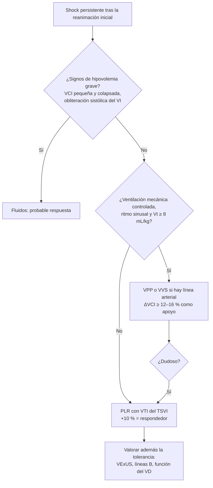

# 03 · Precisión diagnóstica: tipo de shock, función cardiaca, respuesta a fluidos y congestión

Esta página reúne las **cifras de precisión diagnóstica** del POCUS en el paciente en shock. Responde a cinco preguntas. ¿Clasifica bien el tipo de shock y su causa? ¿Estima bien la función ventricular un clínico que no es cardiólogo? ¿Qué parámetro predice mejor la respuesta a fluidos? ¿Qué valor tiene VExUS para detectar congestión y predecir daño renal? ¿Sirve la VCI para anticipar sobrecarga? Para cada estudio se recogen, si están disponibles, la sensibilidad (S), la especificidad (E), las razones de verosimilitud (LR+ y LR−), el AUC, el tamaño muestral y la población.

La técnica de cada medida está en [técnica](02-tecnica.md) y sus límites en [limitaciones](07-limitaciones.md). El impacto clínico (ECA de manejo guiado) está en [impacto](04-impacto.md).

!!! info "Cómo leer las tablas"
    - Las **LR marcadas con asterisco (\*)** no aparecen en el resumen del estudio. Las hemos calculado con las fórmulas LR+ = S / (1 − E) y LR− = (1 − S) / E a partir de la S y la E agrupadas. Son orientativas, porque la LR agrupada de un metaanálisis bivariante no coincide exactamente con la calculada así.
    - Regla práctica de interpretación: una **LR+ > 10** o una **LR− < 0,1** cambian mucho la probabilidad. Entre 5 y 10, o entre 0,1 y 0,2, la cambian de forma moderada. Una LR+ < 2 o una LR− > 0,5 apenas la cambian.
    - «n» es el número de pacientes, salvo que se indique otra cosa (por ejemplo, «sobrecargas»).
    - «VM» significa ventilación mecánica y «RE», respiración espontánea.

---

## 1. POCUS para clasificar el tipo de shock

### 1.1 Metaanálisis por tipo de shock

Hay seis metaanálisis que agrupan estudios de precisión de protocolos multiórgano (RUSH y similares) frente a un diagnóstico final de referencia. Los dos más recientes y amplios son [Yoshida 2023](../../05-fuentes/index.md#yoshida2023) y [Basmaji 2025](../../05-fuentes/index.md#basmaji2025).

| Tipo de shock | Estudio (estudios; n) | S (IC 95 %) | E (IC 95 %) | LR+ | LR− |
|---|---|---|---|---|---|
| **Hipovolémico** | [Yoshida 2023](../../05-fuentes/index.md#yoshida2023) (12; 1132) | 90 % (84–94) | 92 % (88–95) | 11,3\* | 0,11\* |
| | [Basmaji 2025](../../05-fuentes/index.md#basmaji2025) (18; 2088) | 90 % (81–95) | 95 % (90–97) | 18\* | 0,11\* |
| **Cardiogénico** | [Yoshida 2023](../../05-fuentes/index.md#yoshida2023) | 78 % (56–91) | 96 % (92–98) | 19,5\* | 0,23\* |
| | [Basmaji 2025](../../05-fuentes/index.md#basmaji2025) | 95 % (84–98) | 98 % (97–99) | 47,5\* | 0,05\* |
| | [Osawa 2025](../../05-fuentes/index.md#osawa2025b) (8 estudios) | 86,1 % (71,5–93,9) | 95,8 % (94,0–97,2) | 20,5\* | 0,15\* |
| **Distributivo** | [Yoshida 2023](../../05-fuentes/index.md#yoshida2023) | 79 % (71–85) | 96 % (91–98) | 19,7\* | 0,22\* |
| | [Basmaji 2025](../../05-fuentes/index.md#basmaji2025) | 78 % (69–85) | 97 % (94–99) | 26\* | 0,23\* |
| **Obstructivo** | [Yoshida 2023](../../05-fuentes/index.md#yoshida2023) | 82 % (68–91) | 98 % (92–99) | **40 (11–105)** | ≈ 0,2 |
| | [Basmaji 2025](../../05-fuentes/index.md#basmaji2025) | 94 % (85–97) | 99 % (98–100) | 94\* | 0,06\* |
| | [Osawa 2025](../../05-fuentes/index.md#osawa2025b) (8 estudios) | 77,5 % (62,5–87,6) | 97,6 % (93,9–99,1) | 32,3\* | 0,23\* |
| **Mixto** | [Basmaji 2025](../../05-fuentes/index.md#basmaji2025) | 85 % (77–91) | 98 % (91–100) | 42,5\* | 0,15\* |

Otros metaanálisis previos o más pequeños confirman el mismo patrón:

| Metaanálisis | Estudios | Resultado principal |
|---|---|---|
| [Keikha 2018](../../05-fuentes/index.md#keikha2018) (RUSH) | 5 | S global 0,87 (0,80–0,92); E 0,98 (0,96–0,99); AUC 0,98; LR+ 19,19 (11,49–32,06); LR− 0,23 (0,15–0,34) |
| [Stickles 2019](../../05-fuentes/index.md#stickles2019) (urgencias) | 4 | LR+ desde 8,25 (hipovolémico) hasta 40,54 (obstructivo). LR− desde 0,13 (obstructivo) hasta 0,32 (mixto). Riesgo de sesgo global bajo (QUADAS-2) |
| [Karigowda 2024](../../05-fuentes/index.md#karigowda2024) (UCI) | 4 | AUC 0,99 para el shock cardiogénico y el obstructivo, 0,76 para el distributivo y 0,5 para el hipovolémico y el mixto. LR+ del obstructivo 137,56. LR− entre 0,05 (cardiogénico) y 0,22 (mixto) |

!!! tip "Perla clínica: el POCUS «confirma» mejor que «descarta»"
    En todos los metaanálisis la **especificidad es ≥ 92 %** y las **LR+ superan 10**. En cambio, las LR− rondan 0,2 ([Yoshida 2023](../../05-fuentes/index.md#yoshida2023)). Si el POCUS muestra un patrón claro (VD dilatado con VCI pletórica, taponamiento, VI hipocinético), el tipo de shock es muy probable. Si no muestra nada, no se puede descartar el tipo, sobre todo el **distributivo**, que tiene la sensibilidad más baja (78–79 %) ([Basmaji 2025](../../05-fuentes/index.md#basmaji2025)).

!!! warning "Calidad de la evidencia"
    - [Basmaji 2025](../../05-fuentes/index.md#basmaji2025) gradúa la certeza como **muy baja a moderada**. Los estudios son pequeños, de un solo centro y con un estándar de referencia heterogéneo (diagnóstico final clínico).
    - Los intervalos de confianza del shock cardiogénico son amplios en [Yoshida 2023](../../05-fuentes/index.md#yoshida2023): S del 56 al 91 %.
    - En [Karigowda 2024](../../05-fuentes/index.md#karigowda2024) solo hay 4 estudios, y el AUC de 0,5 para el hipovolémico refleja pocos datos, no necesariamente una prueba inútil.

### 1.2 Estudios primarios de RUSH (clásicos)

| Estudio | Diseño y población | n | Hallazgos |
|---|---|---|---|
| [Perera 2010](../../05-fuentes/index.md#perera2010) | Descripción del protocolo RUSH («bomba, depósito, tuberías») | — | Revisión docente. No aporta datos de precisión |
| [Ghane 2015](../../05-fuentes/index.md#ghane2015) | Prospectivo en urgencias (Irán) | 52 | κ 0,7 frente al diagnóstico final. S del 100 % para el shock hipovolémico y el obstructivo (con menor VPP). VPP del 100 % para el distributivo y el mixto (con baja S). Todos los índices > 90 % en el cardiogénico |
| [Ghane 2015b](../../05-fuentes/index.md#ghane2015b) | Prospectivo en urgencias, hecho por urgenciólogo o radiólogo | 77 | κ 0,71. VPN > 97 % para el hipovolémico, el cardiogénico y el obstructivo. κ similar entre urgenciólogo (0,70) y radiólogo (0,73) |
| [Bagheri-Hariri 2015](../../05-fuentes/index.md#bagherihariri2015) | Prospectivo con RUSH ciego al equipo tratante | 25 | κ 0,84. S global del 88 % y E del 96 % |
| [Elbaih 2018](../../05-fuentes/index.md#elbaih2018) | Politraumatizados inestables, con TC corporal total como referencia | 100 | S del 94,2 %. Precisión del 95,2 % en los pacientes en shock |

### 1.3 SHoC-ED: la precisión del POCUS comparada con no hacer POCUS

El ECA SHoC-ED aleatorizó a 273 pacientes hipotensos de urgencias a POCUS precoz o a valoración estándar. No hubo diferencias en la supervivencia ([Atkinson 2018](../../05-fuentes/index.md#atkinson2018)). Su análisis secundario de precisión ([Peach 2023](../../05-fuentes/index.md#peach2023), 270 pacientes con seguimiento completo) es clave para interpretar las cifras anteriores:

| Shock cardiogénico frente a no cardiogénico | Con POCUS | Sin POCUS |
|---|---|---|
| Especificidad | 95,5 % (89,9–98,5) | 93,8 % (87,7–97,5) |
| LR+ | 17,92 | 14,80 |
| LR− | 0,21 | 0,09 |
| Precisión global | 93,7 % (88–97,2) | 93,6 % (87,8–97,2) |

!!! warning "Controversia: ¿aporta el POCUS sobre la clínica?"
    En SHoC-ED, la precisión del grupo con POCUS **no fue mejor** que la de la valoración estándar sin POCUS. Los resultados fueron similares en todos los subtipos de shock ([Peach 2023](../../05-fuentes/index.md#peach2023)). Los metaanálisis de precisión no comparan con la valoración clínica sola, así que una S y una E altas no demuestran valor añadido. Hay que tener en cuenta que, en SHoC-ED, la mayoría de los pacientes tenía sepsis. En esa población, la clínica ya orienta bien y el shock obstructivo es raro.

### 1.4 Precisión por causa concreta

| Causa | Hallazgo o prueba | Estudio | n / estudios | S | E | LR+ / LR− |
|---|---|---|---|---|---|---|
| **Taponamiento** | POCUS multiórgano | [Basmaji 2025](../../05-fuentes/index.md#basmaji2025) | Varios estudios | 100 % (69–100) | 100 % (98–100) | — |
| **Derrame pericárdico** | Ecocardiografía del urgenciólogo (clásico) | [Mandavia 2001](../../05-fuentes/index.md#mandavia2001) | 515 de alto riesgo | 96 % (90,4–98,9) | 98 % (95,8–99,1) | 48\* / 0,04\* |
| | Ventana pericárdica del eFAST (trauma) | [Netherton 2019](../../05-fuentes/index.md#netherton2019) | 75 estudios; 24 350 | 91 % | 94 % | 15,2\* / 0,10\* |
| **TEP** (como causa del shock) | POCUS multiórgano | [Basmaji 2025](../../05-fuentes/index.md#basmaji2025) | Varios estudios | 92 % (71–98) | 99 % (83–100) | — |
| | POCUS multiórgano en críticos | [Melo 2025b](../../05-fuentes/index.md#melo2025b) | 4 estudios; 594 | 90 % (85–94) | 69 % (42–87; I² 95 %) | 3,35 / 0,16 |
| | «Sobrecarga derecha» (ETT, sin definición homogénea) | [Fields 2017](../../05-fuentes/index.md#fields2017) | RS | 53 % (45–61) | 83 % (74–90) | 3,1\* / 0,57\* |
| | Signos aislados en ecocardiografía focalizada | [Mani 2026](../../05-fuentes/index.md#mani2026) | 33 estudios; 3981 | 3–65 % | McConnell 98 %; 60/60 93 %; *notching* del TSVD 98 % | — |
| | Ecocardiografía focalizada más ecografía venosa de piernas | [Mani 2026](../../05-fuentes/index.md#mani2026) | ídem | 62 % | 98 % | 31\* / 0,39\* |
| | VD/VI > 1 (urgenciólogo) | [Dresden 2014](../../05-fuentes/index.md#dresden2014) | 146 (30 con TEP) | 50 % (32–68) | 98 % (95–100) | 29 / 0,51 |
| | FoCUS con FC ≥ 100 o PAS < 90 | [Daley 2019](../../05-fuentes/index.md#daley2019) | 136 | 92 % (78–98) | 64 % (53–73) | 2,6\* / 0,12\* |
| | FoCUS con FC ≥ 110 | [Daley 2019](../../05-fuentes/index.md#daley2019) | 98 | **100 % (88–100)** | 63 % (51–74) | — |
| **Disfunción del VD** en el TEP confirmado (POCUS frente a ecocardiografía reglada) | VD > VI o TAPSE bajo | [Thomas 2026](../../05-fuentes/index.md#thomas2026) | 194 (retrospectivo) | 76,8 % | 85,9 % | 5,4\* / 0,27\* |
| **Neumotórax** (trauma) | Ecografía torácica frente a radiografía en decúbito | [Chan 2020](../../05-fuentes/index.md#chan2020) (Cochrane) | 9 estudios; 1271 | 91 % (85–94) | 99 % (97–100) | 91\* / 0,09\* |
| | Ídem, en metaanálisis clásico | [Ding 2011](../../05-fuentes/index.md#ding2011) | RS | 88 % | 99 % | 88\* / 0,12\* |
| | Componente torácico del eFAST | [Netherton 2019](../../05-fuentes/index.md#netherton2019) | 75 estudios | 69 % | 99 % | 69\* / 0,31\* |
| **Hemoperitoneo** (shock hemorrágico) | FAST en hipotensos | [Netherton 2019](../../05-fuentes/index.md#netherton2019) | Subgrupo | 74 % | 95 % | 14,8\* / 0,27\* |
| | POCUS en trauma cerrado, abdomen | [Stengel 2018](../../05-fuentes/index.md#stengel2018) (Cochrane) | 34 estudios; 8635 | 68 % (59–75) | 95 % (92–97) | — |
| **Hipovolemia** (tipo de shock) | POCUS multiórgano | [Basmaji 2025](../../05-fuentes/index.md#basmaji2025) | 18 estudios | 90 % | 95 % | 18\* / 0,11\* |
| **Sepsis** (causa) | POCUS multiórgano | [Basmaji 2025](../../05-fuentes/index.md#basmaji2025) | Varios estudios | 78 % (18–98) | 96 % (87–99) | 19,5\* / 0,23\* |
| **Edema pulmonar cardiogénico** | Ecografía pulmonar frente a radiografía | [Maw 2019](../../05-fuentes/index.md#maw2019) | 6 estudios; 1827 | 88 % (75–95) | 90 % | 8,8\* / 0,13\* |

!!! tip "Perla clínica: el VD normal en el paciente en shock"
    - La ecocardiografía focalizada es **poco sensible para diagnosticar TEP** en general: S del 53 % ([Fields 2017](../../05-fuentes/index.md#fields2017)).
    - En cambio, **cuando el TEP es la causa del shock, casi siempre hay dilatación del VD**. En pacientes con FC ≥ 110, la S de la FoCUS llega al 100 % ([Daley 2019](../../05-fuentes/index.md#daley2019)).
    - Por eso, en el paciente hipotenso, **un VD de tamaño normal hace muy improbable un TEP masivo como causa del shock**. El consenso ESICM lo recoge como habilidad básica, con recomendación fuerte ([Robba, 2021](../../05-fuentes/index.md#robba2021)).
    - El algoritmo de la ESC para la sospecha de TEP de alto riesgo sitúa la ecocardiografía a pie de cama como prueba inicial si no se puede hacer una angio-TC inmediata ([Konstantinides, 2019](../../05-fuentes/index.md#konstantinides2019)).

!!! warning "Error frecuente: interpretar como TEP un VD dilatado"
    La dilatación del VD es **específica pero no patognomónica**: la E es del 98 % en [Dresden 2014](../../05-fuentes/index.md#dresden2014). También aparece en la hipertensión pulmonar crónica, el infarto de VD, el SDRA o la ventilación con presiones altas. Hay dos pistas de cronicidad que orientan: la **pared libre del VD engrosada** y un VD muy dilatado con buena función. La guía ESICM considera básica la valoración del grosor de la pared libre desde la ventana subcostal ([Robba, 2021](../../05-fuentes/index.md#robba2021)).

---

## 2. FoCUS por no cardiólogos: función del VI «a ojo» y del VD

### 2.1 FEVI por estimación visual

| Estudio | Tipo | Población y operadores | Resultado |
|---|---|---|---|
| [Albaroudi 2022](../../05-fuentes/index.md#albaroudi2022) | RS/MA (12 estudios; 1131 pacientes; 159 ecografistas clínicos) | Urgencias. Urgenciólogo frente a experto | Estimación visual (7 estudios; 786 exploraciones), función normal o anormal: **κ 0,68 (0,57–0,79)**; S del 89 % (80–94); E del 85 % (80–89); **LR+ 5,98; LR− 0,13**. Normal, reducida o muy reducida: κ ponderado 0,70 (0,61–0,80). Calidad baja: estudios pequeños, de un centro y con muestras de conveniencia |
| [Allimant 2025](../../05-fuentes/index.md#allimant2025) | RS (42 estudios; 6598 pacientes; 351 médicos no expertos) | Pacientes no seleccionados con IC, en su mayoría ambulatorios | Estimación visual en el 90,2 % de los estudios. Acuerdo con el experto: κ 0,72 (0,63–0,83), que sube a κ 0,84 (0,71–0,89) con el mismo ecógrafo. La formación tuvo una mediana de 4,5 h de teoría y 25 exploraciones prácticas |
| [Bahl 2021](../../05-fuentes/index.md#bahl2021) | Prospectivo (n = 113) | Urgencias. Dos urgenciólogos con formación de *fellowship*. Referencia: Simpson en ecocardiografía de cardiología | Visual: κ 0,94 y 0,97. Acortamiento fraccional: κ 0,70 y 0,66. EPSS: **κ 0,40 y 0,38**. S para la disfunción grave: visual 85–93 %; acortamiento fraccional 50–73 %; EPSS 11–18 % |
| [Johnson 2016](../../05-fuentes/index.md#johnson2016) | Prospectivo (n = 178) | Planta. 10 internistas formados | Cualquier grado de disfunción del VI: S 0,91 (0,80–0,97); E 0,88 (0,81–0,93); κ 0,77 |
| [Vignon 2011](../../05-fuentes/index.md#vignon2011) | Prospectivo (n = 201) | UCI. Residentes no cardiólogos tras 12 h de formación | Función sistólica global del VI: κ 0,84. VI dilatado: κ 0,90. VD dilatado: κ 0,76. VCI dilatada: κ 0,79. Derrame pericárdico: κ 0,79 |

!!! tip "Perla clínica: mejor la «vista» que la regla"
    En manos de clínicos formados, la **estimación visual** de la FEVI (normal, reducida o muy reducida) funciona mejor que las medidas lineales simples. Hay que desconfiar del **EPSS** como medida aislada en urgencias: en [Bahl 2021](../../05-fuentes/index.md#bahl2021) su S para la disfunción grave fue del 11–18 %. La estimación visual se aprende pronto: la mediana de práctica fue de 25 exploraciones en [Allimant 2025](../../05-fuentes/index.md#allimant2025). Ver [formación](08-formacion.md).

### 2.2 VD y TEP

Resumen de lo anterior: la ecocardiografía focalizada es poco sensible para diagnosticar TEP y muy específica cuando aparecen signos «duros».

- **McConnell** y **60/60**: E del 98 % y del 93 % ([Mani 2026](../../05-fuentes/index.md#mani2026)).
- **VD/VI > 1**: E del 98 % y LR+ de 29 ([Dresden 2014](../../05-fuentes/index.md#dresden2014)).
- La sensibilidad aumenta mucho cuando el TEP tiene repercusión hemodinámica ([Daley 2019](../../05-fuentes/index.md#daley2019)).
- En el TEP confirmado, el urgenciólogo identifica la disfunción del VD con S del 76,8 % y E del 85,9 % (κ 0,63). El acuerdo mejora cuando la disfunción es moderada o grave ([Thomas 2026](../../05-fuentes/index.md#thomas2026)).

---

## 3. Predicción de respuesta a fluidos

Solo **alrededor del 50 %** de los pacientes con insuficiencia circulatoria aguda aumenta su volumen sistólico tras un bolo de fluidos ([Orso 2020](../../05-fuentes/index.md#orso2020); [Long 2017](../../05-fuentes/index.md#long2017)). En los estudios incluidos en [Chaves 2024](../../05-fuentes/index.md#chaves2024), la prevalencia de respondedores fue del 49,9 %. Las guías recomiendan las **variables dinámicas frente a las estáticas** ([Monnet, 2025](../../05-fuentes/index.md#monnet2025); [Prescott, 2026](../../05-fuentes/index.md#prescott2026)).

### 3.1 Vena cava inferior (VCI)

#### Metaanálisis globales o mixtos

| Metaanálisis | Estudios (n) | Población | S | E | AUC | LR+ / LR− | Comentario |
|---|---|---|---|---|---|---|---|
| [Long 2017](../../05-fuentes/index.md#long2017) | 17 (533) | Mixta, adultos y niños | 63 % (56–69) | 73 % (67–78) | 0,79 | 2,3\* / 0,51\* | Rinde mejor en VM. «Una prueba negativa no descarta la respuesta a fluidos» |
| [Orso 2020](../../05-fuentes/index.md#orso2020) | 20 en el MA (26 en la RS) | Críticos, VM o RE | 71 % (62–80) | 75 % (64–85) | 0,71 (0,46–0,83) | 2,8\* / 0,39\* | **Heterogeneidad extrema**: «no parece un método fiable» |
| [Das 2018](../../05-fuentes/index.md#das2018) | 20 (761) | RE (330) y VM (431) | RE: 80 % (68–89); VM: 79 % (67–86) | RE: 79 % (60–90); VM: 70 % (63–76) | — | RE 3,8\* / 0,25\*; VM 2,6\* / 0,30\* | Plantea la variación **baja** de la VCI como predictor de **ausencia** de respuesta |
| [Wenwen 2025](../../05-fuentes/index.md#wenwen2025) | 29 (1833) | Shock | 82 % (75–87) | 82 % (77–87) | 0,89 (0,86–0,91) | **4,58 / 0,22** | I² del 83 % en la S y del 79 % en la E. La heterogeneidad se explica por el umbral, el estándar de referencia y el tipo de fluido |
| [Zhang 2025](../../05-fuentes/index.md#zhang2025b) | 21 | Sepsis | ΔVCI 84 %; distensibilidad 79 %; colapsabilidad 92 % | 87 %; 82 %; 93 % | — | ΔVCI 6,5\* / 0,18\* | Incluye bases de datos chinas. Posible sesgo de publicación, con resultados más optimistas que el resto |
| [Berikashvili 2025](../../05-fuentes/index.md#berikashvili2025) | 9 (560) (MA en red) | VM y RE | — | — | — | — | El índice de la VCI supera a los diámetros absolutos y se comporta de forma parecida al índice yugular. Rinde de forma similar en VM y en RE |

#### En ventilación mecánica (distensibilidad o variación de la VCI)

| Estudio | Estudios (n) | S | E | AUC | Umbral | Comentario |
|---|---|---|---|---|---|---|
| [Si 2018](../../05-fuentes/index.md#si2018) | 12 (753) | Vt ≥ 8 mL/kg con PEEP ≤ 5: **80 %**. Vt < 8 o PEEP > 5: **66 %** | 94 % frente a 68 % | 0,88 frente a 0,70 | 16 ± 2 % frente a 14 ± 5 % | **Con ventilación protectora pierde valor**: el DOR baja de 68 a 4 |
| [Huang 2018](../../05-fuentes/index.md#huang2018) | 603 pacientes en shock | 69 % (51–83) | 80 % (66–89) | 0,82 (0,79–0,85) | 8–21 % | Rendimiento moderado |
| [Chaves 2024](../../05-fuentes/index.md#chaves2024) | 8 estudios de ΔVCI (de 69 en total) | — | — | **0,83 (0,78–0,89)** | 15,4 % (13,3–17,6) | Inferior a VPP, VVS y PVI |
| [Alvarado Sánchez 2021](../../05-fuentes/index.md#alvaradosanchez2021) | 33 (1352), Vt ≤ 8 mL/kg | — | — | ΔVCI 0,86 | — | Sin esfuerzo respiratorio ni arritmias |
| [Vignon 2017](../../05-fuentes/index.md#vignon2017) | Estudio primario multicéntrico (540), referencia PLR con VTI | ΔVCI ≥ 8 %: 55 % (50–59) | 70 % (66–75) | Menor que ΔVCS | — | ΔVCI medible solo en el 78,1 % de los pacientes. La ΔVCS por ETE tuvo la mejor E (84 %) |
| [Meco 2026](../../05-fuentes/index.md#meco2026) | Revisión paraguas (7 MA; 123 estudios; 10 300 pacientes) | — | — | ΔVCI y PVI: **0,82–0,83**, las menos fiables | — | «No deben usarse aisladas» |

#### En respiración espontánea (colapsabilidad de la VCI)

| Estudio | Diseño (n) | S | E | AUC | Umbral | Comentario |
|---|---|---|---|---|---|---|
| [Cardozo Júnior 2023](../../05-fuentes/index.md#cardozo2023) | RS/MA, 8 estudios (497) | **63 % (46–78)** | 83 % (76–87) | 0,83 (0,80–0,86) | Variable | Riesgo de sesgo alto. Con una probabilidad previa del 50 % se clasifica mal a muchos pacientes. «No debe usarse aislada» |
| [Airapetian 2015](../../05-fuentes/index.md#airapetian2015) | Prospectivo en UCI (59) | — | cVCI > 42 %: **97 %** (VPP 90 %) | 0,62 (0,49–0,74) | 42 % | La VCI **no predice** en general, pero una colapsabilidad muy alta sí «confirma» |
| [Preau 2017](../../05-fuentes/index.md#preau2017) | Prospectivo, sepsis sin intubar (90) | 84 % | 90 % | 0,89 (0,82–0,97) | ≥ 48 % con **inspiración profunda estandarizada** | LR+ 8,4\* / LR− 0,18\* |
| [Caplan 2020](../../05-fuentes/index.md#caplan2020) | *Post hoc* de 2 cohortes (81) | No estandarizada: 66 %; estandarizada: **93 %** | 92 %; **98 %** | 0,85 frente a 0,98 | 33 % frente a 44 % | Medir **4 cm caudal a la aurícula derecha** y con inspiración estandarizada mejora mucho la precisión |
| [Bortolotti 2018](../../05-fuentes/index.md#bortolotti2018) | Prospectivo, **arritmias** (55) | 93 % | 88 % | 0,93 (0,86–1) | cVCI ≥ 39 % (inspiración profunda) | También un diámetro inspiratorio < 11 mm: S del 83 % y E del 88 %. Muestra pequeña y seleccionada |

!!! warning "Error frecuente: «la VCI es pequeña, le doy fluidos» o «la VCI está llena, no responde»"
    - Una VCI **normal o dilatada no descarta** que el paciente responda a fluidos. Con una sensibilidad del 63 %, la colapsabilidad no detecta a más de un tercio de los respondedores en respiración espontánea ([Cardozo Júnior 2023](../../05-fuentes/index.md#cardozo2023)).
    - En VM con ventilación protectora (Vt < 8 mL/kg o PEEP > 5), la variación de la VCI rinde poco, con AUC de 0,70 ([Si 2018](../../05-fuentes/index.md#si2018)).
    - Solo los **extremos** tienen valor para «confirmar»: una colapsabilidad > 42–48 % con inspiración estandarizada ([Airapetian 2015](../../05-fuentes/index.md#airapetian2015); [Preau 2017](../../05-fuentes/index.md#preau2017)).
    - El consenso ESICM de habilidades básicas **desaconseja usar la ecografía para determinar la respuesta a fluidos** en el shock persistente sin signos de hipovolemia, como habilidad básica (recomendación fuerte en contra). Sí considera básica la detección de la **hipovolemia grave**: VCI pequeña y colapsada, cavidades pequeñas y obliteración sistólica del VI ([Robba, 2021](../../05-fuentes/index.md#robba2021)).

### 3.2 Elevación pasiva de piernas (PLR) con VTI o gasto cardiaco

| Estudio | Estudios (n) | Medida | S | E | AUC | Umbral | Comentario |
|---|---|---|---|---|---|---|---|
| [Monnet 2016](../../05-fuentes/index.md#monnet2016) | 21 (991 pacientes; 995 sobrecargas) | Cambio del GC con PLR (6 estudios por ecocardiografía) | **85 % (81–88)** | **91 % (88–93)** | **0,95 ± 0,01** | **≥ 10 ± 2 %** | LR+ 9,4\* / LR− 0,16\*. Correlación de 0,76 con el cambio tras fluidos |
| [Monnet 2016](../../05-fuentes/index.md#monnet2016) | 8 (432 sobrecargas) | Cambio de la **presión de pulso** con PLR | 56 % | 83 % | 0,77 ± 0,05 | — | Mala sensibilidad: **mide flujo, no presión** |
| [Cherpanath 2016](../../05-fuentes/index.md#cherpanath2016) | 23 (1013 pacientes; 1034 sobrecargas) | PLR global | 86 % (79–92) | 92 % (88–96) | 0,95 (0,92–0,98) | — | No depende del modo ventilatorio, del tipo de fluido ni de la posición inicial. Con la presión de pulso: S 58 % y E 83 %. Con variables de flujo: S 85 % y E 92 % |
| [Meco 2026](../../05-fuentes/index.md#meco2026) | Revisión paraguas en VM | PLR | — | — | 0,91 (0,88–0,93) | — | Por debajo de la prueba de Vt (0,96) y de la EEOT (0,95) |
| [Lamia 2007](../../05-fuentes/index.md#lamia2007) (clásico) | 24 en **RE** | VS por ETT con PLR | 77 % | 100 % | — | ≥ 12,5 % | Ni el área telediastólica del VI ni el cociente E/Ea predijeron la respuesta |
| [Saji 2025](../../05-fuentes/index.md#saji2025) | RS de 3 estudios (199; sepsis o shock séptico) | VTI del TSVI (PLR o sobrecarga) | 78–96 % | 91–100 % | 0,84–0,99 | > 7 % a 16 % | Evidencia escasa |

!!! note "Precisión de la propia medida de la VTI"
    - Para una VTI precisa hay que **promediar 3 latidos en ritmo sinusal y 5 en fibrilación auricular** ([Jozwiak 2019](../../05-fuentes/index.md#jozwiak2019)).
    - El **cambio mínimo significativo** entre dos exploraciones es del **11 %** si las hace el mismo operador y del **14 %** si las hacen dos operadores distintos ([Jozwiak 2019](../../05-fuentes/index.md#jozwiak2019)).
    - Consecuencia práctica: la PLR debe evaluarla **el mismo operador, sin mover el transductor** y comparando antes y después. El umbral del 10 % está justo en el límite de lo que el ETT puede detectar.

### 3.3 Variación respiratoria de la VTI o del pico de velocidad (Vpeak) aórtico

| Estudio | Diseño (n) | Población | Resultado |
|---|---|---|---|
| [Vignon 2017](../../05-fuentes/index.md#vignon2017) | Multicéntrico (540) | VM, shock de cualquier causa | ΔVmáx aórtica ≥ 10 %: S del **79 %** (75–83), la mejor de los índices estudiados; E del 64 % (59–69). Medible en el 78 % de los pacientes |
| [Pei 2020](../../05-fuentes/index.md#pei2020) | MA de 31 estudios (1854) | ΔVpeak arterial (aórtica, carotídea, braquial…) | S 0,82; E 0,83; LR+ 4,17; LR− 0,22; AUC 0,90. Publicado en chino; incluye bases de datos chinas |
| [Xie 2023](../../05-fuentes/index.md#xie2023) | Observacional (60) | Posoperados con Vt < 8 mL/kg; la respuesta se definió por PLR | Variación de la VTI: AUC 0,919 (S 71,9 %, E 75 %, umbral 12,5 %). ΔVpeak: AUC 0,905. VPP: AUC 0,797, con zona gris del 58 % |

### 3.4 Doppler carotídeo (VTI carotídea, ΔVpeak, tiempo de flujo corregido)

| Metaanálisis | Estudios (n) | Parámetro | S | E | AUC | Calidad |
|---|---|---|---|---|---|---|
| [Beier 2020](../../05-fuentes/index.md#beier2020) | 17 (956), RS sin MA | FTc: S 60–73 %, E 82–92 %, AUC 0,75–0,88. ΔCDPV: umbral 9–14 %, S 73–86 %, E 78–86 %, AUC 0,81–0,91 | — | — | — | Riesgo de sesgo moderado |
| [Singla 2023](../../05-fuentes/index.md#singla2023) | 10 (438) | FTc | 76 % | 88 % | 0,91 | Anestesia y críticos |
| | | ΔVpeak carotídea | 83 % | 81 % | 0,89 | |
| [Lipszyc 2024](../../05-fuentes/index.md#lipszyc2024) | 13 (648), **solo VM** | ΔCDPV | 79 % (74–84) | 85 % (76–90) | — | Calidad global **baja** (GRADE) |
| [Walker 2024](../../05-fuentes/index.md#walker2024) | 17 (842; 1048 sobrecargas), críticos | Carótida en conjunto | 73 % (66–78) | 82 % (72–90) | 0,81 | «Capacidad limitada». Riesgo de sesgo alto o incierto |
| | | ΔCDPV | 72 % (64–80) | 87 % (73–94) | 0,82 | GRADE bajo |
| | | Flujo carotídeo | 70 % (56–80) | 80 % (50–94) | 0,77 | |

!!! warning "Reproducibilidad de la carótida"
    En voluntarios sanos, las medidas carotídeas y la colapsabilidad de la VCI que tomaron residentes de urgencias tuvieron una **fiabilidad interobservador inadecuada para el uso clínico**. Las medidas de volumen sistólico por ETT fueron las más reproducibles ([Bussmann 2019](../../05-fuentes/index.md#bussmann2019)). La carótida es atractiva por lo accesible, pero su evidencia es de baja calidad.

### 3.5 Minibolo de fluidos (*mini-fluid challenge*) y otras pruebas funcionales

| Estudio | Diseño (n) | Prueba | S | E | AUC | Umbral |
|---|---|---|---|---|---|---|
| [Muller 2011](../../05-fuentes/index.md#muller2011) (clásico) | Prospectivo (39 en VM) | Cambio de la VTI subaórtica tras 100 mL en 1 min | 95 % | 78 % | 0,92 (0,78–0,98) | ≥ 10 % |
| [Messina 2019](../../05-fuentes/index.md#messina2019) | MA de 21 estudios (805; 870 sobrecargas), UCI y quirófano | Minibolo | 82 % (76–88) | 83 % (77–89) | 0,91 (0,85–0,97) | 5 % (3–7) |
| | | Oclusión teleespiratoria (EEOT) | 86 % (74–94) | 91 % (85–95) | 0,96 (0,92–1,00) | 5 % (4–8) |
| [Meco 2026](../../05-fuentes/index.md#meco2026) | Revisión paraguas en VM | Prueba de volumen corriente (TVC) / EEOT | — | — | 0,96 / 0,95 | — |

!!! note "El minibolo y la precisión del ETT"
    Con un minibolo, el cambio esperado de la VTI es pequeño (umbral del 5 % en [Messina 2019](../../05-fuentes/index.md#messina2019)). Ese cambio es **inferior al cambio mínimo que el ETT puede detectar entre dos exploraciones**: 11 % con el mismo operador ([Jozwiak 2019](../../05-fuentes/index.md#jozwiak2019)). Con ecografía transtorácica, el minibolo solo tiene sentido si se mide de forma continua, sin mover el transductor y promediando latidos.

### 3.6 Comparación con PVC, VPP y VVS

| Parámetro | Fuente | AUC | Umbral medio | Condiciones de validez |
|---|---|---|---|---|
| **PVC** | [Marik 2013](../../05-fuentes/index.md#marik2013) (43 estudios) | **0,56 (0,54–0,58)** | — | Correlación de 0,18 con el cambio del índice sistólico. «Debería abandonarse» |
| | [Chaves 2024](../../05-fuentes/index.md#chaves2024) (12 estudios) | 0,77 (0,69–0,87) | 9,0 mmHg | — |
| **VPP** | [Chaves 2024](../../05-fuentes/index.md#chaves2024) (40 estudios) | 0,87 (0,84–0,90) | 11,5 % | VM controlada, sin esfuerzo respiratorio, ritmo sinusal y Vt suficiente |
| | [Alvarado Sánchez 2021](../../05-fuentes/index.md#alvaradosanchez2021) (Vt ≤ 8) | 0,82 | — | Influida por la distensibilidad pulmonar |
| **VVS** | [Chaves 2024](../../05-fuentes/index.md#chaves2024) (24 estudios) | 0,87 (0,84–0,91) | 12,1 % | Igual que la VPP |
| **PVI** (pletismografía) | [Chaves 2024](../../05-fuentes/index.md#chaves2024) (17 estudios) | 0,88 (0,82–0,94) | 13,8 % | Igual que la VPP |
| **ΔVCI** | [Chaves 2024](../../05-fuentes/index.md#chaves2024) (8 estudios) | 0,83 (0,78–0,89) | 15,4 % | VM, Vt ≥ 8 mL/kg ([Si 2018](../../05-fuentes/index.md#si2018)) |
| **PLR con GC o VTI** | [Monnet 2016](../../05-fuentes/index.md#monnet2016) | 0,95 | +10 % | Válida en RE, en VM y con arritmias. Necesita medir flujo en tiempo real |

La precisión de todos estos predictores depende de factores **técnicos**: el volumen de la sobrecarga, el método de medida del flujo y el tiempo de apnea en la EEOT. También de factores **clínicos**, como la PEEP y la dosis de noradrenalina durante la PLR o la EEOT ([Alvarado Sánchez 2023](../../05-fuentes/index.md#alvaradosanchez2023)).

---

## 4. VExUS y congestión venosa

VExUS combina el diámetro de la VCI con el Doppler de las venas suprahepáticas, la porta y las venas intrarrenales. Se describió en 2020 ([Beaubien-Souligny, 2020](../../05-fuentes/index.md#beaubien2020)). La técnica está en [técnica](02-tecnica.md) y en la guía práctica de [Assavapokee, 2024](../../05-fuentes/index.md#assavapokee2024).

### 4.1 Correlación con la presión auricular derecha (PAD) y el cateterismo

| Estudio | Diseño (n) | Referencia | Resultado |
|---|---|---|---|
| [Longino 2023](../../05-fuentes/index.md#longino2023) (piloto) | Prospectivo (cateterismo derecho) | PAD | Asociación de la PAD con el grado VExUS (R² 0,68). AUC para PAD ≥ 12 mmHg: **VExUS 0,99** (0,96–1) frente a 0,79 del diámetro de la VCI |
| [Longino 2024](../../05-fuentes/index.md#longino2024) | Prospectivo (81 pacientes con cateterismo derecho) | PAD, PAPm, PCP | VExUS 2: β +4,8 mmHg de PAD. VExUS 3: β +11 mmHg. **AUC para PAD > 10 mmHg: VExUS 0,90** (0,83–0,97); diámetro de la VCI 0,77; colapsabilidad 0,65. AUC para PAD < 7: VExUS 0,79; VCI 0,74; colapsabilidad 0,62 |
| [Klompmaker 2026](../../05-fuentes/index.md#klompmaker2026b) | RS/MA (32 estudios; 3142) | PVC o PAD | Estudios diagnósticos no agregables: **S 78–95 % y E 80–90 %** para detectar PVC o PAD elevadas |
| [Song 2025](../../05-fuentes/index.md#song2025) | Prospectivo multicéntrico en sepsis (108) | PVC | **Sin correlación** entre VExUS y PVC |
| [Carsetti 2026](../../05-fuentes/index.md#carsetti2026) | RS/MA (8 estudios en el análisis principal) | Parámetros ecocardiográficos | VExUS 2–3 se asocia a menor TAPSE (−2,35 mm), pero con valores medios aún normales. Sin asociación fuera de la IC. VExUS indica **congestión establecida**, no disfunción del VD |

### 4.2 Predicción de lesión renal aguda (LRA) y pronóstico

| Estudio | Población (n) | Resultado | Certeza o calidad |
|---|---|---|---|
| [Beaubien-Souligny 2020](../../05-fuentes/index.md#beaubien2020) (derivación) | Posoperatorio de cirugía cardiaca (145; 706 exploraciones) | VExUS grave: **HR 3,69** (1,65–8,24) para LRA; ajustado, HR 2,82 (1,21–6,55). Al ingreso en UCI, **LR+ 6,37** (2,19–18,50). Superior a la PVC | Análisis *post hoc* de un solo centro |
| [Melo 2025](../../05-fuentes/index.md#melo2025) | RS/MA de 9 estudios (1036 críticos) | VExUS ≥ 2 y LRA: **OR 2,63** (1,06–6,54; I² 74 %). En cirugía cardiaca: OR 3,86 (2,32–6,42; I² 0 %). Mortalidad: OR 1,25 (0,71–2,19), no significativa | Estudios observacionales |
| [Klompmaker 2026](../../05-fuentes/index.md#klompmaker2026b) | RS/MA de 32 estudios (3142) | **Pacientes cardiacos:** LRA OR 4,44 (2,34–8,43; certeza moderada) y mortalidad OR 3,17 (1,30–7,75; baja). **Críticos generales:** LRA OR 1,45 (0,70–2,99; muy baja) y mortalidad OR 1,25 (0,77–2,03; baja), sin asociación | GRADE |
| [Andrei 2023](../../05-fuentes/index.md#andrei2023) | UCI general, multicéntrico (145) | VExUS 2 en el 16 % y VExUS 3 en el 6 %. VExUS ≥ 2 **no se asoció** a LRA (OR 0,499) ni a mortalidad | — |
| [Song 2025](../../05-fuentes/index.md#song2025) | **Sepsis**, 4 UCI (108) | VExUS ≥ 2 en el 18 % el día 1 y en el 6 % el día 5. Sin asociación con LRA (OR 1,82; 0,62–5,31) ni con mortalidad | — |
| [Klompmaker 2025](../../05-fuentes/index.md#klompmaker2025) | UCI general (138) | VExUS ≥ 2 en el 12 %. Asociado a MAKE-30: **OR 4,3** (1,2–20,7) | Un solo centro |
| [Viana-Rojas 2023](../../05-fuentes/index.md#vianarojas2023) | Síndrome coronario agudo (77) | VExUS ≥ 1 y LRA: OR ajustada 6,15 (1,26–29,94). LRA según el grado: 10,8 % (grado 0), 23,8 % (1), 75 % (2) y 100 % (3) | Muestra pequeña |

### 4.3 VExUS en la insuficiencia cardiaca aguda

| Estudio | n | Resultado |
|---|---|---|
| [Chaves 2026](../../05-fuentes/index.md#chaves2026) (RS/MA bayesiano) | 5 estudios; 565 | Mortalidad hospitalaria: 1,9 % con VExUS ≤ 1 frente a **14,1 % con VExUS ≥ 2**. OR 0,175 (IC creíble 95 % 0,061–0,497) a favor del VExUS bajo |
| [Anastasiou 2024](../../05-fuentes/index.md#anastasiou2024) | 290 | VExUS 3 en el 39 %. Asociado a mortalidad hospitalaria (OR 8,03; 2,25–28,61). Mejora la escala GWTG-HF, algo que no consiguen la VCI ni la función de la AD |
| [Landi 2024](../../05-fuentes/index.md#landi2024) (urgencias) | 50 | VExUS 3 en el 56 % al ingreso. Todos los fallecidos tenían VExUS 3 en la primera exploración |

!!! warning "Controversia: VExUS en la sepsis frente a la cardiopatía"
    - La asociación de VExUS con la LRA es **sólida en pacientes cardiacos** (cirugía cardiaca, IC, SCA): OR 4,44, certeza moderada ([Klompmaker 2026](../../05-fuentes/index.md#klompmaker2026b)).
    - En **críticos generales y en la sepsis** es **inconsistente o nula** ([Andrei 2023](../../05-fuentes/index.md#andrei2023); [Song 2025](../../05-fuentes/index.md#song2025)).
    - La prevalencia de VExUS ≥ 2 en la UCI general es baja: 12–22 % ([Andrei 2023](../../05-fuentes/index.md#andrei2023); [Klompmaker 2025](../../05-fuentes/index.md#klompmaker2025)). Eso reduce el valor predictivo positivo.
    - Toda la evidencia es observacional. **No hay ECA** que demuestre que actuar según VExUS mejore los resultados. El estudio multicéntrico ANDROMEDA-VEXUS está en marcha en el shock séptico ([Prager, 2023](../../05-fuentes/index.md#prager2023)).

---

## 5. Predicción de sobrecarga con la VCI: SHoC-IVC

[Dunfield 2023](../../05-fuentes/index.md#dunfield2023) es un análisis secundario de SHoC-ED. Incluye a pacientes hipotensos de urgencias en respiración espontánea: 129 con VCI valorable y 125 con estado de volemia determinado (107 depleciones, 13 normovolemias y **solo 7 sobrecargas**).

| Criterio | S | E | AUC | LR+ / LR− |
|---|---|---|---|---|
| VCI > 2,5 cm con colapsabilidad < 50 % para predecir **sobrecarga de volumen** | 85,7 % | 86,4 % | 0,92 | 6,3\* / 0,17\* |

!!! note "Interpretación"
    Una VCI dilatada y poco colapsable en un paciente hipotenso que respira espontáneamente orienta a sobrecarga o a presión de llenado alta, y aconseja **no dar más fluidos a ciegas**. Pero el dato procede de **solo 7 pacientes sobrecargados**, y el estado de volemia se asignó revisando la historia clínica. Se ajusta a lo observado con el cateterismo: el diámetro de la VCI discrimina una PAD > 10 mmHg con AUC de 0,77, y VExUS con 0,90 ([Longino 2024](../../05-fuentes/index.md#longino2024)).

---

## 6. Tabla resumen: qué parámetro usar según el paciente

| Situación | Parámetro preferente | Cifras de referencia | Alternativas y comentarios |
|---|---|---|---|
| **VM controlada, ritmo sinusal, Vt ≥ 8 mL/kg y PEEP ≤ 5** | VPP o VVS (con línea arterial). **ΔVCI** como apoyo | VPP: AUC 0,87 y umbral ≈ 11,5 % ([Chaves 2024](../../05-fuentes/index.md#chaves2024)). ΔVCI: S 80 %, E 94 %, AUC 0,88 y umbral ≈ 16 % ([Si 2018](../../05-fuentes/index.md#si2018)) | ΔVmáx aórtica ≥ 10 %: S del 79 % ([Vignon 2017](../../05-fuentes/index.md#vignon2017)). Carótida ΔCDPV: S 79 % y E 85 % ([Lipszyc 2024](../../05-fuentes/index.md#lipszyc2024)) |
| **VM protectora (Vt < 8 mL/kg o PEEP > 5)** | **PLR con VTI**, EEOT o prueba de Vt | PLR: AUC 0,91 en VM ([Meco 2026](../../05-fuentes/index.md#meco2026)). EEOT: AUC 0,96 ([Messina 2019](../../05-fuentes/index.md#messina2019)) | ΔVCI: S 66 %, E 68 %, AUC 0,70 ([Si 2018](../../05-fuentes/index.md#si2018)). No usarla aislada |
| **Respiración espontánea, ritmo sinusal** | **PLR con VTI del TSVI** (+10 %) | S 85 %, E 91 % y AUC 0,95 ([Monnet 2016](../../05-fuentes/index.md#monnet2016)). En RE: S 77 % y E 100 % ([Lamia 2007](../../05-fuentes/index.md#lamia2007)) | Colapsabilidad de la VCI: S 63 % y E 83 % ([Cardozo Júnior 2023](../../05-fuentes/index.md#cardozo2023)). Con inspiración estandarizada, ≥ 44–48 %: S 84–93 % y E 90–98 % ([Preau 2017](../../05-fuentes/index.md#preau2017); [Caplan 2020](../../05-fuentes/index.md#caplan2020)) |
| **Arritmia (FA)** | **PLR con VTI promediando 5 latidos** | Cambio mínimo detectable de la VTI del 11–14 % ([Jozwiak 2019](../../05-fuentes/index.md#jozwiak2019)) | VPP y VVS no son válidas. Colapsabilidad de la VCI con inspiración profunda ≥ 39 %: S 93 % y E 88 % (estudio pequeño; [Bortolotti 2018](../../05-fuentes/index.md#bortolotti2018)) |
| **Imposible hacer la PLR** (fractura, HTIC, cirugía abdominal) | Minibolo de 100 mL con VTI, o EEOT en VM | Minibolo: AUC 0,91 y umbral 5 % ([Messina 2019](../../05-fuentes/index.md#messina2019)); VTI +10 % en [Muller 2011](../../05-fuentes/index.md#muller2011) | El cambio esperado es menor que el mínimo detectable por ETT entre dos exploraciones ([Jozwiak 2019](../../05-fuentes/index.md#jozwiak2019)) |
| **¿Tolerará más fluidos?** (en cualquier situación) | **VExUS**, diámetro de la VCI y líneas B | VExUS con PAD > 10 mmHg: AUC 0,90 ([Longino 2024](../../05-fuentes/index.md#longino2024)). VCI > 2,5 cm con colapsabilidad < 50 % para sobrecarga: S 86 % y E 86 % ([Dunfield 2023](../../05-fuentes/index.md#dunfield2023)) | En la sepsis, VExUS no predice la LRA ([Song 2025](../../05-fuentes/index.md#song2025)) |
| **Nunca como guía aislada** | PVC | AUC 0,56 ([Marik 2013](../../05-fuentes/index.md#marik2013)) | — |

---

## Puntos clave

- El POCUS clasifica el tipo de shock con **especificidad ≥ 92 %** y LR+ > 10 en todos los tipos, y **confirma mejor de lo que descarta**. El más difícil es el **distributivo**, con S del 78–79 % ([Yoshida 2023](../../05-fuentes/index.md#yoshida2023); [Basmaji 2025](../../05-fuentes/index.md#basmaji2025)). La certeza es de muy baja a moderada.
- En el único ECA, la precisión del POCUS **no superó a la de la valoración estándar** para distinguir el shock cardiogénico del no cardiogénico ([Peach 2023](../../05-fuentes/index.md#peach2023)).
- **Taponamiento** y **neumotórax** son los diagnósticos más fiables: taponamiento con S y E del 100 % ([Basmaji 2025](../../05-fuentes/index.md#basmaji2025)); neumotórax con S del 91 % y E del 99 % ([Chan 2020](../../05-fuentes/index.md#chan2020)). En el paciente hipotenso, **un VD normal hace improbable un TEP masivo** ([Daley 2019](../../05-fuentes/index.md#daley2019); [Robba, 2021](../../05-fuentes/index.md#robba2021)).
- Los no cardiólogos estiman **a ojo** la FEVI con κ de 0,68–0,72 frente al experto ([Albaroudi 2022](../../05-fuentes/index.md#albaroudi2022); [Allimant 2025](../../05-fuentes/index.md#allimant2025)). El EPSS aislado es poco fiable ([Bahl 2021](../../05-fuentes/index.md#bahl2021)).
- La **VCI aislada predice mal la respuesta a fluidos**, sobre todo en respiración espontánea (S del 63 %) y en VM protectora (AUC 0,70) ([Cardozo Júnior 2023](../../05-fuentes/index.md#cardozo2023); [Si 2018](../../05-fuentes/index.md#si2018)).
- La **PLR con VTI** es la prueba ecográfica más precisa y más versátil (AUC 0,95, umbral +10 %) ([Monnet 2016](../../05-fuentes/index.md#monnet2016)). Exige el mismo operador y promediar latidos ([Jozwiak 2019](../../05-fuentes/index.md#jozwiak2019)).
- **VExUS** estima bien la PAD elevada (AUC 0,90). Predice la LRA en pacientes cardiacos, pero **no en la sepsis ni en la UCI general** ([Longino 2024](../../05-fuentes/index.md#longino2024); [Klompmaker 2026](../../05-fuentes/index.md#klompmaker2026b); [Song 2025](../../05-fuentes/index.md#song2025)).
- Una VCI > 2,5 cm y poco colapsable sugiere **sobrecarga** en el paciente hipotenso que respira espontáneamente, aunque con muy pocos casos ([Dunfield 2023](../../05-fuentes/index.md#dunfield2023)).

## Lagunas y preguntas abiertas

- **Estándar de referencia débil** en los estudios de tipo de shock: diagnóstico final clínico, a menudo no ciego. Esto infla la precisión estimada ([Basmaji 2025](../../05-fuentes/index.md#basmaji2025)).
- Falta evidencia sobre **si el POCUS añade precisión a la clínica**, más allá del único ECA ([Peach 2023](../../05-fuentes/index.md#peach2023)).
- Los metaanálisis de VCI tienen una **heterogeneidad extrema**: umbrales entre el 8 y el 48 %, lugar de medida, modo M o B, respiración estandarizada o no, y tipo y volumen de fluido ([Orso 2020](../../05-fuentes/index.md#orso2020); [Wenwen 2025](../../05-fuentes/index.md#wenwen2025)). Algunos metaanálisis con bases de datos chinas dan resultados más optimistas ([Zhang 2025](../../05-fuentes/index.md#zhang2025b); [Pei 2020](../../05-fuentes/index.md#pei2020)).
- La **PLR en urgencias**, con pacientes en respiración espontánea y operadores no expertos, está poco estudiada. La mayoría de los estudios son de UCI y de expertos.
- **VExUS:** no hay umbrales validados para guiar la depleción en la sepsis ni ECA de manejo guiado. Tampoco está claro qué significa un VExUS alto en el paciente séptico sin cardiopatía ([Prager, 2023](../../05-fuentes/index.md#prager2023); [Carsetti 2026](../../05-fuentes/index.md#carsetti2026)).
- La **carótida** (FTc, ΔCDPV) tiene evidencia de calidad baja y una reproducibilidad dudosa ([Walker 2024](../../05-fuentes/index.md#walker2024); [Bussmann 2019](../../05-fuentes/index.md#bussmann2019)).
