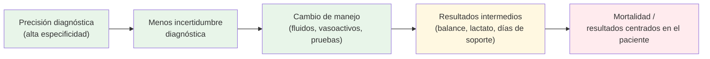
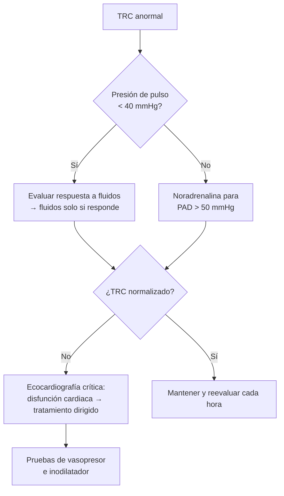

# 04 · Impacto clínico: ¿cambia el POCUS lo que hacemos y lo que le pasa al paciente?

Que una prueba sea **precisa** (ver [precisión diagnóstica](03-precision.md)) no garantiza que **mejore los resultados**. Entre «ver bien» y «vivir más» hay una cadena larga: el hallazgo tiene que cambiar el diagnóstico, el diagnóstico tiene que cambiar el tratamiento, y el tratamiento tiene que ser mejor que el que se habría dado sin ecografía. Esta página revisa, eslabón a eslabón, la evidencia de impacto del POCUS en el paciente en shock: primero en la **hipotensión indiferenciada** (tipo de shock), después en la **ecocardiografía en sepsis y shock séptico**, luego en la **fluidoterapia guiada por ecografía o por medidas dinámicas**, los grandes **ensayos de estrategia de fluidos** (ANDROMEDA-SHOCK, CLASSIC, CLOVERS, ARISE FLUIDS) y, por último, **VExUS y la desescalada**.

!!! abstract "Resumen en una frase"
    El POCUS **cambia el diagnóstico y el manejo** de forma consistente; su efecto sobre la **mortalidad** es incierto en la hipotensión indiferenciada (único ECA grande negativo) y **probablemente favorable pero con certeza baja** cuando se usa para guiar la reanimación y el volumen ([Basmaji, 2024](../../05-fuentes/index.md#basmaji2024); [Sharif, 2025](../../05-fuentes/index.md#sharif2025)). El beneficio más reproducible es **dar menos líquido sin causar daño**.

*Verde: evidencia consistente. Amarillo: evidencia favorable pero heterogénea. Rojo: evidencia incierta o contradictoria.*

---

## 1. Hipotensión indiferenciada: del diagnóstico al pronóstico

### 1.1 Estudios de cambio diagnóstico y de manejo

| Estudio | Diseño | n | Hallazgo principal |
|---|---|:--:|---|
| [Jones, 2004](../../05-fuentes/index.md#jones2004) · **clásico** | ECA, POCUS inmediato frente a diferido (15 min), urgencias, 1 centro | 184 | Con POCUS inmediato, el médico situó el diagnóstico final correcto como el más probable a los 15 min en el **80 %** (IC 95 % 70–87 %) frente al **50 %** (40–60 %) en el grupo diferido; mediana de diagnósticos «viables» 4 frente a 9 (p < 0,0001) |
| [Shokoohi, 2015](../../05-fuentes/index.md#shokoohi2015) | Prospectivo observacional antes-después, urgencias | 118 | Reducción del 27,7 % de la incertidumbre diagnóstica; concordancia del diagnóstico principal tras el POCUS con el diagnóstico final ciego κ = 0,80. **Cambio en fluidos, vasoactivos o hemoderivados en el 24,6 %**; cambio en pruebas de imagen mayores en el 30,5 %, en interconsultas en el 13,6 % y en el destino en el 11,9 % |
| [Shokoohi, 2017](../../05-fuentes/index.md#shokoohi2017) | Serie de casos del estudio anterior | — | Casos en que el protocolo detectó diagnósticos no sospechados (taponamiento, TEP, aneurisma de aorta abdominal, Takotsubo, víscera perforada) con cambio de manejo en todos |

!!! note "Qué nos dicen estos estudios"
    El POCUS **reduce el abanico diagnóstico** y acerca antes al diagnóstico correcto. Pero son estudios con resultados **intermedios** (confianza del médico, cambios de plan), sin grupo control ciego en el caso de Shokoohi, y de un solo centro. Son el «eslabón 2-3» de la cadena, no el 5.

### 1.2 El ECA SHoC-ED y sus análisis secundarios

El programa **SHoC-ED** (Sonography in Hypotension and Cardiac Arrest in the Emergency Department) es el único ECA multicéntrico que ha comparado un protocolo POCUS precoz frente a atención estándar sin POCUS en hipotensión indiferenciada (PAS < 100 mmHg o índice de shock > 1), en 6 servicios de urgencias de Norteamérica y Sudáfrica entre 2012 y 2016.

| Publicación | Resultado evaluado | Hallazgo |
|---|---|---|
| [Atkinson, 2018](../../05-fuentes/index.md#atkinson2018) (principal) | Supervivencia a 30 días o alta | **Sin diferencias**: 104/136 con POCUS frente a 102/134 sin POCUS (diferencia 0,35 %; IC 95 % −10,2 a 11,0 %). Tampoco en TC, inotrópicos, fluidos ni estancias. El diagnóstico más frecuente en más de la mitad fue **sepsis oculta** |
| [Atkinson, 2020](../../05-fuentes/index.md#atkinson2020) | Marcadores de reanimación a las 4 h | Sin diferencias en índice de shock, MEWS, bicarbonato ni lactato venoso |
| [Peach, 2023](../../05-fuentes/index.md#peach2023) | Precisión diagnóstica con frente a sin POCUS | Para shock cardiogénico, especificidad 95,5 % frente a 93,8 % y exactitud global 93,7 % frente a 93,6 %: **el POCUS funcionó bien, pero no mejor que la valoración estándar** |

!!! warning "Por qué SHoC-ED no cierra el debate"
    - **Población con poca patología «ecográfica»**: predominio de sepsis, donde el POCUS aporta menos que en taponamiento, TEP masivo o hemoperitoneo.
    - **Grupo control con buena precisión basal** (≈ 94 %): poco margen de mejora ([Peach, 2023](../../05-fuentes/index.md#peach2023)).
    - **Intervención diagnóstica, no terapéutica**: no había un algoritmo que obligara a cambiar el tratamiento según el hallazgo.
    - **Tamaño muestral pequeño** (n = 273) para detectar diferencias de mortalidad.
    - Reclutamiento de 2012–2016, antes de la difusión de la VTI, VExUS y las estrategias actuales.

### 1.3 Revisiones sistemáticas de impacto

| RS/MA | Población / diseño | Resultado |
|---|---|---|
| [Basmaji, 2024](../../05-fuentes/index.md#basmaji2024) | 18 ECA de reanimación guiada por POCUS en adultos con shock (búsqueda hasta dic. 2023) | **Probablemente reduce la mortalidad a 28 días** (RR 0,88; IC 95 % 0,78–0,99), la duración de vasoactivos (−0,73 días) y quizá la necesidad de TRR (RR 0,80; 0,63–1,02); mejora el aclaramiento de lactato (certeza alta). Cambia algo los **planes** de fluidos y vasoactivos (certeza moderada), pero **apenas cambia la cantidad administrada**. Certeza **baja a moderada** para mortalidad |
| [Osawa, 2025](../../05-fuentes/index.md#osawa2025) | RS sobre sospecha de shock cardiogénico (Japan Resuscitation Council / JCS) | Solo 2 estudios (1 ECA y 1 observacional, 5711 pacientes). ECA: mortalidad hospitalaria RR 0,99 (0,64–1,51). Observacional: **mayor** mortalidad con POCUS antes de la intervención (RR 1,25; 1,12–1,39), probablemente por confusión por indicación. Certeza baja (ECA) y muy baja (observacional) |

!!! tip "Perla clínica"
    El mensaje honesto para la sesión: **en hipotensión indiferenciada, el POCUS «sirve para pensar mejor», no se ha demostrado que salve vidas por sí mismo**. Donde sí muestra señal de beneficio es cuando se integra en un **protocolo de reanimación** que dice qué hacer con cada hallazgo ([Basmaji, 2024](../../05-fuentes/index.md#basmaji2024)).

---

## 2. Ecocardiografía y resultados en sepsis y shock séptico

### 2.1 Grandes bases de datos (MIMIC y otras)

Los estudios con bases de datos de UCI tienen enorme tamaño muestral, pero son **observacionales**: quien recibe una ecocardiografía no es comparable a quien no la recibe (confusión por indicación, sesgo de tiempo inmortal).

| Estudio | Base / población | Método | Resultado principal |
|---|---|---|---|
| [Feng, 2018](../../05-fuentes/index.md#feng2018) | MIMIC-III, sepsis en UCI | Regresión multivariante, *propensity score*, estimación doblemente robusta, IPW | **Menor mortalidad a 28 días con ETT** (OR 0,78; IC 95 % 0,68–0,90). Más fluidos el día 1 (2,5 frente a 2,1 L), más dobutamina (2 % frente a 1 %) y retirada más rápida de vasopresores (21 frente a 19 días libres) |
| [Blank, 2024](../../05-fuentes/index.md#blank2024) | MIMIC-IV, shock séptico con vasopresor (5697 ingresos; ETT en 27 %) | Modelo estructural marginal + emparejamiento *rolling entry* (confusores dependientes del tiempo) | **Sin diferencia en mortalidad a 28 días** (HR ajustado 1,09; 0,95–1,25). Cambios de tratamiento en 4 h en el 33 % frente al 29 % de controles emparejados, sobre todo bolos de fluido |
| [Zhang, 2025](../../05-fuentes/index.md#zhang2025) | MIMIC-IV, LRA asociada a sepsis (121 por grupo tras PSM) | *Propensity score matching* | Menor mortalidad a 28 días con ETT en las primeras 24 h, más marcada en KDIGO 3 (OR 0,81; 0,68–0,96) |
| [Ma, 2026](../../05-fuentes/index.md#ma2026) | MIMIC-III, sepsis en UCI con ETT (10 232) | Ajuste multivariante y *overlap weighting* | ETT precoz (< 6 h) asociada a menor mortalidad hospitalaria (12,1 % frente a 17,2 %; OR ajustado 0,77; 0,67–0,88), **sin asociación con la mortalidad al año**. Más fluidos en 24 h si FEVI deprimida |

!!! warning "Error frecuente: leer MIMIC como si fuera un ECA"
    [Feng, 2018](../../05-fuentes/index.md#feng2018) se cita a menudo como «la ecocardiografía reduce la mortalidad en sepsis». Al reanalizar una base más reciente con métodos que controlan los **confusores que cambian con el tiempo**, el efecto **desaparece** ([Blank, 2024](../../05-fuentes/index.md#blank2024)). Además, en ambos casos se trata de ETT **formal** en UCI de un solo hospital (Beth Israel Deaconess), no de POCUS a pie de cama.

### 2.2 Revisión sistemática de ecocardiografía en shock séptico

- [Killu, 2025](../../05-fuentes/index.md#killu2025) (7 estudios, 3885 pacientes en UCI manejados según la SSC): la ecocardiografía POC se asoció a **menor mortalidad hospitalaria y a 28 días** (OR 0,82; IC 95 % 0,71–0,95), **más inicio de inotrópicos** (OR 2,42; 1,92–3,03) y **aclaramiento de lactato más rápido** (−0,87 h), sin diferencias en fluidos a 24 h ni en días libres de ventilación. La mezcla de diseños incluidos (ECA frente a observacionales) debe comprobarse en el texto completo `[POR VERIFICAR]`.

### 2.3 El único ECA piloto de «eco frente a EGDT» en UCI

- [Lanspa, 2018](../../05-fuentes/index.md#lanspa2018) (ECA de factibilidad, n = 30): reanimación guiada por ecocardiografía frente a EGDT modificada. **No hubo separación entre grupos**: los pacientes llegaban con una mediana de 3 L ya infundidos y el 70 % ya había aclarado lactato. Conclusión de los autores: los ensayos futuros deben reclutar **en urgencias**, no en UCI. Lección metodológica clave: **si se llega tarde, la ecografía ya no tiene nada que decidir**.

### 2.4 La función cardiaca como marcador pronóstico (no como intervención)

La ecocardiografía también **estratifica el riesgo**: la disfunción ventricular izquierda sistólica, diastólica y la disfunción del VD se asocian a mayor mortalidad ([Wang, 2025](../../05-fuentes/index.md#wang2025); [Vallabhajosyula, 2021](../../05-fuentes/index.md#vallabhajosyula2021); [Nam, 2025](../../05-fuentes/index.md#nam2025)). Esto se desarrolla en [novedades: fenotipos](09-novedades.md#3-fenotipos-ecocardiograficos-del-shock-septico). Ser pronóstico **no** equivale a mejorar el pronóstico.

---

## 3. Fluidoterapia guiada por ecografía o por medidas dinámicas: ECA

### 3.1 Tabla de ECA en sepsis y shock séptico

| Autor, año | n | Ámbito | Intervención | Comparador | Resultado primario | Resultado | Cita |
|---|:--:|---|---|---|---|---|---|
| Richard, 2015 | 60 | UCI, 1 centro (Francia) | Expansión titulada por índices de precarga-dependencia (VPP o ΔGC con EPP) | Guiada por PVC | Tiempo hasta resolución del shock | Sin diferencias (2,0 frente a 2,3 días). **Menos fluido diario** (383 frente a 917 mL; p = 0,01) y menos transfusión. Mortalidad 23 % frente a 47 % (p = 0,10) | [Richard, 2015](../../05-fuentes/index.md#richard2015) |
| Chen y Kollef, 2015 | 82 | UCI, 1 centro (EE. UU.) | Minimización dirigida de fluidos con evaluación diaria de respuesta | Atención habitual | Factibilidad / balance | Balance día 3: 1952 frente a 3124 mL (p = 0,20, NS). Mortalidad 56,1 % frente a 48,8 % (NS) | [Chen, 2015](../../05-fuentes/index.md#chen2015) |
| Kuan, 2016 | 122 | Urgencias (Singapur) | Bolos guiados por ΔVS indexado tras EPP (monitor no invasivo, no ecográfico) | Atención habitual | Aclaramiento de lactato > 20 % a 3 h | 70,5 % frente a 73,8 % (RR 0,96; 0,77–1,19). Mortalidad 9,8 % en ambos | [Kuan, 2016](../../05-fuentes/index.md#kuan2016) |
| Lanspa, 2018 | 30 | UCI, 1 centro (EE. UU.) | Reanimación guiada por ecocardiografía | EGDT modificada | ΔSOFA a 48 h (factibilidad) | Sin separación; mortalidad 33 % frente a 20 % (NS) | [Lanspa, 2018](../../05-fuentes/index.md#lanspa2018) |
| Li G, 2019 | 74 | UCI, 1 centro (China) | EPP + ETT (VVS ≥ 15 % → fluidos) | Reposición rápida convencional | Perfusión/oxigenación | Mejor lactato, PaO₂/FiO₂ y ScvO₂; **edema pulmonar 13,5 % frente a 37,8 %**; mortalidad igual (18,9 % en ambos) | [Li, 2019](../../05-fuentes/index.md#li2019) |
| Douglas, 2020 (**FRESH**) | 124 (mITT) | Urgencias → UCI, 13 hospitales (EE. UU., R. Unido) | ΔVS con EPP (bioreactancia) antes de cada bolo o aumento de vasopresor | Atención habitual | Balance hídrico a 72 h o alta de UCI | **−1,37 L** a favor de la intervención (0,65 frente a 2,02 L; p = 0,021). Menos TRR (5,1 % frente a 17,5 %) y ventilación mecánica (17,7 % frente a 34,1 %) | [Douglas, 2020](../../05-fuentes/index.md#douglas2020) |
| Musikatavorn, 2021 | 202 | Urgencias, 1 centro (Tailandia) | Fluidos guiados por variación respiratoria de la VCI (6 h) | Atención habitual | Mortalidad a 30 días | **Sin diferencias** (19,8 % frente a 18,8 %). Menos fluido acumulado a 24 h | [Musikatavorn, 2021](../../05-fuentes/index.md#musikatavorn2021) |
| Sricharoenchai, 2024 | 124 | Hospital universitario (Tailandia), 2016–2020 | Fluidos guiados por VCI dinámica | Guiados por PVC | Mortalidad a 30 días | 34,4 % frente a 45,9 % (RR 0,8; 0,5–1,2; NS). **Menor duración del shock** (0,8 frente a 1,5 días) y menos noradrenalina | [Sricharoenchai, 2024](../../05-fuentes/index.md#sricharoenchai2024) |
| Ghosh, 2024 | ND en resumen | UCI (India) | Fluidos guiados por colapsabilidad de la VCI > 40 % | Atención habitual | Balance a 72 h | Balance −1,37 L; mortalidad 15,7 % frente a 22,0 % (NS). **Calidad dudosa** (ver nota) | [Ghosh, 2024](../../05-fuentes/index.md#ghosh2024) |
| Li Q, 2025 | 113 | UCI, 1 centro (China) | Ecografía crítica añadida a EGDT/guías | EGDT/guías sin ecografía | Parámetros fisiológicos a 6 h | Mejor lactato y aclaramiento; menos edema pulmonar, insuficiencia cardiaca izquierda, SOFA y estancia en UCI | [Li, 2025](../../05-fuentes/index.md#li2025) |

!!! warning "Cautela con algunos ensayos"
    - [Ghosh, 2024](../../05-fuentes/index.md#ghosh2024) se describe a la vez como «investigación prospectiva observacional» y como aleatorizado, y su diferencia de balance (−1,37 L) coincide exactamente con la de FRESH ([Douglas, 2020](../../05-fuentes/index.md#douglas2020)). Conviene no usarlo como evidencia principal.
    - Los ECA pequeños de un solo centro (China, India, Tailandia) muestran beneficios en variables intermedias con frecuentes riesgos de sesgo; ninguno está cegado.
    - En FRESH la medida dinámica fue por **bioreactancia**, no por ecografía, y el análisis principal fue mITT con aleatorización 2:1.

### 3.2 RS/MA de fluidoterapia guiada por respuesta a fluidos o por ecografía

| RS/MA | Estudios incluidos | Resultado sobre mortalidad | Otros resultados / comentario |
|---|---|---|---|
| [Bednarczyk, 2017](../../05-fuentes/index.md#bednarczyk2017) | 13 ECA, 1652 pacientes de UCI (médicos y quirúrgicos); VVS en 9, VPP en 1, EPP/reto en 3 | **RR 0,59** (0,42–0,83); RAR −2,9 % | Menos estancia en UCI (−1,16 días) y ventilación (−2,98 h). **Casi todos con alto riesgo de sesgo**; gran peso de cirugía |
| [Ehrman, 2019](../../05-fuentes/index.md#ehrman2019) | 4 estudios, 365 pacientes con sepsis | **OR 0,87 (0,49–1,54): sin diferencia** | Muestra pequeña; no se pudieron agrupar otros resultados |
| [Azadian, 2022](../../05-fuentes/index.md#azadian2022) | 5 ECA, 462 pacientes en shock séptico; EPP | OR 0,82 (0,52–1,30): sin diferencia | Ninguno cegado |
| [Yuan, 2020](../../05-fuentes/index.md#yuan2020) | 2 ECA (ecografía frente a EGDT) | Menor mortalidad a 7 días (15 % frente a 35 %), sin diferencia a 28 días | Solo revisión sistemática; calidad B y C |
| [Basmaji, 2024](../../05-fuentes/index.md#basmaji2024) | 18 ECA de reanimación guiada por POCUS en shock | **RR 0,88 (0,78–0,99)**, certeza baja-moderada | Menos días de vasoactivos, quizá menos TRR |
| [Sharif, 2025](../../05-fuentes/index.md#sharif2025) | 17 ECA, 1765 pacientes agudos (manejo del volumen guiado por ecografía crítica) | **RR 0,79 (0,67–0,95)**, certeza baja | Balance a 72 h −0,72 L (IC −1,5 a +0,07; certeza baja). Efecto incierto en VM, estancia, LRA y TRR. Incluye análisis secuencial de ensayos |
| [Graziani, 2025](../../05-fuentes/index.md#graziani2025) | 20 ECA, 2435 pacientes con sepsis; MA en red de estrategias no invasivas | **Ninguna estrategia redujo la mortalidad frente a atención habitual** en el análisis en red. Ecocardiografía frente a habitual: RR 0,72 (0,32–1,61; I² 70 %); VCI: RR 0,75 (0,52–1,09); EPP + VS: RR 0,91 (0,67–1,23) | La única comparación por pares significativa fue aclaramiento de lactato frente a ScvO₂ |

!!! info "Cómo reconciliar resultados aparentemente opuestos"
    - Las RS/MA **positivas** ([Bednarczyk, 2017](../../05-fuentes/index.md#bednarczyk2017); [Basmaji, 2024](../../05-fuentes/index.md#basmaji2024); [Sharif, 2025](../../05-fuentes/index.md#sharif2025)) mezclan poblaciones (shock no séptico, cirugía, insuficiencia respiratoria) y ensayos pequeños con riesgo de sesgo; su certeza es **baja**.
    - Las RS/MA **restringidas a sepsis** ([Ehrman, 2019](../../05-fuentes/index.md#ehrman2019); [Azadian, 2022](../../05-fuentes/index.md#azadian2022); [Graziani, 2025](../../05-fuentes/index.md#graziani2025)) no encuentran diferencias significativas en mortalidad.
    - El denominador común es **menos volumen administrado sin aumento del daño**. Ese es el mensaje más sólido.
    - La guía SCCM 2024 tomó la señal de mortalidad para sugerir (recomendación **condicional**) la ecografía crítica para el manejo del volumen ([Díaz-Gómez, 2025](../../05-fuentes/index.md#diazgomez2025)); ver [guías](05-guias.md).

---

## 4. ANDROMEDA-SHOCK y ANDROMEDA-SHOCK-2: la ecocardiografía dentro de un protocolo

### 4.1 ANDROMEDA-SHOCK (2019)

[ANDROMEDA-SHOCK, 2019](../../05-fuentes/index.md#andromeda2019): 424 pacientes con shock séptico en 28 UCI de 5 países, reanimación de 8 h dirigida a normalizar el **tiempo de relleno capilar (TRC)** frente a normalizar/reducir el **lactato**.

- Mortalidad a 28 días: **34,9 % frente a 43,4 %** (HR 0,75; IC 95 % 0,55–1,02; p = 0,06): no significativa.
- Menor disfunción orgánica a las 72 h con TRC (SOFA 5,6 frente a 6,6; diferencia −1,00; IC −1,97 a −0,02).
- El protocolo incluía **evaluación sistemática de la respuesta a fluidos** antes de cada bolo.

Análisis secundario sobre la respuesta a fluidos ([Kattan, 2020](../../05-fuentes/index.md#kattan2020)): se pudo determinar en 348 pacientes; el **70 %** respondía al inicio. A los **no respondedores** se les dieron muchos menos fluidos (mediana 0 frente a 1500 mL) **sin peores resultados** (mortalidad a 28 días 36 % frente a 40 %; SOFA, VM y TRR similares). Solo 13 pacientes siguieron respondiendo durante todo el periodo. Conclusión: **parar los fluidos en quien no responde parece seguro** (evidencia *post hoc*, no aleatorizada).

### 4.2 ANDROMEDA-SHOCK-2 (2025)

[ANDROMEDA-SHOCK-2, 2025](../../05-fuentes/index.md#andromeda2025): 1467 pacientes analizados (86 centros, 19 países, con participación española a través de la SEDAR), dentro de las primeras 4 h de shock séptico. Protocolo del grupo intervención ([Kattan, 2022b](../../05-fuentes/index.md#kattan2022b)):

- Resultado primario jerárquico (mortalidad → duración del soporte vital → estancia hospitalaria a 28 días): ***win ratio* 1,16** (IC 95 % 1,02–1,33; p = 0,04).
- Victorias por muerte 19,1 % frente a 17,8 %; por duración del soporte vital 26,4 % frente a 21,1 %; por estancia 3,4 % frente a 3,2 %. **El beneficio procede sobre todo de menos días de soporte vital, no de menos muertes**.

!!! note "Qué papel tuvo la ecografía"
    En ANDROMEDA-SHOCK-2 la ecocardiografía es **un componente** de una estrategia compleja (TRC + fenotipado por presión de pulso/diastólica + respuesta a fluidos + ecocardiografía). No se puede atribuir el efecto a la ecografía aislada. Pero es el primer ECA grande en que **la ecocardiografía forma parte de un protocolo de reanimación que mejora un resultado centrado en el paciente** ([ANDROMEDA-SHOCK-2, 2025](../../05-fuentes/index.md#andromeda2025); [Hernández, 2026](../../05-fuentes/index.md#hernandez2026)).

---

## 5. Ensayos de restricción de fluidos y su relación con la ecografía

| Ensayo | n | Ámbito | Restrictivo | Liberal / estándar | Resultado primario | Resultado | Cita |
|---|:--:|---|---|---|---|---|---|
| **CLASSIC** (2022) | 1554 | UCI, internacional; shock séptico tras ≥ 1 L | Fluidos solo en situaciones definidas (mediana 1798 mL en UCI) | Estándar (mediana 3811 mL) | Mortalidad a 90 días | **42,3 % frente a 42,1 %** (diferencia 0,1 puntos; IC −4,7 a 4,9) | [CLASSIC, 2022](../../05-fuentes/index.md#classic2022) |
| **CLOVERS** (2023) | 1563 | 60 centros de EE. UU.; hipotensión séptica refractaria a 1–3 L | Vasopresores precoces y menos fluido (−2134 mL de mediana) | Más fluidos antes del vasopresor | Mortalidad antes del alta a domicilio a 90 días | **14,0 % frente a 14,9 %** (diferencia −0,9; IC −4,4 a 2,6) | [CLOVERS, 2023](../../05-fuentes/index.md#clovers2023) |
| **ARISE FLUIDS** (2026) | 1000 (963 ITT) | Urgencias de Australia y Nueva Zelanda; shock séptico | Fluidos restringidos + vasopresor precoz (−1108 mL en 24 h) | Más fluidos y vasopresor más tardío | Días vivo y fuera del hospital a 90 días | **76 frente a 76 días** (diferencia 0,0; IC −2,7 a 2,7). **Edema pulmonar 0,6 % frente a 5,0 %** (p < 0,001) | [ARISE FLUIDS, 2026](../../05-fuentes/index.md#arisefluids2026) |

!!! tip "Perla clínica: la lectura ecográfica de los ensayos de restricción"
    Tres ECA grandes (más de 4000 pacientes en conjunto) coinciden: **una estrategia «de talla única» restrictiva o liberal no cambia la mortalidad**. Esto **no** significa que la cantidad de fluido dé igual en cada paciente, sino que **el promedio de la población no sirve** para decidir. El espacio de la ecografía está precisamente en **individualizar**: ¿responde? (VTI, EPP) y ¿tolera? (líneas B, VExUS). Ninguno de estos tres ensayos usó la ecografía para asignar el volumen.

La guía ESICM 2025 no se posiciona a favor ni en contra de la estrategia restrictiva o liberal en la fase de optimización (certeza moderada de ausencia de efecto) y sugiere un enfoque individualizado ([Mekontso Dessap, 2025](../../05-fuentes/index.md#mekontsodessap2025)). La SSC 2026 acepta **cualquiera de las dos** estrategias tras 30 mL/kg ([Prescott, 2026](../../05-fuentes/index.md#prescott2026); [Azevedo, 2026](../../05-fuentes/index.md#azevedo2026)). Detalles en [novedades](09-novedades.md) y [guías](05-guias.md).

---

## 6. VExUS y resultados: de la asociación al ensayo

### 6.1 Evidencia observacional (pronóstica)

| Estudio | Población | Hallazgo |
|---|---|---|
| [Beaubien-Souligny, 2020](../../05-fuentes/index.md#beaubien2020) | Cirugía cardiaca (cohorte de desarrollo) | Grado 3 asociado a LRA (HR 3,69) |
| [Melo, 2025](../../05-fuentes/index.md#melo2025) | RS/MA de observacionales en críticos | VExUS ≥ 2 asociado a LRA (OR 2,63), **no a mortalidad** |
| [Prager, 2024](../../05-fuentes/index.md#prager2024) | Shock séptico, piloto de 2 UCI (n = 75) | Factible (94,5 % de exploraciones completas). Congestión grave en el 19 % el día 1; posible asociación con TRR (HR no ajustado 3,35; IC 0,94–11,88; p = 0,06) |
| [Song, 2025](../../05-fuentes/index.md#song2025) | Sepsis, 4 UCI chinas (n = 108) | VExUS ≥ 2 en el 18 % el día 1; **sin asociación** con LRA (OR 1,82; 0,62–5,31), mortalidad ni TRR; sin correlación con la PVC |
| [Rolston, 2026](../../05-fuentes/index.md#rolston2026) | Sospecha de sepsis en urgencias antes de fluidos (n = 545) | VExUS ≥ 1 asociado a muerte o ingreso en UCI a 24 h (VExUS 3: OR 4,09; 2,24–7,45) y a **menor probabilidad de responder a fluidos** (VExUS 3: OR 0,16). La combinación VExUS 2-3 con VTI < 17 cm identificó al grupo de peor pronóstico |
| [Chaves, 2026](../../05-fuentes/index.md#chaves2026) | RS/MA bayesiana en insuficiencia cardiaca aguda (5 estudios, 565 pacientes) | Mortalidad hospitalaria 1,9 % con VExUS ≤ 1 frente a 14,1 % con VExUS ≥ 2 |

### 6.2 Ensayos de intervención guiada por VExUS

| Autor, año | n | Ámbito | Intervención | Comparador | Resultado primario | Resultado | Cita |
|---|:--:|---|---|---|---|---|---|
| Islas-Rodríguez, 2024 | 140 | Síndrome cardiorrenal tipo 1 (México) | Descongestión guiada por VExUS | Evaluación clínica habitual | Recuperación de la función renal | **Sin diferencias** en el primario. Más descongestión (OR 2,6; 1,9–3,0) y más descenso de BNP > 30 % (OR 2,4). Supervivencia a 90 días similar | [Islas-Rodríguez, 2024](../../05-fuentes/index.md#islasrodriguez2024) |
| Innes, 2026 (piloto) | 19 | Shock séptico | Manejo de fluidos guiado por VExUS diario (recomendación al equipo) | Atención habitual | Factibilidad | Factible. Balance −65 mL frente a 2608 mL (p = 0,21, NS). Sin diferencias en LRA, insuficiencia respiratoria ni mortalidad | [Innes, 2026](../../05-fuentes/index.md#innes2026) |
| Gouin, 2026 (piloto *USE-the-FORCE-for-AKI*) | 80 | LRA en pacientes no críticos | Informe POCUS de tolerancia a fluidos (líneas B + VExUS) al equipo de nefrología | Atención habitual | Factibilidad (adherencia) | Adherencia del 100 %; el informe cambió la conducta en el **50 %**; más diuréticos el día 1 (40 % frente a 15 %), sin diferencias a 5 días ni en progresión de LRA | [Gouin, 2026](../../05-fuentes/index.md#gouin2026) |

!!! warning "Estado de la evidencia VExUS en shock séptico (septiembre de 2026)"
    - **No hay ningún ECA de tamaño suficiente** que demuestre que guiar fluidos o diuréticos por VExUS mejore resultados en shock séptico. Solo hay un piloto de 19 pacientes ([Innes, 2026](../../05-fuentes/index.md#innes2026)).
    - **Andromeda-VEXUS** es un **estudio de cohortes prospectivo multicéntrico** (no un ECA) cuyo objetivo es cuantificar la asociación entre congestión venosa y resultados en shock séptico ([Prager, 2023](../../05-fuentes/index.md#prager2023)). No se han encontrado resultados publicados en PubMed a septiembre de 2026 `[POR VERIFICAR]`.
    - Hay ensayos registrados de manejo guiado por VExUS tras la fase de reanimación en shock séptico (p. ej., [NCT06227702](https://clinicaltrials.gov/study/NCT06227702), n estimado 200, resultado jerárquico con *win ratio*, estado «desconocido» en el registro).

---

## 7. Desescalada (desreanimación) guiada por ecografía

La SSC 2026 incorpora la **retirada activa de líquido tras la fase de reanimación aguda** ([Prescott, 2026](../../05-fuentes/index.md#prescott2026); [Azevedo, 2026](../../05-fuentes/index.md#azevedo2026)); el grado y la certeza exactos deben comprobarse en el texto completo `[POR VERIFICAR]`. La evidencia específica sobre **desescalada guiada por ecografía** es escasa:

- [Wang, 2018](../../05-fuentes/index.md#wang2018) (cuasiexperimental antes-después, n = 85, pacientes críticos tras la reanimación): con un protocolo ecográfico (líneas B, entre otros), la retirada de líquido **empezó antes** (21 frente a 35 h), **terminó antes** y consiguió más balance negativo diario (−990 frente a −724 mL), con desaparición más rápida de las líneas B.
- [Innes, 2026](../../05-fuentes/index.md#innes2026): el piloto de «desreanimación informada por ecografía» en shock séptico (VExUS) es factible, pero sin potencia para resultados clínicos.
- [Chen, 2015](../../05-fuentes/index.md#chen2015): la minimización de fluidos guiada por la respuesta diaria es factible y parece segura.

!!! note "Laguna"
    No hay ECA con potencia suficiente que compare desescalada guiada por ecografía (líneas B, VExUS) frente a desescalada clínica o por balance en shock séptico.

---

## 8. Síntesis: qué podemos decir y con qué certeza

| Pregunta | Respuesta | Certeza |
|---|---|---|
| ¿El POCUS acelera y afina el diagnóstico en hipotensión? | Sí | Moderada (ECA clásico + observacionales) ([Jones, 2004](../../05-fuentes/index.md#jones2004); [Shokoohi, 2015](../../05-fuentes/index.md#shokoohi2015)) |
| ¿Mejora la supervivencia el POCUS diagnóstico en hipotensión indiferenciada? | No demostrado | Baja (un único ECA de 273 pacientes, negativo) ([Atkinson, 2018](../../05-fuentes/index.md#atkinson2018)) |
| ¿Reduce la mortalidad la reanimación guiada por POCUS en shock? | Probablemente algo | Baja-moderada ([Basmaji, 2024](../../05-fuentes/index.md#basmaji2024); [Sharif, 2025](../../05-fuentes/index.md#sharif2025)); no confirmado en sepsis pura ([Graziani, 2025](../../05-fuentes/index.md#graziani2025)) |
| ¿Permite dar menos fluido sin daño? | Sí, consistentemente | Baja-moderada ([Douglas, 2020](../../05-fuentes/index.md#douglas2020); [Musikatavorn, 2021](../../05-fuentes/index.md#musikatavorn2021); [Kattan, 2020](../../05-fuentes/index.md#kattan2020)) |
| ¿La ETT en sepsis reduce la mortalidad (bases de datos)? | Resultados contradictorios | Muy baja ([Feng, 2018](../../05-fuentes/index.md#feng2018) frente a [Blank, 2024](../../05-fuentes/index.md#blank2024)) |
| ¿Mejora resultados una reanimación personalizada que incluye ecocardiografía? | Sí, en un resultado compuesto (menos días de soporte) | Moderada (un ECA grande) ([ANDROMEDA-SHOCK-2, 2025](../../05-fuentes/index.md#andromeda2025)) |
| ¿Guiar por VExUS mejora resultados? | No demostrado | Muy baja (ECA en cardiorrenal negativo en el primario; pilotos) ([Islas-Rodríguez, 2024](../../05-fuentes/index.md#islasrodriguez2024)) |

## Puntos clave

- El POCUS en hipotensión **reduce la incertidumbre y cambia el manejo** en aproximadamente 1 de cada 4 pacientes ([Shokoohi, 2015](../../05-fuentes/index.md#shokoohi2015)), pero el único ECA grande (SHoC-ED) **no mostró beneficio en la supervivencia** ([Atkinson, 2018](../../05-fuentes/index.md#atkinson2018)).
- Cuando la ecografía se integra en un **protocolo de reanimación**, las RS/MA de ECA sugieren menor mortalidad (RR 0,88 y RR 0,79), con **certeza baja** ([Basmaji, 2024](../../05-fuentes/index.md#basmaji2024); [Sharif, 2025](../../05-fuentes/index.md#sharif2025)).
- El efecto más reproducible de guiar fluidos por medidas dinámicas o ecografía es **administrar menos volumen sin aumentar el daño** ([Douglas, 2020](../../05-fuentes/index.md#douglas2020); [Kattan, 2020](../../05-fuentes/index.md#kattan2020)).
- Los datos de MIMIC a favor de la ecocardiografía ([Feng, 2018](../../05-fuentes/index.md#feng2018)) **no se reproducen** con métodos que controlan confusores dependientes del tiempo ([Blank, 2024](../../05-fuentes/index.md#blank2024)).
- **ANDROMEDA-SHOCK-2** es el primer ECA grande en que una reanimación personalizada que incluye ecocardiografía mejora un resultado compuesto, sobre todo por **menos días de soporte vital** ([ANDROMEDA-SHOCK-2, 2025](../../05-fuentes/index.md#andromeda2025)).
- CLASSIC, CLOVERS y ARISE FLUIDS demuestran que **una estrategia uniforme** restrictiva o liberal no cambia la mortalidad: el reto es individualizar, y ahí está el hueco para la ecografía ([CLASSIC, 2022](../../05-fuentes/index.md#classic2022); [CLOVERS, 2023](../../05-fuentes/index.md#clovers2023); [ARISE FLUIDS, 2026](../../05-fuentes/index.md#arisefluids2026)).
- **VExUS** tiene valor pronóstico heterogéneo y **aún no hay ECA** que demuestre beneficio al guiar el tratamiento en shock séptico ([Melo, 2025](../../05-fuentes/index.md#melo2025); [Song, 2025](../../05-fuentes/index.md#song2025); [Innes, 2026](../../05-fuentes/index.md#innes2026)).

## Lagunas y preguntas abiertas

- **Falta un ECA pragmático grande de POCUS en urgencias** con algoritmo terapéutico ligado a los hallazgos; el ensayo francés GENESIS (312 pacientes, ecocardiografía precoz en sepsis en urgencias, resultado primario ΔSOFA a 24 h) figura como completado en el registro ([NCT04580888](https://clinicaltrials.gov/study/NCT04580888)), pero sus resultados no están publicados ([Lafon, 2025](../../05-fuentes/index.md#lafon2025)).
- **¿Quién hace la ecografía y con qué competencia?** Ninguna RS/MA pudo analizar el efecto de la competencia del operador, la frecuencia ni el momento de las exploraciones ([Basmaji, 2024](../../05-fuentes/index.md#basmaji2024)).
- **Momento:** llegar tarde (tras 3 L) anula el efecto de cualquier estrategia guiada ([Lanspa, 2018](../../05-fuentes/index.md#lanspa2018)).
- **VExUS como intervención:** faltan ECA en shock séptico; los resultados de Andromeda-VEXUS están pendientes.
- **Desescalada guiada por ecografía:** sin ECA con potencia suficiente.
- Riesgo de **sesgo de publicación** y de pequeños estudios en los ECA unicéntricos positivos.
