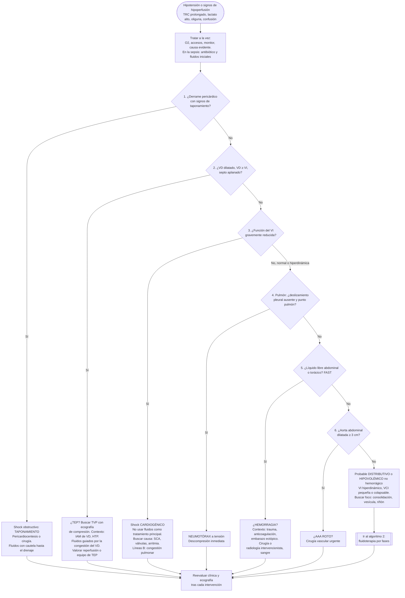
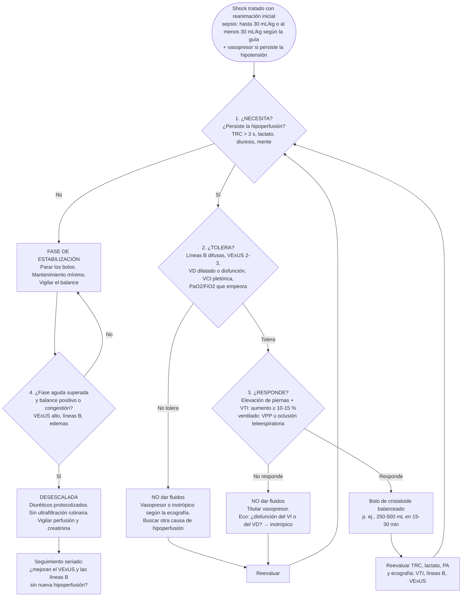

# 06 · Integración en la práctica

Esta página traduce las guías y la evidencia en **dos algoritmos de trabajo** para la cabecera del paciente:

1. **El paciente hipotenso indiferenciado:** ¿qué tipo de shock tiene?
2. **La fluidoterapia por fases:** ¿necesita fluidos?, ¿responde?, ¿los tolera?

Para cada hallazgo se indica qué significa y qué hacer. Después se detallan la reevaluación seriada, la documentación con plantilla de informe y la organización del servicio.

La técnica de cada plano está en [técnica](02-tecnica.md), las limitaciones en [limitaciones](07-limitaciones.md) y el detalle de las guías en [guías](05-guias.md).

!!! warning "Aviso"
    Los algoritmos de esta página son una **síntesis docente** construida sobre las guías y los consensos citados. **No son un protocolo oficial de ninguna sociedad.** Donde el orden o un umbral es una convención práctica y no una recomendación, se indica como **opinión de experto** o **convención docente**.

## 1. Principios de uso

- **Es una exploración dirigida por preguntas.** La ecografía no sustituye a la clínica: responde preguntas binarias («¿hay derrame con compromiso?», «¿está dilatado el VD?») que cambian el tratamiento en minutos. Se amplía la valoración hemodinámica con ecografía **si la exploración clínica no da un diagnóstico claro** ([Cecconi, 2014](../../05-fuentes/index.md#cecconi2014)). La ecocardiografía es la **primera prueba de imagen** para el tipo de shock ([Monnet, 2025](../../05-fuentes/index.md#monnet2025)).
- **Se trata a la vez que se explora.** La SSC recomienda empezar la reanimación de inmediato ([Evans, 2021](../../05-fuentes/index.md#evans2021)). La exploración se hace en paralelo: oxígeno, accesos, monitorización y, en la sepsis, antibiótico y fluidos iniciales.
- **Un hallazgo positivo pesa más que uno negativo.** La especificidad del POCUS para cada tipo de shock es ≥ 95 %. La sensibilidad es menor, sobre todo en el shock distributivo (78 %) ([Basmaji, 2025](../../05-fuentes/index.md#basmaji2025); [Yoshida, 2023](../../05-fuentes/index.md#yoshida2023)). Si no se ve nada, no queda descartado.
- **Nunca decide una variable aislada.** Hay que integrar el corazón, la VCI, el pulmón y la perfusión clínica. Ninguna medida estática aislada debe guiar la reanimación ([Cecconi, 2014](../../05-fuentes/index.md#cecconi2014)).
- **Hay que repetir la exploración.** El paciente en shock cambia, y la ESICM pide **evaluaciones ecocardiográficas seriadas** ([Monnet, 2025](../../05-fuentes/index.md#monnet2025)).
- **Se usa dentro de la propia competencia.** La SSC pediátrica condiciona el uso del POCUS a que «la formación y los recursos lo permitan» ([Weiss, 2026](../../05-fuentes/index.md#weiss2026)).

## 2. Algoritmo 1: el paciente hipotenso indiferenciado

La secuencia sigue las «4 F» de SHoC: *fluid* (líquido), *form* (forma), *function* (función) y *filling* (llenado) ([Atkinson, 2017](../../05-fuentes/index.md#atkinson2017)). También sigue el esquema «bomba, depósito y tuberías» del RUSH ([Perera, 2010](../../05-fuentes/index.md#perera2010)).

El **orden** prioriza las causas que **matan rápido y tienen un tratamiento específico inmediato**: taponamiento, TEP masivo, neumotórax a tensión y hemorragia o aneurisma roto. Es una **convención docente**. Ni SHoC ni RUSH imponen un orden estricto, y en la práctica los planos se encadenan: subxifoideo, VCI y pulmón.



*Fuentes de la secuencia y de las acciones:*

- estructura: SHoC y RUSH ([Atkinson, 2017](../../05-fuentes/index.md#atkinson2017); [Perera, 2010](../../05-fuentes/index.md#perera2010));
- ecocardiografía como primera prueba: [Monnet, 2025](../../05-fuentes/index.md#monnet2025);
- fluidos en el taponamiento, el TEP y el shock cardiogénico: [Mekontso Dessap, 2025](../../05-fuentes/index.md#mekontsodessap2025);
- signos de taponamiento: [ACEP, 2018](../../05-fuentes/index.md#acep2018);
- definición de AAA como aorta ≥ 3 cm: [Wanhainen, 2024](../../05-fuentes/index.md#wanhainen2024) `[POR VERIFICAR el texto literal del umbral en la guía ESVS]`;
- «VD ≥ VI» como signo: [Fields, 2017](../../05-fuentes/index.md#fields2017), que recoge la relación de tamaño ventricular entre los signos de sobrecarga del VD. El punto de corte exacto es una **convención docente** `[POR VERIFICAR]`.

### 2.1. Qué hacer con cada hallazgo

| Pregunta | Hallazgo ecográfico | Interpretación | Acción inmediata | Precisión y respaldo |
|---|---|---|---|---|
| **1. ¿Taponamiento?** | Derrame pericárdico con colapso diastólico de la AD o del VD, VCI pletórica o variación excesiva del flujo mitral | Shock obstructivo por taponamiento. Es un diagnóstico clínico y ecográfico | Pericardiocentesis (guiada por ecografía) o cirugía. Fluidos con cautela hasta el drenaje | La ecocardiografía para el taponamiento tiene grado 1B ([Levitov, 2016](../../05-fuentes/index.md#levitov2016)). eFAST en el derrame pericárdico traumático: sensibilidad del 91 % y especificidad del 94 % ([Netherton, 2019](../../05-fuentes/index.md#netherton2019)). Signos: [ACEP, 2018](../../05-fuentes/index.md#acep2018); [Alerhand, 2022](../../05-fuentes/index.md#alerhand2022) |
| **2. ¿VD dilatado?** | VD igual o mayor que el VI, septo aplanado (signo de la D), McConnell, trombo en cavidades derechas | Sobrecarga aguda del VD: TEP, IAM del VD, descompensación de HTP o ventilación agresiva | Ecografía de compresión venosa (2 o 3 puntos). Anticoagular si no hay contraindicación. Valorar reperfusión si es de alto riesgo. Fluidos solo con prudencia | Signos de sobrecarga del VD en el TEP: sensibilidad del 53 % y especificidad del 83 ([Fields, 2017](../../05-fuentes/index.md#fields2017)). Shock obstructivo: sensibilidad del 94 % y especificidad del 99 % ([Basmaji, 2025](../../05-fuentes/index.md#basmaji2025)). Ecografía de compresión en 2 puntos: sensibilidad del 91 % y especificidad del 98 %; en 3 puntos, 90 % y 95 % ([Lee, 2019](../../05-fuentes/index.md#lee2019)). Fluidos: [Mekontso Dessap, 2025](../../05-fuentes/index.md#mekontsodessap2025) |
| **3. ¿FEVI muy reducida?** | Contractilidad global gravemente reducida «a ojo», VI dilatado, líneas B bilaterales | Shock cardiogénico, o miocardiopatía séptica si el contexto es infeccioso | Evitar los fluidos como tratamiento principal. Buscar la causa: ECG, SCA, valvulopatía. Inotrópico o vasopresor según la perfusión | FEVI estimada a ojo por el urgenciólogo: κ 0,68, sensibilidad del 89 % y especificidad del 85 % ([Albaroudi, 2022](../../05-fuentes/index.md#albaroudi2022)). Shock cardiogénico: sensibilidad del 95 % y especificidad del 98 % ([Basmaji, 2025](../../05-fuentes/index.md#basmaji2025)). Fluidos: [Mekontso Dessap, 2025](../../05-fuentes/index.md#mekontsodessap2025). Inotrópicos en la sepsis con disfunción cardiaca: [Prescott, 2026](../../05-fuentes/index.md#prescott2026) |
| **4. ¿Neumotórax?** | Ausencia de deslizamiento pleural y de líneas B, con punto pulmón | Neumotórax. Si hay shock, a tensión hasta que se demuestre lo contrario | Descompresión inmediata | Ecografía torácica en el trauma: sensibilidad del 91 % y especificidad del 99 %, frente al 47 % y el 100 % de la radiografía en decúbito ([Chan, 2020](../../05-fuentes/index.md#chan2020)) |
| **5. ¿Líquido libre?** | Líquido anecoico en el espacio hepatorrenal, esplenorrenal, pelvis o pleura | Hemorragia (trauma, ectópico, anticoagulación, rotura) o, según el contexto, ascitis | Sangre, cirugía o radiología intervencionista. En el trauma, estrategia restrictiva de fluidos | FAST para líquido intraabdominal en el paciente hipotenso: sensibilidad del 74 % y especificidad del 95 %. Sirve para **confirmar**, no para descartar ([Netherton, 2019](../../05-fuentes/index.md#netherton2019)). Fluidos en el trauma: [Mekontso Dessap, 2025](../../05-fuentes/index.md#mekontsodessap2025) |
| **6. ¿Aorta?** | Aorta abdominal ≥ 3 cm y, a veces, hematoma retroperitoneal (que la ecografía detecta mal) | AAA. Si hay dolor e hipotensión, **rotura** hasta que se demuestre lo contrario | Aviso a cirugía vascular. Hipotensión permisiva | POCUS para AAA ante sospecha de rotura: sensibilidad del 97,8 % y especificidad del 97,0 % ([Fernando, 2022](../../05-fuentes/index.md#fernando2022)) |
| **7. VCI** | Pequeña y colapsable, o grande y sin variación | Pequeña y colapsable: compatible con hipovolemia o vasodilatación. Grande y fija: presión en la AD alta (taponamiento, VD, sobrecarga) | Orienta, pero **no decide** los fluidos por sí sola (véase el algoritmo 2) | En respiración espontánea, la colapsabilidad de la VCI tiene una sensibilidad del 63 % y una especificidad del 83 % para predecir la respuesta a fluidos ([Cardozo Júnior, 2023](../../05-fuentes/index.md#cardozo2023)). Shock hipovolémico: sensibilidad del 90 % y especificidad del 92–95 % ([Yoshida, 2023](../../05-fuentes/index.md#yoshida2023); [Basmaji, 2025](../../05-fuentes/index.md#basmaji2025)) |
| **8. Pulmón (foco)** | Consolidación con broncograma, líneas B focales o derrame | Foco infeccioso probable. Las líneas B difusas indican congestión | Antibiótico. Las líneas B limitan la tolerancia a fluidos | Véase [precisión diagnóstica](03-precision.md) |

!!! tip "Perla clínica: la combinación hace el diagnóstico"
    Cada hallazgo por separado es modesto. La **combinación** orienta mucho más:

    - VI hiperdinámico, VCI pequeña y sin líneas B: hipovolemia o shock distributivo.
    - VD dilatado, VI pequeño y VCI pletórica: shock obstructivo por TEP.
    - VI hipocinético, líneas B y VCI pletórica: shock cardiogénico.

    Así lo proponen los protocolos RUSH y SHoC ([Perera, 2010](../../05-fuentes/index.md#perera2010); [Atkinson, 2017](../../05-fuentes/index.md#atkinson2017)). Las combinaciones son una **convención docente**; su precisión se estudia en los metaanálisis por tipo de shock, no por patrón ([Basmaji, 2025](../../05-fuentes/index.md#basmaji2025)).

### 2.2. Patrones por tipo de shock (tabla de bolsillo)

| Tipo de shock | Bomba (corazón) | Depósito (VCI, pulmón, cavidades) | Tuberías (aorta, venas) | Precisión del POCUS (sensibilidad / especificidad) |
|---|---|---|---|---|
| **Hipovolémico** | Hiperdinámico, cavidades pequeñas | VCI pequeña o colapsable. Líquido libre si es hemorrágico. Sin líneas B | AAA, si esa es la causa | 90 % / 95 % ([Basmaji, 2025](../../05-fuentes/index.md#basmaji2025)) |
| **Distributivo** | Hiperdinámico al principio; puede aparecer disfunción séptica | VCI normal o pequeña. Foco pulmonar o abdominal | — | 78 % / 97 % ([Basmaji, 2025](../../05-fuentes/index.md#basmaji2025)) |
| **Cardiogénico** | Hipocinesia global o segmentaria, VI dilatado | VCI pletórica, líneas B difusas, derrame pleural | — | 95 % / 98 % ([Basmaji, 2025](../../05-fuentes/index.md#basmaji2025)) |
| **Obstructivo** | Taponamiento, o VD dilatado con VI pequeño | VCI pletórica. En el neumotórax, sin deslizamiento | TVP (TEP) | 94 % / 99 % ([Basmaji, 2025](../../05-fuentes/index.md#basmaji2025)) |

!!! warning "Error frecuente: etiquetar un único tipo de shock"
    Los shocks **mixtos** no son raros, por ejemplo un shock séptico con miocardiopatía séptica, o uno cardiogénico con vasoplejía. No se ha verificado una cifra de frecuencia `[POR VERIFICAR]`. La SSC 2026 contempla expresamente el shock séptico con **disfunción cardiaca** y sugiere noradrenalina o adrenalina e inotrópicos si la hipoperfusión persiste ([Prescott, 2026](../../05-fuentes/index.md#prescott2026)).

## 3. Algoritmo 2: fluidoterapia por fases

### 3.1. Marco conceptual: cuatro fases y tres preguntas

El modelo de **cuatro fases** de [Malbrain, 2018](../../05-fuentes/index.md#malbrain2018) organiza la fluidoterapia así:

1. **Reanimación:** salvar la vida.
2. **Optimización:** ajustar el volumen al paciente.
3. **Estabilización:** mantener.
4. **Evacuación o desescalada:** retirar el exceso.

Las guías recogen este esquema:

- la ESICM distingue la fase inicial, la de optimización y la de desescalada ([Mekontso Dessap, 2025](../../05-fuentes/index.md#mekontsodessap2025); [Ostermann, 2025](../../05-fuentes/index.md#ostermann2025));
- la SSC 2026 sugiere retirar fluidos tras la fase aguda ([Prescott, 2026](../../05-fuentes/index.md#prescott2026)).

En cada momento, la decisión se apoya en **tres preguntas**:

| Pregunta | Qué se busca | Herramientas | Respaldo |
|---|---|---|---|
| **¿Necesita fluidos?** | Hipoperfusión persistente | TRC > 3 s, lactato elevado o que no baja, livideces, oliguria, confusión, hipotensión | TRC y lactato seriado ([Prescott, 2026](../../05-fuentes/index.md#prescott2026)). TRC como UGPS ([Monnet, 2025](../../05-fuentes/index.md#monnet2025)). ANDROMEDA-SHOCK-2 ([Hernández, 2025](../../05-fuentes/index.md#andromeda2025)) |
| **¿Responde a fluidos?** | Que el volumen sistólico aumente con la precarga | Elevación pasiva de piernas con VTI, VPP o VVS en ventilación mecánica, oclusión teleespiratoria, minibolo | Variables dinámicas ([Monnet, 2025](../../05-fuentes/index.md#monnet2025); [Prescott, 2026](../../05-fuentes/index.md#prescott2026)). Metaanálisis de la elevación pasiva ([Monnet, 2016](../../05-fuentes/index.md#monnet2016)) |
| **¿Tolera fluidos?** | Que no haya congestión ni daño por más volumen | Líneas B (LUS), VExUS, disfunción del VD, VCI pletórica, PVC, PaO₂/FiO₂ | Concepto de tolerancia ([Kattan, 2022](../../05-fuentes/index.md#kattan2022)). VExUS y LUS citados por la ESICM ([Monnet, 2025](../../05-fuentes/index.md#monnet2025)) `[POR VERIFICAR el enunciado completo]`. Declaración 33 de 2014 ([Cecconi, 2014](../../05-fuentes/index.md#cecconi2014)) |

!!! info "¿Por qué tres preguntas y no una?"
    Responder a fluidos **no significa necesitarlos**: muchos voluntarios sanos responden. Responder **no significa tolerarlos**: en un estudio multicéntrico en pacientes ventilados con vasopresores, las señales de congestión venosa eran igual de frecuentes en los que respondían que en los que no (53 % frente a 57 %) ([Muñoz, 2024](../../05-fuentes/index.md#munoz2024)). Por eso la decisión exige las **tres** respuestas.

### 3.2. Diagrama



*Fuentes del algoritmo:*

- fases: [Malbrain, 2018](../../05-fuentes/index.md#malbrain2018);
- volumen inicial: ESICM «hasta 30 mL/kg» ([Mekontso Dessap, 2025](../../05-fuentes/index.md#mekontsodessap2025)) frente a SSC «al menos 30 mL/kg» ([Prescott, 2026](../../05-fuentes/index.md#prescott2026));
- bolo y después vasopresor si persiste la hipotensión: [Prescott, 2026](../../05-fuentes/index.md#prescott2026);
- evaluar la respuesta antes de seguir y usar variables dinámicas: [Monnet, 2025](../../05-fuentes/index.md#monnet2025);
- umbral de respuesta en la elevación de piernas: [Monnet, 2016](../../05-fuentes/index.md#monnet2016) (≥ 10 % del GC); con VTI, [Saji, 2025](../../05-fuentes/index.md#saji2025) (≥ 10–15 %);
- tolerancia: [Kattan, 2022](../../05-fuentes/index.md#kattan2022); [Cecconi, 2014](../../05-fuentes/index.md#cecconi2014);
- desescalada: [Ostermann, 2025](../../05-fuentes/index.md#ostermann2025); [Prescott, 2026](../../05-fuentes/index.md#prescott2026);
- tamaño del bolo: prueba de carga ([Cecconi, 2014](../../05-fuentes/index.md#cecconi2014)); ANDROMEDA-SHOCK-2 usó 500 mL en 30 min ([Hernández, 2025](../../05-fuentes/index.md#andromeda2025)). El intervalo de 250–500 mL es una **convención práctica**.

!!! note "Sobre el orden «tolera» antes que «responde»"
    Se pregunta primero por la tolerancia porque es **más rápida**: basta con mirar el pulmón y la VCI. Además, si la respuesta es «no», **evita** una prueba innecesaria. Es una **convención docente** (opinión de experto). Las guías no fijan el orden.

### 3.3. Las herramientas, una a una

#### ¿Responde? Elevación pasiva de piernas con VTI

- **Qué es.** La elevación pasiva de piernas es una «autotransfusión» reversible de unos 300 mL `[POR VERIFICAR: volumen aproximado]`. Se mide el cambio del volumen sistólico, estimado con la **VTI del tracto de salida del VI** en el plano apical de 5 cámaras.
- **Rendimiento.** Metaanálisis de 21 estudios con 991 pacientes: un aumento del GC ≥ 10 % durante la elevación **predice muy bien** la respuesta a fluidos (AUC 0,95). Si se mide solo la **presión de pulso**, la sensibilidad es pobre (56 %) ([Monnet, 2016](../../05-fuentes/index.md#monnet2016)).
- **En la sepsis.** La revisión sistemática de la VTI en la sepsis es pequeña (3 estudios, 199 pacientes). Encontró puntos de corte del 7 % al 16 %, con sensibilidades del 78–96 % y especificidades del 91–100 % ([Saji, 2025](../../05-fuentes/index.md#saji2025)). La evidencia es limitada.
- **Técnica.** Detalle en [técnica](02-tecnica.md). Se parte de semisentado a 45°, se pasa a tronco horizontal con piernas a 45° y se mide en el primer minuto `[POR VERIFICAR: detalles de técnica en la página 02]`.

!!! warning "Error frecuente en la elevación de piernas"
    - Hacerla sin **medir el GC o la VTI**: con la PA sola, la sensibilidad baja al 56 % ([Monnet, 2016](../../05-fuentes/index.md#monnet2016)).
    - Mover la sonda entre la medición basal y la posterior.
    - Aplicarla con **hipertensión intraabdominal** o dolor que provoque estimulación simpática. Es una limitación descrita en la literatura `[POR VERIFICAR fuente específica]`.

#### ¿Responde? En ventilación mecánica: oclusión teleespiratoria, VPP y VCI

- **Oclusión teleespiratoria.** La ESICM la **recomienda** como alternativa a la elevación de piernas en pacientes ventilados **sin actividad respiratoria espontánea** ([Monnet, 2025](../../05-fuentes/index.md#monnet2025)).
- **Variables dinámicas en ventilación mecánica.** Metaanálisis ([Chaves, 2024](../../05-fuentes/index.md#chaves2024)):
    - variación de la VCI: AUC 0,83;
    - VPP y VVS: AUC 0,87;
    - PVC: AUC 0,77, la peor.
- **Uso de la ecocardiografía en el ventilado.** La SCCM 2016 le dio un grado **1B** para valorar la respuesta a la precarga en ventilación mecánica ([Levitov, 2016](../../05-fuentes/index.md#levitov2016)).

#### ¿Responde? La VCI en respiración espontánea

- En respiración espontánea, la colapsabilidad de la VCI tiene una sensibilidad del **63 %** y una especificidad del **83 %**, y **no debe usarse aislada** ([Cardozo Júnior, 2023](../../05-fuentes/index.md#cardozo2023)).
- Un ECA de fluidoterapia guiada por la VCI en la sepsis no cambió la mortalidad a 30 días (19,8 % frente a 18,8 %), aunque se administró menos volumen ([Musikatavorn, 2021](../../05-fuentes/index.md#musikatavorn2021)).

!!! tip "Perla clínica: para qué sirve realmente la VCI"
    - En los **extremos**: una VCI muy pequeña y colapsada en un paciente hipotenso apoya la hipovolemia; una VCI grande y fija apoya una presión en la AD alta. También sirve como componente del VExUS.
    - En la **zona intermedia** no discrimina.

    Es una **perla de uso práctico** coherente con los metaanálisis ([Cardozo Júnior, 2023](../../05-fuentes/index.md#cardozo2023); [Chaves, 2024](../../05-fuentes/index.md#chaves2024)), no una recomendación de guía.

#### ¿Tolera? Líneas B

- La aparición o el aumento de **líneas B difusas** es una señal de que el pulmón tolera mal más volumen.
- La ESICM cita la **puntuación de ecografía pulmonar (LUS)** entre los parámetros para valorar el riesgo de la fluidoterapia ([Monnet, 2025](../../05-fuentes/index.md#monnet2025)) `[POR VERIFICAR el enunciado completo]`.
- Ya en 2014 se pedía titular los fluidos con cuidado si el agua extravascular pulmonar estaba elevada ([Cecconi, 2014](../../05-fuentes/index.md#cecconi2014)).
- No hay un número de líneas B validado como punto de parada en el shock `[laguna]`.

#### ¿Tolera? VExUS

El **VExUS** gradúa la congestión venosa sistémica ([Beaubien-Souligny, 2020](../../05-fuentes/index.md#beaubien2020); [Assavapokee, 2024](../../05-fuentes/index.md#assavapokee2024)):

| Grado | VCI | Doppler de venas suprahepáticas, porta e intrarrenales |
|:--:|---|---|
| **0** | < 2 cm | No se evalúa |
| **1** | ≥ 2 cm | Patrones normales o levemente alterados |
| **2** | ≥ 2 cm | **Un** patrón gravemente alterado |
| **3** | ≥ 2 cm | **Dos o más** patrones gravemente alterados |

*Patrones gravemente alterados:*

- suprahepática: inversión de la onda S;
- porta: pulsatilidad ≥ 50 %;
- intrarrenal: flujo monofásico discontinuo, solo en diástole.

Detalle en [técnica](02-tecnica.md).

**Evidencia:**

- El grado 3 predijo la lesión renal aguda tras cirugía cardiaca (HR 3,69) ([Beaubien-Souligny, 2020](../../05-fuentes/index.md#beaubien2020)).
- El VExUS predice una presión en la AD > 10 mmHg con AUC 0,90, frente a 0,77 del diámetro de la VCI ([Longino, 2024](../../05-fuentes/index.md#longino2024)).
- Metaanálisis: un VExUS ≥ 2 se asocia a lesión renal aguda (OR 2,63), pero **no a la mortalidad** ([Melo, 2025](../../05-fuentes/index.md#melo2025)).
- **No hay ningún ECA de manejo guiado por VExUS en la sepsis.** El ensayo ANDROMEDA-VEXUS está en marcha ([Prager, 2023](../../05-fuentes/index.md#prager2023)). En el síndrome cardiorrenal tipo 1, la descongestión guiada por VExUS aumentó la descongestión, pero no la recuperación renal ([Islas-Rodríguez, 2024](../../05-fuentes/index.md#islasrodriguez2024)).

!!! warning "Limitaciones del VExUS"
    El VExUS mide **presión venosa transmitida**, no volumen. Puede alterarse sin sobrecarga de volumen, por ejemplo por:

    - insuficiencia tricuspídea grave;
    - HTP crónica;
    - ventilación con presiones altas;
    - hipertensión intraabdominal.

    Hay que interpretarlo en su contexto ([Assavapokee, 2024](../../05-fuentes/index.md#assavapokee2024)). Más en [limitaciones](07-limitaciones.md).

### 3.4. Matriz de decisión: responde × tolera

|  | **Tolera** (sin líneas B difusas, VExUS 0–1, VD normal) | **No tolera** (líneas B difusas, VExUS 2–3, VD dilatado o disfunción) |
|---|---|---|
| **Responde** (VTI ≥ 10–15 % con la elevación de piernas) | **Dar** un bolo pequeño y reevaluar. Es el único escenario en el que el volumen tiene sentido | **Dilema.** Priorizar el vasopresor. Si se da volumen, que sea pequeño y con reevaluación inmediata. No hay evidencia que resuelva esta situación ([Muñoz, 2024](../../05-fuentes/index.md#munoz2024)) |
| **No responde** | **Parar** los fluidos. Titular el vasopresor. Mirar el corazón: ¿inotrópico? | **Parar y valorar la retirada** cuando la perfusión lo permita. Vasopresor o inotrópico. Desescalada con diuréticos tras la fase aguda ([Ostermann, 2025](../../05-fuentes/index.md#ostermann2025)) |

*Base:* variables dinámicas ([Monnet, 2025](../../05-fuentes/index.md#monnet2025)), tolerancia ([Kattan, 2022](../../05-fuentes/index.md#kattan2022)) y desescalada ([Ostermann, 2025](../../05-fuentes/index.md#ostermann2025)). La matriz como tal es una **síntesis docente**.

## 4. Qué hacer con cada hallazgo durante la reanimación

| Hallazgo | Implicación | Acción sugerida | Respaldo |
|---|---|---|---|
| VI hiperdinámico con obliteración sistólica de la cavidad | Precarga baja o vasoplejía intensa | Si tolera y responde, volumen. Si no, vasopresor | Patrón RUSH ([Perera, 2010](../../05-fuentes/index.md#perera2010)) |
| Disfunción sistólica del VI en el shock séptico | Miocardiopatía séptica | Noradrenalina o adrenalina como primera línea. Inotrópico si la hipoperfusión persiste con un volumen y una PA adecuados | [Prescott, 2026](../../05-fuentes/index.md#prescott2026) |
| Disfunción del VD en el shock séptico | Peor tolerancia a fluidos. Revisar la ventilación | Fluidos con cautela. Revisar PEEP y presiones | Ecografía del VD en el shock séptico, grado 2C ([Levitov, 2016](../../05-fuentes/index.md#levitov2016)) |
| VTI basal muy baja y sin respuesta a la elevación de piernas | GC bajo que no depende de la precarga | Valorar un inotrópico. Buscar causas mecánicas | Monitorizar el GC o el VS si no hay respuesta ([Monnet, 2025](../../05-fuentes/index.md#monnet2025)) |
| Aparición de líneas B tras los bolos | Límite de tolerancia pulmonar | Parar los bolos | [Cecconi, 2014](../../05-fuentes/index.md#cecconi2014); [Kattan, 2022](../../05-fuentes/index.md#kattan2022) |
| VExUS que sube de 0–1 a 2–3 | Congestión venosa creciente | Parar los fluidos. Valorar la retirada cuando sea posible | [Beaubien-Souligny, 2020](../../05-fuentes/index.md#beaubien2020); [Melo, 2025](../../05-fuentes/index.md#melo2025) (evidencia observacional) |
| Normalización del TRC | Objetivo de perfusión alcanzado | Parar la escalada de fluidos | ANDROMEDA-SHOCK-2 ([Hernández, 2025](../../05-fuentes/index.md#andromeda2025)) |

## 5. Reevaluación seriada

- **Cuándo repetir la ecografía** (propuesta docente basada en las guías):
    1. al ingreso o en la primera valoración;
    2. tras cada bolo o cambio de vasopresor o inotrópico;
    3. ante cualquier deterioro clínico (nueva hipotensión, desaturación, oliguria);
    4. al pasar de la fase de reanimación a la de estabilización y antes de desescalar.

    Las guías piden reevaluación **frecuente** y ecocardiografía **seriada**, pero no fijan intervalos ([Prescott, 2026](../../05-fuentes/index.md#prescott2026); [Monnet, 2025](../../05-fuentes/index.md#monnet2025); [Weiss, 2026](../../05-fuentes/index.md#weiss2026)).
- **Qué comparar.** Con el mismo plano y los mismos parámetros:
    - VTI;
    - función del VI y del VD;
    - VCI;
    - puntuación LUS o número de campos con líneas B;
    - grado VExUS.

    Es útil guardar los clips para comparar.
- **Integrar con la perfusión.** La ecografía se interpreta junto con el TRC, el lactato seriado y la diuresis ([Prescott, 2026](../../05-fuentes/index.md#prescott2026)).

!!! example "ANDROMEDA-SHOCK-2: un modelo de integración"
    El protocolo tenía dos niveles ([Hernández, 2025](../../05-fuentes/index.md#andromeda2025)):

    - **Nivel 1:** presión de pulso, presión diastólica, respuesta a fluidos y bolos de 500 mL en 30 min, con límites de seguridad.
    - **Nivel 2:** **ecocardiografía a pie de cama** para descartar disfunción cardiaca, más pruebas de PAM y de dobutamina.

    Resultados frente a la atención habitual:

    - los pacientes del protocolo recibieron **menos fluido** en 6 h (595 frente a 847 mL);
    - la mortalidad a 28 días fue similar (26,5 % frente a 26,6 %);
    - el resultado compuesto jerárquico fue mejor (*win ratio* 1,16; IC 95 % 1,02–1,33), sobre todo por un menor tiempo de soporte vital.

    Los detalles del ensayo están en [impacto clínico](04-impacto.md).

## 6. Desescalada guiada

- **Cuándo.** Tras la fase aguda: perfusión recuperada, vasopresor en descenso y balance positivo o congestión. La ESICM sugiere **desescalar** (certeza baja) mediante **diuréticos protocolizados** (certeza moderada), y **no** usar de rutina la ultrafiltración (certeza baja) ([Ostermann, 2025](../../05-fuentes/index.md#ostermann2025)). La SSC 2026 sugiere la **retirada activa** tras la fase aguda (condicional, muy baja) ([Prescott, 2026](../../05-fuentes/index.md#prescott2026)).
- **Papel de la ecografía.** Tiene dos usos:
    - documentar la congestión (VExUS, líneas B, derrames) antes de empezar;
    - vigilar durante la retirada que no reaparece la hipoperfusión: VTI, TRC, lactato.

    Es un uso **razonable pero no validado** por ECA en la sepsis ([Melo, 2025](../../05-fuentes/index.md#melo2025); [Prager, 2023](../../05-fuentes/index.md#prager2023)).

!!! question "Pregunta para la audiencia"
    Un paciente con shock séptico lleva 72 h de evolución, necesita 0,05 µg/kg/min de noradrenalina, tiene un balance de +9 L y un VExUS de 3. ¿Le quitaríais volumen? ¿Qué vigilaríais mientras lo hacéis? El caso completo está en [casos clínicos](10-casos.md#caso-3).

## 7. Errores frecuentes

!!! warning "Los diez errores más frecuentes"
    1. **Decidir los fluidos por la VCI sola**, sobre todo en respiración espontánea ([Cardozo Júnior, 2023](../../05-fuentes/index.md#cardozo2023)).
    2. **Confundir «responde» con «necesita»**: dar volumen a quien ya perfunde bien.
    3. **Olvidar la tolerancia**: seguir dando bolos con líneas B nuevas o un VExUS en ascenso ([Kattan, 2022](../../05-fuentes/index.md#kattan2022)).
    4. **Hacer la elevación de piernas sin medir el VS o la VTI** ([Monnet, 2016](../../05-fuentes/index.md#monnet2016)).
    5. **Descartar un diagnóstico por una ecografía negativa**. La sensibilidad es menor que la especificidad: el eFAST y el FAST sirven para confirmar, no para descartar ([Netherton, 2019](../../05-fuentes/index.md#netherton2019)). En el TEP, un VD normal no descarta el TEP no masivo ([Fields, 2017](../../05-fuentes/index.md#fields2017)).
    6. **Dar fluidos como tratamiento principal en el shock cardiogénico izquierdo** ([Mekontso Dessap, 2025](../../05-fuentes/index.md#mekontsodessap2025)).
    7. **Retrasar la pericardiocentesis o la descompresión** para completar el protocolo.
    8. **No repetir la exploración** tras las intervenciones ([Monnet, 2025](../../05-fuentes/index.md#monnet2025)).
    9. **Interpretar un VExUS alto sin contexto**: insuficiencia tricuspídea, HTP crónica, presión intraabdominal ([Assavapokee, 2024](../../05-fuentes/index.md#assavapokee2024)).
    10. **No documentar**: sin informe ni imágenes no hay comparación ni control de calidad ([ACEP, 2018](../../05-fuentes/index.md#acep2018)).

## 8. Documentación e informe

La ACEP establece que todo informe de ecografía diagnóstica debe incluir:

- datos del paciente y de la exploración;
- **indicación**;
- **planos**, con la calidad de cada uno;
- **hallazgos**;
- **interpretación**;
- **control de calidad**.

Además, clasifica la exploración como **inicial** o **repetida** y según su categoría clínica (reanimación, basada en síntomas, terapéutica). Incluye también una evaluación híbrida específica de la **hipotensión** ([ACEP, 2018](../../05-fuentes/index.md#acep2018)).

!!! note "Plantilla de informe: POCUS en el shock (adaptada de ACEP 2018)"
    ```text
    ECOGRAFÍA CLÍNICA A PIE DE CAMA — PACIENTE EN SHOCK
    Fecha/hora: ____  Exploración: [ ] inicial  [ ] repetida n.º __  (tras: ________)
    Categoría: [ ] reanimación  [ ] basada en síntomas (hipotensión)  [ ] monitorización
    Operador/es: ____ (supervisión: ____)   Equipo/sonda: ____
    Indicación: [ ] hipotensión  [ ] shock  [ ] hiperlactatemia  [ ] oliguria  [ ] otra: ____
    Contexto: PA ___/___ (PAM __)  FC __  TRC __ s  Lactato __  Vasopresor: ____  Fluidos previos: __ mL
    Ventilación: [ ] espontánea  [ ] VM (VT __ mL/kg, PEEP __)

    PLANOS (adecuado / limitado / no obtenido)
    Subxifoideo __ | Paraesternal largo __ | Paraesternal corto __ | Apical 4C/5C __
    VCI __ | Pulmón (n.º zonas __) __ | FAST (HR/ER/pelvis) __ | Aorta __ | Venas femoral/poplítea __ | VExUS (VSH/porta/intrarrenal) __

    HALLAZGOS
    Pericardio: [ ] sin derrame  [ ] derrame (pequeño/moderado/grande)  Signos de taponamiento: [ ] colapso AD [ ] colapso VD [ ] VCI pletórica
    VI (visual): [ ] hiperdinámico  [ ] normal  [ ] reducido  [ ] gravemente reducido
    VD: [ ] normal  [ ] dilatado (VD ≥ VI)  [ ] septo aplanado  [ ] McConnell
    VCI: diámetro __ cm, variación respiratoria [ ] > 50 %  [ ] < 50 %  [ ] fija
    Pulmón: deslizamiento [ ] sí/no (lado __)  Líneas B: [ ] ausentes  [ ] focales  [ ] difusas (LUS __)  Consolidación: ____  Derrame pleural: ____
    FAST: líquido libre [ ] no  [ ] sí (localización __)
    Aorta abdominal: diámetro máx. __ cm
    TVP (compresión 2/3 puntos): [ ] no  [ ] sí (vena __)
    Respuesta a fluidos: VTI basal __ cm → elevación de piernas __ cm (Δ __ %)  /  VPP __ %  /  oclusión teleespiratoria Δ __ %
    VExUS: grado __ (VSH __ / porta __ % / intrarrenal __)

    INTERPRETACIÓN
    Patrón compatible con: [ ] hipovolémico  [ ] distributivo  [ ] cardiogénico  [ ] obstructivo (taponamiento/TEP/neumotórax)  [ ] mixto  [ ] indeterminado
    ¿Necesita? __   ¿Responde? __   ¿Tolera? __
    Decisión: ____________________   Próxima reevaluación: ____
    Limitaciones: [ ] ventana subóptima  [ ] arritmia  [ ] VM/esfuerzo espontáneo  [ ] otra: ____
    Imágenes archivadas: [ ] sí (n.º clips __)  [ ] no

    CONTROL DE CALIDAD (1-5): __   Revisado por: ____
    ```

!!! tip "Perla organizativa"
    El registro de la exploración como «repetida n.º __ (tras: ___)» obliga a **comparar** con la anterior y convierte la ecografía en una herramienta de **monitorización**, que es lo que piden las guías ([Monnet, 2025](../../05-fuentes/index.md#monnet2025)).

## 9. Aspectos organizativos

| Aspecto | Propuesta | Respaldo |
|---|---|---|
| **Equipo disponible 24 h** | Ecógrafo con sonda sectorial (cardiaca), convexa y lineal en el box de críticos o en la UCI, con Doppler pulsado para la VTI y el VExUS | Opinión de experto. La SCCM y la ESICM asumen su disponibilidad ([Díaz-Gómez, 2025](../../05-fuentes/index.md#diazgomez2025); [Monnet, 2025](../../05-fuentes/index.md#monnet2025)) |
| **Competencia y acreditación** | Definir niveles: básico (FoCUS, pulmón, VCI, FAST) frente a avanzado (VTI, VExUS). Supervisión y registro de exploraciones | [Via, 2014](../../05-fuentes/index.md#via2014); [ACEP, 2023](../../05-fuentes/index.md#acep2023); en España, [Ayuela Azcárate, 2014](../../05-fuentes/index.md#ayuelaazcarate2014). Véase [formación](08-formacion.md) |
| **Protocolo local** | Integrar los algoritmos 1 y 2 en el **Código Sepsis** y en el protocolo de shock del centro | El Código Sepsis de Madrid pide que la fluidoterapia posterior a la carga inicial se guíe por la **reevaluación continua** ([Palencia, 2019](../../05-fuentes/index.md#palencia2019)) |
| **Archivado de imágenes** | Guardar los clips en PACS o en un sistema de ecografía, vinculados al informe | Formato de informe y control de calidad ([ACEP, 2018](../../05-fuentes/index.md#acep2018)) |
| **Control de calidad** | Revisión periódica de clips con escala 1–5 y concordancia con la prueba de referencia (verdaderos y falsos positivos y negativos) | Escala de control de calidad de ACEP ([ACEP, 2018](../../05-fuentes/index.md#acep2018)) |
| **Rutas de escalada** | Circuitos rápidos para la pericardiocentesis, el equipo de TEP, la cirugía vascular, la hemodinámica y la UCI | La guía AHA/ACC 2026 del TEP da clase 1 a los **equipos multidisciplinares de TEP** según fuentes secundarias ([Creager, 2026](../../05-fuentes/index.md#creager2026)) `[POR VERIFICAR]` |
| **Comunicación** | Transmitir el hallazgo y la decisión, no solo la imagen: «VD dilatado + TVP femoral → TEP probable de alto riesgo» | Opinión de experto |

!!! info "Coste de oportunidad"
    El único ECA de POCUS en la hipotensión indiferenciada no mostró beneficio en la supervivencia ([Atkinson, 2018](../../05-fuentes/index.md#atkinson2018)). La mayor señal de beneficio está en el **manejo del volumen guiado por ecografía** (RR de mortalidad 0,79, certeza baja) ([Sharif, 2025](../../05-fuentes/index.md#sharif2025)). Si hay que priorizar la formación, los datos apoyan formar primero en la **valoración de la respuesta y la tolerancia**. Es una inferencia docente a partir de la evidencia; véase [impacto clínico](04-impacto.md).

## Puntos clave

- **Primero el tipo de shock, después los fluidos.** La ecocardiografía es la primera prueba de imagen para el tipo de shock ([Monnet, 2025](../../05-fuentes/index.md#monnet2025)). La secuencia práctica es: taponamiento, VD, VI, neumotórax, líquido libre, aorta, VCI y TVP.
- **Un hallazgo positivo tiene mucho valor y uno negativo no descarta.** La especificidad es ≥ 95 % para todos los tipos de shock, pero la sensibilidad es menor, sobre todo en el distributivo ([Basmaji, 2025](../../05-fuentes/index.md#basmaji2025)).
- **Fluidos: tres preguntas.** ¿Necesita (TRC, lactato)? ¿Tolera (líneas B, VExUS, VD)? ¿Responde (elevación de piernas con VTI ≥ 10–15 %)? Solo se da volumen cuando las tres respuestas son «sí» ([Monnet, 2016](../../05-fuentes/index.md#monnet2016); [Kattan, 2022](../../05-fuentes/index.md#kattan2022)).
- **La VCI no decide sola.** En respiración espontánea, su sensibilidad es del 63 % ([Cardozo Júnior, 2023](../../05-fuentes/index.md#cardozo2023)).
- **Los fluidos no son el tratamiento del shock cardiogénico** y se dan con cautela en el taponamiento y el TEP ([Mekontso Dessap, 2025](../../05-fuentes/index.md#mekontsodessap2025)).
- **La ecografía se repite** tras cada intervención y ante cada cambio. Se compara con la anterior y se integra con la perfusión clínica ([Prescott, 2026](../../05-fuentes/index.md#prescott2026)).
- **Tras la fase aguda toca desescalar**, con diuréticos protocolizados ([Ostermann, 2025](../../05-fuentes/index.md#ostermann2025)). El VExUS ayuda a documentar la congestión, pero no hay ECA en la sepsis.
- **Hay que documentar** con una plantilla (indicación, planos, hallazgos, interpretación, calidad) y archivar los clips ([ACEP, 2018](../../05-fuentes/index.md#acep2018)).
