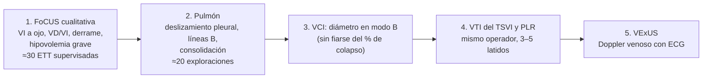

# 08 · Formación y competencia en POCUS para el paciente en shock

La precisión que se describe en [precisión diagnóstica](03-precision.md) solo se reproduce en manos **formadas**. Esta página resume cinco cosas:

- los **niveles de competencia** (básico y avanzado) definidos por las declaraciones internacionales;
- el **número de exploraciones** que recomienda cada sociedad;
- lo que se sabe de las **curvas de aprendizaje** de la FoCUS, la VCI, la VTI y VExUS;
- la **concordancia interobservador**;
- la situación en **España**.

Cierra con una propuesta práctica de qué aprender primero como residente.

!!! note "Competencia no es lo mismo que número de exploraciones"
    Todas las sociedades coinciden en que los números mínimos son **orientativos**. La competencia debe evaluarse de forma individual, con supervisión, revisión de imágenes y exámenes. El consenso de la SEMICYUC lo resume así: «la tendencia actual es evaluar la adquisición de competencias, más que el recuento simple» ([Ayuela Azcárate, 2014](../../05-fuentes/index.md#ayuelaazcarate2014)). La ACEP reconoce que la curva de aprendizaje puede estabilizarse por debajo o por encima de su umbral ([ACEP, 2023](../../05-fuentes/index.md#acep2023)).

---

## 1. Niveles de competencia: básico y avanzado

### 1.1 Las declaraciones fundacionales

| Documento | Año | Qué define |
|---|---|---|
| [ACCP/SRLF, Mayo 2009](../../05-fuentes/index.md#mayo2009) | 2009 (clásico) | Divide la ecografía crítica en **general** (torácica, abdominal y vascular) y **ecocardiografía básica y avanzada**. Para cada parte define las habilidades mínimas del intensivista competente |
| [Expert Round Table, 2011](../../05-fuentes/index.md#expertroundtable2011) | 2011 (clásico, vigente como referencia) | 29 expertos de la ESICM y de otras 11 sociedades. Acuerdo del 100 % en que la ecografía crítica general y la **ecocardiografía crítica básica deben ser obligatorias** en la formación de todo médico de UCI. Fija los mínimos de horas y de exploraciones (ver apartado 2) |
| [Expert Round Table, 2014](../../05-fuentes/index.md#expertroundtable2014) | 2014 | Estándares de formación en **ecocardiografía crítica avanzada** (ETT y ETE), con certificación formal |
| [Via, 2014 (WINFOCUS)](../../05-fuentes/index.md#via2014) | 2014 | Recomendaciones internacionales basadas en la evidencia sobre la FoCUS: 33 expertos de 16 países, método GRADE y método RAND. De 108 enunciados, 96 recibieron recomendación fuerte o muy fuerte. Abarcan indicaciones, técnica, formación y certificación |
| [Spencer, 2013 (ASE)](../../05-fuentes/index.md#spencer2013) | 2013 | Recomendaciones de la ASE sobre la FoCUS |
| [Neskovic, 2018 (EACVI)](../../05-fuentes/index.md#neskovic2018) | 2018 | *Core curriculum* y *core syllabus* de la FoCUS de la EACVI, elaborados con la ESA, la EACTA, la ACCA y WINFOCUS. Es el marco europeo común de la formación en FoCUS |
| [Robba, 2021 (ESICM)](../../05-fuentes/index.md#robba2021) | 2021 | Consenso Delphi de **habilidades básicas «de la cabeza a los pies»** para intensivistas: 74 enunciados (20 cardiacos) |
| [Díaz-Gómez, 2025 (SCCM)](../../05-fuentes/index.md#diazgomez2025) | 2025 | Actualización de la guía de ecografía crítica de la SCCM (ver [guías](05-guias.md)) |
| [Patrawalla, 2025 (ATS)](../../05-fuentes/index.md#patrawalla2025) | 2025 | Buenas prácticas para un currículo basado en competencias en ecografía crítica. Responde a los nuevos requisitos de la ACGME (EE. UU.), vigentes desde julio de 2024 para los *fellows* de medicina intensiva. Estos requisitos incluyen ecografía cardiaca básica, pulmonar y pleural, abdominal y vascular |

### 1.2 Qué es «básico» en el paciente en shock (ESICM 2021)

El consenso de [Robba, 2021](../../05-fuentes/index.md#robba2021) es la referencia más útil para decidir qué debe saber cualquier residente que atienda a pacientes en shock:

| Habilidad | ¿Básica? | Fuerza |
|---|---|---|
| Contractilidad del VI (aumentada, normal o disminuida) en 4 ventanas | Sí | Fuerte |
| **VD de tamaño normal para descartar fisiología obstructiva** si se sospecha TEP masivo | Sí | Fuerte |
| Insuficiencia del VD: movimiento septal paradójico, aplanamiento septal y VCI dilatada sin variación respiratoria | Sí | Fuerte |
| Grosor de la pared libre del VD en la ventana subcostal (orienta a cronicidad) | Sí | Fuerte |
| Signos ecocardiográficos de taponamiento (colapso de cavidades, variación Doppler del llenado) integrados en la clínica | Sí | Fuerte |
| Tamaño de la VCI para valorar la probabilidad de taponamiento | Sí | Fuerte |
| **Hipovolemia grave**: VCI pequeña y colapsada, cavidades pequeñas y obliteración sistólica | Sí | Fuerte |
| **Respuesta a fluidos en el shock persistente sin signos de hipovolemia** | **No** (recomendación en contra como habilidad básica) | Fuerte |
| **VTI del TSVI** para estimar el volumen sistólico | Sí | **Débil** |
| Física y limitaciones del Doppler color | No (habilidad añadida) | Fuerte |
| Neumotórax: deslizamiento pleural, pulso pulmonar o líneas B para descartarlo, y punto pulmón para confirmarlo | Sí | Fuerte |
| Síndrome intersticial y consolidación en la insuficiencia respiratoria | Sí | Fuerte |

!!! tip "Perla clínica: la frontera entre lo básico y lo avanzado"
    Para la ESICM, **reconocer el patrón** es básico: VI malo, VD dilatado, taponamiento, hipovolemia grave o neumotórax. **Cuantificar la respuesta a fluidos** en el shock persistente sin hipovolemia evidente se considera avanzado. La VTI queda en la frontera, con recomendación débil ([Robba, 2021](../../05-fuentes/index.md#robba2021)). VExUS no aparece en este consenso (es de 2021), así que hoy no forma parte del núcleo básico consensuado.

---

## 2. Número de exploraciones y horas recomendadas

| Fuente | Nivel o aplicación | Teoría | Exploraciones supervisadas | Certificación |
|---|---|---|---|---|
| [Expert Round Table, 2011](../../05-fuentes/index.md#expertroundtable2011) | Ecografía crítica general | ≥ 10 h | Sin consenso sobre el número | No obligatoria (acuerdo del 100 %) |
| | **Ecocardiografía crítica básica** | **≥ 10 h** (clases y casos con imágenes) | **30 ETT totalmente supervisadas** | No obligatoria (acuerdo del 100 %) |
| | **Ecocardiografía crítica avanzada** (requiere el nivel básico previo) | **≥ 40 h** | **150 ETT y 50 ETE totalmente supervisadas**. La ETE es obligatoria en este nivel | Considerada esencial (acuerdo del 100 %) |
| [Arntfield, 2014 (Canadá)](../../05-fuentes/index.md#arntfield2014) | Ecocardiografía crítica básica | 10 h de ecografía general más 10 h de ecocardiografía básica (siguiendo el consenso de Viena) | **30** | — |
| | Pulmón y pleura / acceso vascular / líquido libre abdominal | — | 20 / 10 / 10 | — |
| | Riñón / aorta abdominal / TVP | — | 25 / 25 / 25 | — |
| [ACEP, 2023](../../05-fuentes/index.md#acep2023) | Cada aplicación de ecografía de urgencias | Currículo estructurado | **25–50 exploraciones revisadas por aplicación** | Acreditación local (*credentialing*) |
| | Total durante la residencia | — | **150–300** según el número de aplicaciones | — |
| [ESICM, EDEC 2025](../../05-fuentes/index.md#edec2025) | Diploma europeo de ecocardiografía crítica avanzada | ≥ 40 créditos de formación continuada | **100 ETT y 35 ETE** en un e-logbook validado, en un máximo de 24 meses. Se accede al examen tras 30 ETT y 10 ETE | Examen teórico, casos y OSCE de ETE en simulador |
| [SEMICYUC, Ayuela Azcárate 2014](../../05-fuentes/index.md#ayuelaazcarate2014) | **Nivel I (básico)** | ≥ 20 h (14 h de teoría y 6 h de práctica) | **30 estudios supervisados** | Examen final |
| | **Nivel II (avanzado, IIa y IIb)** | ≥ 40 h | **150 ETT supervisadas y 30–50 ETE** | Examen teórico-práctico y estudios grabados |

!!! note "Sobre las cifras de la ACEP"
    Las cifras de 25–50 exploraciones por aplicación y de 150–300 en total aparecen en el texto de la guía ACEP en su versión de 2016, que hemos consultado. Según fuentes secundarias, se mantienen en la actualización de 2023 ([ACEP, 2023](../../05-fuentes/index.md#acep2023)). No hemos podido abrir el texto completo de la versión de 2023 `[POR VERIFICAR la redacción exacta]`. El estudio sobre la VCI de [Di Pietro 2018](../../05-fuentes/index.md#dipietro2018) cita 25 repeticiones como el umbral de la ACEP para esa técnica.

!!! warning "Error frecuente: confundir «haber hecho 30» con «ser competente»"
    - Dominar la técnica exige más repeticiones que el umbral mínimo.
    - En un gran análisis retrospectivo de más de 52 000 exploraciones de urgencias, la meseta de aprendizaje llegó entre las **18 exploraciones** (calidad de imagen en partes blandas) y las **90** (interpretación del cuadrante superior derecho). Para la mayoría de las aplicaciones, entre **50 y 75** exploraciones bastaron para una interpretación excelente (S > 84 % y E > 90 %) y una buena calidad de imagen ([Blehar 2015](../../05-fuentes/index.md#blehar2015)).
    - Con la VCI, 25 repeticiones permitieron a estudiantes novatos alcanzar el nivel predefinido de competencia, pero **no la pericia** del experto ([Di Pietro 2018](../../05-fuentes/index.md#dipietro2018)).

---

## 3. Curvas de aprendizaje

### 3.1 FoCUS y ecocardiografía crítica básica

| Estudio | Diseño (n) | Formación | Resultado |
|---|---|---|---|
| [Vignon 2011](../../05-fuentes/index.md#vignon2011) | Prospectivo en UCI (201 pacientes), residentes no cardiólogos sin experiencia | **12 h** (teoría, casos y práctica tutorizada). Una media de 33 ETT por residente (29–38) | Acuerdo con el intensivista experto. Función del VI: κ 0,84. VI dilatado: κ 0,90. **VD dilatado: κ 0,76**. **VCI dilatada: κ 0,79**. Derrame: κ 0,79. Diagnosticaron 2 taponamientos. Dejaron más preguntas sin responder (11,0 % frente a 5,7 %) y tardaron más (7 frente a 3 min) |
| [Vignon 2018](../../05-fuentes/index.md#vignon2018) | Prospectivo bicéntrico (24 residentes; 965 ETT) | Igual, con o sin **simulación informatizada** (2 sesiones de 3 h) | La simulación acelera la curva de aprendizaje: mejores puntuaciones al primer y al tercer mes, sin diferencias al sexto. Menos ETT supervisadas hasta la competencia: **30 ± 9 frente a 36 ± 7** |
| [Goudelin 2024](../../05-fuentes/index.md#goudelin2024) | Prospectivo en UCI (244 pacientes) | Formación limitada. Una media de 33 ETT | Acuerdo de las **propuestas terapéuticas** del residente con las del experto: κ > 0,80 para indicar fluidos, inotrópicos o vasopresores. Solo moderado para el balance negativo (κ 0,65): los residentes propusieron diuréticos con menos frecuencia (9,5 % frente a 14,4 %). CCI > 0,75 para las dimensiones ventriculares y de la VCI |
| [Townsend 2016](../../05-fuentes/index.md#townsend2016) | Prospectivo, residentes de cirugía (20; 390 exploraciones FADE) | 4 sesiones de 45 min de simulación más 5 exploraciones en pacientes cada una | Precisión del 45 % en la primera sesión y del 89 % en la cuarta. Estimación de la PVC con un 88 % de acierto al final |
| [Allimant 2025](../../05-fuentes/index.md#allimant2025) | RS (42 estudios; 351 no expertos) | Mediana de 4,5 h de teoría y **25** exploraciones de práctica | FEVI visual con κ de 0,72 frente al experto |

### 3.2 Vena cava inferior

| Estudio | Diseño (n) | Resultado |
|---|---|---|
| [Di Pietro 2018](../../05-fuentes/index.md#dipietro2018) | 10 estudiantes sin experiencia; 25 pacientes cada uno | 9 de 10 alcanzaron la competencia predefinida, pero con peor rendimiento que el experto y **poca mejora con la repetición**. Lo que sí mejoró fue el tiempo necesario para obtener imágenes legibles. Conclusión: 25 repeticiones no bastan para la pericia |
| [Fields 2011](../../05-fuentes/index.md#fields2011) | 5 urgenciólogos; 46 pacientes (92 exploraciones) | La fiabilidad del diámetro en modo M fue **mayor cuando el ecografista había hecho al menos 5 exploraciones previas de VCI** (ver 4.1) |

### 3.3 VTI

Hay pocos estudios específicos de la curva de aprendizaje de la VTI con novatos. La evidencia disponible es indirecta:

- **Precisión de la medida (operadores expertos):** hay que promediar 3 latidos en ritmo sinusal y 5 en fibrilación auricular. El cambio mínimo significativo es del **11 % con el mismo operador y del 14 % con dos operadores** ([Jozwiak 2019](../../05-fuentes/index.md#jozwiak2019)). Por tanto, las mediciones seriadas deben hacerlas, si es posible, el mismo operador.
- **Residentes de urgencias en voluntarios:** el volumen sistólico por ETT fue la medida hemodinámica más reproducible entre residentes (CCI 0,55; acuerdo del 80 % con diferencias < 15 %). La carótida y la colapsabilidad de la VCI fueron mucho peores ([Bussmann 2019](../../05-fuentes/index.md#bussmann2019)).
- **Con inteligencia artificial:** en pacientes con COVID-19, un novato que usaba software automático obtuvo una VTI y una colapsabilidad de la VCI concordantes con las de los expertos (CCI 0,95–0,97) ([Damodaran 2022](../../05-fuentes/index.md#damodaran2022)). La IA se trata en [novedades](09-novedades.md).
- **Consenso:** la ESICM considera la VTI una habilidad básica solo con **recomendación débil** ([Robba, 2021](../../05-fuentes/index.md#robba2021)).

### 3.4 VExUS

| Estudio | Diseño (n) | Resultado |
|---|---|---|
| [Zhai 2026](../../05-fuentes/index.md#zhai2026) | 2 **residentes** con un curso corto de VExUS; 80 pacientes de UCI; ecógrafo de bolsillo frente a convencional | Fiabilidad interobservador del grado VExUS: **κ 0,879** con el ecógrafo de bolsillo y κ 0,851 con el convencional. Con el de bolsillo empeoró la vena renal (κ 0,55 frente a 0,653). Imagen obtenida en más del 91 % de los casos (100 % en suprahepáticas y VCI). La exploración duró 5 min con el de bolsillo y 8 min con el convencional |
| [Longino 2024b](../../05-fuentes/index.md#longino2024b) | Multicéntrico; 4 médicos de distintas especialidades; 84 exploraciones pareadas de 42 pacientes | Fiabilidad interobservador del grado VExUS: **κ 0,71 y CCI 0,83**. Reproducibilidad entre usuarios: κ 0,63 y CCI 0,80. El acuerdo fue **mayor con ECG simultáneo** |
| [Klompmaker 2025](../../05-fuentes/index.md#klompmaker2025) | UCI general (138) | Acuerdo inter e intraobservador de VExUS de moderado a excelente |

!!! tip "Perla clínica: conecta el ECG para el Doppler venoso"
    Para interpretar las ondas de las suprahepáticas y de la porta hay que saber en qué fase del ciclo cardiaco está cada onda. Con ECG simultáneo, el acuerdo entre observadores mejora ([Longino 2024b](../../05-fuentes/index.md#longino2024b)). La vena renal es el componente más difícil, sobre todo con ecógrafos de bolsillo ([Zhai 2026](../../05-fuentes/index.md#zhai2026)).

---

## 4. Concordancia interobservador

### 4.1 VCI

| Estudio | Operadores y población | Resultado |
|---|---|---|
| [Fields 2011](../../05-fuentes/index.md#fields2011) | 5 urgenciólogos; 46 pacientes de urgencias | Diámetro máximo en modo M: **CCI 0,81** (0,67–0,89). Diámetro mínimo: CCI 0,77. Colapso estimado a ojo: 0,60. Índice de colapso calculado en modo M: **0,52**. Estado de volemia valorado visualmente: κ ponderado 0,64 |
| [Finnerty 2017](../../05-fuentes/index.md#finnerty2017) | 3 urgenciólogos expertos; 39 voluntarios | El modo B en eje largo subxifoideo fue la medida más fiable (CCI 0,86). La vista coronal lateral («de rescate») fue la peor (CCI 0,74). **Todos los índices de colapsabilidad en modo M tuvieron un CCI bajo** |
| [Bussmann 2019](../../05-fuentes/index.md#bussmann2019) | Residentes de urgencias; 31 voluntarios | La colapsabilidad de la VCI y las medidas carotídeas tuvieron una fiabilidad **inadecuada para el uso clínico** |
| [Vignon 2011](../../05-fuentes/index.md#vignon2011) | Residentes frente a experto en UCI | VCI dilatada: κ 0,79. Variación respiratoria de la VCI: κ 0,66, según la tabla recopilada en [Robba, 2021](../../05-fuentes/index.md#robba2021) |

!!! warning "El diámetro es fiable; el índice de colapso, bastante menos"
    Los clínicos miden el **diámetro** de la VCI de forma reproducible (CCI de alrededor de 0,8). El **porcentaje de colapso** es mucho menos reproducible (CCI 0,52 en [Fields 2011](../../05-fuentes/index.md#fields2011); bajo en todas las vistas en [Finnerty 2017](../../05-fuentes/index.md#finnerty2017)). Esto se suma a su baja precisión para predecir la respuesta a fluidos ([precisión](03-precision.md)). Conviene medir en **eje largo subxifoideo, en modo B**, y siempre en el mismo sitio.

### 4.2 FoCUS y VD

| Parámetro | κ o CCI | Fuente |
|---|---|---|
| FEVI visual, urgenciólogo frente a experto | κ 0,68 (0,57–0,79) | [Albaroudi 2022](../../05-fuentes/index.md#albaroudi2022) |
| FEVI visual, no expertos, pacientes no seleccionados | κ 0,72 (0,63–0,83); 0,84 con el mismo ecógrafo | [Allimant 2025](../../05-fuentes/index.md#allimant2025) |
| Disfunción del VD en el TEP, POCUS frente a ecocardiografía reglada | κ 0,63 (0,51–0,75) | [Thomas 2026](../../05-fuentes/index.md#thomas2026) |
| FoCUS en la sospecha de TEP con constantes alteradas | κ 1,0 (0,31–1,0) (IC muy amplio) | [Daley 2019](../../05-fuentes/index.md#daley2019) |

!!! note "Un dato llamativo"
    En [Thomas 2026](../../05-fuentes/index.md#thomas2026), la fiabilidad interobservador para la disfunción del VD **disminuyó a lo largo de la residencia** de urgencias. Es un estudio retrospectivo y el hallazgo no está explicado. Sirve de recordatorio de que la competencia no se consolida sola sin revisión de imágenes y control de calidad.

---

## 5. Formación en España

| Sociedad | Documento | Contenido relevante |
|---|---|---|
| **SEMICYUC** (medicina intensiva) | [Ayuela Azcárate, 2014](../../05-fuentes/index.md#ayuelaazcarate2014). Consenso del Grupo de Trabajo de Cuidados Intensivos Cardiológicos y RCP | **Nivel I**: ≥ 20 h y 30 estudios supervisados. **Nivel II (IIa y IIb)**: ≥ 40 h, 150 ETT y 30–50 ETE, examen teórico-práctico. **Nivel III**: investigación y docencia. La SEMICYUC acredita unidades, cursos y niveles |
| **SEDAR, SEMI y SEMES** | [Vives, 2021](../../05-fuentes/index.md#vives2021) | Consenso sobre las competencias mínimas y el diploma en ecografía **pulmonar, abdominal y vascular** en cuidados intensivos, anestesia y urgencias. Puede servir de guía para los programas MIR |
| **SEDAR y SEMES** | [Vives, 2022](../../05-fuentes/index.md#vives2022) | Diploma de **ecocardiografía básica** en cuidados intensivos y urgencias. Para obtener el diploma completo de ecografía en cuidados intensivos y urgencias hay que tener el de ecografía básica y el de ecografía pulmonar, abdominal y vascular. Los requisitos numéricos concretos (horas y exploraciones) no se han podido consultar en el texto completo `[POR VERIFICAR]` |
| **SEMI** (medicina interna) | [Torres Macho, 2018](../../05-fuentes/index.md#torresmacho2018) | Posicionamiento sobre la incorporación de la ecografía clínica a los servicios de medicina interna: indicaciones y periodo formativo recomendado. Cifras concretas `[POR VERIFICAR]` en el texto completo |
| | [Tung-Chen, 2024](../../05-fuentes/index.md#tungchen2024) (GTECO-SEMI) | Consenso Delphi sobre la formación y el desarrollo de la ecografía clínica en medicina interna: 137 enunciados en 10 áreas, 99 con consenso |
| | [Tung-Chen, 2025](../../05-fuentes/index.md#tungchen2025) | Posicionamiento sobre POCUS en la insuficiencia cardiaca, con ecografía pulmonar y VExUS (ver [guías](05-guias.md)) |

!!! info "Contexto internacional de la formación MIR"
    Una encuesta nacional italiana a residentes de anestesia y cuidados intensivos encontró tres carencias. La formación solo se consideró adecuada para el acceso vascular (62,2 %). En la mayoría de los casos no había certificación (< 10 %). El 48,5 % de los residentes se formaba por su cuenta. La principal limitación era la falta de un currículo estandarizado ([Mongodi 2022](../../05-fuentes/index.md#mongodi2022)). No hemos encontrado una encuesta equivalente y reciente en España `[laguna]`.

---

## 6. Recomendaciones prácticas para residentes: qué aprender primero

Esta secuencia es una **propuesta docente**, no una recomendación de ninguna guía. Se basa en tres criterios: qué considera básico la ESICM ([Robba, 2021](../../05-fuentes/index.md#robba2021)), qué precisión tiene cada técnica ([precisión](03-precision.md)) y qué fiabilidad logran los novatos (apartados 3 y 4).

| Paso | Qué aprender | Por qué en este orden | Referencia |
|---|---|---|---|
| **1** | **FoCUS cualitativa**: contractilidad del VI (normal, reducida o muy reducida), relación VD/VI, derrame y signos de taponamiento, e hipovolemia grave | Es lo que más cambia la clasificación del shock (LR+ > 10) y lo que antes se aprende: 25–33 exploraciones para una concordancia buena | [Robba, 2021](../../05-fuentes/index.md#robba2021); [Vignon 2011](../../05-fuentes/index.md#vignon2011); [Allimant 2025](../../05-fuentes/index.md#allimant2025) |
| **2** | **Ecografía pulmonar**: neumotórax, líneas B y consolidación | Habilidad básica con recomendación fuerte. Precisión alta para el neumotórax y el edema | [Robba, 2021](../../05-fuentes/index.md#robba2021); [Arntfield, 2014](../../05-fuentes/index.md#arntfield2014) |
| **3** | **Diámetro de la VCI** en eje largo y modo B | Es reproducible, orienta a la PAD y sirve de entrada a VExUS. El porcentaje de colapso es poco reproducible y poco preciso | [Fields 2011](../../05-fuentes/index.md#fields2011); [Finnerty 2017](../../05-fuentes/index.md#finnerty2017) |
| **4** | **VTI del TSVI** y **PLR** | Es la mejor prueba ecográfica de respuesta a fluidos (ver [precisión](03-precision.md)), pero requiere Doppler pulsado, una alineación correcta y el mismo operador. Recomendación débil como habilidad básica | [Jozwiak 2019](../../05-fuentes/index.md#jozwiak2019); [Robba, 2021](../../05-fuentes/index.md#robba2021) |
| **5** | **VExUS** | Aporta información de tolerancia a fluidos, pero exige Doppler venoso e interpretación con ECG. Se aprende con un curso corto si ya se domina lo anterior | [Zhai 2026](../../05-fuentes/index.md#zhai2026); [Longino 2024b](../../05-fuentes/index.md#longino2024b) |

!!! tip "Cómo organizar el aprendizaje"
    - **Simulación antes que pacientes:** acorta la curva de aprendizaje de la ecocardiografía básica (30 frente a 36 ETT hasta la competencia) ([Vignon 2018](../../05-fuentes/index.md#vignon2018)).
    - **Registro personal** (*logbook*) y **revisión de imágenes** por un supervisor: todas las sociedades lo exigen ([Expert Round Table, 2011](../../05-fuentes/index.md#expertroundtable2011); [ACEP, 2023](../../05-fuentes/index.md#acep2023)).
    - **Pacientes estables primero:** practica las ventanas en planta o en consulta antes de usarlas en el paciente inestable.
    - **Pregunta binaria:** plantea cada exploración como una pregunta de sí o no («¿VD mayor que VI?», «¿derrame con colapso?»). Así se ha validado la ecocardiografía básica ([Vignon 2011](../../05-fuentes/index.md#vignon2011)).
    - **Conocer el límite:** si la pregunta supera lo básico, por ejemplo valvulopatías o respuesta a fluidos sin hipovolemia evidente, pide una ecocardiografía reglada o avanzada ([Robba, 2021](../../05-fuentes/index.md#robba2021)).

---

## Puntos clave

- Las declaraciones internacionales distinguen la **ecocardiografía crítica básica**, obligatoria para todo médico de UCI, de la **avanzada**, que requiere certificación ([Expert Round Table, 2011](../../05-fuentes/index.md#expertroundtable2011); [Mayo, 2009](../../05-fuentes/index.md#mayo2009)).
- Mínimos orientativos del nivel básico: **≥ 10 h de teoría y 30 ETT supervisadas**. Del nivel avanzado: **≥ 40 h, 150 ETT y 50 ETE** ([Expert Round Table, 2011](../../05-fuentes/index.md#expertroundtable2011)). La SEMICYUC propone cifras parecidas: nivel I con 20 h y 30 estudios; nivel II con 40 h, 150 ETT y 30–50 ETE ([Ayuela Azcárate, 2014](../../05-fuentes/index.md#ayuelaazcarate2014)).
- La ACEP fija **25–50 exploraciones por aplicación** y 150–300 en total ([ACEP, 2023](../../05-fuentes/index.md#acep2023)). El diploma europeo avanzado (EDEC) exige **100 ETT y 35 ETE** ([ESICM, 2025](../../05-fuentes/index.md#edec2025)).
- Con formación limitada (12 h y unas 33 ETT), los residentes alcanzan un **acuerdo bueno o excelente** con los expertos en las preguntas básicas y en las decisiones terapéuticas ([Vignon 2011](../../05-fuentes/index.md#vignon2011); [Goudelin 2024](../../05-fuentes/index.md#goudelin2024)).
- El **diámetro de la VCI** es reproducible (CCI de alrededor de 0,8), pero el **índice de colapso** no lo es (CCI de alrededor de 0,5) ([Fields 2011](../../05-fuentes/index.md#fields2011); [Finnerty 2017](../../05-fuentes/index.md#finnerty2017)).
- **VExUS** logra un acuerdo sustancial incluso entre residentes con un curso corto (κ 0,71–0,88), sobre todo si se usa ECG ([Longino 2024b](../../05-fuentes/index.md#longino2024b); [Zhai 2026](../../05-fuentes/index.md#zhai2026)).
- Para la ESICM, la **respuesta a fluidos en el shock persistente sin hipovolemia evidente no es una habilidad básica**, y la VTI lo es solo con recomendación débil ([Robba, 2021](../../05-fuentes/index.md#robba2021)).
- Orden sugerido para el residente: **FoCUS cualitativa → pulmón → diámetro de la VCI → VTI y PLR → VExUS**.

## Lagunas y preguntas abiertas

- **No hay estudios de curva de aprendizaje específicos de la VTI ni de la PLR en novatos**. La evidencia es indirecta: estudios de reproducibilidad con expertos y estudios con IA.
- Los **números mínimos se basan en consenso**, no en estudios que demuestren una mejora de resultados en los pacientes. Las mesetas de aprendizaje varían mucho según la aplicación ([Blehar 2015](../../05-fuentes/index.md#blehar2015)).
- **VExUS no forma parte de ningún currículo básico consensuado**, y falta saber cuántas exploraciones hacen falta para dominarlo.
- En **España** conviven varios diplomas: SEMICYUC, SEDAR/SEMI/SEMES y GTECO-SEMI. No hemos localizado datos publicados sobre cuántos residentes los completan ni una encuesta nacional reciente. Parte de sus requisitos no se ha podido verificar en el texto completo `[POR VERIFICAR]`.
- **Mantenimiento de la competencia:** no hay consenso sobre cuántas exploraciones al año hacen falta para no perderla. El hallazgo de [Thomas 2026](../../05-fuentes/index.md#thomas2026) sugiere que el control de calidad continuo es necesario.
