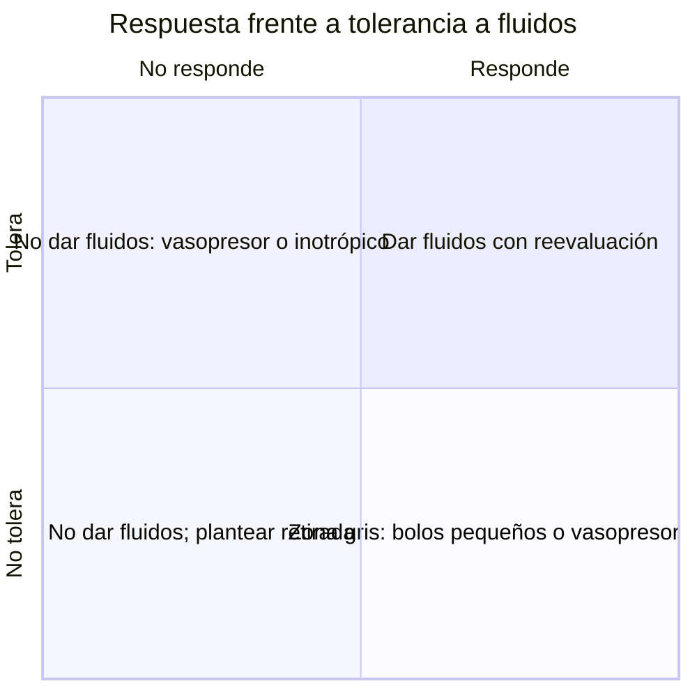

# 09 · Novedades y controversias (2024–2026)

El campo de la ecografía en el shock se ha movido mucho en los últimos dos años: han salido la **Surviving Sepsis Campaign (SSC) 2026** y las **guías ESICM 2025** de shock y de fluidos, se han publicado **ANDROMEDA-SHOCK-2** y **ARISE FLUIDS**, se consolida el concepto de **tolerancia a fluidos**, el **VExUS** pasa de moda a objeto de crítica, y llegan la **inteligencia artificial** y los **parches Doppler**. Esta página recoge qué cambia, qué se discute y qué falta por saber. Para el texto de las recomendaciones, ver [guías](05-guias.md); para los ensayos en detalle, [impacto clínico](04-impacto.md).

!!! abstract "Las cinco novedades para contar en la sesión"
    1. La ESICM 2025 sugiere la **ecocardiografía como primera prueba de imagen** para identificar el tipo de shock ([Monnet, 2025](../../05-fuentes/index.md#monnet2025)).
    2. La SSC 2026 acepta **tanto la estrategia liberal como la restrictiva** tras la reanimación inicial y mantiene las **medidas dinámicas** ([Prescott, 2026](../../05-fuentes/index.md#prescott2026); [Azevedo, 2026](../../05-fuentes/index.md#azevedo2026)).
    3. **ANDROMEDA-SHOCK-2**: una reanimación personalizada (relleno capilar + fenotipo + respuesta a fluidos + ecocardiografía) mejora un resultado compuesto ([ANDROMEDA-SHOCK-2, 2025](../../05-fuentes/index.md#andromeda2025)).
    4. Se pasa de la pregunta **«¿responde?»** a la doble pregunta **«¿responde y tolera?»** ([Kattan, 2022](../../05-fuentes/index.md#kattan2022)).
    5. **VExUS** se reinterpreta: marca congestión venosa establecida más que disfunción del VD, y su valor pronóstico es **heterogéneo** ([Carsetti, 2026](../../05-fuentes/index.md#carsetti2026); [Song, 2025](../../05-fuentes/index.md#song2025)).

---

## 1. Surviving Sepsis Campaign 2026: qué cambia respecto a 2021

### 1.1 Fluidos y monitorización: comparación 2021 → 2026

| Tema | SSC 2021 ([Evans, 2021](../../05-fuentes/index.md#evans2021)) | SSC 2026 ([Prescott, 2026](../../05-fuentes/index.md#prescott2026)) |
|---|---|---|
| Volumen inicial | «Al menos 30 mL/kg» de cristaloide IV en las primeras 3 h. Débil, calidad baja | Se mantiene «≥ 30 mL/kg en 3 h» (recomendación **revisada**, condicional, certeza baja), con énfasis en individualizar, reevaluar con frecuencia y usar peso ajustado/ideal si el IMC es > 30 `[POR VERIFICAR literalidad en el texto completo]` |
| Fluidos tras la reanimación inicial | «Evidencia insuficiente» para recomendar estrategia restrictiva o liberal en las primeras 24 h | **Cualquiera de las dos, liberal o restrictiva**, según factores del paciente y del sistema sanitario ([Azevedo, 2026](../../05-fuentes/index.md#azevedo2026)); condicional, certeza baja `[POR VERIFICAR]` |
| Medidas dinámicas | Se sugieren frente a la exploración física o parámetros estáticos solos (EPP o bolo con VS, VVS, VPP **o ecocardiografía, si está disponible**). Débil, calidad muy baja | Se mantienen (EPP o bolo con VS, VVS, VP, VPP) ([Azevedo, 2026](../../05-fuentes/index.md#azevedo2026)); condicional, certeza baja. La inclusión explícita del POCUS en las observaciones está `[POR VERIFICAR]` |
| Lactato | Guiar la reanimación para reducir el lactato. Débil, calidad baja | Lactato seriado; se cita como objetivo un descenso ≥ 10 % cada 2 h `[POR VERIFICAR]` |
| Tiempo de relleno capilar | Coadyuvante de otras medidas de perfusión en el shock séptico. Débil, calidad baja | Se mantiene como coadyuvante; ANDROMEDA-SHOCK-2 se publicó después del cierre de la evidencia `[POR VERIFICAR]` |
| Gasto cardiaco mínimamente invasivo o no invasivo | — | **Nueva:** evidencia insuficiente para recomendarlo ([Azevedo, 2026](../../05-fuentes/index.md#azevedo2026)) |
| Vasopresor en disfunción cardiaca | — | **Nueva:** noradrenalina o adrenalina como primer vasopresor en shock séptico con disfunción cardiaca ([Azevedo, 2026](../../05-fuentes/index.md#azevedo2026)) |
| Retirada activa de líquido | No hay recomendación específica | **Nueva:** retirada activa de líquido después de la fase de reanimación aguda ([Azevedo, 2026](../../05-fuentes/index.md#azevedo2026)); grado `[POR VERIFICAR]` |
| Secuencia fluidos → vasopresor | Vasopresores periféricos en vez de retrasarlos hasta tener una vía central. Débil, calidad muy baja | Bolo inicial de cristaloide seguido de **vasopresor precoz** si persiste la hipotensión ([Azevedo, 2026](../../05-fuentes/index.md#azevedo2026)) |

!!! info "Nota metodológica"
    El texto completo de la SSC 2026 es de pago y PubMed no incluye resumen. La tabla se basa en la tabla de recomendaciones de la revisión de [Azevedo, 2026](../../05-fuentes/index.md#azevedo2026) (Critical Care Science, open access) y en resúmenes secundarios. Las celdas `[POR VERIFICAR]` (grados de recomendación y literalidad) deben comprobarse con el PDF de la guía antes de llevarlas a una diapositiva. Las recomendaciones de 2021 se han verificado en el texto completo ([Evans, 2021](../../05-fuentes/index.md#evans2021), PMC8486643).

### 1.2 La controversia de «al menos 30 mL/kg»

| Posición | Documento | Formulación |
|---|---|---|
| SSC 2021 y 2026 | [Evans, 2021](../../05-fuentes/index.md#evans2021); [Prescott, 2026](../../05-fuentes/index.md#prescott2026) | **«Al menos»** 30 mL/kg en 3 h |
| ESICM 2025 (fluidos, parte 2) | [Mekontso Dessap, 2025](../../05-fuentes/index.md#mekontsodessap2025) | **«Hasta»** 30 mL/kg en la fase inicial, ajustando al contexto con reevaluación frecuente (certeza muy baja) |

Críticas principales:

- **Un volumen fijo no respeta la heterogeneidad** de los pacientes y puede contribuir a la sobrecarga, aunque la recomendación se haya rebajado en ediciones sucesivas ([Azevedo, 2026](../../05-fuentes/index.md#azevedo2026)).
- Tres ECA grandes de estrategia (CLASSIC, CLOVERS, ARISE FLUIDS) **no encuentran diferencias** entre dar más o menos líquido, y ARISE FLUIDS encuentra **más edema pulmonar** con la estrategia liberal (5,0 % frente a 0,6 %) ([CLASSIC, 2022](../../05-fuentes/index.md#classic2022); [CLOVERS, 2023](../../05-fuentes/index.md#clovers2023); [ARISE FLUIDS, 2026](../../05-fuentes/index.md#arisefluids2026)).
- La ecografía cardiaca focalizada puede estar **modulando ya** la aplicación del bolo: en un estudio retrospectivo, los pacientes clasificados por ecografía como «tolerantes» recibieron más a menudo los 30 mL/kg (52,0 % frente a 31,3 %), sin diferencias en mortalidad ([Prevalska, 2023](../../05-fuentes/index.md#prevalska2023)).

!!! warning "Error frecuente"
    Interpretar el «al menos 30 mL/kg» como una **orden** para todos. Incluso la SSC lo formula como recomendación condicional de certeza baja, y la ESICM habla de **«hasta»** 30 mL/kg. En insuficiencia cardiaca, insuficiencia renal crónica o congestión pulmonar visible en la ecografía, el volumen debe individualizarse.

---

## 2. ESICM 2025: shock, monitorización y volumen

### 2.1 Guía de shock circulatorio y monitorización hemodinámica

La guía [Monnet, 2025](../../05-fuentes/index.md#monnet2025) emite 50 declaraciones (GRADE + declaraciones de buena práctica no graduadas, *UGPS*). Las relevantes para la ecografía son:

| Declaración | Tipo |
|---|---|
| Se sugiere la **ecocardiografía como primera modalidad de imagen para evaluar el tipo de shock** | Graduada |
| Se recomiendan **variables dinámicas** frente a marcadores estáticos de precarga para predecir la respuesta a fluidos, cuando sean aplicables | Graduada |
| En el shock persistente tras la reanimación inicial, **evaluar la respuesta a fluidos antes de seguir** dando fluidos | UGPS |
| Monitorizar el gasto cardiaco y/o el volumen sistólico si no hay respuesta al tratamiento inicial | UGPS |
| Los **fenotipos ecocardiográficos** de disfunción del VI y del VD pueden tener **significado pronóstico** | UGPS |
| Monitorizar la perfusión cutánea con el tiempo de relleno capilar | UGPS |

### 2.2 Guía de fluidos, parte 2 (volumen)

[Mekontso Dessap, 2025](../../05-fuentes/index.md#mekontsodessap2025):

- Sepsis: **hasta 30 mL/kg** en la fase inicial (certeza muy baja); enfoque **individualizado** en la fase de optimización (certeza muy baja); **ninguna recomendación a favor ni en contra** de las estrategias restrictiva o liberal (certeza moderada de ausencia de efecto).
- **Shock cardiogénico izquierdo:** los fluidos **no** se recomiendan como tratamiento principal.
- **Taponamiento:** fluidos con cautela hasta el tratamiento definitivo. **TEP agudo:** guiados por marcadores subrogados de congestión derecha (buena práctica). Aquí la ecografía es la herramienta natural para ver el VD y la congestión.

!!! tip "Perla clínica"
    Las dos guías europeas encajan con la secuencia de la charla: **1)** ecocardiografía para el **tipo** de shock, **2)** medidas dinámicas (VTI con elevación pasiva de piernas) para la **respuesta**, **3)** fenotipo cardiaco y signos de congestión para la **tolerancia** y el pronóstico.

---

## 3. Fenotipos ecocardiográficos del shock séptico

### 3.1 Los cinco *clusters* de Geri

[Geri, 2019](../../05-fuentes/index.md#geri2019) combinó datos clínicos y de ecocardiografía transesofágica de 360 pacientes con shock séptico (12 UCI) mediante agrupamiento jerárquico:

| *Cluster* | Fenotipo | % | Mortalidad a 7 días | Mortalidad en UCI |
|:--:|---|:--:|:--:|:--:|
| 1 | Bien reanimado (sin disfunción del VI/VD ni respuesta a fluidos) | 16,9 % | 9,8 % | 21,3 % |
| 2 | **Disfunción sistólica del VI** | 17,7 % | 32,8 % | **50,0 %** |
| 3 | Hipercinético | 23,3 % | 8,3 % | 23,8 % |
| 4 | **Insuficiencia del VD** | 22,5 % | 27,2 % | 42,0 % |
| 5 | Hipovolemia persistente | 19,4 % | 23,2 % | 38,6 % |

### 3.2 Metaanálisis recientes sobre disfunción cardiaca y pronóstico

- [Wang, 2025](../../05-fuentes/index.md#wang2025) (65 estudios, 17 008 pacientes): la disfunción sistólica del VI **alcanza un pico del 33 %** a las 48 h; la diastólica, del 46 %; la del VD, del 47 %. Todas se asocian a más mortalidad: RR 1,57 (sistólica VI), 1,36 (diastólica VI) y 1,62 (VD). Patrón «parabólico»: aparecen en las primeras 48 h y regresan en la recuperación, lo que obliga a **explorar de forma seriada**.
- [Vallabhajosyula, 2021](../../05-fuentes/index.md#vallabhajosyula2021) (10 estudios, 1373 pacientes): disfunción del VD en el 34,7 %; mortalidad a corto plazo OR 2,42 y a largo plazo OR 2,26.
- [Nam, 2025](../../05-fuentes/index.md#nam2025) (cohorte coreana, 19 hospitales, 2274 pacientes con ecocardiografía < 24 h): solo la FEVI **< 30 %** se asoció de forma independiente a mortalidad hospitalaria (OR 1,81; 1,09–3,03), más en bacteriemia y sin cardiopatía previa.
- Revisión de [Sato, 2025](../../05-fuentes/index.md#sato2025): la miocardiopatía séptica es un espectro (sistólica, hiperdinámica, diastólica, VD); ningún tratamiento dirigido ha demostrado beneficio en la supervivencia y se propone un **abordaje guiado por fenotipo**.

!!! note "Controversia: ¿fenotipar sirve para tratar?"
    Los fenotipos **predicen**, pero ningún ECA ha demostrado que asignar el tratamiento según el fenotipo ecocardiográfico, por sí solo, mejore la supervivencia. ANDROMEDA-SHOCK-2 incorpora el fenotipado (clínico y ecocardiográfico) dentro de un paquete, y mejora un resultado compuesto, sin poder aislar su contribución ([ANDROMEDA-SHOCK-2, 2025](../../05-fuentes/index.md#andromeda2025); [Hernández, 2026](../../05-fuentes/index.md#hernandez2026)). La ESICM lo formula solo como declaración de buena práctica sobre el **pronóstico** ([Monnet, 2025](../../05-fuentes/index.md#monnet2025)).

---

## 4. Tolerancia a fluidos: el nuevo eje de decisión

### 4.1 El concepto

El documento de posicionamiento de [Kattan, 2022](../../05-fuentes/index.md#kattan2022) propone definir la **tolerancia a fluidos** como la capacidad del paciente de recibir líquido **sin que aparezcan signos de sobrecarga o congestión**, e introduce señales clínicas y ecográficas para valorarla. Es complementario de la **respuesta a fluidos**: un paciente puede responder y no tolerar (p. ej., respondedor con líneas B difusas) o tolerar y no responder. Ver también la revisión de [Díaz-Gómez, 2022](../../05-fuentes/index.md#diazgomez2022) sobre la «cascada de congestión».

*Esquema conceptual de elaboración propia a partir del concepto de [Kattan, 2022](../../05-fuentes/index.md#kattan2022). Es opinión de experto y no una estrategia validada en ECA.*

### 4.2 Marcadores ecográficos de (in)tolerancia

| Marcador | Evidencia reciente |
|---|---|
| **Líneas B / puntuación de ecografía pulmonar** | En SDRA con shock séptico, 1 L de suero empeoró la aireación (puntuación de 13 a 16) aunque mejoró transitoriamente la oxigenación: la ecografía pulmonar puede servir de «freno» a la sobrecarga ([Caltabeloti, 2014](../../05-fuentes/index.md#caltabeloti2014), clásico) |
| **VExUS** | VExUS ≥ 1 se asocia a menor probabilidad de responder a fluidos y a peor evolución a 24 h en urgencias ([Rolston, 2026](../../05-fuentes/index.md#rolston2026)) |
| **Combinación pulmón + venas** | En 138 críticos, el 63 % era tolerante al ingreso; la congestión **pulmonar** (27 %) fue mucho más frecuente que la **sistémica** (6 %), y ambas raramente coexistían (5 %): **hay que mirar las dos** ([Klompmaker, 2026](../../05-fuentes/index.md#klompmaker2026)) |
| **Doppler de vena femoral** | Concordancia moderada con VExUS (κ 0,55) en shock séptico; más accesible y con curva de aprendizaje más corta ([Sahbal, 2026](../../05-fuentes/index.md#sahbal2026)) |
| **Índice VTI/VExUS** | Integra flujo arterial (VTI) y congestión venosa; un índice bajo se asoció a disfunción ventricular y a más mortalidad a 30 días (HR ajustado 3,86) en un estudio exploratorio de 62 pacientes ([Prager, 2025](../../05-fuentes/index.md#prager2025)) |

!!! warning "Ecografía gástrica/intestinal como marcador de tolerancia"
    No se ha encontrado evidencia clínica sólida (RS/MA o ECA) sobre ecografía **gástrica** o **intestinal** como marcador de tolerancia a fluidos en el shock. Se mantiene como **laguna**; no debe presentarse como herramienta validada.

---

## 5. VExUS: controversias

### 5.1 ¿Congestión o disfunción del ventrículo derecho?

- [Carsetti, 2026](../../05-fuentes/index.md#carsetti2026) (RS/MA, 8 estudios en el análisis principal): el VExUS alto (2–3) se asocia a un TAPSE menor (diferencia media −2,35 mm; I² 61 %) y a menor gasto, volumen sistólico, S' del VD y VTI. Pero **al excluir los estudios de insuficiencia cardiaca, la asociación con disfunción del VD desaparece**, y los valores medios de TAPSE, S' y FAC en VExUS 2–3 **siguen dentro de la normalidad**. Conclusión: el VExUS debe leerse como **marcador de congestión venosa sistémica establecida**, no como indicador de disfunción sistólica intrínseca del VD.
- [Andrei, 2025](../../05-fuentes/index.md#andrei2025) (145 pacientes de UCI general, 514 evaluaciones): el VExUS ≥ 2 (18,7 %) se asoció sobre todo a **comorbilidad cardiaca** y a parámetros de función cardiaca (onda S del VD, E/A del VI). Esto explicaría por qué el VExUS predice bien en unas cohortes y no en otras.

### 5.2 Heterogeneidad pronóstica

| A favor de su valor pronóstico | En contra o sin asociación |
|---|---|
| LRA tras cirugía cardiaca ([Beaubien-Souligny, 2020](../../05-fuentes/index.md#beaubien2020)) | Sepsis en UCI china: sin asociación con LRA, mortalidad ni TRR ([Song, 2025](../../05-fuentes/index.md#song2025)) |
| RS/MA en críticos: asociación con LRA (OR 2,63) ([Melo, 2025](../../05-fuentes/index.md#melo2025)) | …pero **no** con mortalidad en la misma RS/MA ([Melo, 2025](../../05-fuentes/index.md#melo2025)) |
| Sepsis en urgencias: asociación con muerte/UCI a 24 h ([Rolston, 2026](../../05-fuentes/index.md#rolston2026)) | Shock séptico, piloto: asociación con TRR no significativa (p = 0,06) ([Prager, 2024](../../05-fuentes/index.md#prager2024)) |
| Insuficiencia cardiaca aguda: mortalidad hospitalaria 14,1 % frente a 1,9 % ([Chaves, 2026](../../05-fuentes/index.md#chaves2026)) | ECA en cardiorrenal: guiar por VExUS no mejoró la recuperación renal ([Islas-Rodríguez, 2024](../../05-fuentes/index.md#islasrodriguez2024)) |

Otras fuentes de heterogeneidad:

- **Correlación con la presión auricular derecha** buena en una cohorte (AUC 0,90 frente a 0,77 de la VCI) ([Longino, 2024](../../05-fuentes/index.md#longino2024)), pero **sin correlación con la PVC** en sepsis ([Song, 2025](../../05-fuentes/index.md#song2025)).
- **Prevalencia baja** en sepsis (≈ 18–19 % el día 1) ([Prager, 2024](../../05-fuentes/index.md#prager2024); [Song, 2025](../../05-fuentes/index.md#song2025)), lo que limita la potencia de los estudios.
- Técnica exigente (Doppler de venas hepáticas, porta e intrarrenal); ver [técnica](02-tecnica.md) y [limitaciones](07-limitaciones.md).

---

## 6. Shock cardiogénico y POCUS

- La SCCM 2024 sugiere usar la ecografía crítica para guiar el manejo del **shock cardiogénico**, además del séptico y la insuficiencia respiratoria aguda (recomendación condicional) ([Díaz-Gómez, 2025](../../05-fuentes/index.md#diazgomez2025)).
- La ESC 2021 de insuficiencia cardiaca recoge la ecocardiografía inmediata ante la sospecha de shock cardiogénico ([McDonagh, 2021](../../05-fuentes/index.md#mcdonagh2021)); la clase y el nivel están `[POR VERIFICAR]`.
- **Impacto pronóstico:** la RS del Japan Resuscitation Council solo encontró 2 estudios; el ECA fue neutro (RR 0,99) y el observacional mostró mayor mortalidad con POCUS, probablemente por confusión por indicación ([Osawa, 2025](../../05-fuentes/index.md#osawa2025)).
- La ESICM desaconseja los fluidos como tratamiento principal del shock cardiogénico izquierdo ([Mekontso Dessap, 2025](../../05-fuentes/index.md#mekontsodessap2025)). La SSC 2026 añade la opción de **noradrenalina o adrenalina** en el shock séptico con disfunción cardiaca ([Azevedo, 2026](../../05-fuentes/index.md#azevedo2026)): la ecocardiografía es lo que permite identificar a este subgrupo.

---

## 7. Tecnología: inteligencia artificial y parches Doppler

### 7.1 IA para FEVI, VTI y VCI

| Estudio | Qué evalúa | Resultado |
|---|---|---|
| [Zako, 2026](../../05-fuentes/index.md#zako2026) | RS de 12 estudios prospectivos de **FEVI** con POCUS asistido por IA (UCI, urgencias, perioperatorio, planta, comunidad) | Correlación r 0,56–0,92; CCI 0,84–0,94; límites de acuerdo **amplios** (≈ −31,8 % a +20,0 %), con tendencia a **infraestimar**. Para FEVI < 50 %: sensibilidad 70–93 %, especificidad 89–100 %. **Ningún estudio con bajo riesgo de sesgo** en todos los dominios de QUADAS-2. Útil para **cribado y triaje** |
| [Gohar, 2023](../../05-fuentes/index.md#gohar2023) | Herramientas automáticas de FEVI, VTI y VCI de un equipo comercial frente a un experto | Buen acuerdo **con vistas de alta calidad** (κ: FEVI 0,50; VCI 0,54; VTI 0,66). La IA **no sustituye** la buena adquisición de la imagen |
| [Bataille, 2021](../../05-fuentes/index.md#bataille2021) | Aprendizaje automático con datos de ETT para predecir la respuesta a fluidos (100 pacientes sépticos) | AUC en la muestra de validación 0,83–0,85, comparable a la EPP (0,77); variables clave: colapsabilidad de la VCI, VTI, onda S, E/Ea y onda E |
| [Baloescu, 2025](../../05-fuentes/index.md#baloescu2025) | Ecografía pulmonar guiada por IA realizada por no expertos | Ver [formación](08-formacion.md); relevante para detectar congestión pulmonar (líneas B) |

### 7.2 Doppler carotídeo y parches *wearables*

- **Parche Doppler inalámbrico** sobre la carótida: en voluntarios sanos, los cambios de VTI carotídeo y del tiempo de flujo corregido siguieron los cambios de volumen sistólico (r² 0,81 y 0,62); ΔVTI carotídeo > 15 % predijo ΔVS > 10 % con sensibilidad del 95 % y especificidad del 92 % ([Kenny, 2020](../../05-fuentes/index.md#kenny2020)). En cirugía cardiaca, un cambio del 13,6 % en la velocidad máxima carotídea correspondió a un cambio del 10 % en el flujo total ([Munding, 2023](../../05-fuentes/index.md#munding2023)). En voluntarios sanos, las medidas de la VCI **no se correlacionaron** con el cambio del tiempo de flujo corregido ([Kenny, 2023](../../05-fuentes/index.md#kenny2023)).
- **Precisión en pacientes críticos (RS/MA):**
    - en ventilación mecánica, la Δ velocidad pico carotídea tuvo una sensibilidad de 0,79 y una especificidad de 0,85, con **certeza baja** ([Lipszyc, 2024](../../05-fuentes/index.md#lipszyc2024));
    - en críticos inestables en general, la sensibilidad fue de 0,73, la especificidad de 0,82 y el AUROC de 0,81, con **capacidad limitada** según los autores ([Walker, 2024](../../05-fuentes/index.md#walker2024)).

!!! note "Valoración"
    La IA y los parches prometen **reducir la dependencia del operador** y permitir la **monitorización continua** de la respuesta a fluidos, pero la evidencia es de **precisión** (a menudo en voluntarios sanos o en quirófano), no de impacto en resultados clínicos. El Doppler carotídeo en críticos tiene una precisión solo moderada.

---

## 8. Ensayos y estudios en marcha o pendientes de publicar (2024–2026)

| Estudio | Diseño | Pregunta | Estado (registro/protocolo) |
|---|---|---|---|
| **Andromeda-VEXUS** ([Prager, 2023](../../05-fuentes/index.md#prager2023)) | Cohorte prospectiva internacional (no ECA) | Asociación entre congestión venosa por Doppler y resultados en shock séptico | Resultados no localizados en PubMed a septiembre de 2026 `[POR VERIFICAR]` |
| **GENESIS** ([Lafon, 2025](../../05-fuentes/index.md#lafon2025)) | ECA, 13 urgencias francesas, n = 312 | Ecocardiografía precoz con algoritmo terapéutico frente a SSC estándar; primario ΔSOFA a 24 h | Completado en [ClinicalTrials.gov](https://clinicaltrials.gov/study/NCT04580888); resultados pendientes |
| **FLUIDS** ([Ter Horst, 2025](../../05-fuentes/index.md#terhorst2025)) | ECA, 1 centro (Groningen), n = 188 | Fluidos y vasopresor guiados por ΔVS indexado no invasivo en urgencias; secundario: congestión venosa por POCUS | Protocolo publicado |
| **ICON-Sepsis** ([Ehrman, 2025](../../05-fuentes/index.md#ehrman2025)) | Cohorte prospectiva | Fenotipos de congestión (eco cardiaca, pulmonar y renal + biomarcadores) en sepsis desde urgencias | Reclutando desde abril de 2024 |
| VExUS tras la fase de reanimación ([NCT06227702](https://clinicaltrials.gov/study/NCT06227702)) | ECA, n estimado 200 | Manejo de fluidos guiado por VExUS; primario jerárquico (*win ratio*) | Estado «desconocido» |
| Señales de intolerancia ([NCT06568744](https://clinicaltrials.gov/study/NCT06568744)) | ECA, Chile, n estimado 62 | Límites de seguridad por señales de intolerancia a fluidos durante la reanimación | Estado «desconocido» |

---

## 9. Otras controversias abiertas

- **¿La ecocardiografía en sepsis reduce la mortalidad?** Los datos de MIMIC se contradicen según el método: sí según [Feng, 2018](../../05-fuentes/index.md#feng2018) y no según [Blank, 2024](../../05-fuentes/index.md#blank2024). Ver [impacto](04-impacto.md#21-grandes-bases-de-datos-mimic-y-otras).
- **Restrictivo frente a liberal:** tres ECA neutros; ¿hay subfenotipos biológicos que se beneficien de uno u otro? Ver el editorial de [Kitsios, 2025](../../05-fuentes/index.md#kitsios2025) sobre subfenotipos en CLOVERS.
- **VCI en respiración espontánea:** sigue en uso pese a una sensibilidad del 63 % ([Cardozo Júnior, 2023](../../05-fuentes/index.md#cardozo2023)); ver [precisión](03-precision.md).
- **Paradigma 2026:** la reanimación evoluciona de objetivos fijos aislados hacia **pruebas reversibles en ciclos cortos** guiadas por señales de perfusión rápidas (TRC) y por el fenotipo ([Hernández, 2026](../../05-fuentes/index.md#hernandez2026)).

## Puntos clave

- La **ESICM 2025** sugiere la ecocardiografía como **primera prueba de imagen** para el tipo de shock y recomienda las **variables dinámicas** frente a las estáticas ([Monnet, 2025](../../05-fuentes/index.md#monnet2025)).
- La **SSC 2026** mantiene los 30 mL/kg iniciales, pero acepta **estrategia liberal o restrictiva** después e incorpora la **retirada activa de líquido** ([Prescott, 2026](../../05-fuentes/index.md#prescott2026); [Azevedo, 2026](../../05-fuentes/index.md#azevedo2026)). La ESICM habla de **«hasta»** 30 mL/kg ([Mekontso Dessap, 2025](../../05-fuentes/index.md#mekontsodessap2025)).
- Los **fenotipos ecocardiográficos** (disfunción del VI, del VD, hipovolemia persistente) tienen valor pronóstico claro ([Geri, 2019](../../05-fuentes/index.md#geri2019); [Wang, 2025](../../05-fuentes/index.md#wang2025)), pero tratar según fenotipo aún no ha demostrado beneficio aislado.
- La **tolerancia a fluidos** (líneas B + VExUS) completa a la respuesta a fluidos. La congestión pulmonar y la sistémica rara vez coexisten, así que hay que valorar las dos ([Kattan, 2022](../../05-fuentes/index.md#kattan2022); [Klompmaker, 2026](../../05-fuentes/index.md#klompmaker2026)).
- **VExUS** refleja congestión venosa establecida más que disfunción del VD, y su valor pronóstico en sepsis es **inconsistente** ([Carsetti, 2026](../../05-fuentes/index.md#carsetti2026); [Song, 2025](../../05-fuentes/index.md#song2025)).
- La **IA** y los **parches Doppler** son prometedores para reducir la dependencia del operador, pero solo hay evidencia de precisión, con sesgos y límites de acuerdo amplios ([Zako, 2026](../../05-fuentes/index.md#zako2026); [Walker, 2024](../../05-fuentes/index.md#walker2024)).

## Lagunas y preguntas abiertas

- Verificar en el texto completo de la SSC 2026 la **fuerza y certeza** de cada recomendación hemodinámica y si menciona el POCUS de forma explícita.
- Resultados de **Andromeda-VEXUS** y **GENESIS**.
- No hay ECA con potencia suficiente de **manejo guiado por VExUS** ni de **desescalada guiada por ecografía** en shock séptico.
- Falta validar la **ecografía gástrica/intestinal** como marcador de tolerancia.
- No está claro qué umbral de **competencia del operador** se necesita para que la ecografía mejore resultados, ni si la IA puede cubrir esa brecha.
- ¿Tratar según fenotipo ecocardiográfico, y no solo según fenotipo clínico, mejora los resultados? Hace falta un ECA específico.
