# Recursos gráficos

Material visual de la sesión:

- **Presentación (tema «Dividendo»):** [ver el PDF](../assets/presentacion/sesion-clinica.pdf) o [descargar el PowerPoint (.pptx)](../assets/presentacion/sesion-clinica.pptx), editable para los retoques finales.
- **Diagramas propios:** generados con los scripts de `scripts/diagramas/`, con el estilo sobrio de la presentación (blanco y negro más acento morado).
- **Imágenes ecográficas:** descargadas con licencia libre. Los créditos y licencias de cada una están en [Créditos de imágenes](creditos.md).

## Diagramas propios

Esquemas y gráficos hechos para la charla. Los datos salen de la investigación, y cada script cita su fuente en un comentario. Para regenerarlos: `.venv/bin/python scripts/diagramas/<script>.py`. La presentación usa una variante con el granate del tema Dividendo, en `docs/assets/diagramas/dividendo/`, que se genera con `DIAGRAMAS_TEMA=dividendo` delante del mismo comando.

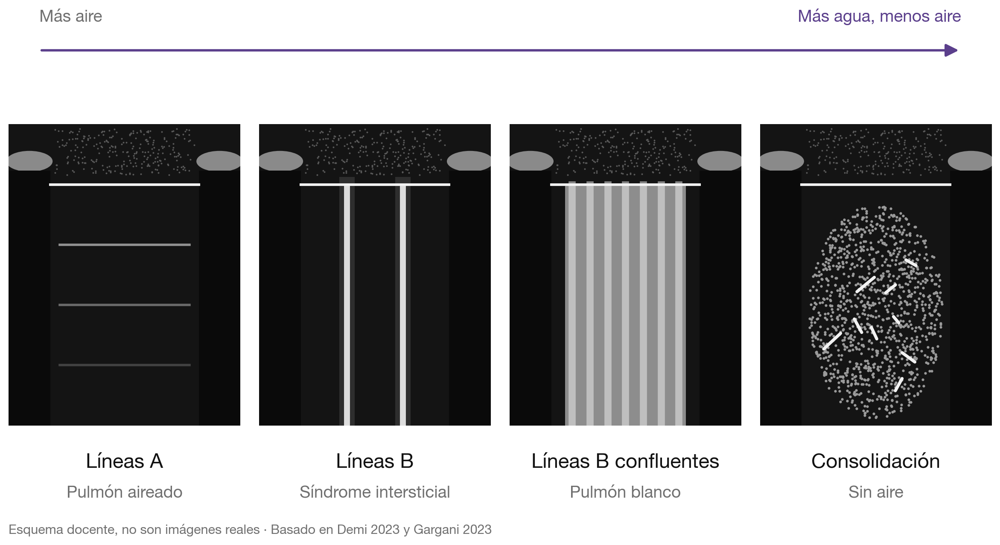{ loading=lazy }

*Espectro de aireación: de líneas A a consolidación.* Uso: diapositiva 4 · Script: `scripts/diagramas/espectro_aireacion.py`

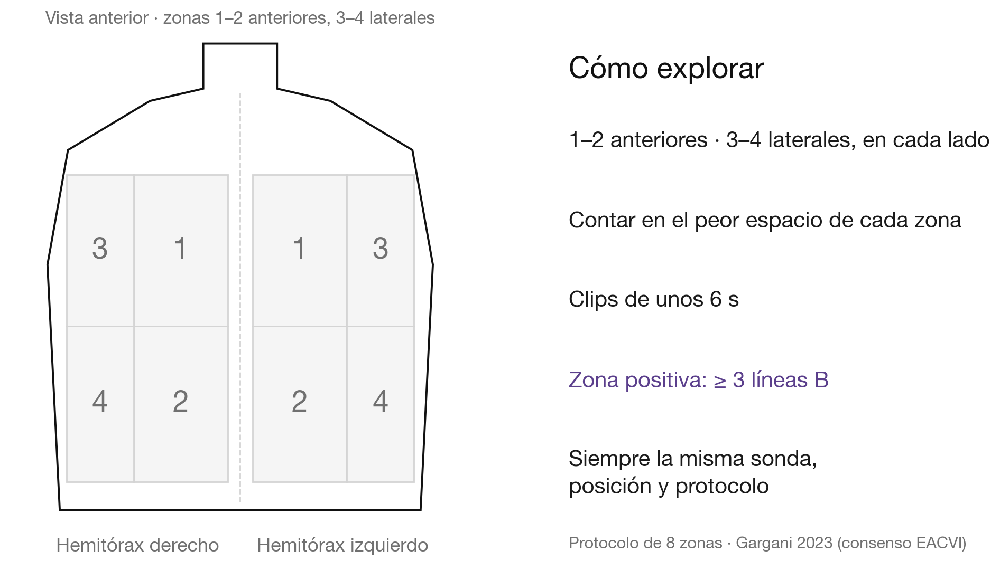{ loading=lazy }

*Protocolo de 8 zonas (EACVI) y cómo explorar.* Uso: diapositiva 7 · Script: `scripts/diagramas/zonas_8.py`

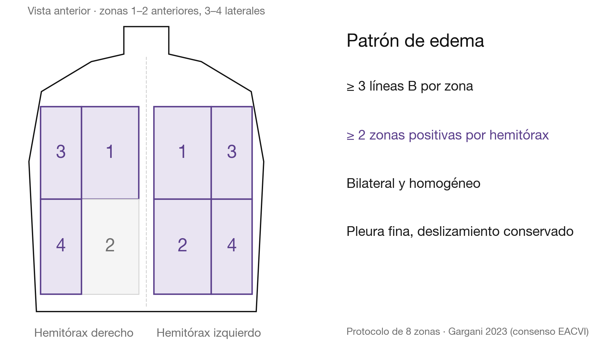{ loading=lazy }

*Patrón de edema en el mapa de 8 zonas.* Uso: reserva · Script: `scripts/diagramas/zonas_8.py`

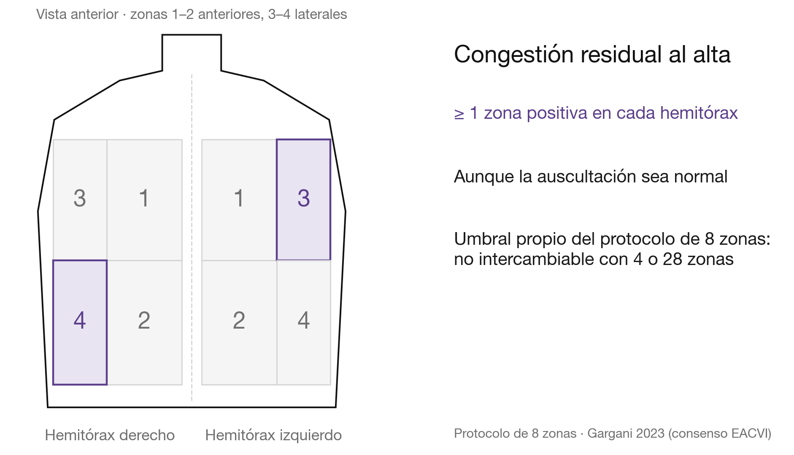{ loading=lazy }

*Congestión residual al alta en 8 zonas.* Uso: diapositiva 14 · Script: `scripts/diagramas/zonas_8.py`

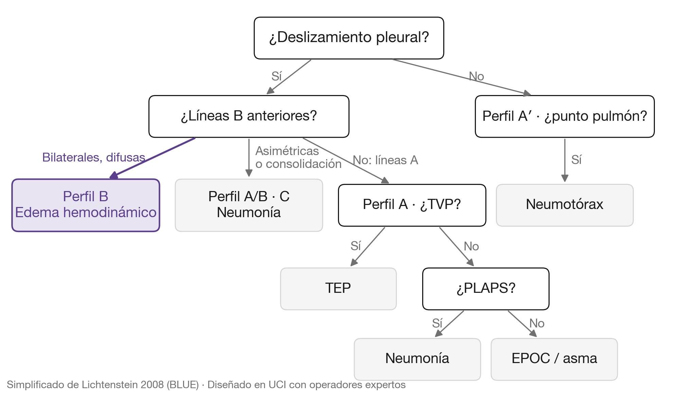{ loading=lazy }

*Árbol de decisión simplificado del protocolo BLUE.* Uso: diapositiva 8 · Script: `scripts/diagramas/arbol_blue.py`

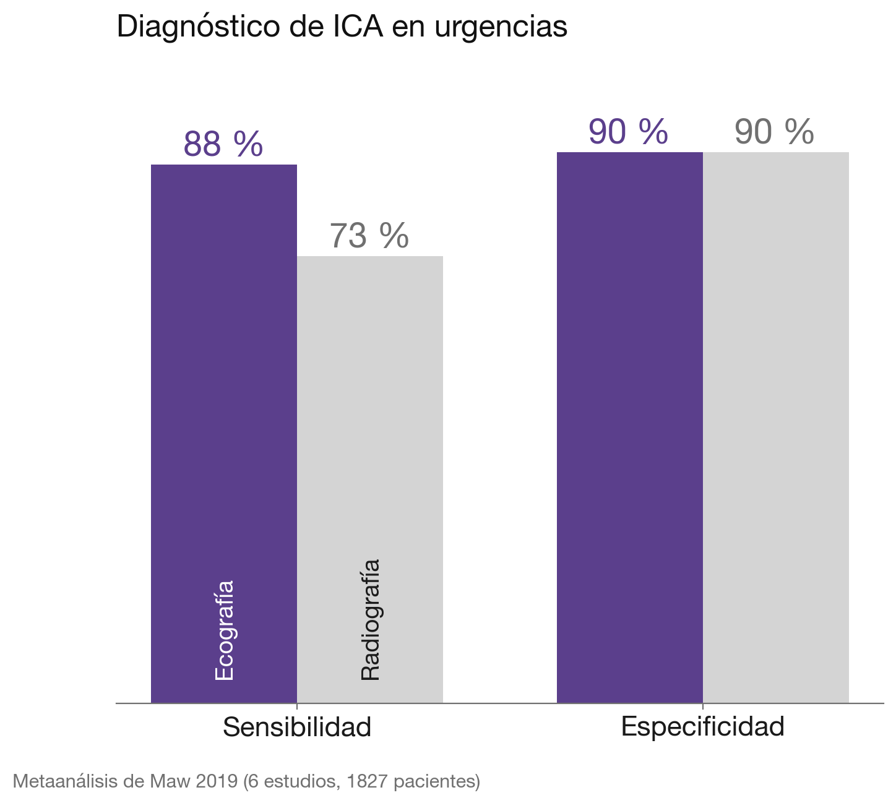{ loading=lazy }

*Sensibilidad y especificidad: ecografía pulmonar frente a radiografía (Maw 2019).* Uso: diapositiva 9 · Script: `scripts/diagramas/rendimiento_lus_rx.py`

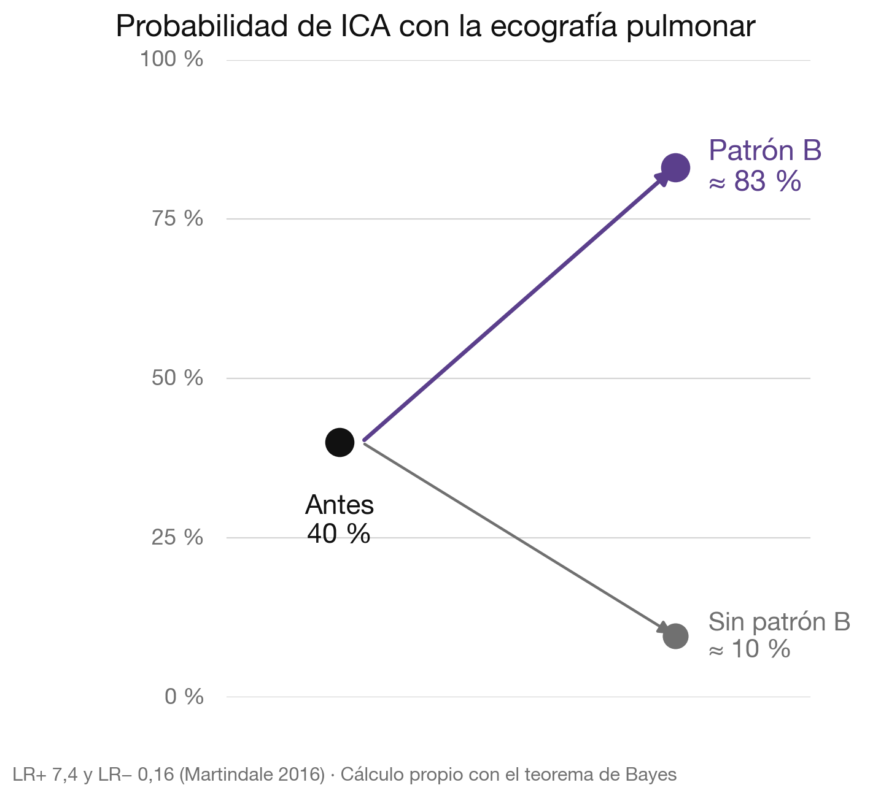{ loading=lazy }

*Probabilidad de ICA antes y después del patrón B (LR de Martindale 2016).* Uso: diapositiva 10 · Script: `scripts/diagramas/probabilidad_bayes.py`

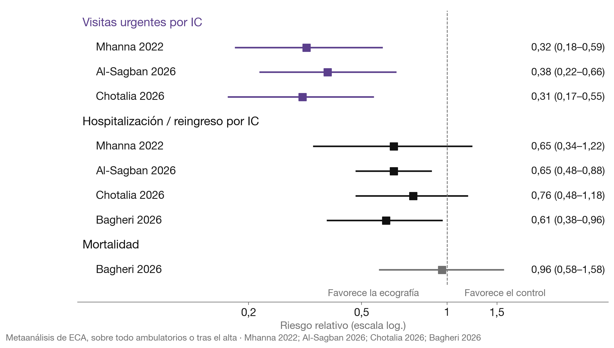{ loading=lazy }

*Forest plot de los metaanálisis de tratamiento guiado por líneas B.* Uso: diapositiva 15 · Script: `scripts/diagramas/forest_metaanalisis.py`

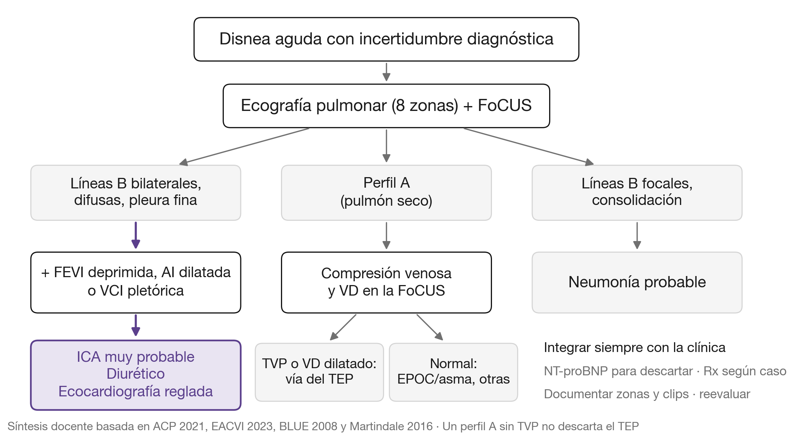{ loading=lazy }

*Algoritmo práctico de la disnea con incertidumbre diagnóstica.* Uso: diapositiva 17 · Script: `scripts/diagramas/algoritmo_disnea.py`

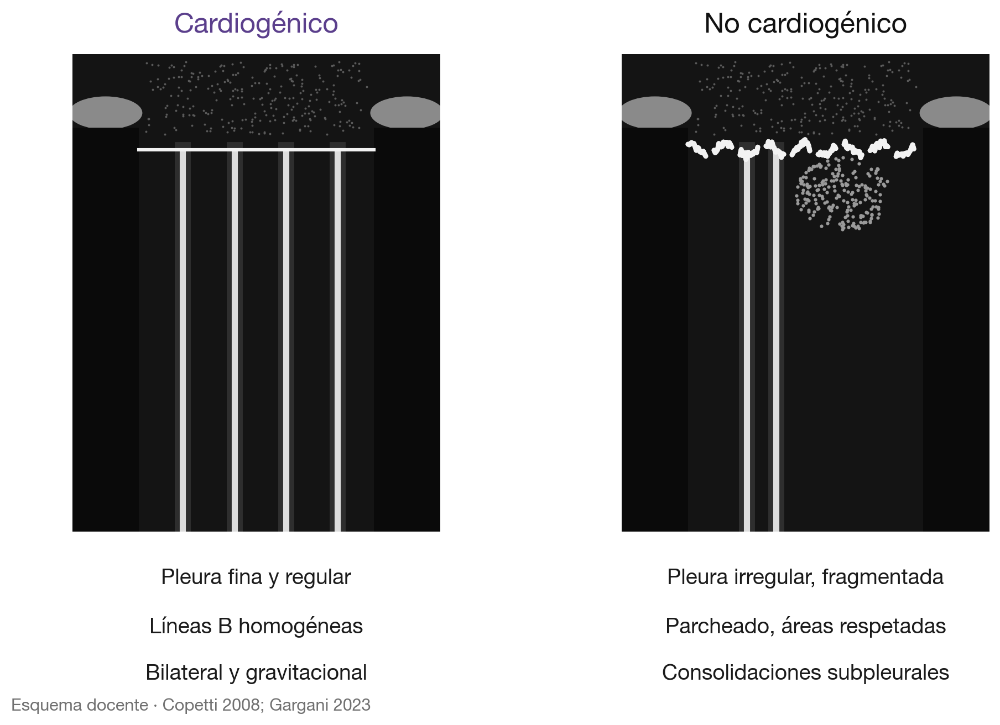{ loading=lazy }

*Líneas B cardiogénicas frente a no cardiogénicas.* Uso: diapositiva 19 · Script: `scripts/diagramas/cardiogenico_vs_no.py`

## Imágenes ecográficas

Imágenes con licencia libre (dominio público o Creative Commons). La autoría completa, la URL de origen y los cambios hechos a cada imagen están en [Créditos de imágenes](creditos.md).

### Pulmón normal

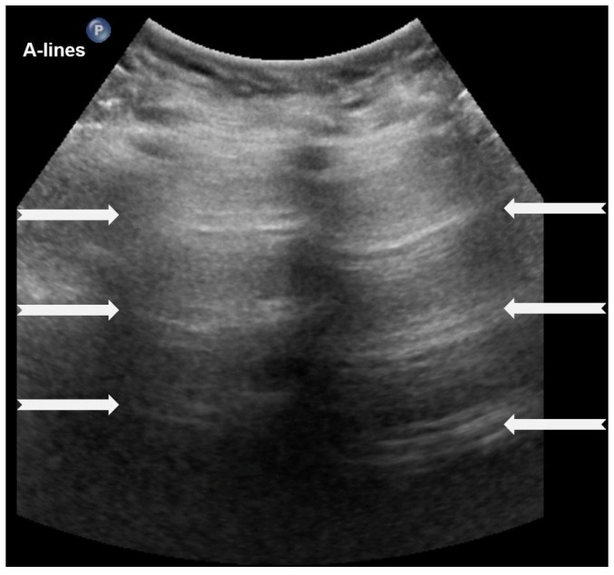{ loading=lazy }

*Líneas A (flechas): pulmón normalmente aireado. Paciente pediátrico.* Foutzitzi et al., *Diagnostics* 2025 (PMC12608682), CC BY 4.0.

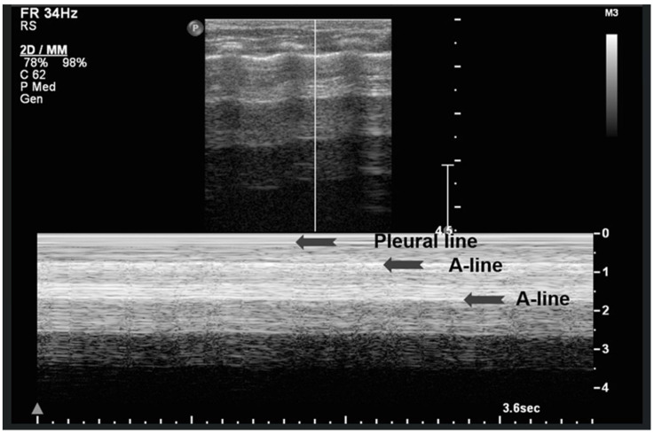{ loading=lazy }

*Modo M: signo de la orilla del mar. Hay deslizamiento pulmonar, así que no hay neumotórax en ese punto. Paciente pediátrico.* Foutzitzi et al., *Diagnostics* 2025 (PMC12608682), CC BY 4.0.

### Síndrome intersticial

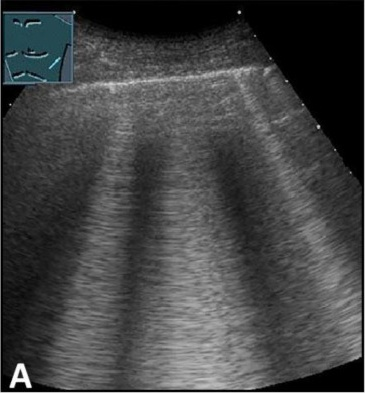{ loading=lazy }

*Líneas B múltiples (3 o más por espacio intercostal): patrón B.* Safai Zadeh et al., *Diagnostics* 2024 (PMC10814232), CC BY 4.0, recortada.

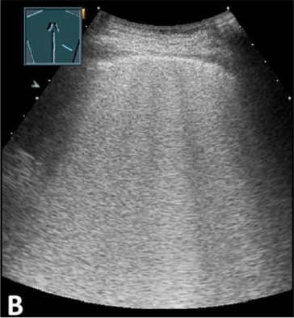{ loading=lazy }

*Líneas B confluentes: «pulmón blanco».* Safai Zadeh et al., *Diagnostics* 2024 (PMC10814232), CC BY 4.0, recortada.

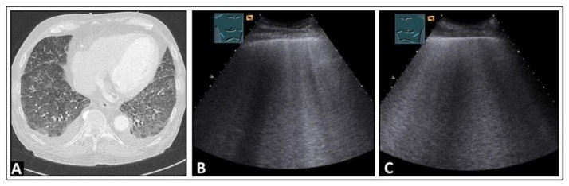{ loading=lazy }

*Edema pulmonar cardiogénico: la TC muestra derrame bilateral y vidrio deslustrado (A); la ecografía muestra líneas B bilaterales en los campos inferiores (B, C).* Safai Zadeh et al., *Diagnostics* 2024 (PMC10814232), CC BY 4.0.

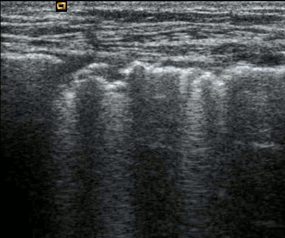{ loading=lazy }

*Línea pleural visceral irregular con líneas B, en una paciente con antecedente de radioterapia torácica. Sirve para contrastar con la pleura fina y regular del edema cardiogénico.* Nevit Dilmen, Wikimedia Commons, CC BY-SA 3.0.

### Consolidación y derrame

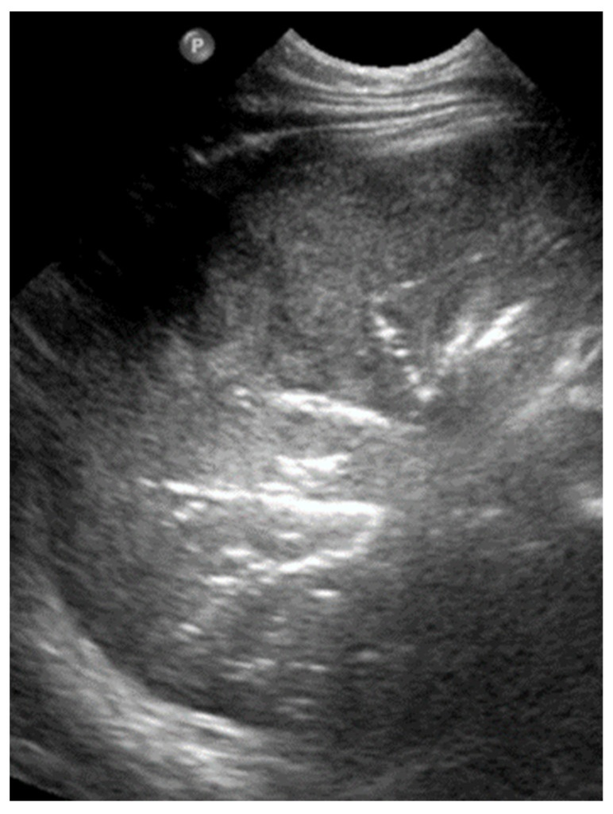{ loading=lazy }

*Consolidación pulmonar: hepatización con broncograma aéreo. Paciente pediátrico.* Foutzitzi et al., *Diagnostics* 2025 (PMC12608682), CC BY 4.0.

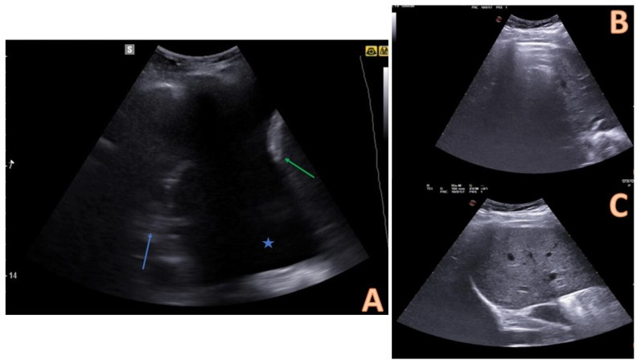{ loading=lazy }

*Derrame pleural anecoico sobre el diafragma, con pulmón atelectásico flotando (A), frente a una base pulmonar sana con líneas A y signo de la cortina (B, C).* Boccatonda et al., *Diagnostics* 2024 (PMC11172328), CC BY 4.0.

### Neumotórax

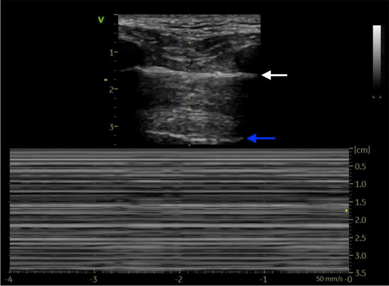{ loading=lazy }

*Neumotórax: línea pleural y líneas A sin líneas B en modo B; en modo M, signo del código de barras o de la estratosfera. Adulto.* Beshara et al., *Crit Care* 2024 (PMC11460009), CC BY 4.0.

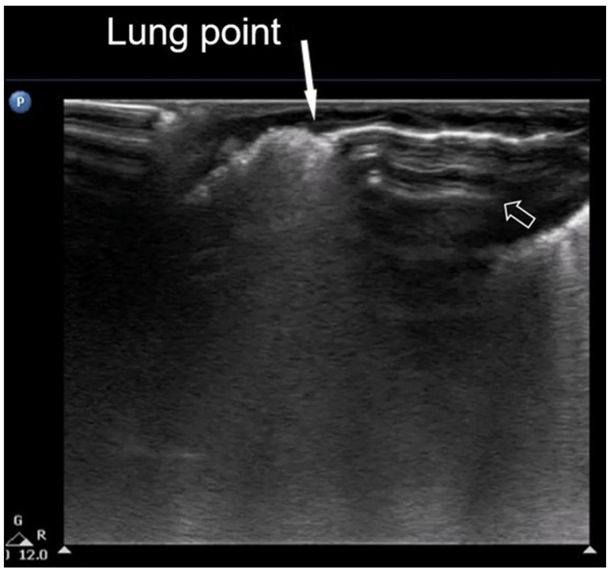{ loading=lazy }

*Punto pulmón: transición entre el pulmón que desliza (con líneas B) y la zona de neumotórax (líneas A sin deslizamiento). Paciente neonatal.* Foutzitzi et al., *Diagnostics* 2025 (PMC12608682), CC BY 4.0.

### Corazón y venas

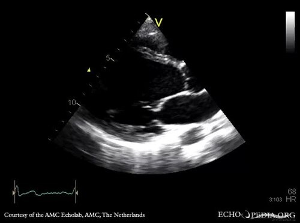{ loading=lazy }

*Eje largo paraesternal (PLAX): ventrículo izquierdo dilatado con función deprimida. Es un fotograma de un vídeo.* CardioNetworks/ECHOpedia, Wikimedia Commons, CC BY-SA 3.0.

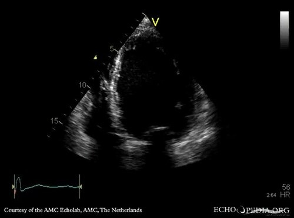{ loading=lazy }

*Apical de cuatro cámaras: ventrículo izquierdo dilatado con mala función. Es un fotograma de un vídeo.* CardioNetworks/ECHOpedia, Wikimedia Commons, CC BY-SA 3.0.

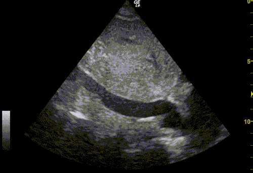{ loading=lazy }

*Vena cava inferior en plano subcostal longitudinal. Es un fotograma de un GIF que muestra variabilidad respiratoria normal.* Tinss, Wikimedia Commons, CC BY-SA 4.0.

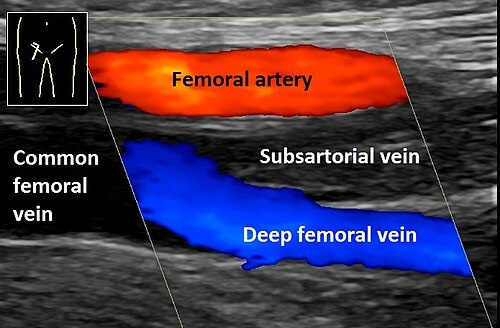{ loading=lazy }

*Trombosis venosa profunda de la vena femoral: la vena trombosada no tiene flujo y es hiperecogénica, mientras que la arteria femoral y la vena femoral profunda sí tienen flujo.* Mikael Häggström, Wikimedia Commons, CC0.

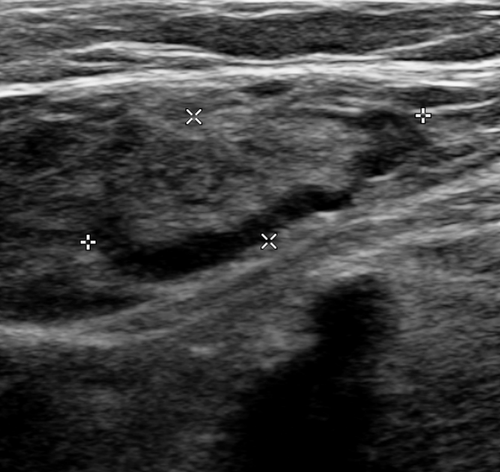{ loading=lazy }

*TVP en la ingle: la vena femoral no se colapsa al comprimir.* James Heilman, Wikimedia Commons, CC BY-SA 4.0.

### Referencia

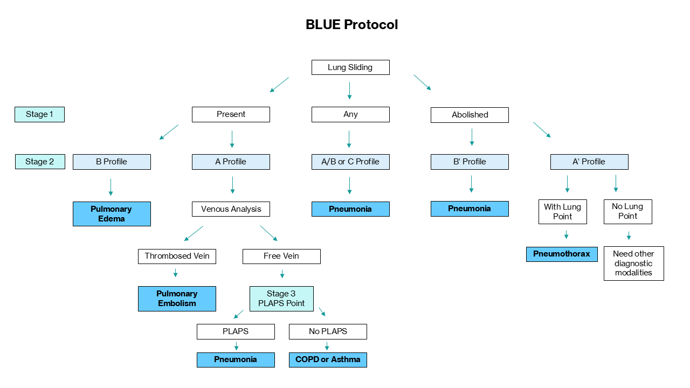{ loading=lazy }

*Protocolo BLUE, adaptado de Lichtenstein y Mezière (Chest 2008). Solo como referencia: para la charla conviene un diagrama propio.* LittleT889, Wikimedia Commons, CC0.
